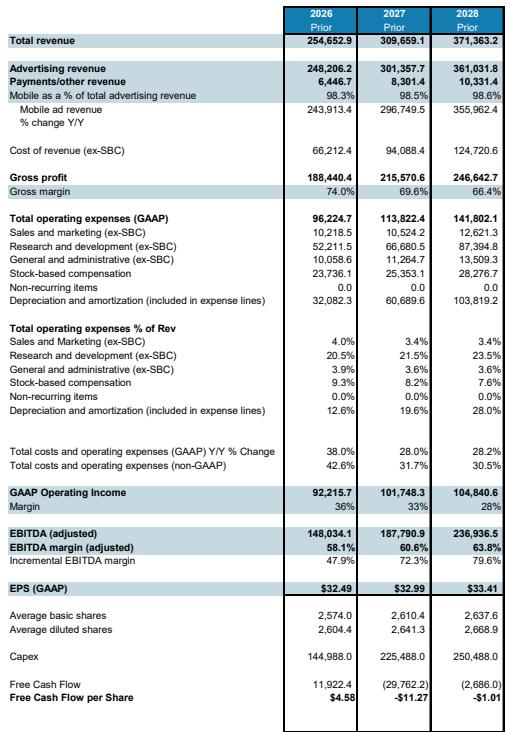
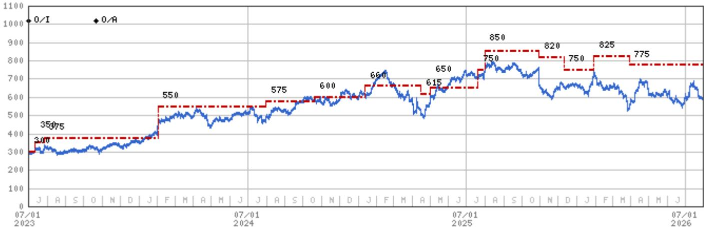
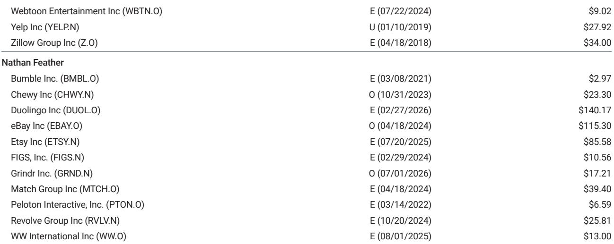

# MS：Meta核心社交业务用户规模与变现效率同步提升

Meta在2026年第二季度交出了一份超出预期的成绩单。MS在最新研报中指出，公司核心社交业务的触达、用户参与度和变现能力仍在持续改善，同时管理层在业绩沟通中多次提及“soon”来描述新产品的时间表，暗示Meta Connect开发者大会（9月23-24日）可能成为关键节点。报告估算，四项新产品期权合计可为2028年每股回报带来约9美元（约25%）的上行空间。

## 1. 核心社交业务的用户规模与变现效率同步提升

Meta旗下应用家族（Family of Apps）日活跃用户已达36亿，其中Instagram单平台日活突破20亿。MS认为，用户规模本身构成了多代际的竞争壁垒，而更关键的变化在于Meta正在利用大语言模型等新分析方法处理更多数据，从而提升有机内容和付费广告的相关性。第三季度收入指引上限640亿美元，隐含剔除汇率影响后同比增长26%，两年复合增速从第二季度的48%升至51%，这一增速超出了分析师预期。

> **KC评论：** 报告强调的“多代际护城河”并非指用户规模本身，而是Meta将用户数据与LLM结合后，在广告匹配效率上形成的持续优势。这一点在北美广告收入超预期7.2%的数据中已有体现。

## 2. 四项新产品期权合计可贡献约9美元EPS增量

研报详细拆解了四个尚未被市场充分定价的增长方向：Neocloud算力服务、API收入、订阅产品以及消息平台（WhatsApp/Instagram）的商业化。MS估算，这些产品期权在乐观情景下合计可为2028年每股回报增加约9美元，相当于当前基准预测35美元的25%。管理层在沟通中多次使用“soon”描述产品更新节奏，而9月的Meta Connect大会被分析师视为最可能的发布窗口。

## 3. 当前市场定价尚未计入新产品期权的价值

以2028年每股回报35美元计算，Meta当前交易价格对应约16倍市盈率。如果新产品期权仅实现50%（约5美元EPS），则实际市盈率降至约14倍。MS认为，市场当前定价已充分反映了资本开支和运营支出，但并未计入任何新产品期权的潜在贡献。报告将2027年和2028年每股回报预测分别上调2%和4%，认为后续产品落地和盈利预测上修将成为推动表现的主要动力。

## 4. 资本开支周期与自由现金流的阶段性不确定性

值得注意的是，报告中的财务预测显示，Meta的资本开支将从2026年的约1450亿美元升至2027年的2250亿美元，2028年进一步增至2500亿美元。这导致2027年和2028年自由现金流分别为负值。MS认为，这是为新产品期权和AI基础设施研究所付出的阶段性成本，而EBITDA利润率仍将从2026年的57.2%升至2028年的63.5%，显示运营效率在持续改善。

> **KC评论：** 自由现金流为负并不等同于基本面出现变化。关键在于增量EBITDA利润率从2026年的43.8%升至2028年的79.0%，意味着每新增一美元收入中可转化为EBITDA的比例在快速提升。这是判断回报表现效率的核心指标。

For informational purposes only. Portions may be generated,translated,summarized,or edited with AI assistance based on source materials and may contain omissions or errors. Please verify independently. This is not investment,legal,tax,accounting,or other professional advice.

For informational purposes only. Portions may be generated,translated,summarized,or edited with AI assistance based on source materials and may contain omissions or errors. Please verify independently. This is not investment,legal,tax,accounting,or other professional advice.

