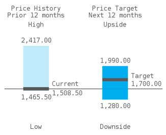
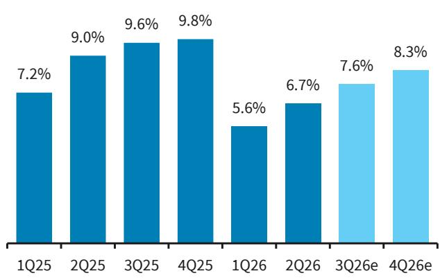
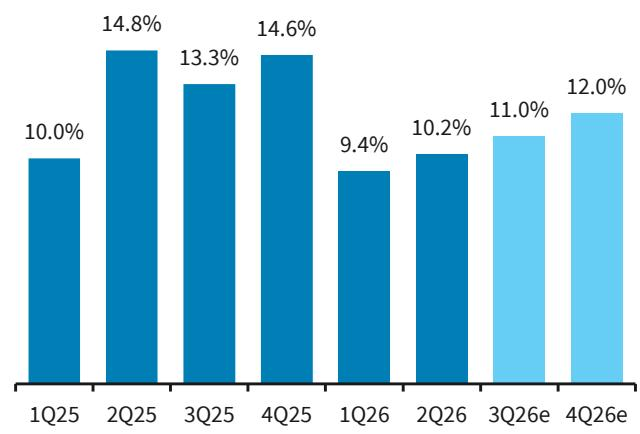
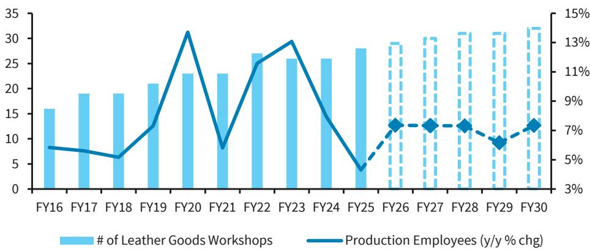

Hermes

# 数据之外：增长模式的讨论仍在继续

第二季度按固定汇率计算销售额增长6.7%（市场一致预期为6.5%），其中皮具及马具部门增长10.2%（市场一致预期为10.7%）。上半年营业利润率达到41%，好于预期，推动我们对每股盈利的预测上调约1%。然而，在数据之外，低于8%的固定汇率增长尚不能完全消除市场对公司整体及皮具部门增长模式可持续性的疑虑。维持中性评级。

业绩要点：符合预期。爱马仕第二季度收入为41亿欧元，固定汇率增长6.7%，整体符合市场一致预期的6.5%。皮具部门以10.2%的固定汇率增长引领增长，略低于市场一致预期的10.7%。

业绩细节：分地区看，第二季度增长主要由美洲（13.7%）和日本（12.3%）驱动，与同业趋势一致。除日本外的亚太地区增长2.5%，低于市场一致预期的3.2%，表现相对温和。欧洲和法国表现稳健，法国增长6.2%（固定汇率），好于市场一致预期的3.8%；除法国外的欧洲地区增长8.3%（固定汇率）。分品类看，皮具及马具部门再次成为增长引擎，增长10.2%（固定汇率），但低于市场一致预期的10.7%以及11-12%的增长模式。成衣及配饰部门增长3.6%（固定汇率），与市场一致预期的3.5%基本持平，对公司整体表现的贡献相对有限。丝绸及纺织品部门增长12.2%（固定汇率），显著好于市场一致预期的7.5%，该品类通常对消费意愿更为敏感。香水及美妆部门报告固定汇率增长为-9.5%，远低于市场一致预期的-1.5%。

预测调整：2026财年固定汇率增长7%，每股盈利上调约1%：考虑到对亚太地区更为谨慎的看法，我们将第三季度收入增长预测从8.6%下调至7.6%。我们仅将皮具部门第三季度增长预测小幅下调50个基点至11.0%，并同等幅度下调成衣部门增长预测。对香水及化妆品部门的下调幅度较大。据此，我们将集团2026财年固定汇率增长预测从之前的7.3%调整为7.0%。上半年业绩好于预期，我们将2026财年营业利润率预测上调至40.8%。我们的预测调整意味着2026-28财年每股盈利增加约1%（图11）。我们维持目标价1,700欧元不变，贴现现金流假设（加权平均资本成本7.5%，长期增长率3.5%）亦保持不变。

在数据之外，尽管估值有所回落，关键讨论仍未解决。爱马仕仍是市场讨论最多的奢侈品公司之一（参见我们与100多位读者交流的反馈报告）。第二季度业绩未能为增长模式的可持续性提供足够信心。值得注意的是，产能扩张计划与6-7%的产量增长保持一致（图8），这支持了我们的观点，即供应在2030年前不应成为制约因素，但也引发了若产量放缓则经营杠杆可能承压的担忧。我们认为6%的产量增长是可持续的，但第三季度不太可能提供更多证据。维持中性评级。

虽然我们认为估值正变得更具吸引力，但我们认为公司需要明确的证据来证明集团增长能够持续回升至中高个位数区间，无论是通过皮具部门还是非皮具部门的更强增长势头。我们预计第三季度（固定汇率增长7.6%）不会成为这一催化剂。

HRMS.PA：财务与估值指标 每股盈利（欧元）

| 财年截至12月 | 2024 | 2025 | 2026 | 2027 | 2028 |
|---|---|---|---|---|---|
| 每股盈利 | 43.87A | 43.07A | 45.35E | 52.99E | 57.46E |
| 前次每股盈利 | 43.87A | 43.07A | 44.91E | 52.54E | 56.96E |
| 市场一致预期每股盈利 | 43.87A | 43.07A | 44.38E | 51.07E | 56.16E |
| 市盈率 | 34.4 | 35.0 | 33.3 | 28.5 | 26.3 |

市场一致预期数据来自彭博，接收时间为2026年7月29日12:50 GMT 来源：BARC

欧洲奢侈品及专业零售

| 利润表（百万欧元） | 2025A | 2026E | 2027E | 2028E | 复合年增长率 |
|---|---|---|---|---|---|
| 收入 | 16,003 | 16,828 | 18,222 | 19,677 | 7.1% |
| 息税折旧摊销前利润（调整后） | 6,963 | 7,325 | 8,073 | 8,787 | 8.1% |
| 息税前利润（调整后） | 6,570 | 6,873 | 7,488 | 8,118 | 7.3% |
| 税前利润（调整后） | 6,776 | 7,116 | 7,766 | 8,363 | 7.3% |
| 净利润（调整后） | 4,524 | 4,764 | 5,567 | 6,036 | 10.1% |
| 每股盈利（调整后）（欧元） | 43.07 | 45.35 | 52.99 | 57.46 | 10.1% |
| 摊薄股数（百万股） | 105 | 105 | 105 | 105 | 0.0% |
| 每股股息（欧元） | 18.00 | 20.00 | 22.00 | 24.00 | 10.1% |

| 利润率及回报数据 | 2025A | 2026E | 2027E | 2028E | 平均 |
|---|---|---|---|---|---|
| 息税折旧摊销前利润率（调整后）（%） | 43.5 | 43.5 | 44.3 | 44.7 | 44.0 |
| 息税前利润率（调整后）（%） | 41.1 | 40.8 | 41.1 | 41.3 | 41.1 |
| 税前利润率（调整后）（%） | 42.3 | 42.3 | 42.6 | 42.5 | 42.4 |
| 净利润率（调整后）（%） | 28.3 | 28.3 | 30.6 | 30.7 | 29.5 |
| 资产回报率（%） | 18.0 | 16.6 | 17.1 | 16.5 | 17.0 |
| 净资产回报率（%） | 24.0 | 22.1 | 22.2 | 21.0 | 22.3 |
| 资本运用回报率（%） | 73.9 | 67.1 | 69.7 | 69.8 | 70.1 |

| 现金流及资产负债表（百万欧元） | 2025A | 2026E | 2027E | 2028E | 复合年增长率 |
|---|---|---|---|---|---|
| 经营活动现金流 | 5,374 | 5,863 | 6,394 | 6,966 | 9.0% |
| 投资活动现金流 | -1,278 | -1,422 | -1,239 | -1,141 | 不适用 |
| 资本支出 | -1,161 | -1,297 | -1,239 | -1,141 | 不适用 |
| 自由现金流 | 3,448 | 3,973 | 4,500 | 5,157 | 14.4% |
| 有形固定资产 | 3,486 | 4,196 | 4,744 | 5,109 | 13.6% |
| 无形固定资产 | 411 | 454 | 492 | 526 | 8.6% |
| 总资产 | 24,323 | 27,665 | 31,398 | 35,410 | 13.3% |
| 营运资金 | 2,201 | 2,366 | 2,634 | 2,922 | 9.9% |
| 运用资本 | 5,918 | 6,830 | 7,685 | 8,373 | 12.3% |
| 净债务/（资金） | -12,205 | -14,367 | -17,024 | -20,110 | 不适用 |
| 拨备 | 160 | 151 | 151 | 151 | -1.9% |
| 其他长期负债 | 72 | 68 | 68 | 68 | -1.7% |
| 股东权益 | 18,840 | 21,586 | 25,056 | 28,785 | 15.2% |

价格（2026年7月29日） 1,508.50欧元
目标价 1,700.00欧元
凭借其高度的稀缺性、卓越的增长和稳健的利润率，爱马仕是我们覆盖范围内质量最高的公司之一。然而，2026年的缓慢开局以及中东和北非地区的扰动可能会引发读者对未来增长水平的担忧。
爱马仕保持强劲的两位数销售增长，营业利润率达到40%中段。

| 估值及杠杆指标 | 2025A | 2026E | 2027E | 2028E | 平均 |
|---|---|---|---|---|---|
| 市盈率（调整后）（倍） | 35.0 | 33.3 | 28.5 | 26.3 | 30.8 |
| 企业价值/销售额（倍） | 9.4 | 8.8 | 8.1 | 7.5 | 8.5 |
| 企业价值/息税折旧摊销前利润（调整后）（倍） | 21.5 | 20.2 | 18.4 | 16.9 | 19.3 |
| 企业价值/息税前利润（调整后）（倍） | 22.8 | 21.6 | 19.8 | 18.3 | 20.6 |
| 股息回报表现（%） | 1.2 | 1.3 | 1.5 | 1.6 | 1.4 |
| 自由现金流回报表现（%） | 2.3 | 2.7 | 3.0 | 3.5 | 2.9 |
| 净债务/息税折旧摊销前利润（调整后）（倍） | -1.3 | -1.5 | -1.7 | -1.9 | -1.6 |
| 利息保障倍数（倍） | 163.4 | 115.4 | 111.8 | 113.6 | 126.1 |
| 市净率（倍） | 8.4 | 7.3 | 6.3 | 5.5 | 6.9 |
| 主要经营指标 | 2025A | 2026E | 2027E | 2028E | 平均 |
| 固定汇率增长率（%） | 8.9 | 7.0 | 7.6 | 7.9 | 7.9 |

注：财年截至12月
来源：公司数据，彭博，BARC
上行/下行情景

中性评级

## 为何是中性评级？

假设整体收入为低个位数增长，其他部门以中个位数增长，稀释了皮具部门较高的结构性增长。营业利润率保持在36-37%区间。长期增长率设定为2.5%。

## 关键图表

图1. 我们预计集团第三季度增长7.6%...

来源：公司数据，BARC预测
图2. ...由皮具部门11.0%的增长驱动

来源：公司数据，BARC预测

图3. 我们认为工坊开设计划与6-7%的产量增长一致

来源：公司数据，BARC预测

图4. 我们上调每股盈利预测1%

| | 2026e | 2026e | 2026e | 2027e | 2027e | 2027e | 2028e | 2028e | 2028e |
|---|---|---|---|---|---|---|---|---|---|
| （百万欧元） | 旧 | 新 | 变化% | 旧 | 新 | 变化% | 旧 | 新 | 变化% |
| 收入 | 16,831 | 16,828 | 0.0% | 18,221 | 18,222 | 0.0% | 19,674 | 19,677 | 0.0% |
| 固定汇率增长率% | 7.3% | 7.0% | -25个基点 | 7.6% | 7.6% | 0个基点 | 7.9% | 7.9% | 2个基点 |
| 毛利 | 11,921 | 11,981 | 0.5% | 12,906 | 12,973 | 0.5% | 13,935 | 14,009 | 0.5% |
| 毛利率% | 70.8% | 71.2% | 37个基点 | 70.8% | 71.2% | 37个基点 | 70.8% | 71.2% | 37个基点 |
| 经常性息税前利润 | 6,767 | 6,873 | 1.6% | 7,421 | 7,488 | 0.9% | 8,045 | 8,118 | 0.9% |
| 息税前利润率% | 40.2% | 40.8% | 63个基点 | 40.7% | 41.1% | 37个基点 | 40.9% | 41.3% | 37个基点 |
| 息税前利润 | 6,767 | 6,873 | 1.6% | 7,421 | 7,488 | 0.9% | 8,045 | 8,118 | 0.9% |
| 息税前利润率% | 40.2% | 40.8% | 63个基点 | 40.7% | 41.1% | 37个基点 | 40.9% | 41.3% | 37个基点 |
| 净财务结果 | 295 | 244 | -17.3% | 278 | 278 | 0.3% | 245 | 245 | 0.1% |
| 税前利润 | 7,062 | 7,116 | 0.8% | 7,699 | 7,766 | 0.9% | 8,290 | 8,363 | 0.9% |
| 税率% | 33.4% | 33.3% | -4个基点 | 28.5% | 28.5% | 0个基点 | 28.0% | 28.0% | 0个基点 |
| 净利润 | 4,756 | 4,793 | 0.8% | 5,559 | 5,608 | 0.9% | 6,028 | 6,080 | 0.9% |
| 少数股东权益 | -38 | -28 | 不适用 | -41 | -41 | 不适用 | -44 | -44 | 不适用 |
| 归属股东净利润 | 4,718 | 4,764 | 1.0% | 5,518 | 5,567 | 0.9% | 5,983 | 6,036 | 0.9% |
| 归属股东经常性净利润 | 4,718 | 4,764 | 1.0% | 5,518 | 5,567 | 0.9% | 5,983 | 6,036 | 0.9% |
| 经常性摊薄每股盈利 | 44.9 | 45.4 | 1.0% | 52.5 | 53.0 | 0.9% | 57.0 | 57.5 | 0.9% |

来源：公司数据，BARC预测

## 业绩摘要

第二季度业绩：爱马仕第二季度收入为41亿欧元，固定汇率增长6.7%，整体符合市场一致预期的6.5%。皮具部门以10.2%的固定汇率增长引领增长，略低于市场一致预期的10.7%。丝绸及纺织品和腕表部门表现强劲，超出预期。

分地区看：第二季度增长主要由美洲（13.7%）和日本（12.3%）驱动，与同业趋势一致。除日本外的亚太地区增长2.5%，低于市场一致预期的3.2%，表现相对温和。欧洲和法国表现稳健，法国增长6.2%（固定汇率），好于市场一致预期的3.8%；除法国外的欧洲地区增长8.3%（固定汇率）。

分品类看：皮具及马具部门再次成为增长引擎，增长10.2%（固定汇率），但低于市场一致预期的10.7%以及11-12%的增长模式。成衣及配饰部门增长3.6%（固定汇率），与市场一致预期的3.5%基本持平，对公司整体表现的贡献相对有限。丝绸及纺织品部门增长12.2%（固定汇率），显著好于市场一致预期的7.5%，该品类通常对消费意愿更为敏感。香水及美妆部门报告固定汇率增长为-9.5%，远低于市场一致预期的-1.5%。

图5. 爱马仕第二季度分地区销售情况

| 爱马仕第二季度 | 报告 | 报告 | 报告 | 预测 | 预测 | 预测 | 预测 | 预测 | 预测 |
|---|---|---|---|---|---|---|---|---|---|
| 收入（百万欧元） | 2Q26 | 2Q25 | 同比变化% | BARC | 较BARC | 市场一致预期 | 较市场一致预期 |
| 法国 | 407 | 383 | 6.3% | 398 | 2.2% | 397 | 2.5% |
| 固定汇率增长率% | 6.2% | 4.1% | 210个基点 | 4.0% | 220个基点 | 3.8% | 243个基点 |
| 除法国外的欧洲 | 627 | 588 | 6.6% | 639 | -1.9% | 633 | -1.0% |
| 固定汇率增长率% | 8.3% | 12.6% | -430个基点 | 9.0% | -70个基点 | 8.8% | -52个基点 |
| 日本 | 394 | 394 | 0.0% | 388 | 1.6% | 387 | 1.8% |
| 固定汇率增长率% | 12.3% | 14.7% | -240个基点 | 10.0% | 230个基点 | 10.7% | 158个基点 |
| 除日本外的亚太 | 1,651 | 1,603 | 3.0% | 1,633 | 1.1% | 1,628 | 1.4% |
| 固定汇率增长率% | 2.5% | 5.2% | -270个基点 | 3.5% | -100个基点 | 3.2% | -70个基点 |
| 美洲 | 846 | 760 | 11.3% | 828 | 2.1% | 842 | 0.4% |
| 固定汇率增长率% | 13.7% | 12.3% | 140个基点 | 13.0% | 70个基点 | 13.9% | -18个基点 |
| 其他 | 170 | 177 | -4.0% | 159 | 7.0% | 161 | 5.5% |
| 固定汇率增长率% | -2.4% | 20.4% | -2,280个基点 | -7.5% | 510个基点 | -7.6% | 520个基点 |
| 集团 | 4,094 | 3,905 | 4.8% | 4,045 | 1.2% | 4,069 | 0.6% |
| 固定汇率增长率% | 6.7% | 9.0% | -231个基点 | 6.4% | 32个基点 | 6.5% | 19个基点 |

来源：公司数据，BARC预测，彭博

图6. 爱马仕第二季度分部门销售情况

| 爱马仕第二季度 | 报告 | 报告 | 报告 | 预测 | 预测 | 预测 | 预测 | 预测 | 预测 |
|---|---|---|---|---|---|---|---|---|---|
| 收入（百万欧元） | 2Q26 | 2Q25 | 同比变化% | BARC | 较BARC | 市场一致预期 | 较市场一致预期 |
| 皮具及马具 | 1,912 | 1,765 | 8.3% | 1,904 | 0.4% | 1,907 | 0.2% |
| 固定汇率增长率% | 10.2% | 14.8% | -460个基点 | 10.5% | -30个基点 | 10.7% | -54个基点 |
| 成衣及配饰 | 1,123 | 1,106 | 1.6% | 1,110 | 1.2% | 1,112 | 1.0% |
| 固定汇率增长率% | 3.6% | 3.8% | -20个基点 | 3.0% | 60个基点 | 3.5% | 7个基点 |
| 丝绸及纺织品 | 212 | 192 | 10.6% | 202 | 4.9% | 200 | 5.9% |
| 固定汇率增长率% | 12.2% | 2.2% | 1,000个基点 | 8.0% | 420个基点 | 7.5% | 470个基点 |
| 其他爱马仕部门 | 525 | 512 | 2.5% | 519 | 1.1% | 520 | 1.0% |
| 固定汇率增长率% | 4.0% | 14.9% | -1,090个基点 | 4.0% | 0个基点 | 3.2% | 79个基点 |
| 香水及美妆 | 107 | 119 | -9.9% | 110 | -2.4% | 113 | -5.6% |
| 固定汇率增长率% | -9.5% | -7.2% | -230个基点 | -5.0% | -450个基点 | -1.5% | -803个基点 |
| 腕表 | 134 | 130 | 3.5% | 126 | 6.3% | 126 | 6.1% |
| 固定汇率增长率% | 4.4% | -5.5% | 990个基点 | 0.0% | 440个基点 | 0.2% | 423个基点 |
| 其他产品 | 82 | 82 | 0.5% | 74 | 10.2% | 77 | 6.0% |
| 固定汇率增长率% | 1.9% | -0.4% | 230个基点 | 1.1% | 82个基点 | 2.5% | -64个基点 |
| 集团 | 4,094 | 3,905 | 4.8% | 4,045 | 1.2% | 4,069 | 0.6% |
| 固定汇率增长率% | 6.7% | 9.0% | -231个基点 | 6.4% | 32个基点 | 6.5% | 19个基点 |

来源：公司数据，BARC预测，彭博

图7. 爱马仕2026年上半年损益表

| 爱马仕2026年上半年 | 报告 | 报告 | 报告 | 预测 | 预测 | 预测 | 预测 | 预测 | 预测 |
|---|---|---|---|---|---|---|---|---|---|
| （百万欧元） | 1H26 | 1H25 | 同比变化% | BARC | 较BARC | 市场一致预期 | 较市场一致预期 |
| 收入 | 8,163 | 8,034 | 1.6% | 8,115 | 0.6% | 8,121 | 0.5% |
| 毛利 | 5,807 | 5,678 | 2.3% | 5,711 | 1.7% | 5,684 | 2.2% |
| 利润率% | 71.1% | 70.7% | 46个基点 | 70.4% | 76个基点 | 70.1% | 108个基点 |
| 经常性息税前利润 | 3,351 | 3,327 | 0.7% | 3,276 | 2.3% | 3,275 | 2.3% |
| 利润率% | 41.1% | 41.4% | -36个基点 | 40.4% | 68个基点 | 40.3% | 73个基点 |
| 经常性税前利润 | 3,441 | 3,475 | -1.0% | 3,416 | 0.7% | 3,397 | 1.3% |
| 经常性净利润 | 2,238 | 2,246 | -0.4% | 2,212 | 1.2% | 2,204 | 1.5% |
| 经常性摊薄每股盈利 | 21.32 | 21.39 | -0.3% | 21.06 | 1.3% | 21.08 | 1.2% |

来源：公司数据，BARC，彭博

# 数据之外：增长模式的讨论仍在继续

# “12个月后，爱马仕的估值不可能仍接近当前水平。要么大幅上升，要么大幅下降。”

— 读者，2026年6月初

关键讨论仍在继续，估值已有所回落。爱马仕是我们覆盖范围内讨论最多的公司之一。遗憾的是，第二季度业绩未能为看多观点和商业模式的强韧性提供所需信心，看空讨论仍将继续。

看多与看空观点：看多者认为当前估值水平是极具吸引力的入场点，并将近期的放缓视为暂时现象。相反，看空者认为标志性手袋的吸引力有所减弱，高端消费领域的竞争加剧，非皮具部门的疲软趋势表明购买配额手袋的门槛降低，预示着放缓可能持续，皮具部门的增长模式（隐含6%的产量增长）可能发生变化。

公司表态：公司持续强调亚太地区面临的挑战，除中东和北非地区及法国外（两者均受旅游业和中东北非消费者影响），各区域均无重大环比变化或加速。尽管皮具部门增长依然强劲，达到两位数（2026年第二季度为10.2%），但低于全年11-12%的增长模式（其中产量贡献约6%）。我们认为6%的产量预期仍然有效（尽管电话会议上的沟通略显模糊）。

公司行动：为6-7%的产量增长扩大产能：我们的分析表明，供应至少在2030年前是充足的。生产员工数量（最接近的代理指标）在2025-30年间的五年复合年增长率约为7%（我们的预测），比前十年低1个百分点。

图8. 我们认为到2030年的皮具工坊开设计划与6%以上的产量增长一致

来源：公司数据，BARC预测

我们使用生产员工数量作为代理指标，以了解产量约束以及维持未来约6%产量增长所需的投入。我们估计爱马仕的产能扩张应能在未来五年内支持6-7%的产量增长，与我们对皮具部门的预测一致。因此，我们预计该部门占爱马仕销售额的比例将从2025年的约44%扩大至2030年的约49%。

...在此背景下，增长模式的改变可能带来挑战：我们认为皮具部门的需求模式仍然稳固，并假设我们的中长期产量假设不存在重大风险。皮具需求的任何重大变化都可能引发对过度投入和产能过剩的担忧，并可能对利润率和回报构成显著影响。

（软性）数据怎么说：除了轶事证据外，我们未能找到数据表明：1）标志性手袋需求下降；2）二手市场中标志性手袋供应显著增加（不过我们确实听到一些关于“其他”手袋供应增加的评论）；3）二手市场中标志性手袋的溢价恶化（情况恰恰相反）；4）在爱马仕门店购买配额手袋所需的最低消费额下降。我们与行业参与者的交流，包括一家实体爱马仕二手经销商，表明鉴于近期价格上涨，二手溢价有所增加而非减少。

我们的看法：对于2026财年，我们更倾向于皮具部门全年增长10.5%，其中第三/第四季度增长11-12%，而非全年达到该水平。我们认为皮具部门在2026-29年间能够轻松实现中高至低双位数的复合年增长率（我们预测为10.5%）。我们的中性评级主要基于：1）2026年市场面临的挑战，这支撑了我们低于市场一致预期的2027-29财年约8%固定汇率增长预测；2）亚太地区（含日本占销售额52%）的中期风险，我们预测其复合年增长率约为7%；3）对工艺模式长期可扩展性的信心。

估值正变得更具吸引力，但我们认为公司需要明确的证据来证明集团增长能够持续回升至中高个位数区间，无论是通过皮具部门还是非皮具部门的更强增长势头。我们预计第三季度（固定汇率增长7.6%）不会成为这一催化剂。

## 模型更新

考虑到对亚太地区更为谨慎的看法，我们将第三季度收入增长预测从8.3%下调至7.6%。我们仅将皮具部门第三季度增长预测小幅下调50个基点至11.0%，并同等幅度下调成衣部门增长预测。对香水及化妆品部门的下调幅度较大。据此，我们将集团2026财年固定汇率增长预测从之前的7.3%调整为7.0%。

毛利率方面，我们维持2026年下半年71.3%的毛利率预测不变，同比下降30个基点。总体而言，上半年业绩好于预期，我们将2026财年营业利润率预测上调至40.8%。我们的预测调整意味着2026-28财年每股盈利增加约1%。我们维持目标价1,700欧元不变，贴现现金流假设（加权平均资本成本7.5%，长期增长率3.5%）亦保持不变。我们维持中性评级。

图9. 爱马仕新旧预测 - 分部门季度销售

| 爱马仕2026年预测 | 实际 | 实际 | 新（2026年预测） | 新（2026年预测） | 新（2026年预测） | 旧（2026年预测） | 旧（2026年预测） | 旧（2026年预测） |
|---|---|---|---|---|---|---|---|---|
| 收入（百万欧元） | 第一季度 | 第二季度 | 第三季度预测 | 第四季度预测 | 全年预测 | 第三季度预测 | 第四季度预测 | 全年预测 |
| 皮具及马具 | 1,849 | 1,912 | 1,895 | 2,023 | 7,679 | 1,903 | 2,031 | 7,688 |
| 有机增长率% | 9.4% | 10.2% | 11.0% | 12.0% | 10.7% | 11.5% | 12.5% | 11.0% |
| 成衣及配饰 | 1,076 | 1,123 | 1,215 | 1,189 | 4,603 | 1,220 | 1,201 | 4,606 |
| 有机增长率% | 0.4% | 3.6% | 4.5% | 6.0% | 3.6% | 5.0% | 7.0% | 3.8% |
| 丝绸及纺织品 | 257 | 212 | 223 | 317 | 1,008 | 223 | 317 | 998 |
| 有机增长率% | 7.8% | 12.2% | 6.0% | 2.0% | 6.4% | 6.0% | 2.0% | 5.6% |
| 其他爱马仕部门 | 540 | 525 | 520 | 557 | 2,142 | 525 | 562 | 2,146 |
| 有机增长率% | 6.8% | 4.0% | 7.0% | 7.0% | 6.2% | 8.0% | 8.0% | 6.7% |
| 香水及美妆 | 127 | 107 | 120 | 129 | 483 | 127 | 132 | 495 |
| 有机增长率% | 0.2% | -9.5% | 1.0% | 5.0% | -0.8% | 7.0% | 7.0% | 2.3% |
| 腕表 | 135 | 134 | 136 | 142 | 547 | 132 | 141 | 534 |
| 有机增长率% | -3.7% | 4.4% | 3.0% | 2.0% | 1.3% | 0.0% | 1.0% | -0.8% |
| 其他产品 | 86 | 82 | 90 | 108 | 366 | 92 | 111 | 363 |
| 有机增长率% | 3.6% | 1.9% | 6.9% | 6.7% | 5.2% | 9.1% | 8.8% | 5.7% |
| 集团 | 4,070 | 4,094 | 4,198 | 4,465 | 16,828 | 4,222 | 4,493 | 16,831 |
| 有机增长率% | 5.6% | 6.7% | 7.6% | 8.3% | 7.0% | 8.3% | 9.0% | 7.3% |

来源：BARC预测，公司数据

图10. 爱马仕新旧预测 - 分地区季度销售

| 爱马仕2026年预测 | 实际 | 实际 | 新（2026年预测） | 新（2026年预测） | 新（2026年预测） | 旧（2026年预测） | 旧（2026年预测） | 旧（2026年预测） |
|---|---|---|---|---|---|---|---|---|
| 收入（百万欧元） | 第一季度 | 第二季度 | 第三季度预测 | 第四季度预测 | 全年预测 | 第三季度预测 | 第四季度预测 | 全年预测 |
| 法国 | 347 | 407 | 419 | 454 | 1,627 | 431 | 467 | 1,643 |
| 有机增长率% | -2.8% | 6.2% | 4.0% | 5.0% | 3.3% | 7.0% | 8.0% | 4.3% |
| 除法国外的欧洲 | 538 | 627 | 690 | 701 | 2,556 | 697 | 701 |
