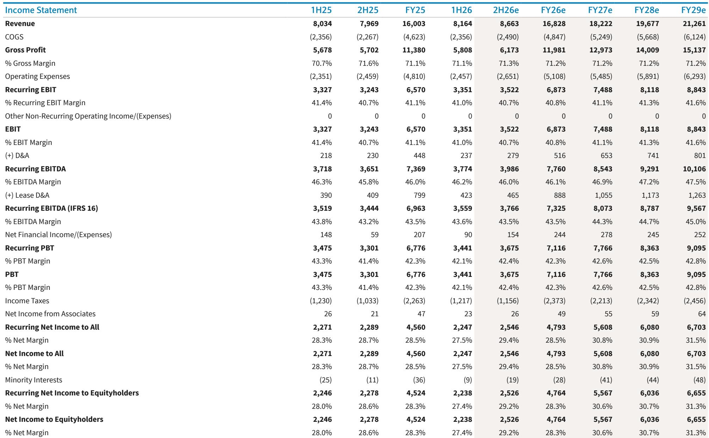

# Hermès 6.7%增长表现：长期增长逻辑的讨论仍在继续

2026年第二季度交出了一份按常规标准衡量相当扎实的成绩单：爱马仕以固定汇率计算的销售额增长6.7%，略高于市场一致预期的6.5%，上半年息税前利润率达到41%，促使分析师小幅上调盈利预测。然而，市场对这份成绩单的反应方式已经发生了变化。股价从52周高点约2,417欧元回落至1,508.50欧元，市场不再为超预期的表现支付溢价。市场期待的是更根本的东西：证明支撑此前高估值的增长逻辑依然成立。而第二季度的数据并未提供这样的证明。作为整个研究逻辑核心的皮具部门，固定汇率增长为10.2%——低于10.7%的市场一致预期，也低于管理层历来指引的11%至12%的增长区间。数据本身符合预期，但争论并未平息，这才是更值得关注的事实。

这不是一个关于糟糕季度的故事，而是一个关于结构性张力持续累积多个季度、如今逐渐清晰的故事。爱马仕长期以来一直是奢侈品行业的例外：其稀缺性模式、定价能力和有纪律的产能扩张使其能够在竞争对手步履蹒跚时穿越周期实现增长。这种例外性如今正受到来自两个方向的同时考验。在需求端，渴望型消费者——支撑丝巾和香水等品类的边际购买者——正显现出疲态，而除日本以外的亚太核心奢侈品消费者依然明显谨慎。在供给端，公司自身的产能扩张计划（与到2030年6%至7%的产量增长相符）提出了一个几年前还难以想象的问题：如果产量增长而非需求成为约束条件，稀缺性溢价将何去何从？这个问题的答案将决定爱马仕是维持33倍市盈率还是向行业均值回归。

风险之所以高企，是因为估值已经开始调整。当前33.3倍的2026年预期市盈率已低于年初的35倍，21.6倍的企业价值/息税前利润倍数也较历史区间出现明显折让。市场并非在定价崩溃，而是在定价不确定性。而对于一只数十年来持续复利增长的股票而言，不确定性比糟糕的季度更危险。第二季度的数据——区域表现强弱交织、丝巾超预期而香水不及预期、亚太地区疲软得到确认——并未消除这种不确定性，反而加深了它。

## 二季度数据揭示：增长引擎如今仅剩单缸驱动

6.7%的固定汇率增长背后，是一个与公司长期叙事越来越难以调和的分化。占集团收入约47%的皮具及马具部门固定汇率增长10.2%。按任何相对标准衡量这都是一个强劲的数字，但低于10.7%的市场一致预期，更重要的是，低于管理层此前沟通的11%至12%的增长区间。与2025年第二季度14.8%的增速相比，放缓幅度达到460个基点——这是公司最重要部门的一次明显减速。问题不在于10.2%是否是一个好的增长率，而在于该业务板块的结构性增长率是否已经整体下移了一个百分点或更多。

答案在于增长的构成。美洲增长13.7%，日本增长12.3%，法国增长6.2%，均超出市场一致预期。但除日本以外的亚太地区——历来是奢侈品行业的利润引擎——仅增长2.5%，低于3.2%的一致预期，较去年同期的5.2%明显放缓。这并非爱马仕独有的问题，而是同行业绩中普遍可见的行业现象。但对爱马仕而言，区域结构比其他公司更为重要，因为其产能是全球配置的，定价策略也因区域而异。当增长率最高的区域同时也是利润率最低的区域——美洲——而增长率最低的区域恰恰是利润率最高的区域——亚洲——时，利润率扩张的算术就变得更加具有挑战性。

品类数据进一步印证了这一担忧。成衣及配饰作为第二大部门，占收入的27%，固定汇率增长仅为3.6%，与一致预期相符，但对集团整体增长构成持续拖累。这个部门本应受益于皮具稀缺性的光环效应；其无法更快增长表明光环的效力已不如从前。丝巾及纺织品作为更依赖渴望型消费者的较小品类，增长12.2%，大幅超出7.5%的一致预期，考虑到该消费群体的整体疲软，这一结果令人意外。然而，香水及美妆部门增长为-9.5%，而一致预期为-1.5%——800个基点的差距难以用时点或基数效应来解释。最依赖渴望型消费者的品类，恰恰也是公司正在失去最多消费份额的品类。

## 产能问题不再是理论性的：供给正成为约束条件

二季度报告中最被低估的变化不在利润表中，而在资本支出计划中。公司的工坊建设计划与到2030年6%至7%的产量增长相符。这是一个经过深思熟虑的长期投资决策，过去几年中一直被持续沟通。它始终被定位为供给端的赋能因素：公司投资是为了满足此前无法满足的需求。如今，这一框架正从相反方向受到质疑。如果需求以6%至7%增长，供给也以6%至7%增长，那么作为爱马仕定价权基础的稀缺性溢价将不再扩大，而仅仅是被维持。

二阶影响是经营杠杆。爱马仕历来是一个利润率扩张的故事：随着产量增长，固定成本被摊薄到更大的基数上，息税前利润率从30%出头逐步上升到当前的41%区间。这一动态如今面临逆转的风险。如果产量增长放缓至6%，而公司继续以同样的速度投资产能，新增产能将在较低的利用率下被消化，经营去杠杆将成为现实的可能性。报告明确指出了这一担忧：产能扩张计划与6%至7%的产量增长保持一致，如果产量放缓，经营去杠杆的担忧将上升。公司自身的指引——反映在分析师的修正中——暗示2026财年固定汇率增长为7.0%，低于此前预测的7.3%。方向已经清晰。

利润率的故事目前仍然稳健。上半年41%的息税前利润率超出预期，2026财年预测已上调至40.8%。但公司自身的长期利润率轨迹——反映在分析师模型中——显示息税前利润率在2028年前基本持平于40.8%至41.3%之间。对于一家历来每年实现100至200个基点利润率扩张的公司来说，这是一个值得注意的结果。市场被要求接受这样一个事实：爱马仕已经到达了一个利润率平台期，下一阶段的价值创造将来自收入增长而非利润率扩张。这是一个根本不同的投资命题，理应获得不同的估值。

## 区域分化成为新常态：美洲和日本领先，亚洲相对滞后

二季度的区域数据讲述了一个清晰的故事：美洲13.7%和日本12.3%是增长引擎，而除日本以外的亚太地区2.5%则相对落后。这与同行的报告一致，反映了奢侈品需求的结构性转变，这种转变可能持续数年。作为十年来全球奢侈品边际购买者的中国消费者，如今更多在国内消费且更加有选择性。相比之下，日本消费者受益于日元疲软使国内购买相对有吸引力，以及旅游业复苏为东京和大阪带来高消费游客。美国消费者尽管存在对潜在下行的担忧，仍以显著的韧性继续在高端商品上消费。

对爱马仕而言，战略含义在于其区域结构正在向利润率较低的市场倾斜。美洲和日本是盈利的，但盈利能力不如除日本以外的亚洲——公司在当地历来享有更高的价格和更大的销量。报告指出，除日本以外的亚太地区二季度增长2.5%，低于3.2%的一致预期，分析师已下调该地区三季度的预测。公司并未在亚洲失去市场份额，而是面临一个结构性走弱的需求环境。问题在于这是周期性的还是长期性的。如果是周期性的，爱马仕将以稀缺性溢价完好、增长逻辑恢复的姿态走出。如果是长期性的，公司将需要在他处寻找增长，而为亚洲市场所做的产能投资也需要重新定向。

品类结构增加了另一层复杂性。丝巾及纺织品作为最依赖渴望型消费者的品类，增长12.2%——强劲的超预期表现表明渴望型消费者并非全面疲软。然而，香水及美妆下滑9.5%，这更准确地反映了该细分市场面临的压力。这两个品类之间的分化具有启发性。丝巾及纺织品是爱马仕拥有纯正传承和定价权的品类；香水及美妆则是公司与拥有更深分销网络和更广消费者触达的专业厂商竞争的品类。公司能够在香水下滑9.5%的同时实现丝巾12.2%的增长，表明问题不在于消费者，而在于品类策略。

## 决策框架：什么会改变投资判断

对于正在权衡是否在当前估值水平增持爱马仕的读者而言，分析框架应围绕三个具体的、可证伪的条件来组织。第一个条件是皮具部门增长持续重新加速至11%至12%的区间。二季度10.2%的数据很接近，但尚未达到，分析师已将三季度预测下调至11.0%。一个或两个季度达到11%或更高将证明减速是产能约束或时点因素所致，而非需求疲软。第二个条件是除日本以外的亚太地区企稳。报告预计三季度不会提供这一证据，集团增长预测为7.6%，并非重新加速。第三个条件是香水及美妆下滑的逆转，这将表明渴望型消费者并非永久性撤退。

估值框架在此很重要。在1,508.50欧元的价位，该股对应2026年预期市盈率33.3倍，2027年预期市盈率28.5倍，历史上一直享有溢价估值。DCF假设——7.5%的加权平均资本成本和3.5%的长期增长率——保持不变，这表明分析师认为没有理由改变该业务的基本价值。但中性评级反映了这样的观点：在增长逻辑明显恢复之前，市场不会重新评级该股。该股并未贵到无法持有，但也未便宜到无需证据即可买入。

因此，读者的决策框架应该是：在证据出现之前保持中性，但提前定义证据。如果皮具部门回到11%以上且亚太企稳，该股将重新获得溢价。如果三季度增长仍为7.6%且皮具部门未加速，进一步向30倍市盈率水平调整将变得实质性。市场要求的不是完美，而是一个相信增长逻辑仍然完好的理由。二季度的数据没有提供这个理由，而三季度7.6%的增长预测表明下一季度也不会提供。

## 战略问题不在于爱马仕是否是一家伟大的公司，而在于在这个价位它是否是一只伟大的股票

爱马仕无疑是奢侈品行业中质量最高的公司之一，已动用资本回报率为67%至74%，净现金头寸超过140亿欧元，品牌价值数十年来持续增值。这些都没有争议。问题在于当前估值是否充分补偿了现在可见的风险。该股已从2,417欧元回落至1,508.50欧元，较峰值下跌近38%。这一下跌反映的是对增长逻辑的重新评估，而非业务基本面的恶化。公司仍在增长，仍在产生现金流，利润率仍在扩张。但市场已从按最佳情景定价转向按基准情景定价。

基准情景——反映在分析师的预测中——是2026财年固定汇率增长7.0%，2027财年增长7.6%，2028财年增长7.9%。这较2025财年8.9%的增速有所放缓，意味着公司正在进入7%至8%的增长区间，而非历史上支撑溢价估值的8%至10%区间。利润率状况稳定但未扩张：2026财年息税前利润率40.8%，2027财年41.1%，2028财年41.3%。自由现金流回报表现2026财年为2.7%，2028财年升至3.5%。这些不是成长股的指标，而是已经成熟的高质量复利股的指标。

投资结论并非爱马仕是一家糟糕的企业——恰恰相反。结论是市场已经开始将该公司作为成熟复利股而非成长故事来定价，而二季度的数据确认了这一重新评级是合理的。分析师的评级意味着增长逻辑恢复则有适度上行空间，否则则有适度下行空间。多空之间的争论不在于公司的质量，而在于增长的轨迹以及适用于该增长的合理倍数。二季度的数据没有解决这一争论，三季度的预测表明短期内也不会解决。市场需要等待更清晰的证据，在此期间，该股可能在区间内交易。

*仅供参考。部分内容可能基于原始材料由AI辅助生成、翻译、摘要或编辑，可能包含遗漏或错误。请独立核实。本文不构成投资、法律、税务、会计或其他专业建议。*

仅供参考。部分内容可能基于原始材料由AI辅助生成、翻译、摘要或编辑，可能包含遗漏或错误。请独立核实。本文不构成投资、法律、税务、会计或其他专业建议。

