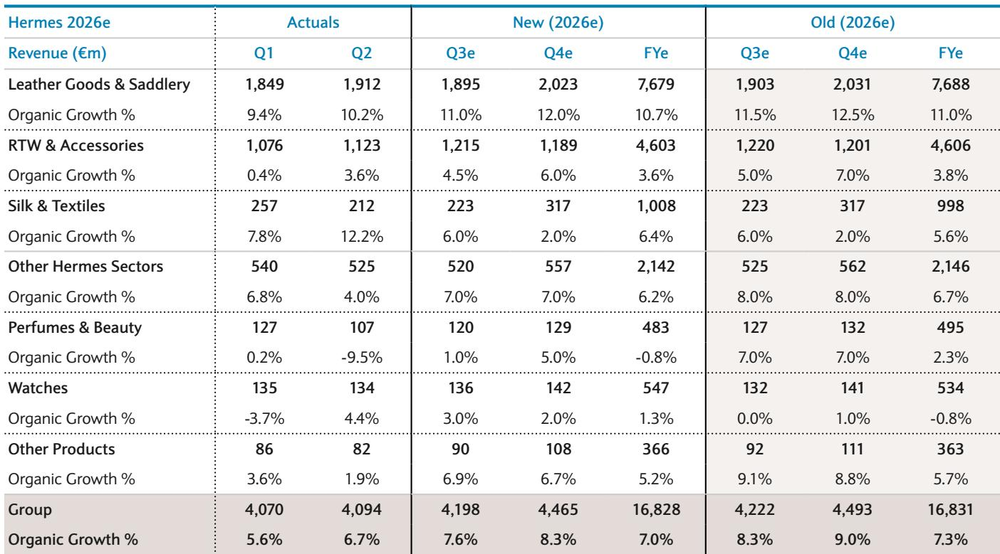
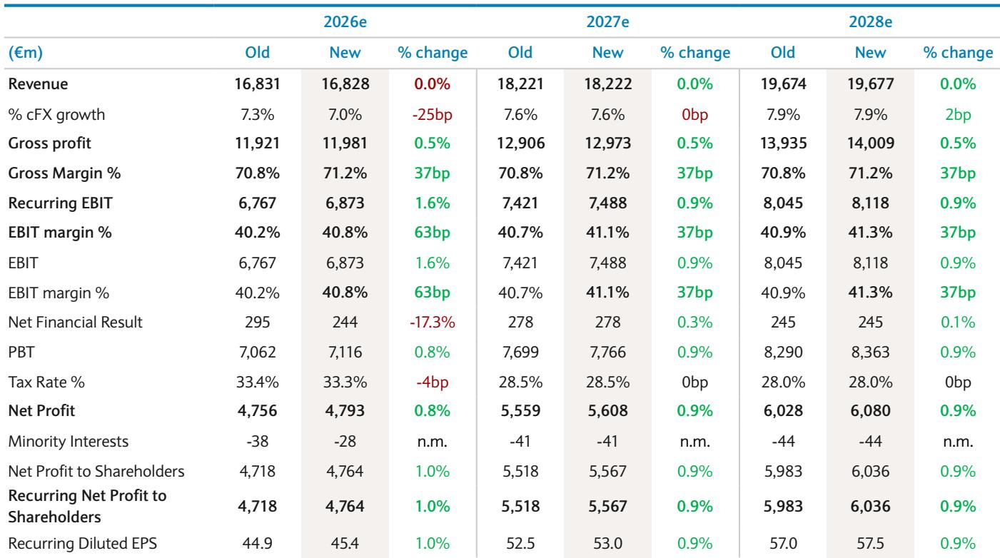

# BARC：爱马仕业务与季度数据观察

爱马仕二季度收入41亿欧元，恒定汇率增长6.7%，与市场预期的6.5%基本一致。皮具部门增长10.2%，略低于市场预期的10.7%。这份成绩单没有改变一个核心争论：集团能否持续维持高个位数增长。BARC在最新研报中更新公司观点，认为估值虽然更有吸引力，但市场需要看到更清晰的增长证据。

上半年EBIT利润率达到41%，超出预期，推动BARC将2026-2028年每股收益预测上调约1%。但利润率的好消息被增长结构的隐忧部分抵消。亚太区（除日本）仅增长2.5%，低于市场预期的3.2%，延续了同行普遍呈现的区域分化。美洲增长13.7%、日本增长12.3%，成为本季度的主要拉动力量。

## 1. 皮具部门增长低于长期算法区间，非皮具部门表现分化

皮具与马具部门增长10.2%，低于11-12%的长期增长算法，也略低于市场预期的10.7%。成衣与配饰部门增长3.6%，继续影响集团整体表现。丝绸与纺织品部门增长12.2%，大幅超过市场预期的7.5%，这个品类通常对 aspirational 消费者敞口更高。香水与美妆部门则出现9.5%的负增长，远低于市场预期的-1.5%。

> **KC评论：** 丝绸的强劲和香水的疲软放在一起看，说明爱马仕不同品类的消费者基础正在分化。香水部门的大幅下滑值得关注，这个品类过去几年一直是奢侈品牌获取新客的重要入口。

## 2. 产能扩张计划与6-7%销量增长一致，供给端约束有限

研报特别指出，工坊开业计划与6-7%的销量增长保持一致。这意味着到2030年，供给不会成为增长的约束条件。但反过来看，如果需求端增速节奏变化，固定成本摊薄效应会减弱，运营杠杆可能反向作用。BARC认为6%的销量增长是可持续的，但三季度不太可能提供更明确的证据。

## 3. BARC下调三季度增长预测，上调全年利润率预期

BARC将三季度集团增长预测从8.6%下调至7.6%，主要基于对亚太区持续疲软的谨慎判断。皮具部门三季度增长预测小幅下调50个基点至11.0%，成衣部门同样下调50个基点。香水与美妆部门的预测下调幅度更大。全年集团增长预测从7.3%下调至7.0%，但EBIT利润率预测从40.2%上调至40.8%。

## 4. 观察框架：增长能否重新加速比单季利润率更重要

这份报告提供了一个可复用的观察框架：对于高估值奢侈品公司，市场定价的核心不是单季利润率，而是增长算法的可持续性。BARC认为，爱马仕需要证明集团增长能够稳定回到高个位数区间，无论通过皮具部门还是非皮具部门的更强动能。三季度预测增长7.6%，在BARC看来不太可能成为改变市场预期的催化剂。

估值方面，当前报价对应2026年预期市盈率约33倍，低于2025年的35倍。，基于7.5%的WACC和3.5%的长期增长率假设。研报也提到，在与100多位读者的交流中，爱马仕是奢侈品板块中争议最大的标的之一，核心分歧就在于增长模式的可持续性。

For informational purposes only. Portions may be generated,translated,summarized,or edited with AI assistance based on source materials and may contain omissions or errors. Please verify independently. This is not investment,legal,tax,accounting,or other professional advice.

For informational purposes only. Portions may be generated,translated,summarized,or edited with AI assistance based on source materials and may contain omissions or errors. Please verify independently. This is not investment,legal,tax,accounting,or other professional advice.

