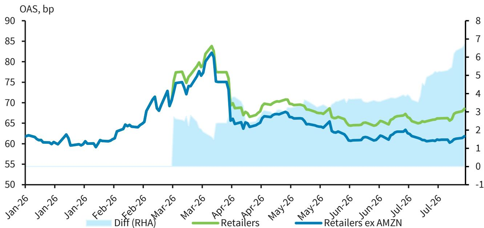
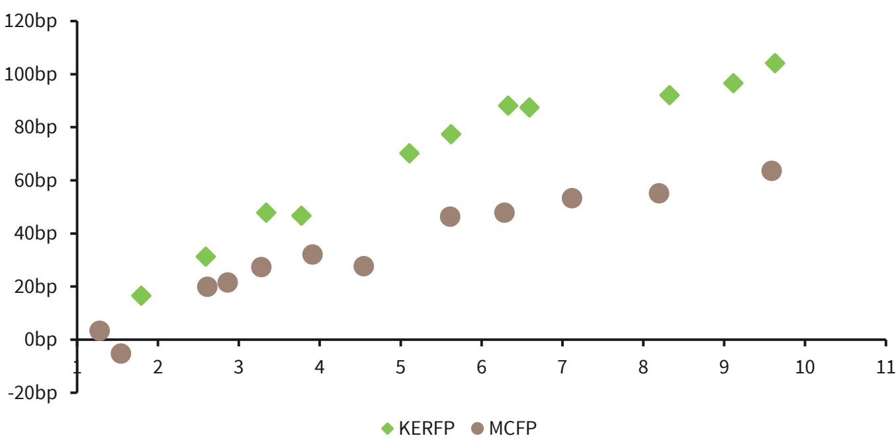

# BARC：资金结构与相关数据观察

BARC在最新研究报告中将对开云集团（Kering）的信用评级展望从低配上调至市场权重，理由是H1 26业绩显示经营企稳，且去杠杆进度快于预期。这份覆盖欧洲高等级零售债券的研究报告，同时将整个欧洲高等级零售板块从市场权重下调至低配，原因来自亚马逊进入欧元研究级市场后对板块构成的改变。

开云集团新任CEO Luca De Meo于2025年9月15日正式上任，此前三天他在股东大会上表示将迅速削减债务和成本。随后数周内，集团与Mayhoola推迟了Valentino股权的出售选择权期限，并以约40亿欧元出售Kering Beauté（核心资产为Creed品牌），现金在H1 26入账。净债务从FY25的80亿欧元降至33亿欧元，净杠杆率（不含IFRS 16）从3.4倍降至1.4倍。

## 1. Gucci经营数据连续两个季度好于市场预期

H1 26集团有机增长为1%，其中Gucci有机收入下降5%，但Q2单季降幅收窄至2%，好于彭博一致预期的下降3.27%。管理层称Gucci皮具品类在Q2恢复增长，新系列Borsetto和Paparazzo带来品牌可见度。Gucci经营利润率同比提升100个基点至17%，集团整体经营利润率12.8%，较H2 25的9.8%有300个基点的环比改善。

BARC公司团队预计EBIT利润率到FY29将弹性较高至22.2%，比资本市场日设定的目标提前一年。他们对FY26 EBIT的预测上调9%，目前较市场一致预期高出3%至14%。

> **KC评论：** Gucci占集团收入约四成，其单季降幅收窄和皮具品类恢复增长，是判断整个集团经营是否触底的关键信号。报告中提到Demna的首场大秀在2026年2月于米兰举行，新创意方向对销售的拉动尚未完全体现。

## 2. 资产出售与现金流共同推动去杠杆进度

自由现金流（不含房地产和Gucci Beauty协议）同比增加约8亿欧元至18亿欧元，经营现金流改善和40亿欧元Beauty出售款共同推动净债务大幅下降。管理层在电话会上表示，现金余额约85亿欧元，净杠杆率目标区间为1.0至1.5倍（不含租赁），但未给出时间表。

标普在2025年11月将开云集团展望从谨慎上调至稳定，预计FY26调整后债务/EBITDA将从FY25年末约4.0至4.5倍的峰值改善至约3.0倍。标普称若开云能持续将调整后债务/EBITDA维持在2.5倍以下，并成功执行Gucci品牌转型，可能考虑正面评级行动。

## 3. 债券曲线出现分化，长端相对价值更突出

自2026年4月资本市场日以来，开云集团2027和2028年到期债券利差收窄20至25个基点，2030至2033年到期债券则略有走阔。BARC认为，考虑到公司现金充裕，可能通过要约回购降低融资成本，因此偏好高票息债券2032年英镑债、2035年和2036年欧元债。

研报同时提到了几组换券交易：从2031年换入2033年欧元债，现金价格多收约1.7个点，z-spread多收约18个基点；从2032年换入2034年欧元债，多收约0.5个点和15个基点。此外，从LVMH 2036年欧元债换入开云2033年欧元债，z-spread多收约24个基点，同时缩短久期三年。

> **KC评论：** 开云与LVMH的债券利差关系值得关注。报告认为尽管两者评级有差异，但开云在Gucci转型推进和潜在正面评级行动下，不确定性收益比更有利。换券交易的核心逻辑是：同一信用曲线内部不同期限的利差差距，可能比跨发行人比较更能反映定价偏差。

## 4. 亚马逊进入欧元研究级市场改变板块结构

BARC将欧洲高等级零售板块从市场权重下调至低配，直接原因是亚马逊于2026年3月进入欧元研究级市场，目前占板块权重25%。剔除亚马逊后，板块利差年初至今变化不大，但亚马逊单一发行人贡献了约7个基点的板块平均利差，并拉长了板块平均久期。

开云集团在板块中权重约17%，LVMH约21%。BARC对这两家仍维持市场权重，但对亚马逊的看法转弱——其分析师将亚马逊下调至低配，理由是未来发行不确定性。这一变化削弱了此前上调板块评级的关键支柱。

Q2 26开云集团收入37亿欧元，有机增长2%，好于公司汇编一致预期的1.4%。北美收入增长6%，占集团收入比重升至24%；中东地区零售收入下降8%，对集团增长的影响约1个百分点。珠宝业务有机增长18%，眼镜业务增长8%，经营利润率分别提升270和290个基点。

开云集团5年期CDS在Q2业绩公布后收窄4个基点至57.5个基点，为过去12个月最窄水平，当日报价上涨约11%。BARC认为当前CDS定价基本合理，后续催化剂包括Q3业绩——公司团队预计集团有机增长基本持平，Q4加速至2.7%。

For informational purposes only. Portions may be generated,translated,summarized,or edited with AI assistance based on source materials and may contain omissions or errors. Please verify independently. This is not investment,legal,tax,accounting,or other professional advice.

For informational purposes only. Portions may be generated,translated,summarized,or edited with AI assistance based on source materials and may contain omissions or errors. Please verify independently. This is not investment,legal,tax,accounting,or other professional advice.

