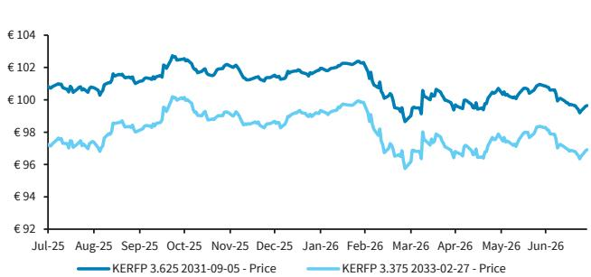
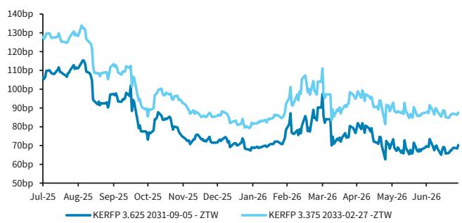
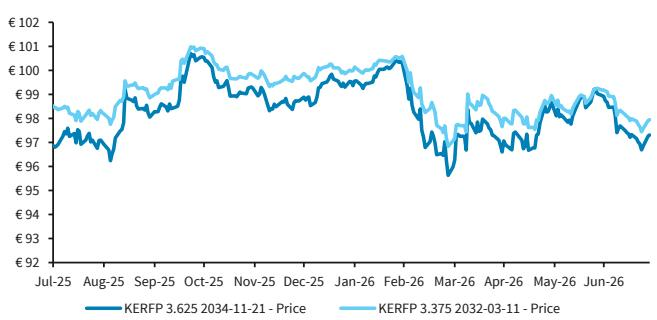
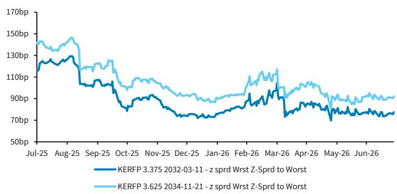
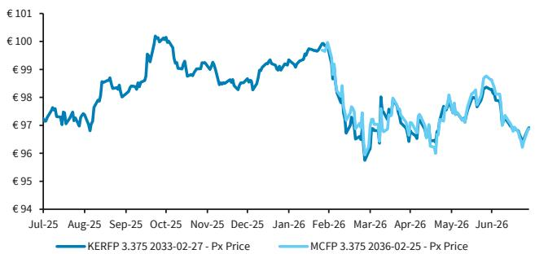
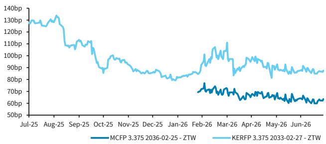
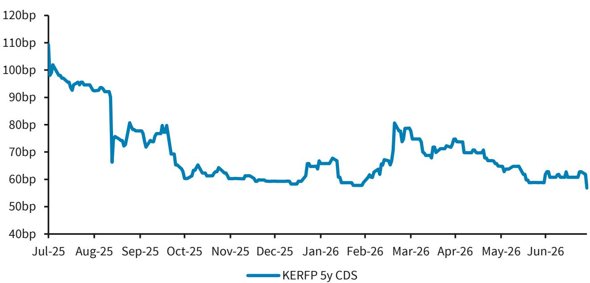

# KERING (KERFP)

## 前景展望趋于明朗——评级调整至标配

我们将KERFP的评级从低配调整为标配，主要基于对H1 26业绩公布后公司经营模式趋于稳定的信心增强，以及在降低杠杆方面取得的进展。本报告中，我们也将欧洲高端零售板块的评级从低配调整为标配。

## 三重积极信号

**新管理层迅速行动。** Kering首席执行官Luca De Meo于2025年9月15日正式上任，此前他在9月9日的股东大会上表示将果断采取措施削减债务和控制成本。De Meo在数日内兑现了两项关键承诺：

1. **降低发行风险……** 次日（2025年9月10日），Kering与Mayhoola同意将后者对Valentino 70%股权的出售选择权从2026-27年推迟至2028-29年，Kering的购买选择权也从2028年推迟至2029年。我们认为，获得更多时间来完成对Valentino的收购，有助于减轻Kering的财务压力，使管理层能够专注于债务削减和Gucci的品牌重塑。

2. **……以及债务水平：** 2025年10月19日，Kering宣布出售Kering Beauté，其主要资产为Creed品牌（据BARC股票研究估算，约占Kering Beauté资产的93%）。如预期，40亿欧元现金在H1 26到账（已计入H1 26报表），此后欧莱雅将为其授权品牌支付为期50年的特许权使用费。双方还成立了50/50合资企业，探索健康与长寿领域的机遇。

3. **资本市场日目标渐行渐近，Gucci初现积极迹象：** 此前我们对Kering在4月16日资本市场日上提出的目标持保留态度，包括：1）将EBIT利润率从11%（2010年以来最低水平）提升一倍以上的目标；2）在实现20% ROCE的同时跑赢市场，资本开支为销售额的5-6%。鉴于我们对Gucci品牌重塑持谨慎看法（Gucci占FY25集团收入的40%，但仅产生FY22收入的57%，我们认为这需要的不仅仅是运营层面的调整），H1 26的业绩令我们感到惊喜。主要积极因素包括：1）Gucci的环比改善（Q2有机增长同比下降2%，好于彭博一致预期的下降3.27%），管理层表示Gucci皮具品类在Q2恢复增长；2）营业利润率改善（12.8%，同比提升40个基点，较H2 25提升300个基点），尤其是Gucci营业利润率的提升（H1 26同比提升100个基点至17%），新系列提升了品牌可见度并带来积极趋势，Borsetto和Paparazzo系列的成功推出提供了支撑；3）集团整体在Q2恢复增长，Saint Laurent在H1 26恢复增长。我们的股票研究同事预计EBIT利润率将从FY25水平提升一倍至FY29的22.2%，比资本市场日设定的目标提前一年。他们对FY26 EBIT的预测上调9%，反映了上半年的超预期表现和管理层提到的下半年利润率环比改善。目前他们较一致预期高出3-14%（FY26E至FY28E EBIT）。

如预期，Kering珠宝业务表现超预期，Q2有机增长同比增长18%，H1 26同比增长20%，营业利润率同比提升270个基点至6.2%。

**净债务削减势头良好：** 除了销售和利润率的改善势头外，经营自由现金流（不含房地产和Gucci美妆协议）同比增加约8亿欧元至18亿欧元，净债务从FY25的80亿欧元降至33亿欧元，反映了经营现金流的改善以及Kering Beauté出售所得（40亿欧元）和房地产处置所得（5亿欧元）。净杠杆率（不含IFRS 16）从FY25的2倍降至1.4倍。在业绩电话会上被问及可能的债券回购时，管理层指出H1 26净债务已显著下降，并表示现金流生成还有进一步下降空间。考虑到Kering约85亿欧元的强劲现金余额，我们认为存在债务回购的可能，但管理层未明确提及总债务削减或回购。我们认为，净债务的减少，尤其是Gucci势头的改善（Demna于2026年2月在米兰的首秀值得关注），以及其他品牌（特别是Saint Laurent和Bottega Veneta）表现的提升，应有助于信用利差的收窄。我们将Kering评级从低配调整为标配，反映我们认为业务已趋于稳定，Gucci仍有进一步改善空间。虽然我们仍偏好较高票息的债券，但也看好长久期债券（与LVMH类似）。潜在催化剂包括Q3业绩（我们的股票研究同事预计Q3集团有机增长基本持平，Q4加速至2.7%，其中FLG增长2.1%）。我们认为Kering在BBB+评级（标普）内定位稳固；但若出现以下情况，不排除标普可能采取正面评级行动：1）"Kering通过正有机增长将调整后债务/EBITDA持续维持在2.5倍以下，并在关键市场收复部分失去的市场份额，同时EBITDA和现金流生成实现可持续改善"；2）"公司成功执行业务计划和Gucci品牌重塑战略"（据标普2025年11月的潜在上调标准）。

## 标普评级关注：BBB+/稳定

标普对Kering的评级为BBB+/稳定，最近一次更新于2025年11月7日，展望从负面调回稳定。2025年11月展望调回稳定是在Beauté出售之后，基于去杠杆前景以及公司经营表现将在2026年逐步改善的预期，得益于品牌重塑战略的执行、较有利的比较基数和更好的行业经营环境。得益于资产处置的预期现金收入，标普预计公司标普调整后债务/EBITDA将在FY26从2025年末约4.0-4.5倍的预测峰值显著改善至约3.0倍。此前我们预计杠杆率在2027年前将保持在3.5倍以上。标普表示，如果Kering展现出清晰的有机去杠杆趋势，调整后债务/EBITDA持续低于2.5倍，则可能上调评级。这一情景可能来自正有机增长的记录、在关键市场收复部分失去的市场份额，以及EBITDA和现金流生成的可持续改善。评级上调还取决于公司能否成功执行业务计划和Gucci品牌重塑战略。

## 相对价值分析

自4月16日资本市场日以来，Kering回报表现曲线在2027和2028年到期债券上收紧了20-25个基点，3.25% 2029年到期债券收紧约14个基点，3.125% 2029年到期债券收紧6个基点。相比之下，2030s、2032s和2033s略有走宽，而长久期债券（2034至2036）收紧了5-8个基点。

图1. KERFP欧元曲线对比MCFP欧元曲线（2026年7月28日）

来源：Bloomberg, BARC

鉴于我们对高票息债券可能被收购的预期，我们偏好高票息债券，建议关注KERFP英镑5.0% 2032s（较LTM最紧水平宽10-11个基点）、KERFP欧元3.875% 2035s和KERFP欧元3.625% 2036s。虽然公司在H1 26电话会上未明确提及收购，但我们认为鉴于较高的现金余额，Kering可能通过收购来降低债务成本。

在潜在收购之外，我们认为曲线长端更具价值，2031、2032、2033和2034欧元债券平均较LTM最紧水平宽约5个基点（尤其是2033s）。我们认为将KERFP欧元31s换为KERFP欧元33s、将KERFP欧元32s换为KERFP欧元34s具有价值。我们还建议将MCFP欧元36s换为KERFP欧元33s。

我们认为将KERFP欧元31s换为KERFP欧元33s具有价值，现金价差约1.7个点，z-spread差约18个基点（LTM均值约15个基点），2026年1月末曾收窄至约8-9个基点。鉴于我们对经营势头的积极看法，我们愿意在曲线上延长久期。

图2. KERFP EUR31对比KERFP EUR33 - 价格

来源：Bloomberg, BARC

图3. KERFP EUR31对比KERFP EUR33 - ZTW

来源：Bloomberg, BARC

我们认为将KERFP欧元32s换为KERFP欧元34s具有价值。现金价差约0.5个点，z-spread差约15个基点（LTM均值12-13个基点），2026年4月初曾收窄至9个基点。鉴于我们对经营势头的积极看法，我们愿意在曲线上延长久期。

图4. KERFP EUR32对比KERFP EUR34 - 价格

来源：Bloomberg, BARC

图5. KERFP EUR32对比KERFP EUR34 - ZTW

来源：Bloomberg, BARC

我们认为将MCFP 36s换为KERFP 33s具有价值，现金价格相近，z-spread差24个基点（均值26个基点），2026年4月初曾收窄至16个基点，4月30日曾走宽至约31个基点，久期缩短三年。尽管存在评级差异，我们认为Kering的风险收益偏向上行，尤其是若Gucci品牌重塑取得成效，可能带来正面评级行动。

图6. MCFP EUR36对比KERFP EUR33 - 价格

来源：Bloomberg, BARC

图7. MCFP EUR36对比KERFP EUR33 - ZTW

来源：Bloomberg, BARC

KERFP 5年期CDS与Kering股价历史上呈负相关关系。在Q4 25电话会（2026年2月10日）上，管理层表示目标将杠杆率（不含租赁）维持在1.0-1.5倍区间，但未给出时间表。业绩公布次日，股价上涨约11%（同日CAC 40上涨0.1%），CDS收紧6个基点，现金债券收盘持平。尽管出售Kering Beauté所得40亿欧元中有1.23亿欧元以特别股息形式分配给股东，但这一表态仍属信用正面。鉴于缺乏时间表，我们假设该目标考虑了Beauté出售所得和房地产股权出售，因此预计该杠杆目标适用于FY26。按标普的杠杆计算方法，Kering的1.0-1.5倍目标约合2.5-3.0倍，与BBB+评级区间一致。对Q1 26业绩的反应：股价盘中下跌9.3%，CDS走宽5个基点。资本市场日（2026年4月16日）使股价进一步下跌3.1%，CDS当日持平。对Q2 26业绩（2026年7月28日）的反应：股价上涨11%（同日CAC 40下跌0.8%），CDS收紧4个基点至LTM低点57.5个基点（中间价）。我们认为5年期CDS在当前水平定价合理。

图8. KERFP（5年期CDS）

来源：Bloomberg, BARC

## 经营表现

**Q2 26**

- Kering报告2Q26收入37亿欧元，有机增长同比增长2%，好于公司汇总的一致预期（同比增长1.4%）。时装与皮具（FLG，约占销售额的81%）有机增长持平（一致预期为同比下降0.6%），Gucci有机收入同比下降2%，显著好于一致预期¹（同比下降4.7%）。

- 我们认为Gucci超预期是非常积极的信号，按地区看，超预期主要由北美（同比增长6%）驱动，其他地区也有所改善。

- 如预期，Kering珠宝业务强劲增长，有机增长18%，好于一致预期的同比增长17.2%，由北美、亚太和日本的强劲两位数增长驱动。

- Kering眼镜业务有机增长8.0%（一致预期为6.1%），较Q1略有加速，受品牌组合扩张驱动。

- 分地区看，北美对集团收入的贡献在Q2提升至24%，西欧稳定在30%。在被问及中东地区时，管理层表示世界其他地区仍具挑战性，Q2下降8%，主要反映中东地区的不稳定因素，尽管该地区零售在整个季度内逐月环比改善。中东通常约占集团零售收入的5%。其对集团收入增长的负面影响在Q2 26为-1%，与Q1持平（当时干扰仅影响当季一个月）。

**H1 26**

- Kering报告H126收入72.2亿欧元，有机增长同比增长1%。时装与皮具（FLG，约占销售额的80%）有机收入同比下降1%，Gucci有机收入同比下降5%。

- Kering珠宝业务强劲增长，有机增长20%。

- Kering眼镜业务有机增长8.0%。

- 集团经常性收入从H1 25的9.2亿欧元增至H1 26的9.21亿欧元。重要的是，营业收入从H2 25的7.11亿欧元环比改善，主要受运营费用减少（同比下降5%）驱动。

- 集团营业利润率同比提升40个基点至12.8%。较H2 25（9.8%）环比提升300个基点。

- FLG营业利润率同比提升70个基点至13.6%。

- FLG中，Gucci营业利润率同比提升100个基点至17%。

- Kering珠宝营业利润率同比提升270个基点至6.2%。

- Kering眼镜营业利润率同比提升290个基点至23%。

- 经营自由现金流同比增加8.52亿欧元至23.24亿欧元，主要得益于H1 26营运资本流入6.02亿欧元（上年同期为流出2600万欧元）。

- 不含房地产和Gucci美妆协议的经营自由现金流从H1 25的10.83亿欧元改善至18.16亿欧元。

- 净债务（不含IFRS 16）从FY25的80亿欧元降至H1 26的33亿欧元。账面现金为85亿欧元，我们计算净杠杆率为1.4倍（不含IFRS 16），FY25为3.4倍。

## 零售板块：AMZN改变格局

我们此前将泛欧高端零售板块从低配调整为标配，基于两个因素。第一，我们看好KERFP前景改善，认为评级下调风险已进一步推后。第二，AMZN于2026年3月进入欧元投资级市场，显著改变了板块构成，该发行人目前占板块的25%。当时我们认为这是引入了一个多元化的高评级发行人，我们的基本面分析师给予标配评级。

上述论点的第一部分仍然成立，反映在我们对KERFP的标配评级调整上。然而，我们的分析师近期将AMZN下调至低配，因发行压力隐现（参见《超大规模效应对零售的影响》，2026年7月24日）。

来源：BARC

AMZN对板块的影响显著。剔除AMZN后，零售板块利差年初至今变化不大，而该发行人目前对整体利差贡献近7个基点（图9）。此外，AMZN拉长了板块的平均久期，使其长于更广泛指数。虽然我们对板块中两个最大的成分股KERFP（17%）和MCFP（21%）持标配评级，但我们对AMZN前景的转弱削弱了我们此前上调评级的一个关键支柱。鉴于该发行人的较大权重和对板块特征的影响，我们将泛欧高端零售板块从标配调整为低配。

图9. 零售板块对比剔除AMZN后的零售板块

来源：Bloomberg, BARC

## 评级汇总

|  | 原评级 | 新评级 |
|---|---|---|
| 泛欧投资级零售板块 | 标配 | 低配 |
| KERING SA | 低配 | 标配 |

## 分析师认证：

我们，Karine Elias和Melissa McCallum（CFA），特此证明（1）本研究报告所表达的观点准确反映了我们对本报告提及的任何或所有标的证券或发行人的个人观点；（2）我们的薪酬中没有任何部分直接或间接与本研究报告中的具体建议或观点相关。

## 重要披露：

BARC由BARC Bank PLC及其关联公司的投资银行部门制作（统称及个别均称"BARC"）。

除非另有说明，为本研究报告做出贡献的所有作者均为研究分析师。报告顶部的发布日期反映报告制作地的当地时间，可能与GMT发布时间不同。

## 披露可用性：

有关本研究报告所涉任何发行人的当前重要披露，请参阅https://publicresearch.BARC.com，或书面请求发送至：BARC Compliance, 745 Seventh Avenue, 13th Floor, New York, NY 10019，或致电+1-212-526-1072。

BARC Capital Inc.和/或其一家关联公司确实并寻求与其研究报告所覆盖的公司开展业务。因此，读者应注意BARC可能存在影响本报告客观性的利益冲突。BARC Capital Inc.和/或其一家关联公司定期交易、通常作为自营方交易并通常为本研究报告所涉债务证券（及其相关衍生品）提供流动性（作为做市商或其他身份）。BARC交易台可能持有此类证券、其他金融工具和/或衍生品的多头和/或空头头寸，这可能与投资客户的利益产生冲突。在允许且受适当信息隔离限制约束的情况下，BARC固定收益研究分析师定期与其交易台人员就当前市场状况和价格进行交流。BARC固定收益研究分析师的薪酬基于多种因素，包括但不限于其工作质量、公司整体表现（包括投资银行部门的盈利能力）、市场业务的盈利和收入，以及公司投资客户对分析师所覆盖资产类别研究的潜在兴趣。如果从BARC交易台获取了任何历史定价信息，公司不保证其准确或完整。所有水平、价格和利差均为历史数据，不一定代表当前市场水平、价格或利差，其中部分可能自本文件发布以来已发生变化。BARC部门制作多种类型的研究，包括但不限于基本面分析、股票关联分析、定量分析和交易思路。一种类型的BARC中所含的建议和交易思路可能与其他类型的BARC不同，无论是由于时间跨度、方法论或其他方面的差异。

如需访问BARC关于研究传播政策和程序的声明，请参阅https://publicresearch.BARC.com/S/RD.htm。如需访问BARC冲突管理政策声明，请参阅：https://publicresearch.BARC.com/S/CM.htm。

## 信息来源披露

Bloomberg®是Bloomberg Finance L.P.及其关联公司（统称"Bloomberg"）的商标和服务标志，Bloomberg指数是Bloomberg的商标。Bloomberg或Bloomberg的许可方拥有Bloomberg指数的所有专有权利。Bloomberg不批准或认可本材料，不保证其中任何信息的准确性或完整性，也不对由此获得的结果作任何明示或暗示的保证。在法律允许的最大范围内，Bloomberg对与此相关的伤害或损害不承担任何责任或义务。

## 主要发行人/债券

KERING SA，标配，CD/FA/J/K/N

估值方法：尽管我们此前对Gucci品牌重塑持谨慎态度，但通过资产处置在降低净债务和杠杆方面取得了进展，我们认为H1 26业绩证明了业务的稳定，Gucci取得了可信的进展——鉴于强劲的现金余额，我们继续认为债务最终将减少。我们认为曲线长端更具价值，将基本面观点与技术面结合，我们对Kering持标配评级。

可能阻碍评级达成的风险——上行：Gucci在新创意总监带领下表现超预期。中国市场需求回升。中东冲突解决带动需求增长。Beauté出售所得用于债券回购超出预期。进一步处置外围资产，标普可能采取正面评级行动，处置用于去杠杆。

下行：Q3 26业绩恶化，Gucci品牌重塑耗时更长。

代表债券：KERFP 3 1/4 02/27/29（欧元99.95，2026年7月28日）

## 实质性提及的发行人/债券

KERING SA，标配，CD/FA/J/K/N

KERFP 3 3/8 02/27/33（欧元96.99，2026年7月28日）

KERFP 3 3/8 03/11/32（欧元98.03，2026年7月28日）

KERFP 3 5/8 03/11/36（欧元95.77，2026年7月28日）

KERFP 3 5/8 09/05/31（欧元99.74，2026年7月28日）

KERFP 3 5/8 11/21/34（欧元97.41，2026年7月28日）

KERFP 3 7/8 09/05/35（欧元98.55，2026年7月28日）

KERFP 5 11/23/32（英镑97.31，2026年7月28日）

LVMH MOET HENNESSY LOUIS VUITTON SE，CD/FA/J/K/M/N

MCFP 3 3/8 02/25/36（欧元96.95，2026年7月28日）

所有定价信息仅供参考。除非另有说明，价格来源于LSEG Data & Analytics，反映相关交易市场的收盘价，可能不是发布时的最新可用价格。

## 披露图例：

A：BARC Bank PLC和/或其关联公司在过去12个月内曾担任该发行人公开发行证券的主承销商或联席主承销商。

B：BARC PLC的员工或非执行董事是该发行人的董事。

CD：BARC Bank PLC和/或其关联公司是该发行人发行的债务证券的做市商。

CE：BARC Bank PLC和/或其关联公司是该发行人发行的股票证券的做市商。

CH：BARC Bank PLC和/或其集团公司将或将在该发行人的证券（定义见香港证监会《行为准则》第16.2(k)段）中做市。

D：BARC Bank PLC和/或其关联公司在过去12个月内从该发行人处获得投资银行服务报酬。

E：BARC Bank PLC和/或其关联公司预计在未来3个月内寻求从该发行人处获得投资银行服务报酬。

FA：BARC Bank PLC和/或其关联公司实益拥有该发行人一类股票证券的1%或以上，按美国法规计算。

FB：BARC Bank PLC和/或其关联公司实益拥有该发行人一类股票证券超过0.5%的多头头寸，按欧盟法规计算。

FC：BARC Bank PLC和/或其关联公司实益拥有该发行人一类股票证券超过0.5%的空头头寸，按欧盟法规计算。

FD：BARC Bank PLC和/或其关联公司实益拥有该发行人一类股票证券的1%或以上，按韩国法规计算。

FE：BARC Bank PLC和/或其集团公司与该发行人存在财务利益关系，且此类利益合计等于或超过该发行人市值的1%，按香港法规计算。

GD：基本面信用覆盖团队的研究分析师之一（和/或其家庭成员）持有该发行人普通股股票的多头头寸。

GE：基本面股票覆盖团队的研究分析师之一（和/或其家庭成员）持有该发行人普通股股票的多头头寸。

H：该发行人实益拥有BARC PLC任何一类普通股股票超过5%。

I：BARC Bank PLC和/或其关联公司与该发行人签订了向BARC Bank PLC和/或其关联公司提供金融服务的协议。

J：BARC Bank PLC和/或其关联公司是该发行人证券和/或任何相关衍生品的流动性提供者和/或定期交易。

K：BARC Bank PLC和/或其关联公司在过去12个月内从该发行人处获得非投资银行相关报酬（如适用，包括经纪服务报酬）。

L：该发行人是BARC Bank PLC和/或其关联公司的投资银行客户（现在或过去12个月内）。

M：该发行人是BARC Bank PLC和/或其关联公司的非投资银行客户（证券相关服务）（现在或过去12个月内）。

N：该发行人是BARC Bank PLC和/或其关联公司的非投资银行客户（非证券相关服务）（现在或过去12个月内）。

O：未使用。

P：未使用。

Q：BARC Bank PLC和/或其关联公司是该发行人的企业经纪商。

R：未使用。

S：该发行人是BARC PLC的企业经纪商。

T：BARC Bank PLC和/或其关联公司正在为该发行人提供读者参与服务。

## BARC企业信用行业评级系统说明

**超配（OW）：**

对于对标Bloomberg美国信用指数、Bloomberg泛欧信用指数、Bloomberg新兴亚洲美元投资级信用指数或Bloomberg新兴美元企业与准主权指数的行业，分析师预计该行业六个月的超额回报将超过相应指数的六个月超额回报。

对于对标Bloomberg美国高收益2%发行人上限信用指数、Bloomberg泛欧高收益3%发行人上限信用指数（不含金融）、Bloomberg泛欧高收益金融指数或Bloomberg新兴亚洲美元高收益企业信用指数的行业，分析师预计该行业六个月的总体回报将超过相应指数的六个月总体回报。

**标配（MW）：**

对于对标Bloomberg美国信用指数、Bloomberg泛欧信用指数、Bloomberg新兴亚洲美元投资级信用指数或Bloomberg新兴美元企业与准主权指数的行业，分析师预计该行业六个月的超额回报将与相应指数的六个月超额回报一致。

对于对标Bloomberg美国高收益2%发行人上限信用指数、Bloomberg泛欧高收益3%发行人上限信用指数（不含金融）、Bloomberg泛欧高收益金融指数或Bloomberg新兴亚洲美元高收益企业信用指数的行业，分析师预计该行业六个月的总体回报将与相应指数的六个月总体回报一致。

**低配（UW）：**

对于对标Bloomberg美国信用指数、Bloomberg泛欧信用指数、Bloomberg新兴亚洲美元投资级信用指数或Bloomberg新兴美元企业与准主权指数的行业，分析师预计该行业六个月的超额回报将低于相应指数的六个月超额回报。

对于对标Bloomberg美国高收益2%发行人上限信用指数、Bloomberg泛欧高收益3%发行人上限信用指数（不含金融）、Bloomberg泛欧高收益金融指数或Bloomberg新兴亚洲美元高收益企业信用指数的行业，分析师预计该行业六个月的总体回报将低于相应指数的六个月总体回报。

## 行业定义：

美国高收益研究中的行业使用Bloomberg美国高收益2%发行人上限信用指数的行业定义，并对照该指数进行评级。

欧洲高收益研究中的行业使用Bloomberg泛欧高收益3%发行人上限信用指数（不含金融）的行业定义，并对照该指数进行评级。

欧洲高收益研究中的金融行业使用Bloomberg泛欧高收益金融指数的行业定义，并对照该指数进行评级。

亚洲高收益研究中的行业在BARC Live上定义，并对照Bloomberg新兴亚洲美元高收益企业信用指数进行评级。

EEMEA和拉丁美洲研究中的行业在BARC Live上定义，并对照Bloomberg新兴美元企业与准主权指数进行评级。这些行业可能同时包含投资级和高收益发行人。

如需查看亚洲、EEMEA和拉丁美洲研究的行业定义和月度行业回报，请访问BARC Live上的https://live.barcap.com/go/research/EMSectorReturns。

如需了解亚洲、EEMEA和拉美信用行业定义的重要信息，请访问BARC Live上的https://live.barcap.com/go/publications/link?contentPubID=FC2786307&restriction=DEBT。

## BARC企业信用评级系统说明

对于在美国、欧洲或亚洲覆盖的所有投资级发行人，以及拉丁美洲和EEMEA的所有发行人，信用评级系统基于分析师对发行人指数合格公司债务证券*在六个月内的预期超额回报相对于相关行业（如报告所述）预期超额回报的看法。

**超配（OW）：** 分析师预计发行人指数合格公司债务证券六个月的超额回报将超过相关行业六个月的预期超额回报。

**标配（MW）：** 分析师预计发行人指数合格公司债务证券六个月的超额回报将与相关行业六个月的预期超额回报一致。

**低配（UW）：** 分析师预计发行人指数合格公司债务证券六个月的超额回报将低于相关行业六个月的预期超额回报。

**评级暂停（RS）：** 由于市场事件使覆盖不切实际，或为遵守适用法规和/或公司政策（包括BARC Bank PLC投资银行部门在涉及该公司的合并或战略交易中担任顾问的情况），评级已暂时暂停。

**覆盖暂停（CS）：** 该发行人的覆盖已暂时暂停。

**未覆盖（NC）：** BARC基本面信用研究团队未对该发行人提供正式、持续的覆盖，也未对该发行人或其债务证券分配评级。对未覆盖发行人或其债务证券的任何分析、意见或交易建议仅在本报告发布之日有效，不应预期此后会发布关于该未覆盖发行人或其债务证券的额外报告。

对于所有高收益发行人（EEMEA或拉丁美洲覆盖的除外），信用评级系统基于分析师对评级债务证券在六个月内的预期总体回报相对于相关行业（如报告所述）预期总体回报的看法。

**超配（OW）：** 分析师预计受此评级约束的债务证券六个月的总体回报将超过相关行业六个月的预期总体回报。

**标配（MW）：** 分析师预计受此评级约束的债务证券六个月的总体回报将与相关行业六个月的预期总体回报一致。

**低配（UW）：** 分析师预计受此评级约束的债务证券六个月的总体回报将低于相关行业六个月的预期总体回报。

**评级暂停（RS）：** 由于市场事件使覆盖不切实际，或为遵守适用法规和/或公司政策（包括BARC Bank PLC投资银行部门在涉及该公司的合并或战略交易中担任顾问的情况），评级已暂时暂停。

**覆盖暂停（CS）：** 该发行人的覆盖已暂时暂停。

**未覆盖（NC）：** BARC基本面信用研究团队未对该发行人提供正式、持续的覆盖，也未对该发行人或其债务证券分配评级。对未覆盖发行人或其债务证券的任何分析、意见或交易建议仅在本报告发布之日有效，不应预期此后会发布关于该未覆盖发行人或其债务证券的额外报告。

如果在发行人层面做出建议，则不适用于任何受制裁证券，即在适用法律（包括制裁法律和法规）下交易此类证券将被禁止的情况。

*在EEMEA和拉丁美洲（以及在其他地区的某些有限情况下），分析师可能偶尔对不属于Bloomberg美国信用指数、Bloomberg泛欧信用指数、Bloomberg新兴亚洲美元投资级信用指数或Bloomberg新兴美元企业与准主权指数的发行人进行评级。在此类情况下，评级将反映分析师对发行人公司债务证券在六个月内的预期超额回报相对于相关行业（如报告所述）预期超额回报的看法。

## BARC企业信用研究在发行人层面的评级分布：

27%被分配了超配评级，就强制性监管披露而言，该评级被归类为报告评级；此评级类别中58%的发行人是公司的投资银行客户；70%的此评级发行人已获得公司的金融服务。

52%被分配了标配评级，就强制性监管披露而言，该评级被归类为持有评级；此评级类别中62%的发行人是公司的投资银行客户；76%的此评级发行人已获得公司的金融服务。

21%被分配了低配评级，就强制性监管披露而言，该评级被归类为报告评级；此评级类别中59%的发行人是公司的投资银行客户；73%的此评级发行人已获得公司的金融服务。

## BARC FICC研究制作的研究交流类型：

除了BARC正式评级系统下分配的任何评级外，本出版物可能包含以交易思路、主题筛选、评分卡或组合建议形式的研究交流，由FICC研究的分析师制作。非信用研究团队（包括可持续投资）制作的任何此类研究交流将保持有效，直至在未来的研究报告中修订、再平衡或关闭。信用因子观点保持有效，直至在未来的研究报告中定期修订或随后关闭。信用研究团队制作的任何其他研究交流在当前市场条件下有效，不得另行依赖。

## BARC FICC研究制作的其他研究交流披露：

BARC FICC研究可能在本研究报告之前的12个月内发布过关于相同证券/工具的其他研究交流。如需查看BARC FICC研究在过去12个月内发布的所有研究交流，请参阅https://live.barcap.com/go/research/Recommendations。

BARC不对资产支持证券分配评级。BARC Capital Inc.和/或其一家关联公司可能曾担任任何资产支持证券公开发行的承销商，这些证券可能在其证券化研究报告中包含的交易思路中被推荐。

## 制作BARC的法律实体：

BARC Bank PLC（BARC，英国）

BARC Capital Inc.（BCI，美国）

BARC Bank Ireland PLC，法兰克福分行（BBI，法兰克福）

BARC Bank Ireland PLC，巴黎分行（BBI，巴黎）

BARC Bank Ireland PLC，米兰分行（BBI，米兰）

BARC Securities Japan Limited（BSJL，日本）

BARC Bank PLC，香港分行（BARC Bank，香港）

BARC Bank Mexico, S.A.（BBMX，墨西哥）

BARC Capital Casa de Bolsa, S.A. de C.V.（BCCB，墨西哥）

BARC Securities (India) Private Limited（BSIPL，印度）

BARC Bank PLC，新加坡分行（BARC Bank，新加坡）

BARC Bank PLC，DIFC分行（BARC Bank，DIFC）

## 免责声明：

本出版物由BARC Bank PLC和/或其一家或多家关联公司（统称及个别均称"BARC"）投资银行部门的BARC部门制作。

本出版物面向机构读者而非零售读者。由一家或多家BARC关联法律实体（如下所列）或独立非关联第三方（如其与您的沟通中所述）分发。本出版物仅供参考，BARC不作任何明示或暗示的保证，并明确否认对其中包含的任何数据的适销性或特定用途适用性的所有保证。BARC可向某些不使用本出版物进行投资的类别的接收者提供研究，包括所覆盖行业的上市公司和私营公司、媒体机构、监管机构和学术机构，这些机构将此类研究用于其内部信息、新闻采集、监管或学术目的。如果本出版物首页声明其面向机构读者且不受适用于零售读者的债务研究报告中独立性及披露标准的约束（美国FINRA规则2242），则其为"机构债务研究报告"，严格禁止向零售读者分发。媒体机构不得重新发布BARC任何机构债务研究报告中包含的关于债务发行人或债务证券的任何意见或建议。不希望继续接收BARC机构债务研究报告的接收者应联系debtresearch@BARC.com。除非客户同意按照美国FINRA规则2242的要求接收"机构债务研究报告"，否则他们不会收到任何可能由非债务研究分析师合著的此类报告。符合条件的客户可通过联系debtresearch@BARC.com获取此类跨资产报告。BARC将不把本报告的未经授权接收者视为其客户，并且不对其使用内容承担任何责任，这些内容可能不适合其个人使用。所示价格为指示性价格，BARC不提供买入或卖出任何金融工具的要约，也不征求买入或卖出任何金融工具的要约。

在不限制前述内容且在法律允许的范围内，BARC、任何关联公司或其各自的高级职员、董事、合伙人或员工在任何情况下均不对以下情况承担责任：(a) 任何特殊的、惩罚性的、间接的或后果性的损害；或 (b) 任何利润损失、收入损失、预期储蓄损失或机会损失或其他财务损失，即使已被告知此类损害的可能性，因使用本出版物或其内容而产生。

除与BARC相关的披露外，本出版物中包含的信息（包括第三方数据）来自BARC认为可靠的来源，但BARC不声明或保证其准确或完整。第三方数据，包括第三方预测和预期，仅供参考，未经BARC采纳或认可，不代表BARC的观点或意见。第三方演讲者演示：第三方演讲者在BARC主办的活动期间表达的任何观点或意见仅代表演讲者本人，不代表BARC的观点或意见。BARC不对任何第三方演讲者的书面、电子、音频或视频演示中包含的信息或意见负责，也不作任何保证，此类演示未经BARC采纳或认可，不代表BARC的观点或意见。第三方演示内容仅供参考，未经BARC独立验证其准确性或完整性。

本出版物中的观点仅且完全属于署名分析师的个人观点，可能随时变更，BARC没有义务更新其观点或本出版物中的信息。除非本报告另有披露，本报告署名分析师在过去12个月内未从标的公司获得任何报酬。如果本出版物包含建议，则这些建议是一般性建议，独立于任何其他利益（包括BARC和/或其关联公司和/或标的公司的利益）而编制。本出版物不包含个人研究交流或投资
