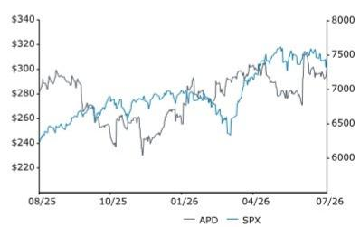
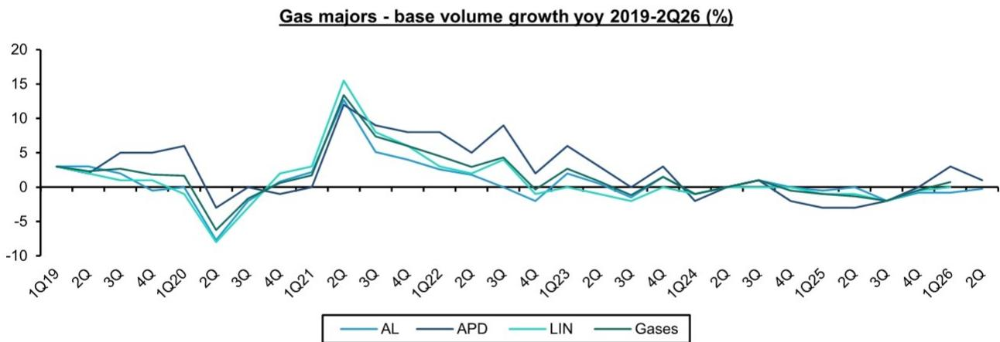
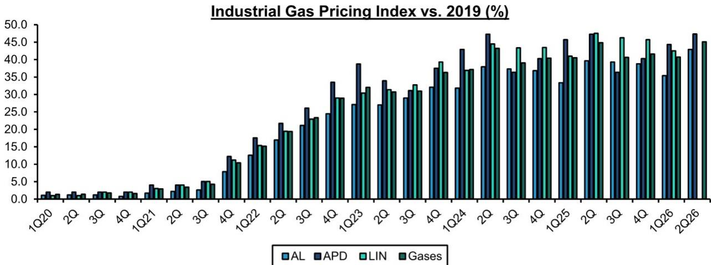
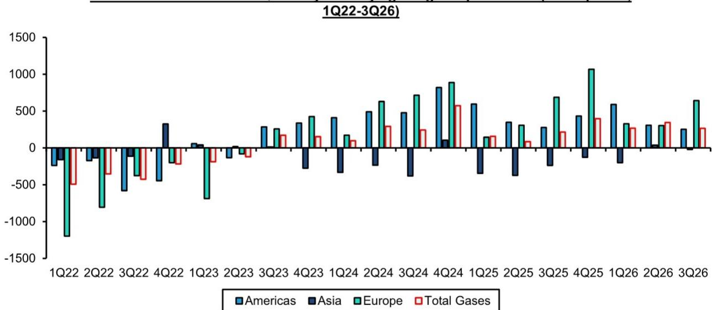
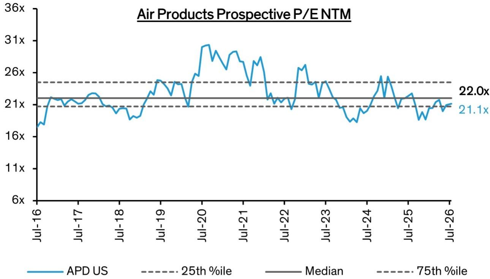
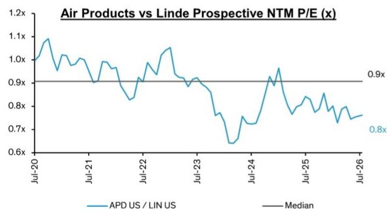
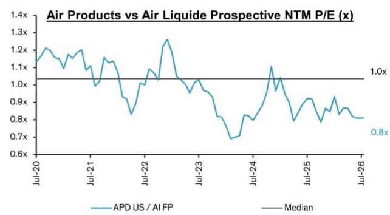
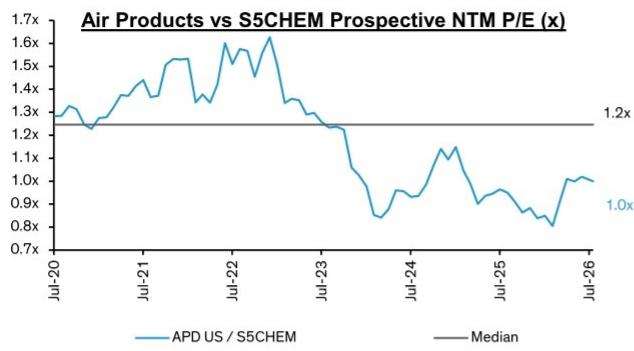
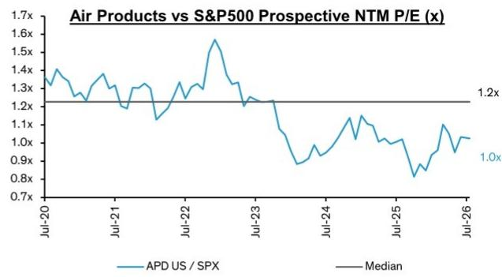

# 微信文章（wechat_article.md）

## Air Products 3QFY26：稳健表现延续

Air Products再次交出了一份稳健的季度更新（快速解读：Air Products 3QFY26——又一次超预期并上调指引）。更多这样的季度表现将有助于验证我们在近期深度研究报告中提出的核心观点：Air Products：即便包含NEOM项目，仍可实现可持续的、高于市场一致预期的每股收益增长。本季度提供了更多证据表明Air Products正专注于工业气体主业，我们仍然难以解释其与工业气体同行之间历史性的估值差距。我们认为Air Products通过了"鸭子测试"——对于工业气体公司而言，如果其大部分收入来自工业气体销售且经营表现与工业气体公司一致，那么它很可能就是一家工业气体公司，理应获得相应的估值认可。评级：跑赢大盘。

**FY2027预计不受NEOM项目影响。** 作为深度研究的一部分，我们构建了专有的NEOM模型，客户可随时索取。我们对该模型进行了小幅更新，以与管理层对FY27的指引保持一致——即无重大财务影响——具体做法是放缓该设施的全面投产进度，从而调整项目融资节奏。因此，我们上调了FY27每股收益预测，这在一定程度上回应了读者的谨慎观点。

FY27每股收益增速同比可能略有放缓，但我们仍看到复利增长的机会。APD在中国气化项目上获得了一定助力，有望实现FY26约11-12%的调整后每股收益增长。销量环境仍存在较大不确定性。氦气方面的不利因素可能持续（但影响递减），直至明年二月美国一项大型合同到期。但这些因素都不会削弱生产率提升的机会、亚洲更多电子产线持续爬坡带来的增量，以及在关键客户修复发射台期间利用定价能力的空间（尤其是在航天业务领域）。然而，作为一家工业气体公司，保守指引是经营风格的一部分，因此要通过"鸭子测试"，读者可能需要为FY27调整后每股收益指引区间约6-9%的同比增速做好准备。随着业务持续推进，这一指引有望逐步改善。

## 投资启示

我们给予Air Products"跑赢大盘"评级。我们将FY26E和FY27E每股收益预测各上调1%。我们将估值框架从FY26市盈率滚动至NTM市盈率（包含FY26的3个月和FY27的9个月）。在26倍NTM市盈率不变的假设下，目标价从345美元上调至373美元。

| 调整后每股收益 | F25A | F26E | F27E |
|---|---|---|---|
| APD（美元） | 12.07 | 13.45 | 14.67 |
| 原预测 | -- | 13.28 | 14.50 |

来源：Bloomberg，Bernstein预测与分析

| 收盘日期 | 2026年7月29日 |
|---|---|
| APD收盘价（美元） | 294.27 |
| 目标价（美元） | 373.00 |
| 上行空间 | 27% |
| 52周区间 | 314.87/229.11 |
| SPX | 7,437.63 |
| 财年截止 | 9月 |
| 股息率 | 2.4% |
| 市值（百万美元） | 66,677 |
| EV（百万美元） | 86,583 |

| 表现 | 年初至今 | 1个月 | 6个月 | 12个月 |
|---|---|---|---|---|
| 相对表现（%） | 21.2 | 2.1 | 9.9 | 3.2 |
| SPX（%） | 8.6 | (0.8) | 7.2 | 16.9 |
| 相对表现（%） | 12.6 | 3.0 | 2.7 | (13.7) |

来源：Bloomberg，Bernstein预测与分析

一年价格表现

| 估值指标 | F25A | F26E | F27E |
|---|---|---|---|
| 调整后市盈率（倍） | 24.4 | 21.9 | 20.1 |
| EV/EBITDA（倍） | 17.1 | 15.8 | 14.6 |

## 详细分析

图表1：Air Products正逐步建立起读者所看重的业绩可靠性——Eduardo Menezes领导下的APD调整后每股收益超预期/不及预期历史

来源：Bloomberg，Bernstein分析

图表2：我们认为APD基础销量持续向好

来源：公司信息，Bernstein预测与分析

图表3：尽管存在氦气不利因素，Air Products的商用气定价仍与同行保持同步

日历年季度
来源：公司信息，Bernstein分析与预测

图表4：近期利润率改善在各区域均有体现

季度以9月财年截止
来源：公司数据，Bernstein分析

图表5：Air Products当前交易水平接近其十年中位数

来源：Bloomberg，Bernstein分析

图表6：Air Products相对同行的折价在过去两年持续扩大（1/2）

来源：Bloomberg，Bernstein分析

图表7：Air Products相对同行的折价在过去两年持续扩大（2/2）

来源：Bloomberg，Bernstein分析

图表8：自2024年以来，Air Products相对板块的估值处于历史低位……

图表9：……相对更广泛的市场也呈现类似趋势
来源：Bloomberg，Bernstein分析

来源：Bloomberg，Bernstein分析

## 重点工业气体研究

## 工业气体

• 2026年7月15日 - 化工：特种还是大宗，中间可能面临挑战时期

• 2026年5月26日 - 长期视角：化工——分析伊朗战争对上游化工的持续影响

• 2026年5月7日 - Bernstein工业气体入门：行业结构如何支撑长期优异表现

• 2026年4月20日 - 化工：布局伊朗相关周期，将Arkema上调至市场表现

• 2026年3月13日 - 全球工业气体与半导体：评估氦气影响

• 2026年2月23日 - 长期视角：工业气体航天机遇——增长的火箭燃料

• 2026年1月8日 - 化工2026展望：开局缓慢，但存在可观上行潜力。将Solvay下调至市场表现。

• 2025年12月1日 - 长期视角：工业气体收入如何在2030年前实现5%的复利增长

• 2025年8月13日 - 欧洲化工：战争与和平II——更新乌克兰战争情景

• 2025年5月27日 - 化工：关税动荡之中

• 2025年4月9日 - 工业气体巨头——世界很大，但气体不流动，因此"保持坚定"并买入

## AIR PRODUCTS

• 2026年7月17日 - Air Products：可持续的、高于市场一致预期的每股收益增长，即便包含NEOM

• 2026年6月30日 - 快速解读：Air Products取消Darrow项目及3QFY26更新

• 2026年5月27日 - Bernstein SDC：Air Products要点

• 2026年5月1日 - Air Products 2QFY26：这可能不是今年最后一次上调指引

• 2026年2月2日 - Air Products 1QFY26：转型进行中

• 2025年12月8日 - Air Products大型项目更新：工业气体能源转型的故事尚未结束

• 2025年11月26日 - Air Products 4QFY25：随着焦点转向Darrow项目取得进展

• 2025年7月31日 - 快速解读：APD 3Q25——新管理层的首次超预期

• 2025年5月1日 - 快速解读：Air Products 2Q25——对当前任务的清醒认识

• 2025年2月25日 - Air Products——快速大型项目优化显示对股东价值的重新关注

• 2025年2月6日 - Air Products——1Q25发布无意外

• 2025年2月4日 - Air Products新领导层支持密度、纪律、去风险……和可靠性

• 2025年1月31日 - Air Products——上调至跑赢大盘：密度、纪律、去风险……可靠性？

## LINDE

• 2026年5月5日 - Linde 1Q26：收益贵族，核心增长有望改善

• 2026年2月19日 - Linde 4Q25：收益贵族，适应各种宏观情景

• 2025年11月3日 - Linde 3Q25：收益贵族，也是被低估的增长故事

• 2025年10月31日 - 快速解读：Linde 3Q25——连续27次调整后每股收益超预期，但指引收窄而非上调

• 2025年8月4日 - Linde 2Q25：收益贵族

• 2025年8月1日 - 快速解读：Linde 2Q25——连续26次每股收益超预期，3美分算什么？

• 2025年7月22日 - Linde：收益贵族2Q25——我们预计连续第26个季度每股收益超预期

• 2025年6月4日 - Linde：SDC与CEO的一天——"价值可见"……在现场、网络、密度、基准、所有权、45Q……

• 2025年4月29日 - Linde：收益贵族？1Q25——我们预计连续第25个季度每股收益超预期及潜在环比增长

• 2025年2月6日 - Linde——如预期第24次超预期，1Q和FY25指引偏弱，股价反应与3Q24类似……

• 2025年2月4日 - Linde——我们预计连续第24次每股收益超预期及环比增长，但宏观因素拖累指引……

## AIR LIQUIDE

• 2026年7月29日 - Air Liquide 1H26——小幅波动，维持跑赢大盘

• 2026年4月29日 - Air Liquide 1Q26：指引为谁而设？

• 2026年2月23日 - Air Liquide 2H25：更多增长和更多利润率改善

• 2026年1月28日 - Air Liquide：2026年第一季度欧洲最佳标的——未被定价的增长改善。跑赢大盘

• 2025年12月3日 - 快速解读：SDC与Air Liquide的一天——溢价回顾

• 2025年10月29日 - Air Liquide 3Q25：典型稳健，可能是增长低谷

• 2025年9月25日 - Air Liquide在Bernstein欧洲工业论坛：令人安心的稳健

• 2025年8月22日 - 快速解读：Air Liquide收购DIG Airgas——价格不菲，但物有所值

• 2025年7月30日 - Air Liquide 1H25："这只是开始"

• 2025年7月28日 - Air Liquide：边际收益

• 2025年5月29日 - 快速解读：Air Liquide美洲CEO在SDC

• 2025年4月24日 - Air Liquide——稳中有进

• 2025年2月21日 - Air Liquide——再次推高利润率……

• 2025年2月14日 - Air Liquide——我们预计FY24 EBIT利润率+110bp，并有望在此基础上再提升约500bp

## 附录 - 财务预测

图表10：APD损益汇总

| Air Products（百万美元） | FY23 | 同比 | FY24 | 同比 | FY25 | 同比 | 4Q26e | 同比 | FY26e | 同比 | FY27e | 同比 | FY28e | 同比 |
|---|---|---|---|---|---|---|---|---|---|---|---|---|---|---|
| **销售额** | | | | | | | | | | | | | | |
| 美洲 | 5,369.3 | 0.0% | 5,040.1 | -6.1% | 5,125.9 | 1.7% | 1,366.6 | 8.4% | 5,413.6 | 5.6% | 5,792.5 | 7.0% | 6,169.0 | 6.5% |
| 亚洲 | 3,216.1 | 2.3% | 3,224.3 | 0.3% | 3,271.0 | 1.4% | 940.7 | 16.1% | 3,490.8 | 6.7% | 3,681.1 | 5.5% | 3,865.1 | 5.0% |
| 欧洲 | 2,963.1 | -4.0% | 2,823.4 | -4.7% | 2,984.5 | 5.7% | 799.9 | 3.8% | 3,186.6 | 6.8% | 3,303.9 | 3.7% | 3,403.0 | 3.0% |
| 中东 | 162.5 | 25.5% | 134.4 | -17.3% | 135.9 | | 32.6 | | 126.9 | | 556.1 | | 1,002.3 | |
| 气体 | 11,711.0 | -0.1% | 11,222.2 | -4.2% | 11,517.3 | 2.6% | 3,139.9 | 9.0% | 12,218.0 | 6.1% | 13,333.5 | 9.1% | 14,439.5 | 8.3% |
| 公司及其他 | 889.0 | -8.4% | 878.4 | -1.2% | 520.0 | -40.8% | 172.6 | 20.8% | 529.8 | 1.9% | 500.0 | -5.6% | 500.0 | 0.0% |
| **集团** | **12,600.0** | **-0.8%** | **12,100.6** | **-4.0%** | **12,037.3** | **-0.5%** | **3,312.5** | **9.6%** | **12,747.8** | **5.9%** | **13,833.5** | **8.5%** | **14,939.5** | **8.0%** |
| **调整后EBITDA** | | | | | | | | | | | | | | |
| 美洲 | 2,198.2 | 15.6% | 2,423.2 | 10.2% | 2,408.7 | -0.6% | 660.1 | 9.2% | 2,521.9 | 4.7% | 2,784.5 | 10.4% | 3,027.2 | 8.7% |
| 亚洲 | 1,369.7 | 0.9% | 1,363.1 | -0.5% | 1,412.3 | 3.6% | 419.0 | 18.7% | 1,532.8 | 8.5% | 1,638.4 | 6.9% | 1,797.6 | 9.7% |
| 欧洲 | 962.1 | 23.9% | 1,105.2 | 14.9% | 1,194.0 | 8.0% | 346.0 | 8.2% | 1,314.2 | 10.1% | 1,379.1 | 4.9% | 1,471.5 | 6.7% |
| 中东 | 394.2 | | 380.0 | | 376.4 | | 99.8 | | 401.0 | | 378.3 | | 362.2 | |
| 气体 | 4,924.2 | 12.5% | 5,271.5 | 7.1% | 5,391.4 | 2.3% | 1,524.9 | 10.7% | 5,769.9 | 7.0% | 6,180.4 | 7.1% | 6,658.6 | 7.7% |
| 公司及其他 | -222.4 | | -225.2 | | -314.9 | 39.8% | -68.4 | 0.2% | -306.0 | | -256.0 | | -256.0 | |
| **集团** | **4,701.8** | **10.7%** | **5,046.3** | **7.3%** | **5,076.5** | **0.6%** | **1,456.5** | **11.2%** | **5,463.9** | **7.6%** | **5,924.4** | **8.4%** | **6,402.6** | **8.1%** |
| **调整后EBIT** | | | | | | | | | | | | | | |
| 美洲 | 1,439.7 | 22.6% | 1,565.1 | 8.7% | 1,519.6 | -2.9% | 425.1 | 13.6% | 1,598.2 | 5.2% | 1,796.9 | 12.4% | 1,975.4 | 9.9% |
| 亚洲 | 906.5 | 0.9% | 859.2 | -5.2% | 851.1 | -0.9% | 273.2 | 26.0% | 1,001.9 | 17.7% | 1,074.9 | 7.3% | 1,205.9 | 12.2% |
| 欧洲 | 663.4 | 31.8% | 810.0 | 22.1% | 844.7 | 4.3% | 246.7 | 9.5% | 912.5 | 8.0% | 962.6 | 5.5% | 1,042.5 | 8.3% |
| 中东 | 16.9 | | 5.9 | | 9.6 | | 6.7 | | 25.1 | | 6.4 | | -13.1 | |
| 气体 | 3,026.5 | 16.5% | 3,240.2 | 7.1% | 3,225.0 | -0.5% | 951.7 | 15.5% | 3,537.7 | 9.7% | 3,840.8 | 8.6% | 4,210.7 | 9.6% |
| 公司及其他 | -287.3 | | -292.7 | | -367.3 | 25.5% | -80.0 | -3.7% | -346.5 | | -310.0 | | -310.0 | |
| **营业利润** | **2,739.2** | **13.5%** | **2,947.5** | **7.6%** | **2,857.7** | **-3.0%** | **871.7** | **17.6%** | **3,191.2** | **11.7%** | **3,530.8** | **10.6%** | **3,900.7** | **10.5%** |
| **调整后净利润** | **2,562.9** | **10.7%** | **2,768.6** | **8.0%** | **2,688.4** | **-2.9%** | **804.8** | **16.9%** | **2,997.6** | **11.5%** | **3,270.2** | **9.1%** | **3,566.0** | **9.0%** |
| 摊薄股数（百万） | 222.7 | | 222.8 | | 222.7 | | 222.9 | | 222.9 | | 222.9 | | 222.9 | |
| 摊薄每股收益（美元） | 11.51 | 10.6% | 12.43 | 8.0% | 12.07 | -2.9% | 3.61 | 16.9% | 13.45 | 11.4% | 14.67 | 9.1% | 16.00 | 9.0% |
| 每股股息（美元） | 7.00 | 8.0% | 7.08 | 1.1% | 7.16 | 1.1% | 1.81 | 1.1% | 7.24 | 1.1% | 7.35 | 1.5% | 7.50 | 2.0% |
| **EBITDA利润率** | | | | | | | | | | | | | | |
| 美洲 | 40.9% | | 48.1% | | 47.0% | | 48.3% | | 46.6% | | 48.1% | | 49.1% | |
| 亚洲 | 42.6% | | 42.3% | | 43.2% | | 44.5% | | 43.9% | | 44.5% | | 46.5% | |
| 欧洲 | 32.5% | | 39.1% | | 40.0% | | 43.3% | | 41.2% | | 41.7% | | 43.2% | |
| 中东 | NM | | NM | | NM | | NM | | NM | | NM | | NM | |
| 气体 | 42.0% | | 47.0% | | 46.8% | | 48.6% | | 47.2% | | 46.4% | | 46.1% | |
| 集团 | 37.3% | | 41.7% | | 42.2% | | 44.0% | | 42.9% | | 42.8% | | 42.9% | |
| **EBIT利润率** | | | | | | | | | | | | | | |
| 美洲 | 26.8% | | 31.1% | | 29.6% | | 31.1% | | 29.5% | | 31.0% | | 32.0% | |
| 亚洲 | 28.2% | | 26.6% | | 26.0% | | 29.0% | | 28.7% | | 29.2% | | 31.2% | |
| 欧洲 | 22.4% | | 28.7% | | 28.3% | | 30.8% | | 28.6% | | 29.1% | | 30.6% | |
| 中东 | 10.4% | | 4.4% | | 7.1% | | 20.6% | | 19.8% | | 1.1% | | -1.3% | |
| 气体 | 25.8% | | 28.9% | | 28.0% | | 30.3% | | 29.0% | | 28.8% | | 29.2% | |
| 集团 | 21.7% | | 24.4% | | 23.7% | | 26.3% | | 25.0% | | 25.5% | | 26.1% | |

来源：公司信息，Bernstein预测与分析

图表11：APD现金流量指标汇总

| Air Products | 2020 | 2021 | 2022 | 2023 | 2024 | 2025 | 2026e | 2027e | 2028e |
|---|---|---|---|---|---|---|---|---|---|
| 经营现金流/销售额 | 36.9% | 32.3% | 25.0% | 25.4% | 30.1% | 22.3% | 33.4% | 34.7% | 36.0% |
| 资本开支/销售额 | 28.3% | 23.9% | 36.1% | 44.0% | 56.2% | 58.3% | 31.3% | 22.3% | 17.7% |
| 资本开支（非GAAP）/销售额 | 30.7% | 24.7% | 36.6% | 41.5% | 42.6% | 42.1% | 31.3% | 22.3% | 17.7% |
| 资本开支/折旧 | 2.1x | 1.9x | 3.4x | 4.1x | 4.7x | 4.5x | 2.5x | 1.8x | 1.4x |
| 营业利润/资本开支 | 0.9x | 1.0x | 0.5x | 0.5x | 0.4x | 0.4x | 0.8x | 1.2x | 1.5x |
| 自由现金流（百万美元） | 756 | 871 | -1,414 | -2,332 | -3,150 | -4,336 | 264 | 1,665 | 2,580 |
| 自由现金流转换率 | 34% | 37% | -57% | -84% | -105% | -152% | 8% | 47% | 67% |
| 净债务（百万美元） | 1,550 | 1,836 | 4,271 | 8,357 | 11,243 | 15,842 | 15,156 | 14,919 | 13,802 |
| 净债务/EBITDA | 0.4x | 0.5x | 1.0x | 1.8x | 2.2x | 3.1x | 2.8x | 2.5x | 2.2x |

来源：公司信息，Bernstein预测与分析

## BERNSTEIN代码表

| 代码 | 评级 | 货币 | 2026年7月29日收盘价 | 目标价 | TTM相对表现 | 调整后每股收益 | | | 调整后市盈率（倍） | | |
|---|---|---|---|---|---|---|---|---|---|---|---|
| | | | | | | 2025A | 2026E | 2027E | 2025A | 2026E | 2027E |
| APD（Air Products） | O | USD | 294.27 | 373.00 | (13.7)% | USD | 12.07 | 13.45 | 14.67 | 24.4 | 21.9 |
| 原预测 | | | | 345.00 | | | | 13.28 | 14.50 | | |
| SPX | | | 7,437.63 | | | | | | | | |

## 目标价调整/预测调整以粗体标示

O - 跑赢大盘，M - 市场表现，U - 跑输大盘，NR - 未评级，CS - 暂停覆盖
来源：Bloomberg，Bernstein预测与分析

## I. 必要披露

本披露中提及的"Bernstein"或"本公司"指以下实体：Bernstein Institutional Services LLC（2024年4月1日起）、Bernstein & Co., LLC（2024年4月1日前）、Bernstein Autonomous LLP、BSG France S.A.（2024年4月1日起）、Bernstein (Hong Kong) Limited 盛博香港有限公司、Bernstein (Canada) Limited、Bernstein (India) Private Limited（SEBI注册号INH000006378）、Bernstein (Singapore) Private Limited、Bernstein Japan KK（サンフォード・C・バーンスタイン株式会社）以及根据Bernstein与SG之间的全球服务协议为Bernstein编制研究报告的SG Africa Technologies & Services所雇用的分析师。

Bernstein是SG（SG）与AllianceBernstein, L.P.（AB）合资企业的一部分。除非另有明确说明，就本披露而言，对Bernstein"关联方"的引用涉及SG和AB及其各自的关联公司。

## 估值方法

## Air Products & Chemicals Inc

我们使用前瞻市盈率对气体巨头进行估值，认为约26倍NTM26E市盈率适合APD，因此我们的目标价为373美元。

## 风险

## Air Products & Chemicals Inc

下行风险——APD大型项目战略的挫折持续存在，特别是在市场发展的不确定性、有利监管环境的缺乏以及关键绿色NEOM和路易斯安那州蓝色氢项目持续缺乏承购客户方面。任何新的挫折都可能对股价产生重大影响（如2020/21和2023/24所见），并可能导致股价下跌。净债务/EBITDA超过2.5倍，反映了APD在大型项目上的资本开支，任何财务杠杆过度拉伸的感觉都可能引起读者担忧，股价影响>10美元。虽然我们认为APD的既有业务非常具有韧性，超过50%的销售额来自现场型运营，但特别是在2025年2月以来新任CEO的领导下，如果APD相对于同行严重低于每股收益指引并遭遇进一步的运营表现挫折，这可能对股价造成重大打击，股价影响>10美元。

## 评级定义、基准和分布

## 股票评级定义

## Bernstein品牌

Bernstein品牌根据未来12个月相对表现的预测对股票进行评级：美国及加拿大交易所上市股票对标S&P 500，欧洲交易所及亚太地区以外新兴市场交易所上市股票对标Bloomberg Europe Developed Markets Large and Mid Cap Price Return Index EUR (EDME)，日本交易所上市股票对标Bloomberg Japan Large and Mid Cap Price Return Index USD (JPL)，亚洲（除日本）交易所上市股票对标Bloomberg Asia ex-Japan Large and Mid Cap Price Return Index (ASIAX)——除非另有说明。

Bernstein品牌有三个评级类别：

- 跑赢大盘：股票将跑赢市场指数超过15个百分点

• 市场表现：股票表现将与市场指数一致，在±15个百分点以内

- 跑输大盘：股票将跑输市场指数超过15个百分点

暂停覆盖：Bernstein品牌下对某公司的覆盖已暂停。评级和目标价暂时中止，不再有效，不应依赖。

未评级：当股票目前无法准确估值或无法准确预测公司表现时分配的评级。负责分析师可能继续发布关于该公司的研究报告以向读者更新事件和发展。

未覆盖（NC）表示不在覆盖范围内的公司。

Bernstein品牌股票评级基于12个月时间跨度。

## Autonomous品牌——普通股

Autonomous品牌按如下所示对普通股进行评级。我们使用的基准包括：Bloomberg Europe 600 Financials Price Return Index (E600BK)和Bloomberg Europe Dev Mkt Financials Large and Mid Cap Price Ret Index EUR (EDMFI)用于欧洲银行和支付，Bloomberg Europe 600 Insurance Price Return Index (E600IN)用于欧洲保险公司，S&P 500和S&P Financials用于美国银行和支付覆盖，S5LIFE用于美国保险，S&P Insurance Select Industry (SPSIINS)用于美国非寿险公司覆盖，Bloomberg Emerging Markets Financials Large, Mid and Small Cap Price Return Index (EMLSF)用于新兴市场银行、保险公司和支付，Bloomberg Japan Financials Large & Mid Cap Price Return Index (JPFILM)用于日本金融。评级相对于行业（而非市场）表述。

Autonomous品牌有三个普通股评级类别：

- 跑赢大盘（OP）：股票将跑赢相关指数超过10个百分点

- 中性（N）：股票表现将与市场指数一致，在±10个百分点以内

• 跑输大盘（UP）：股票将跑输相关指数超过10个百分点

暂停覆盖：Autonomous研究品牌下对某公司的覆盖已暂停。评级和目标价暂时中止，不再有效，不应依赖。

未评级：当股票目前无法准确估值或无法准确预测公司表现时分配的评级。负责分析师可能继续发布关于该公司的研究报告以向读者更新事件和发展。

标记为"重点"（例如，重点跑赢大盘FOP、重点跑输大盘FUP）的是我们的核心观点。

未覆盖（NC）表示不在覆盖范围内的公司。

Autonomous品牌普通股评级基于12个月时间跨度。

## Autonomous品牌——优先股

Autonomous品牌有三个优先股评级类别：

- 跑赢大盘（OP）：优先工具的总回报预计将在未来六个月内跑赢经营类似行业或评级类别的其他发行人的优先证券。

- 中性（N）：优先工具的总回报预计将在未来六个月内与经营类似行业或评级类别的其他发行人的优先证券表现一致。

- 跑输大盘（UP）：优先工具的总回报预计将在未来六个月内跑输经营类似行业或评级类别的其他发行人的优先证券。

Autonomous优先股评级基于6个月时间跨度。

## AUTONOMOUS信用研究

如果本报告包含对信用工具的研究交流（定义见市场滥用条例第3(1)(35)条），以下信息旨在满足其披露要求。

本报告可能还包含对其他Autonomous或Bernstein分析师对本报告所述发行人股票证券的已发布观点的引用。请注意，本报告作者发布的信用工具研究交流可能与本报告分析师对发行人股票证券的已发布观点不同，反之亦然。

## 信用评级定义

Autonomous品牌有三个信用评级类别：

- 信用跑赢大盘（C-OP）：参考信用工具的总回报预计将在未来六个月内跑赢经营类似行业或评级类别的其他发行人债券的信用利差。

- 信用中性（C-N）：参考信用工具的总回报预计将在未来六个月内与经营类似行业或评级类别的其他发行人债券的信用利差表现一致。

- 信用跑输大盘（C-UP）：参考信用工具的总回报预计将在未来六个月内跑输经营类似行业或评级类别的其他发行人债券的信用利差。

Autonomous信用评级基于6个月时间跨度。

本报告作者发布的所有研究交流列表及信用评级历史可应要求提供。

是否启动、更新和终止研究覆盖由本公司自行决定。本公司已建立、维护并依赖信息壁垒来控制本公司一个或多个领域（即私密侧）内的信息流动，以及进入本公司其他领域、单位、集团或关联方（即公开侧）的信息流动。

## 股票评级/投资银行服务分布

| 股票评级 | 市场滥用条例（MAR）和FINRA评级类别 | 全球评级分布 | 投资银行关系* |
|---|---|---|---|
| 跑赢大盘 | 买入 | 51.2% | 15
