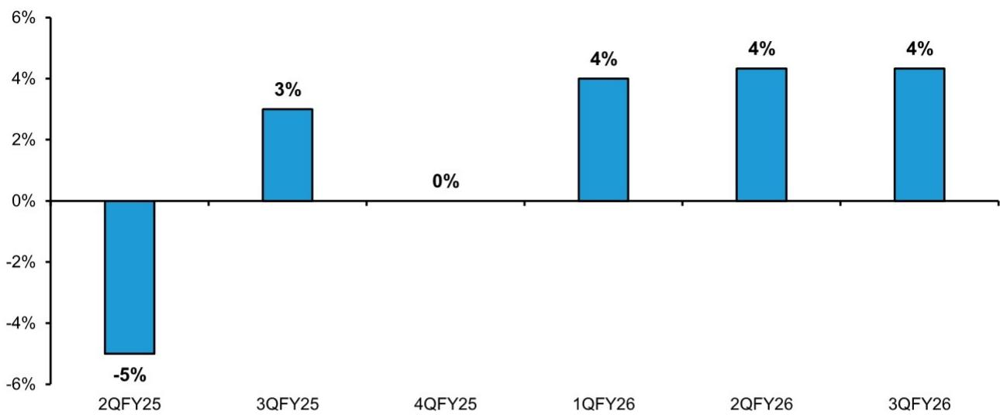

# Air Products的估值折价已难以自圆其说：公司如今经得起“鸭子测试”

Air Products最新季度报告中最引人注目的张力并不在于数字本身，而在于市场拒绝接受这些数字所暗示的含义。以294.27美元的收盘价计算，公司目前交易价格约为前瞻调整后盈利的21.9倍，而行业板块倍数维持不变为26倍，这一折价自2024年以来持续扩大。然而，2026财年第三季度再次交出了超预期并上调指引的成绩单，展现出读者历来在工业气体板块所青睐的那种一致性。市场的怀疑态度越来越难以合理化，而基于可观察行为而非叙事的重新定价分析依据现已成立。

变化的不是战略本身，而是战略行之有效的证明。过去两年，Air Products在新管理层领导下精简了大型项目组合，取消了Darrow项目，并重新聚焦于核心工业气体业务模式。市场的回应却是给予估值折价，仿佛该公司仍是一家转型中的综合企业集团，一个资本密集、回报不确定的能源转型故事。但第三季度的业绩，加上管理层对2027财年的指引，表明公司现在的行为表现已像一家纯粹的工业气体公司：销售气体、扩大利润率、并给出保守指引。公司实际所为与市场对其估值方式之间的差距，正是观察机会所在。

“鸭子测试”框架在此以异乎寻常的精确度适用。如果一家公司主要销售工业气体，表现像工业气体公司，指引也像工业气体公司，那么它很可能就是一家工业气体公司，并应据此进行估值。Air Products在三个方面都通过了这一测试。剩下的问题不是公司是否在执行，而是市场能在多大程度上维持一个看起来与基本面日益脱节的折价。这个问题的答案决定了那27%的……

## 超预期并上调指引的节奏，如今已映照出工业气体领域备受珍视的可靠性

在现任领导层下，Air Products已从指引失准和大型项目不确定性的模式，转变为接近盈利可靠性的状态——这种可靠性长期以来支撑着其最接近同行的溢价估值。2026财年第三季度业绩再次超出预期，管理层也再次上调指引，这是本财年第二次上调。这不是孤立事件，而是一种节奏的确立。现任CEO领导下的超预期与未达预期历史显示出明显的转折点，公司现在持续达到或超出预期，而非令人失望后重新设定预期。

这一转变的意义超越了即时的盈利惊喜。工业气体公司的价值不仅在于增长，更在于可预测性。该板块的研究逻辑建立在长期照付不议合同、密度优势和定价权之上，这些因素共同产生了具有异常可见性的盈利流。当该板块中的一家公司能够证明其季度复季度地兑现承诺时，市场通常会压缩对其不确定性较高部分所施加的折价。Air Products正在建立这样的业绩记录，结果在基础业务量的逐季改善中清晰可见——即便更广泛的工业环境仍不均衡，基础业务量仍持续录得正增长。

然而，市场的回应却相对平淡。该股年初至今跑赢标普500指数12.6个百分点，但这一相对强势并未缩小与同行之间的估值差距。尽管执行层面持续改善，折价却依然存在，这表明市场锚定于历史叙事而非当前证据。在某个时点上，持续兑现的分量应当压过过往失望的分量。那个时点可能比市场预期的来得更快，尤其是考虑到公司对2027财年的指引已消除了主导空头论点的NEOM悬置因素。

## NEOM逆风已从2027财年方程式中移除，主要空头论点随之消解

本次更新中最重要的单一进展是管理层明确指引NEOM在2027财年不会产生重大财务影响。这直接回应了自该大型项目宣布以来一直压制该股的空头论点。专有的NEOM模型已根据这一指引进行更新，放缓了该设施的全面投产时间，从而也放缓了项目融资的推进节奏。结果是2027财年每股盈利预估的上调——并非因为运营超预期，而是因为NEOM的财务拖累现在预计将微乎其微。

这是投资讨论中的一个结构性变化。多年来，市场一直难以在NEOM作为一个大型、不确定、资本密集且回报不清晰的项目背景下对Air Products进行估值。公司取消Darrow项目以及精简大型项目组合表明了战略转变，但NEOM始终是那个不确定因素。现在，管理层实际上已在下个财年将这一不确定因素从桌面上移除。公司可以基于其表现良好的核心工业气体运营进行估值，而非基于一个时间表不确定的投机性项目。

2027财年每股盈利预测为14.67美元，高于此前的14.50美元，反映了这一调整。每股盈利增速同比可能略有放缓，从2026财年预期的11.4%降至2027财年的9.1%，但增长质量更高，因为它不再依赖于大型项目的时间节点。市场的空头论点一直基于这样一种想法：NEOM将成为回报的持续拖累和指引风险的持续来源。管理层现已明确回应了这一担忧，分析框架也必须相应调整。

## 增长引擎已从大型项目转向生产率、电子业务与定价权

Air Products的增长构成正在以应当获得更高倍数的方式发生变化。2026财年11%至12%的盈利增长得到了中国气化项目的助力，但前瞻增长故事越来越多地由三个更持久、更符合高质量工业气体特许经营特征的因素驱动。首先，生产率提升机会仍然可观，管理层持续在业务中识别成本与效率改进空间。其次，亚洲额外电子生产线的逐步投产提供了高增长、高利润率的业务流，其周期性低于传统工业气体需求。第三，公司保有定价权，尤其是在航天业务领域，一位关键客户的发射台维修将创造提价机会。

这些增长驱动力不仅比大型项目贡献更可持续，而且更符合市场对工业气体公司的估值方式。该板块的溢价估值建立在由网络效应、密度和定价权驱动的稳定复利增长假设之上，而非偶发性的项目完工。Air Products正越来越多地交付这种增长。利润率进展在所有地区均清晰可见，美洲、亚洲和欧洲的调整后EBITDA利润率均在扩大。公司不仅在增长营收，更在增长盈利能力——而这正是对估值最重要的指标。

商用气体定价环境也依然具有支撑性。尽管氦气逆风将持续到2月份一份大型美国合同到期为止，Air Products的商用气体定价继续与同行保持同步。这是公司竞争地位的一个关键指标。在工业气体业务中，定价纪律是理性竞争的标志。Air Products即便在吸收氦气拖累的同时仍能与其较强竞争对手保持定价持平，这表明其基础商业地位是稳健的。随着氦气逆风消退，定价收益将更直接地传导至利润底线。

## 与同行的估值折价已扩大至低迷水平，创造了不对称的重新定价机会

Air Products当前估值最引人注目的特征并非相对水平，而是相对折价。公司相对估值接近其10年中位数，但相对于工业气体同行的折价在过去两年持续扩大，且相对于板块和更广泛市场均处于低迷水平。基本面改善与相对估值恶化之间的这种背离，是观察案例的核心。市场对Air Products的定价，仿佛它是一家与当前正在报告业绩的公司截然不同的企业。

考虑到公司盈利可靠性正在改善，这一折价尤其值得关注。从历史上看，Air Products相对于该板块享有溢价，反映了其规模、技术和市场地位。如今这一溢价已变为折价，且即便公司连续超预期并上调指引，差距仍在扩大。市场不愿重新定价该股，表明读者要么锚定于过去，要么怀疑当前表现能否持续。证据越来越支持前一种解读。

这种格局中的不对称性颇具吸引力。如果Air Products继续执行，随着市场认识到公司的真实面貌——一家增长与可靠性均在改善的高质量工业气体特许经营企业——折价应当收窄。如果公司出现失误，下行空间也受到限制，因为该股已相对同行存在折价，这提供了一个估值下限。因此风险回报特征偏向上行，且潜在重新定价的幅度相当可观。对同行适用的26倍倍数保持不变——上行空间并不依赖于倍数扩张；它只是市场为Air Products支付与为其同行相同的倍数。

## 决策框架：如何区分结构性重新定价与价值陷阱

读者面临的挑战在于区分一家真正在重新定价的公司与一个价值陷阱——即以折价交易但折价有其充分理由的公司。工业气体板块为做出这一区分提供了有用的框架，而Air Products当前的处境提供了一个清晰的测试案例。该框架包含三个组成部分：行为变化的证据、业绩变化的证据、以及指引可靠性的证据。当三者同时具备时，折价很可能会收窄。当它们缺失时，折价很可能会持续。

在行为方面，Air Products显然已经改变。取消Darrow项目、精简大型项目组合、以及重新聚焦于核心气体业务，都是可观察的行动，标志着战略转变。在业绩方面，证据同样清晰：连续盈利超预期、所有地区利润率扩张、以及基础业务量正增长。在指引可靠性方面，公司本财年已两次上调指引，且2027财年指引明确消除了NEOM逆风。框架的三个组成部分均已具备，这表明当前折价是一个重新定价机会，而非价值陷阱。

框架的第二个维度是增长来源。价值陷阱往往具有依赖于单一项目、单一客户或单一周期性上行的增长。Air Products的增长现在更加多元化：生产率提升、亚洲电子业务、航天领域定价权，以及随着美国合同到期氦气业务的最终复苏。这种多元化降低了单一失败点使盈利故事脱轨的风险。公司也在给出保守指引，这是成熟工业气体公司的特征。管理层对2027财年调整后每股盈利同比增长6%至9%的初始指引区间预期，低于公司的实际潜力，但这与该板块最佳公司管理预期的方式一致。这种保守是一个特征，而非缺陷，因为它为持续超预期创造了条件。

最后一个维度是市场对好消息的反应。在重新定价中，市场以倍数扩张来奖励积极惊喜。在价值陷阱中，市场忽略积极惊喜，将其视为不可持续。Air Products已交付了多次积极惊喜，而市场的回应仅是适度的相对跑赢。这表明市场仍处于怀疑阶段——而这恰恰是机会最具吸引力的时刻。一旦市场接受该公司已发生永久性改变，折价将收窄，重新定价将是迅速的。问题不在于它是否会发生，而在于何时发生，而这个问题的答案决定了读者是捕获全部27%的上行空间，还是仅捕获其中一部分。

2026财年第三季度更新的证据是明确的：Air Products现在的行为表现像一家工业气体公司，业绩表现像一家工业气体公司，指引也像一家工业气体公司。市场拒绝像对待工业气体公司那样对其进行估值，这才是异常现象——而估值中的异常往往倾向于修正。公司通过了鸭子测试，市场持续的怀疑态度正在为愿意接受证据而非叙事的观察者创造机会。

*仅供参考。部分内容可能基于源材料由AI辅助生成、翻译、摘要或编辑，可能包含遗漏或错误。请独立核实。本文不构成投资、法律、税务、会计或其他专业建议。*

仅供参考。部分内容可能基于源材料由AI辅助生成、翻译、摘要或编辑，可能包含遗漏或错误。请独立核实。本文不构成投资、法律、税务、会计或其他专业建议。

