EU Semiconductors
ASML Holding NV

评级
跑赢行业

目标价

ASML.NA 2,500.00 欧元

David Dai, CFA
+852 2918 5704
david.dai@bernsteinsg.com

Carmine Milano, CFA
+44 20 7762 1857
carmine.milano@bernsteinsg.com

ASML 2,859.00 美元

Juho Hwang
+81 3 6777 6980
juho.hwang@bernsteinsg.com

# ASML：2026年第三季度首选标的——设备开支上行周期、光刻强度提升与定价空间

ASML是我们2026年第三季度的首选标的。我们给予ASML“跑赢行业”评级，目标价为2,500欧元。

ASML凭借不断提升的光刻强度，提供了最佳的成长可见性。在庞大的设备开支支撑人工智能发展的背景下，ASML凭借其占据份额优势的关键EUV/DUV设备而受益。随着DRAM向更多EUV层迁移，光刻强度正从20%稳步上升至接近30%，并在先进逻辑芯片领域保持在30%以上。我们还预计，到2030年，HNA EUV将逐步被几乎所有DRAM和逻辑芯片领域的领先厂商所采用。

提价与利润率扩张被低估。ASML的提价包含两部分：1. 随着从3800E向F型号迁移，EUV价格在两年内上涨20%；2. 潜在的同类产品提价，以实现在供应链中的价值。我们发现第1点常被忽视，而第2点则完全未被市场预期所包含。我们相信，仅凭第1点，EUV利润率便可扩大至60%左右的中段，若加上第2点则可能更高。日本设备制造商已开始确认提价，这表明ASML也很可能采取类似举措。

<table><tr><td>收盘日期</td><td>2026年7月29日</td></tr><tr><td>ASML.NA 收盘价（欧元）</td><td>1,362.20</td></tr><tr><td>目标价（欧元）</td><td>2,500.00</td></tr><tr><td>上行/（下行）空间</td><td>84%</td></tr><tr><td>52周区间</td><td>1,741.00/587.80</td></tr><tr><td>EDME</td><td>1,601.43</td></tr><tr><td>财年截止</td><td>12月</td></tr><tr><td>股息率</td><td>0.6%</td></tr><tr><td>市值（欧元）（百万）</td><td>547,055</td></tr><tr><td>企业价值（欧元）（百万）</td><td>541,458</td></tr></table>

DUV结构性增长，中国市场担忧过度。对于DRAM而言，EUV与DUV的配置比例为1:1，因此当DRAM资本开支大幅增长时，DUV部分也相应增长。中国市场的需求也持续处于较高水平；尽管有报道称中国正在自行制造DUV（ArFi）设备，但我们认为该设备短期内不会对ASML构成竞争威胁，且ASML在中国的收入贡献已在2026年上半年降至16%（全年为20%），在设备同行中处于最低水平。

<table><tr><td>表现</td><td>年初至今</td><td>1个月</td><td>6个月</td><td>12个月</td></tr><tr><td>相对（%）</td><td>53.0</td><td>(18.1)</td><td>15.9</td><td>124.6</td></tr><tr><td>EDME（%）</td><td>8.9</td><td>0.3</td><td>5.7</td><td>17.6</td></tr><tr><td>相对（%）</td><td>44.1</td><td>(18.4)</td><td>10.3</td><td>107.0</td></tr></table>

来源：彭博、Bernstein预测与分析。

风险回报具吸引力，下行有保护。经过回调后，我们2,500欧元的目标价意味着约80%的上行空间。另一方面，当前股价仅为我们2028年每股收益预测的20倍；如此低的倍数在历史上几乎未曾出现，而我们的每股收益预测尚未包含任何额外的提价因素。当前的风险回报颇具吸引力，且下行风险有限。

一年期价格表现
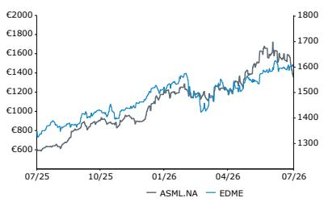

## 投资启示

我们给予ASML“跑赢行业”评级，并列为欧洲半导体板块首选标的，目标价为2,500欧元。

<table><tr><td>报告每股收益</td><td>25财年实际</td><td>26财年预测</td><td>27财年预测</td></tr><tr><td>ASML.NA（欧元）</td><td>24.72</td><td>38.91</td><td>53.56</td></tr><tr><td>ASML（美元）</td><td>27.95</td><td>44.01</td><td>60.58</td></tr></table>

来源：彭博、Bernstein预测与分析。

<table><tr><td>估值指标</td><td>25财年实际</td><td>26财年预测</td><td>27财年预测</td></tr><tr><td>报告市盈率（倍）</td><td>55.1</td><td>35.0</td><td>25.4</td></tr></table>

## 详细内容

## 相关研究：

2026年7月20日 - 全球半导体设备：实现人工智能愿景需要多少设备开支？

2026年7月16日 - ASML 2026年第二季度：三重利好；目标价上调至2,500欧元

2026年7月13日 - 全球半导体——若存储板块不启动，半导体设备能否独善其身？

2026年7月6日 - ASML：高数值孔径EUV成本深度分析——光刻强度提升推动目标价上调至2,300欧元

2026年6月15日 - 日本/欧洲半导体设备：提价迹象初现

2026年5月21日 - 全球半导体设备：2,000亿美元设备开支在望

2026年4月23日 - 快评：ASML——高数值孔径EUV采用推迟？

2026年3月26日 - ASML与日本半导体设备：DRAM短缺引发产能建设热潮

2026年2月25日 - ASML：低数值孔径EUV均价存在60%上行空间？跑赢行业

2026年1月21日 - ASML：勿忘DUV。跑赢行业

ASML、EUV和DUV模型可在此处下载（ASML.NA / ASML Holding NV；EUV模型；DUV模型）。

## ASML仍为板块首选标的

## 光刻强度持续提升，回应市场疑虑

我们预测光刻强度将持续上行，从24%提升至2028年的28%，驱动因素为DRAM和先进逻辑芯片相对于整体半导体市场的更快增长。这两个细分领域的光刻强度均显著高于成熟逻辑芯片和NAND，从而在结构上支撑综合光刻强度随时间的提升。

\- 在DRAM领域，我们估计光刻强度从1Y和1Z节点的略低于20%提升至1c节点的26%。这一显著增长源于EUV曝光层数的增加，从1a节点的3-4层，增至1b节点的4-6层，再到1c节点的6-7层。随着1c节点渗透率在未来数年大幅提升，我们预计整体DRAM光刻强度将显著上升。此外，随着1d节点引入双重曝光EUV或HNA技术，我们预计光刻强度将进一步升至约30%。

\- 类似地，逻辑芯片光刻强度从10nm节点的约20%显著提升，主要受EUV曝光层数急剧增加推动，在5nm和3nm节点达到35%以上的峰值。尽管由于采用GAA技术需要更多非光刻工艺步骤，逻辑芯片光刻强度从3nm到2nm有所下降，但仍维持在约32%的较高水平。我们预计，随着1.4nm节点采用HNA技术，光刻强度将保持相近水平或可能进一步提升，并在1nm节点继续上升。

图表1：我们预计光刻强度将持续上行，驱动因素为DRAM中1c和1d节点渗透率提升（这些节点具有更高的光刻强度），以及先进逻辑芯片（其光刻强度显著高于成熟逻辑芯片）

逻辑芯片光刻强度
DRAM光刻强度
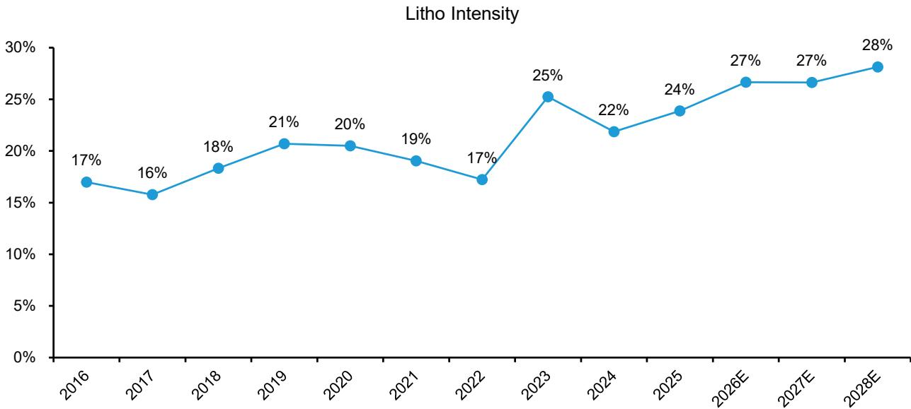
来源：公司报告、Bernstein分析与预测
图表2：我们预计DRAM光刻强度将提升。1d节点引入双重曝光EUV（或HNA）预计将推动光刻强度升至约30%

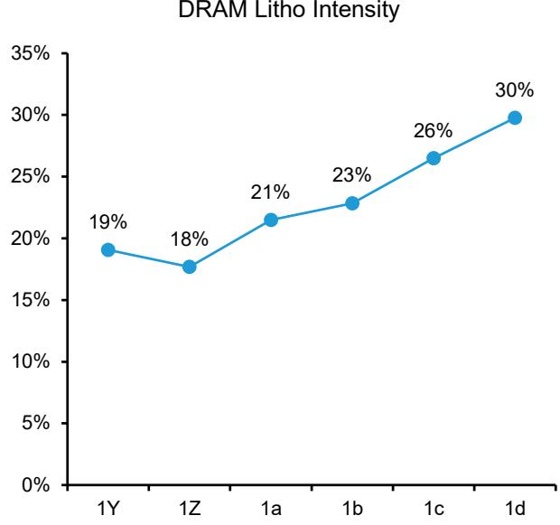
来源：公司报告、Bernstein分析与预测
图表3：逻辑芯片光刻强度从3nm到2nm有所下降，但仍维持在约32%的较高水平。我们预计随着1.4nm节点采用HNA技术，光刻强度将保持相近水平或进一步提升，并可能在1nm节点再次上升。

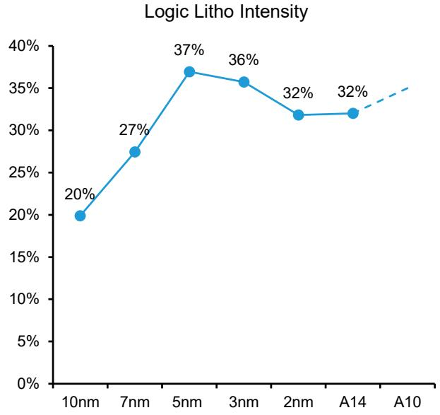
来源：公司报告、Bernstein分析与预测

## DRAM增速超越逻辑芯片，成为ASML更大的增长驱动力

DRAM已超越逻辑芯片，成为ASML光刻需求最重要的驱动力。ASML指引2026年存储系统销售额同比增长超过75%，而先进逻辑芯片/代工仅增长25%。这一趋势已在ASML的订单结构中显现，存储占系统销售额的比例从历史约30%升至近几个季度的约50%（图表4）。

\- 主要原因在于，如前所述，DRAM的光刻强度提升速度快于逻辑芯片。随着DRAM制造商向1c和1d等更先进节点迁移，关键光刻层数持续增加。特别是，DRAM的EUV和浸没式光刻层数均快速增长，EUV正逐步取代此前使用多次DUV曝光的多次图形化工艺。每当客户用单次曝光EUV替代多次图形化工艺时，工艺支出中流向光刻环节的比例就会增加。ASML特别指出，由于这一节点迁移趋势，DRAM对EUV和浸没式光刻的需求均在上升。

\- 与此同时，DRAM产能扩张速度也快于逻辑芯片。DDR和HBM供应偏紧及价格处于较高水平，推动了对新晶圆厂和大型晶圆厂的重大投资。ASML指出，客户目前正在增加可观产能，同时规划未来多项晶圆厂扩建。HBM建设在技术迁移之上增加了产量因素，形成了管理层所描述的DRAM光刻需求“完美风暴”。

\- 这反映在我们对EUV曝光量增长的预测中：DRAM总EUV曝光量将在未来五年增长4.5倍，从2025年的约340万片/月增至2030年的2,630万片/月，而同期逻辑芯片EUV曝光量增长略超3倍。尽管逻辑芯片继续受益于2nm、3nm及未来1.4nm节点的人工智能相关需求，但更高的光刻强度和更快的产能增加相结合，使DRAM在未来数年内成为ASML更强劲的增长引擎（图表5）。

图表4：存储系统销售额在过去两个季度显著增长，占总销售额比例从约30%升至50%。ASML预计2026年存储将成为主要增长驱动力，同比增长75%。

按终端用途划分的净系统销售额占比（%）

来源：公司报告、Bernstein分析

图表5：我们估计DRAM总EUV曝光量将在未来五年增长4.5倍，占总曝光量的比例从26%升至44%。虽然我们预计逻辑芯片EUV曝光量增速将低于DRAM，但仍预计其未来五年增长超过两倍
EUV总曝光量构成

来源：公司报告、Bernstein分析与预测

## EUV采用持续推动光刻份额提升，尤其在DRAM领域

DRAM微缩持续支撑光刻强度的提升，存储制造商不断追求更小的特征尺寸。特征尺寸预计将从1a节点的约14nm缩小至1d节点的约10nm，并最终在1d节点向10nm以下迈进。虽然行业可能在0a节点前后从6F²向4F²单元架构过渡，但这应主要被视为微缩要求的暂时性放宽，而非偏离特征尺寸长期缩小的趋势。管理层认为，持续的节点迁移仍将需要增加EUV采用，HNA最终将在本十年末成为必要（图表6）。

因此，每一代DRAM的EUV曝光层数都在快速增加。平均EUV层数从1a节点的约2层，增至1b节点的3层、1c节点的5层和1d节点的8层。EUV使用量预计将在0a/0b节点进一步上升。EUV层数的增加以及多次图形化DUV的持续替代，继续推动光刻支出增速高于整体设备开支增速（图表7）。

图表6：我们预计DRAM特征尺寸（F）将随时间持续缩小。虽然向4F²迁移可能暂时放宽特征尺寸微缩要求，但我们认为长期趋势仍将需要更高的EUV强度，并在2028-29年前后最终采用HNA技术。
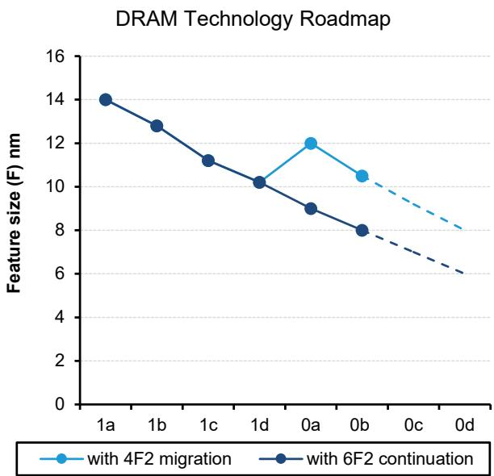
来源：公司报告、Bernstein分析与预测

图表7：我们预计EUV层数将在后续各代DRAM中显著增加，在1d和0a节点达到高个位数曝光层数，并最终在0b和0c节点扩展至十位数出头的水平。

各节点DRAM平均EUV曝光层数

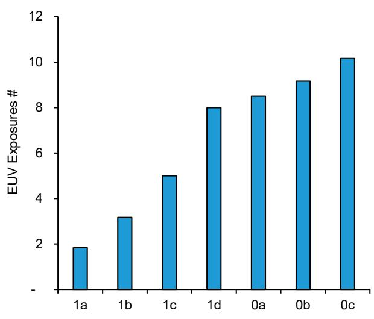
来源：公司报告、Bernstein分析与预测

## HNA采用：通过工艺简化提升光刻强度

HNA应能推动光刻强度的跃升，类似于当年EUV LNA取代DUV多次图形化时的情况。关键原因在于HNA将工艺价值从非光刻环节转移至光刻环节。正如EUV LNA通过用更少但更有价值的光刻曝光取代复杂的DUV多次图形化方案来提升光刻强度，HNA可以用关键层上的单次曝光方案取代多次图形化LNA流程。HNA更高的分辨率和对比度使得许多原本需要LNA多次图形化流程（如SALELE）的关键层可以通过单次曝光完成。通过消除多个掩模、曝光、光刻-蚀刻循环和切割步骤，HNA简化了工艺流程，改善了图形保真度和良率，并降低了整体工艺复杂度。虽然HNA单次曝光比LNA单次曝光成本更高，但它替代了大量非光刻工艺，可以降低总体制程成本。因此，设备开支中流向光刻环节的比例增加，从而提升光刻强度。我们预计，随着客户从LNA多次图形化向HNA单次曝光图形化过渡，光刻强度将实现跃升（图表8、图表9）。

英特尔今年在18A节点采用HNA技术（英特尔代工在Intel 18A上使用HNA），证实了该技术已具备量产能力，消除了围绕采用的一大不确定性。然而，我们认为HNA在DRAM领域的经济性最为突出，因为DRAM芯片尺寸小于逻辑芯片，无需拼接。这转化为更高的生产效率和更低的单次曝光成本，使HNA在经济上更容易被证明合理。SK海力士发出了最明确的早期信号：该公司于2025年9月宣布，已在其M16工厂组装了ASML的TWINSCAN EXE:5200B——首台面向生产的HNA系统，用于下一代DRAM开发。三星也在快速推进，行业报道显示其订购了两台ASML EXE:5200B设备，首台预计于2025年底交付，第二台于2026年上半年交付。三星逻辑芯片部门应紧随其后，而台积电似乎可能将HNA的大规模导入推迟至约10A节点，优先进行研发并延长LNA在早期节点的使用（图表10）。

图表8：与SALELE相比，HNA EUV降低了工艺复杂度和光刻曝光次数，实现了更高效的图形化、更低的成本和更高的生产效率。

工艺步骤与光刻曝光：SALELE vs HNA SE

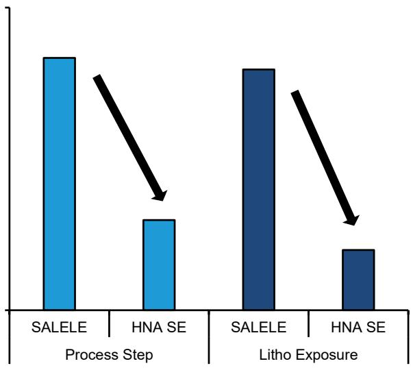
来源：IEEE VLSI研讨会2026、Bernstein分析
图表9：ASML估计从LELE LNA向单次曝光HNA过渡时，光刻强度将显著提升。光刻资本开支和运营开支预计将增加约1.2倍，而非光刻成本预计将下降。

LELE LNA vs SE HNA光刻强度
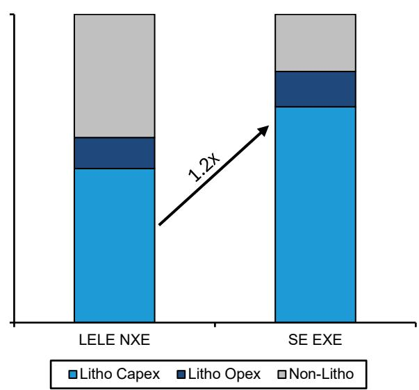
来源：ASML、Bernstein分析

图表10：逻辑芯片HNA采用已由英特尔在18A节点验证。我们预计DRAM领域将从SK海力士和三星在1d节点开始采用，而更广泛的逻辑芯片采用可能发生在英特尔A14和三星SF1.4节点，台积电最终将在本十年末在A10节点附近引入HNA。

各公司HNA采用情况
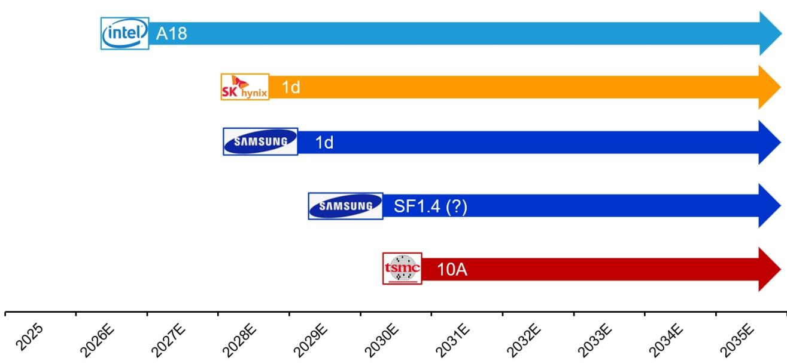
来源：公司报告、Bernstein分析与预测

## DUV是另一增长驱动力而非拖累

虽然读者的关注点自然集中在EUV上，但我们仍然认为DUV的前景被低估。正如我们在（ASML：勿忘DUV。跑赢行业）报告中强调的，综合DUV与EUV资本开支比例仍约为1:1，这意味着每增加1美元EUV支出，就会带动相应1美元的DUV需求。在DRAM领域，即使在1c节点，DUV仍占光刻支出的约50%，这意味着EUV密集型DRAM产能的快速扩张也带动了可观的DUV需求。在先进逻辑芯片领域，DUV与EUV的比例较低，约为1:4，但DUV的相对支出仍具韧性。尽管EUV已取代部分DUV多次图形化工艺，但更高的光刻强度、不断增加的晶圆产能以及更丰富的ArFi设备组合，使DUV资本开支总体保持稳定（图表11）。

第二个驱动力是中国市场，我们预计未来三年中国设备开支将以超过15%的年复合增长率增长，到2028年达到约770亿美元。由于无法获得EUV且本土光刻能力有限，中国高度依赖DUV，且往往需要额外的多次图形化步骤，这进一步提升了DUV强度。我们估计中国先进逻辑芯片产能将在未来数年大幅增长，为DUV需求提供结构性支撑（图表12）。

尽管ASML第二季度业绩后市场对DUV的预测有所上调，但我们的DUV收入预测在未来五年内仍高于市场一致预期（图表13）。

图表11：我们计算综合DUV与EUV比例仍约为1:1，意味着每10亿美元EUV支出对应10亿美元DUV资本开支。虽然EUV在先进逻辑芯片中占绝大部分支出，但DUV仍是成熟逻辑芯片和NAND中相对少见使用的光刻设备。

<table><tr><td rowspan="2"></td><td rowspan="2">2026年设备开支构成</td><td colspan="3">占设备开支比例</td><td colspan="2">占光刻支出比例</td></tr><tr><td>光刻占比</td><td>DUV占比</td><td>EUV占比</td><td>DUV</td><td>EUV</td></tr><tr><td>逻辑芯片</td><td>60%</td><td></td><td></td><td></td><td></td><td></td></tr><tr><td>先进</td><td>30%</td><td>30%</td><td>6%</td><td>24%</td><td>20%</td><td>80%</td></tr><tr><td>成熟</td><td>30%</td><td>20%</td><td>20%</td><td>0%</td><td>100%</td><td>0%</td></tr><tr><td>存储</td><td>40%</td><td></td><td></td><td></td><td></td><td></td></tr><tr><td>DRAM</td><td>32%</td><td>25%</td><td>12%</td><td>13%</td><td>48%</td><td>52%</td></tr><tr><td>NAND</td><td>8%</td><td>10%</td><td>10%</td><td>0%</td><td>100%</td><td>0%</td></tr><tr><td>综合总计</td><td>100%</td><td>24%</td><td>12%</td><td>11%</td><td>52%</td><td>48%</td></tr></table>

来源：公司报告、Bernstein分析与预测。

图表12：我们预计中国设备开支需求将保持强劲，未来三年年复合增长率超过15%，到2028年达到770亿美元。

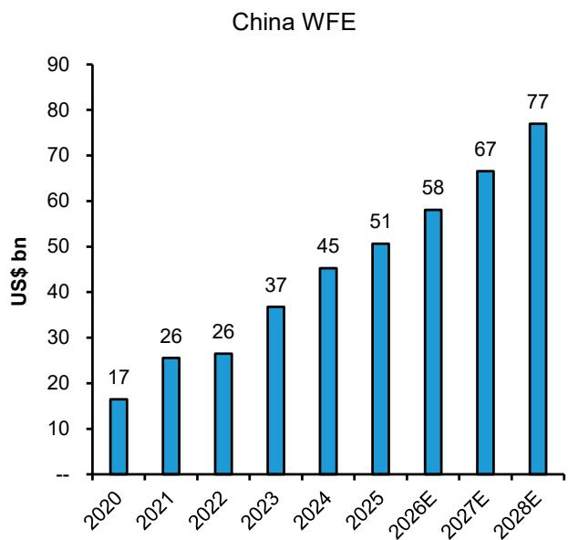
来源：公司报告、Bernstein分析与预测

图表13：尽管ASML第二季度业绩后DUV市场一致预期显著上调，但我们的DUV收入预测在未来五年内仍高于市场一致预期。

DUV收入（Bernstein vs 市场一致预期）

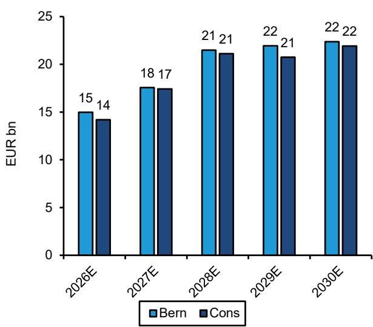
来源：公司报告、Bernstein分析与预测

## 中国市场竞争担忧过度

7月27日有报道称，中国正在量产自有的DUV（ArFi）光刻设备，预计今年生产5台，明年生产20台。即使属实，我们认为也无需过度担忧，原因如下：

1. 中国的光刻设备在产能、关键尺寸、分辨率、套刻精度和正常运行时间等规格上可能明显落后。虽然报道中的设备似乎是真实的，并已安装在多个客户现场，但关键问题不在于它能否印制图形，而在于能否满足量产要求。根据渠道调研，其性能明显低于ASML当前的ArFi平台，可能也低于较早的NXT系列（约1950）。在光刻领域，产能、正常运行时间、套刻精度、缺陷率和制造一致性最终决定晶圆厂的经济性，目前没有证据表明中国设备在这些指标上具备竞争力。

2. 当中国的设备准备就绪时，实际上缓解了ASML ArFi设备对华出口进一步受限的风险。可行的本土替代方案可能会削弱限制成熟进口ArFi系统的政策理由，因为设备可用性将不再是限制因素。具有讽刺意味的是，中国光刻设备供应商的进展可能随时间推移支持限制放松而非收紧。

3. DUV领域一直存在竞争，尼康过去和现在都在生产ArFi设备。ASML与尼康在浸没式光刻领域竞争了数十年。尽管尼康仅比ASML晚几年进入市场，但从未在产能、套刻精度和生产效率上缩小差距，因此仅保持了有限的市场地位。

4. 在公平的市场竞争中，ASML具有相对的技术优势。中国晶圆厂主要关注生产效率、良率和拥有成本。虽然本土供应商将受益于战略支持，但在本土替代方案在量产环境中展现出相当性能之前，客户不太可能更换性能更优的设备。

5. 在最坏情况下，这只会让ASML与其他所有设备供应商处于相同境地，而不会更差。大多数设备公司在中国已经面临至少部分产品线的本土竞争对手。即使在国产光刻设备随时间获得份额的下行情景下，ASML也只会面临其他设备供应商已经在应对的相同本土化动态。

AMAT尚未公布第二季度业绩，因此我们仅使用第一季度数据。来源：公司报告、彭博、Bernstein分析

6. ASML在中国的收入占比在2026年上半年已降至仅16%，为同行中最低。2025年中国占ASML收入的32%，但管理层目前预计2026年这一比例约为20%。与此同时，未来增长日益来自EUV领域，而中国在该领域仍被排除在外。重要的是，中国的光刻需求依然强劲，ASML和本土供应商很可能能够共存多年，因为中国规划的产能扩张超过了本土设备制造商目前可提供的供应量（图表14）。

因此，我们认为市场对ASML中国竞争的担忧过度。

图表14：ASML在2026年上半年对中国的收入占比在设备同行中最低，仅为16%。公司预计2026年中国将占收入约20%，远低于去年的32%。

2026年上半年中国收入占比
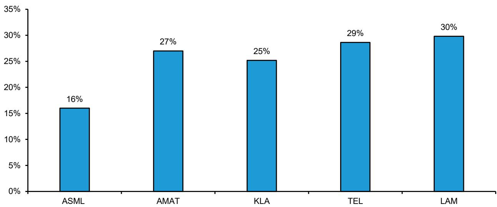

## 产能扩张确保充足供应

读者普遍关注的一个问题是ASML的产能能否跟上先进逻辑芯片和DRAM加速增长的需求。我们认为这一风险日益有限。ASML计划到2028年将LNA EUV和浸没式DUV产能均以每年约30%的速度扩张，EUV产能从2026年的65台增至2027年的约85台和2028年的约110台，ArFi产能则从130台分别增至约170台和约220台。此外，HNA产能应在2027/28年达到20台（图表15）。

重要的是，管理层表示这些目标并非硬性上限，并受到延伸至2028年的强劲订单可见性支撑。ASML强调客户需求依然异常强劲，订单动能稳健，产能计划仍在与客户共同细化。因此，如果需求允许，EUV和DUV产能均可进一步增加。我们认为，这一积极的产能扩张显著降低了光刻供应成为先进节点增长瓶颈的担忧。相反，它为先进逻辑芯片、DRAM的预期增长以及光刻强度的提升在未来数年得到充足设备供应支撑提供了信心。

图表15：ASML指引明年产能扩张30%，2028年再扩张30%，涵盖DUV浸没式和EUV。这一强劲指引表明积压订单增长显著加速，促使ASML积极扩张产能。
ASML ArF浸没式和EUV产能扩张
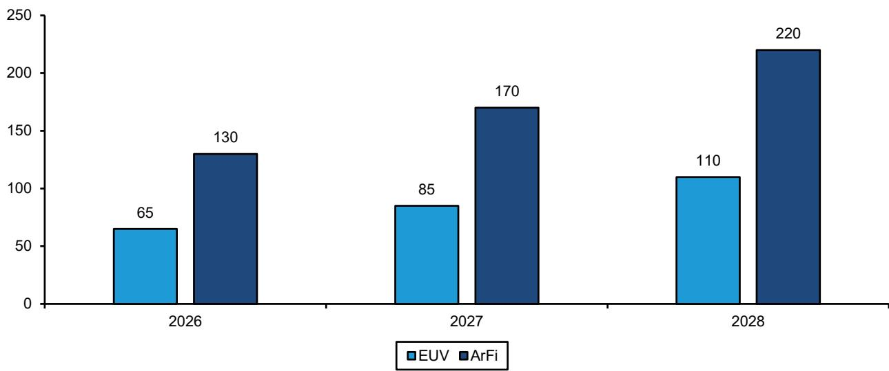
来源：公司报告、Bernstein分析与预测

## 定价上行空间仍被低估

我们认为读者可能低估了ASML的定价能力。目前，定价主要由生产效率提升驱动，客户为更高的产能和更好的性能支付更多费用。与管理层的评论一致，我们预测EUV平均售价在2027年上涨约10%，2028年再上涨7%，驱动因素为更高的生产效率和向更先进EUV系统的过渡。

重要的是，除与生产效率挂钩的定价外，可能还存在额外上行空间。行业报道表明ASML也在探索同类产品提价，以反映其独特的市场地位、强劲的需求环境和不断扩大的价值主张。此类提价未包含在我们当前的预测中。台积电和英特尔近期的评论似乎也承认设备价格持续上涨。

我们当前对利润率扩张的预测未包含任何广泛的同类产品提价，但我们仍高于市场一致预期。我们预测毛利率到2030年扩大至60%，营业利润率至50%，而市场一致预期分别为59.1%和46.7%。我们的盈利预测显著领先市场，2029年每股收益较一致预期高22%，2030年高41%。因此，任何成功的同类产品提价都将代表收入、利润率和盈利在当前预测之外的增量上行空间（图表16、图表17）。

图表16：我们预计过去两年实现的强劲利润率扩张将持续，驱动因素为EUV盈利能力改善、IBM和运营杠杆。我们预测毛利率到2030年达到60%，营业利润率达到50%。此外，提价可能带来增量上行空间。
ASML盈利能力
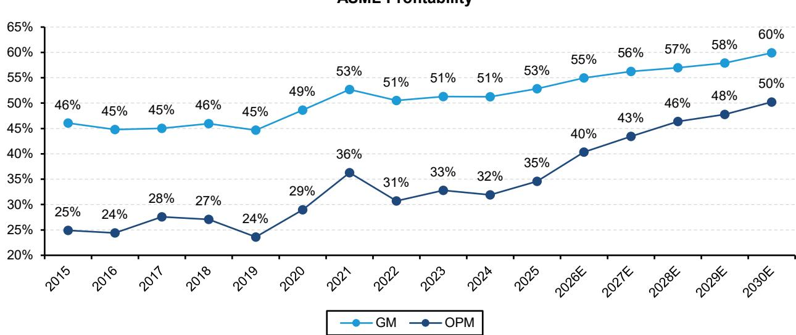
来源：公司报告、Bernstein分析与预测

图表17：虽然市场一致预期已大幅上调，但我们仍显著领先市场，尤其是在本十年末，我们的每股收益预测2029年高22%，2030年高41%。

<table><tr><td>ASML：对比表</td><td>2026年预测</td><td>2027年预测</td><td>2028年预测</td><td>2029年预测</td><td>2030年预测</td></tr><tr><td colspan="6">收入（十亿欧元）</td></tr><tr><td>Bernstein</td><td>44.0</td><td>55.9</td><td>71.9</td><td>81.9</td><td>92.1</td></tr><tr><td>同比增长</td><td>35%</td><td>27%</td><td>29%</td><td>14%</td><td>13%</td></tr><tr><td>市场一致预期</td><td>42.7</td><td>54.5</td><td>65.5</td><td>72.8</td><td>76.4</td></tr><tr><td>同比增长</td><td>31%</td><td>28%</td><td>20%</td><td>11%</td><td>5%</td></tr><tr><td>Bernstein vs 一致预期</td><td>3.0%</td><td>2.6%</td><td>9.7%</td><td>12.4%</td><td>20.6%</td></tr><tr><td colspan="6">毛利（十亿欧元）</td></tr><tr><td>Bernstein</td><td>24.2</td><td>31.4</td><td>41.0</td><td>47.4</td><td>55.2</td></tr><tr><td>同比增长</td><td>40%</td><td>30%</td><td>30%</td><td>16%</td><td>16%</td></tr><tr><td>利润率</td><td>55.0%</td><td>56.2%</td><td>57.0%</td><td>57.9%</td><td>59.9%</td></tr><tr><td>市场一致预期</td><td>23.3</td><td>30.2</td><td>37.5</td><td>41.3</td><td>45.1</td></tr><tr><td>同比增长</td><td>35%</td><td>30%</td><td>24%</td><td>10%</td><td>9%</td></tr><tr><td>利润率</td><td>54.5%</td><td>55.4%</td><td>57.3%</td><td>56.7%</td><td>59.1%</td></tr><tr><td>Bernstein vs 一致预期</td><td>3.9%</td><td>4.2%</td><td>9.1%</td><td>14.8%</td><td>22.3%</td></tr><tr><td colspan="6">营业利润（十亿欧元）</td></tr><tr><td>Bernstein</td><td>17.7</td><td>24.3</td><td>33.3</td><td>39.1</td><td>46.3</td></tr><tr><td>同比增长</td><td>57%</td><td>37%</td><td>37%</td><td>17%</td><td>18%</td></tr><tr><td>利润率</td><td>40.3%</td><td>43.4%</td><td>46.4%</td><td>47.8%</td><td>50.2%</td></tr><tr><td>市场一致预期</td><td>16.5</td><td>23.1</td><td>29.4</td><td>32.8</td><td>35.7</td></tr><tr><td>同比增长</td><td>46%</td><td>41%</td><td>27%</td><td>12%</td><td>9%</td></tr><tr><td>利润率</td><td>38.5%</td><td>42.4%</td><td>44.8%</td><td>45.0%</td><td>46.7%</td></tr><tr><td>Bernstein vs 一致预期</td><td>7.8%</td><td>5.0%</td><td>13.6%</td><td>19.3%</td><td>29.6%</td></tr><tr><td colspan="6">摊薄每股收益（欧元）</td></tr><tr><td>Bernstein</td><td>38.91</td><td>53.56</td><td>75.25</td><td>91.64</td><td>114.84</td></tr><tr><td>同比增长</td><td>57%</td><td>38%</td><td>40%</td><td>22%</td><td>25%</td></tr><tr><td>市场一致预期</td><td>36.43</td><td>51.00</td><td>64.95</td><td>75.19</td><td>81.34</td></tr><tr><td>同比增长</td><td>47%</td><td>40%</td><td>27%</td><td>16%</td><td>8%</td></tr><tr><td>Bernstein vs 一致预期</td><td>6.8%</td><td>5.0%</td><td>15.9%</td><td>21.9%</td><td>41.2%</td></tr></table>

来源：公司报告、彭博、Bernstein分析与预测。

## 估值日益具吸引力

我们预计ASML将显著跑赢设备同行，收入从2025年的327亿欧元增至2028年的719亿欧元（30%年复合增长率），领先于LRCX（26%）、AMAT（25%）、TEL（23%）和KLAC（21%）。增长由光刻强度提升驱动，因为先进半导体制造日益依赖EUV，将更大比例的工艺价值集中于光刻环节。这使ASML能够在半导体资本开支中占据更大份额。因此，我们预计ASML的每股收益到2028年将增长两倍以上（45%年复合增长率），显著超过更广泛的设备同行（图表18、图表19）。

尽管增长前景更为优越，ASML相对于设备同行的估值溢价实际上已消失
