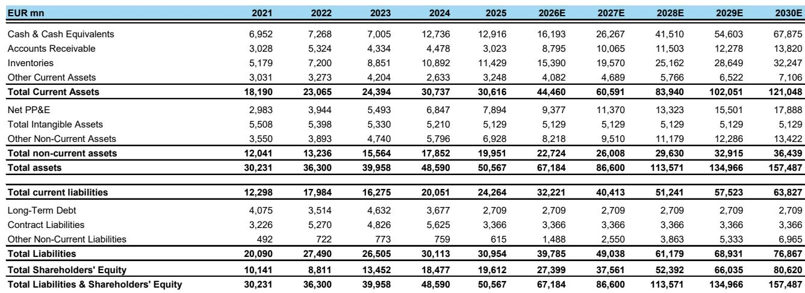
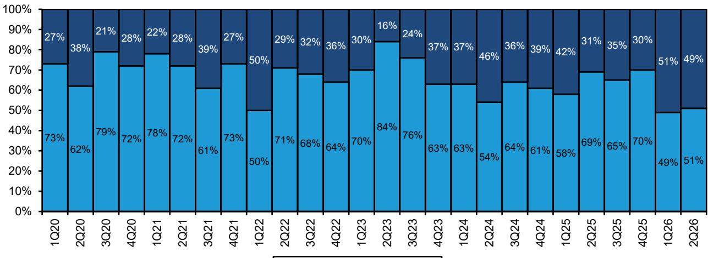
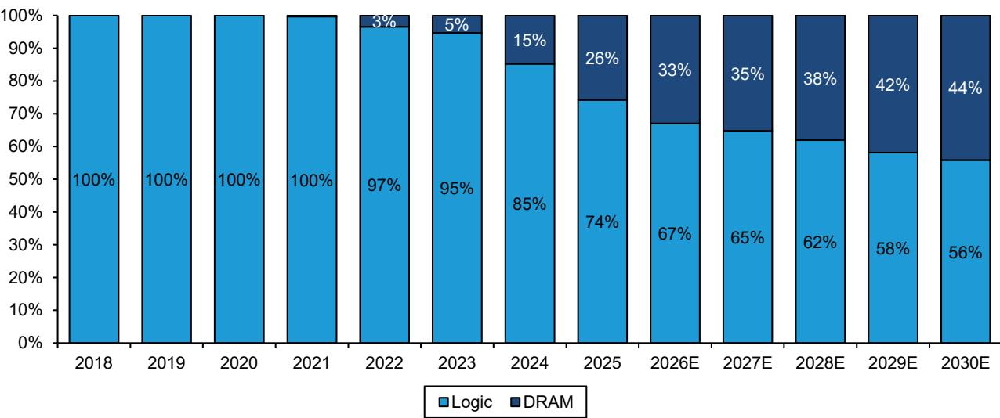

# Bernstein：研究主题与行业变化观察

半导体设备行业正在经历一轮由AI算力研究驱动的资本开支扩张，但市场对设备商收入结构变化的讨论，大多停留在EUV与DUV的简单二分上。Bernstein在7月29日发布的ASML研究报告中提出一个更具体的判断：光刻强度（litho intensity）正从24%向2028年的28%持续抬升，而ASML的定价能力——尤其是EUV从3800E向3800F迁移带来的约20%价格上浮——尚未被市场充分计入预期。报告将ASML列为2026年第三季度重点关注标的，对应约84%的潜在空间。

这份报告值得注意的地方不在于重申ASML的龙头地位，而在于它把增长逻辑拆成了三个可验证的层次：DRAM取代逻辑成为光刻需求的主要引擎、HNA EUV通过简化工艺推高光刻支出占比、以及DUV在1:1的EUV配套比例下仍然构成结构性增长来源。三者共同指向同一个结论：光刻在晶圆制造设备总支出中的份额仍在扩大，而不是见顶。

## 1. DRAM取代逻辑成为ASML光刻需求的主要增长引擎

报告给出的关键证据是订单结构的变化。ASML的存储系统销售占比从历史约30%升至近几个季度的约50%，公司指引2026年存储系统销售同比增长超过75%，而先进逻辑/代工仅增长25%。这一转变的底层原因是DRAM的光刻强度上升速度高于逻辑：从1Y/1Z节点的略低于20%，升至1c节点的26%，预计1d节点引入双重曝光EUV或HNA后达到约30%。

DRAM的EUV曝光层数也在逐代增加，从1a的约2层、1b的3层、1c的5层，升至1d的8层。报告估算，DRAM总EUV曝光量未来五年将增长4.5倍，从2025年的约340万片/月升至2030年的2630万片/月，而同期逻辑仅增长约3倍。HBM的扩产在技术迁移之外增加了纯量因素，管理层将其描述为DRAM光刻需求的“完美风暴”。

> **KC评论：** 存储占ASML系统销售的比例从30%跳到50%，这个结构变化比营收增速本身更值得跟踪。它意味着ASML的业绩弹性正在从逻辑制程竞赛转向存储周期，而存储的资本开支波动历来比逻辑更大。

## 2. HNA EUV通过简化工艺推高光刻支出占比

HNA的价值不在于单次曝光更贵，而在于它替代了原本需要多次曝光的工艺步骤。报告引用ASML的估算：从LELE LNA转向单次曝光HNA，光刻资本开支和运营开支上升约1.2倍，但非光刻成本下降，总体制程成本反而可能降低。这意味着光刻在WFE总支出中的占比上升，而非光刻环节的支出被压缩。

采用节奏上，英特尔已在18A节点使用HNA，验证了高量产可行性。SK海力士2025年9月已在M16工厂组装ASML的TWINSCAN EXE:5200B用于下一代DRAM开发；三星据行业报道订购了两台EXE:5200B，分别预计于2025年底和2026年上半年交付。台积电则可能将HNA的大规模导入推迟至10A节点附近。报告认为HNA在DRAM中的宏观环境性较强，因为DRAM芯片尺寸小、无需stitching，吞吐量更高、单次曝光成本更低。

## 3. DUV在1:1配套比例下构成独立增长来源

市场注意力集中在EUV，但报告强调DUV的混合EUV:DUV资本开支比例仍约为1:1，即每1美元EUV支出对应约1美元DUV需求。在DRAM的1c节点，DUV仍占光刻支出的约50%；先进逻辑中该比例约为1:4，但相对支出保持稳定。中国是另一个结构性支撑：报告预计中国WFE未来三年复合增速超过15%，2028年达到约770亿美元，由于无法获得EUV且本土光刻能力有限，中国对DUV的依赖反而因多次曝光工艺而加深。

报告同时指出，ASML的中国收入贡献在2025年上半年已降至16%（全年约20%），在WFE同行中处于最低水平。这一数据部分回应了市场对中国自研ArFi设备替代ASML的担忧——报告认为短期内该工具不具备竞争力。

## 4. 定价能力是预期差最大的变量

报告将ASML的定价拆成两个部分：一是EUV从3800E向3800F迁移带来的两年约20%价格上浮，二是潜在的同类产品定价调整以体现其在供应链中的价值。报告认为第一部分常被市场忽略，第二部分则完全未被计入预期。仅第一部分即可推动EUV利润率升至60%中段，若第二部分落地则可能更高。日本设备厂商已开始确认定价调整，报告认为这增加了ASML跟进调整的可能性。

当前报价对应2028年EPS约20倍，报告指出这一估值水平在历史上几乎未出现过，且其EPS预测尚未计入任何额外定价调整。节奏变化保护来自DUV的持续增长和存储周期的结构性需求，而非单纯依赖AI叙事的延续。

> **KC评论：** 定价逻辑的关键在于3800E到3800F的迁移是制程升级而非单纯涨价，客户获得的是更高生产率，因此抵触较小。日本设备商的定价确认是一个容易被忽略的交叉验证信号，说明整个光刻供应链的定价环境都在变化。

Bernstein这份报告的核心贡献，是把“AI拉动半导体设备”这个宏观叙事，落到了光刻强度、EUV层数、DUV配套比例和定价节奏这些可追踪的微观指标上。对于关注半导体设备板块的读者而言，DRAM光刻强度的上升斜率、HNA在存储客户中的导入进度，以及ASML季度订单中存储占比的演变，是比季度营收更前置的观察变量。

For informational purposes only. Portions may be generated,translated,summarized,or edited with AI assistance based on source materials and may contain omissions or errors. Please verify independently. This is not investment,legal,tax,accounting,or other professional advice.

For informational purposes only. Portions may be generated,translated,summarized,or edited with AI assistance based on source materials and may contain omissions or errors. Please verify independently. This is not investment,legal,tax,accounting,or other professional advice.

