# 亚太食品与饮料行业研究

## 百威亚太控股有限公司

**评级：市场表现**

**目标报价**

**1876.HK**

**7.00 港元（原为 7.30）**

**目标报价调整**

**研究分析师**

Euan McLeish  
+81 3 5962 9611  
euan.mcleish@bernsteinsg.com

Trevor Stirling  
+44 20 7676 7521  
trevor.stirling@bernsteinsg.com

Hao Wang, CFA  
+852 2123 2627  
hao.wang@bernsteinsg.com

Mufei Gao  
+81 3 6777 6995  
mufei.gao@bernsteinsg.com

# 百威亚太二季度：中国市场持续投入，管理层致力于稳定销量

百威亚太二季度业绩整体符合预期，按固定汇率计算EBITDA基本持平，由于实际税率较低，净利润表现优于预期。二季度固定汇率收入下降2.1%，固定汇率EBITDA下降9.7%，正常化净利润增长3.3%。中国市场各利润表项目表现未达预期，而韩国市场利润率尤其是显著超出预期。我们已将2026年亚太西部地区固定汇率EBITDA增长预期下调至-8.0%（原为-4.5%），并将亚太东部地区固定汇率EBITDA增长预期上调至+5.7%（原为+2.3%），综合导致2026年固定汇率EBITDA预期整体下调1.9%。鉴于管理层指出中国即饮渠道持续承压、商业投入需求较高以及原材料成本压力，我们也将2027年固定汇率EBITDA预期下调6.3%。

中国地区二季度销量下降10%，明显低于预期。虽然即时零售渠道增长和超高端产品的强劲表现成为亮点，在一定程度上缓解了销量压力，但固定汇率收入仍下降8.6%。持续投入于家庭渠道拓展策略以及运营去杠杆效应，导致亚太西部地区二季度固定汇率EBITDA下降16.5%。我们预计下半年亚太西部地区利润率将进一步收缩100个基点，尽管中国地区同比基数在下半年有所降低，但百威中国与同业之间的差距短期内难以明显收窄。

## 研究启示

亚太东部地区二季度EBITDA同比增长26%，大幅超出预期。收入增长9%，定价和运营杠杆推动利润率扩张413个基点。随着2025年提价影响在下半年完全消化，我们预计韩国市场的增长态势将逐步回归常态。

我们维持"市场表现"评级，并将目标报价从7.30港元下调至7.00港元（模型）。我们将2027财年每股收益预期下调6%，以反映中国市场持续的表现和原材料成本压力。我们维持17.5倍的市盈率目标倍数。

<table><tr><td colspan="3">报告日期</td><td colspan="2">2026年7月29日</td></tr><tr><td colspan="3">1876.HK 收盘价（港元）</td><td colspan="2">6.93</td></tr><tr><td colspan="3">目标报价（港元）</td><td colspan="2">7.00</td></tr><tr><td colspan="3">上行/下行空间</td><td colspan="2">1%</td></tr><tr><td colspan="3">52周区间</td><td colspan="2">9.42/6.00</td></tr><tr><td colspan="3">ASIAX</td><td colspan="2">1,810.56</td></tr><tr><td colspan="3">财年截止</td><td colspan="2">12月</td></tr><tr><td colspan="3">股息回报表现</td><td colspan="2">6.4%</td></tr><tr><td colspan="3">市值（百万港元）</td><td colspan="2">91,777</td></tr><tr><td colspan="3">企业价值（百万港元）</td><td colspan="2">9,146</td></tr><tr><td>表现</td><td>年初至今</td><td>1个月</td><td>6个月</td><td>12个月</td></tr><tr><td>相对表现（%）</td><td>(8.7)</td><td>13.6</td><td>(10.0)</td><td>(21.0)</td></tr><tr><td>ASIAX（%）</td><td>10.7</td><td>(8.9)</td><td>3.6</td><td>22.8</td></tr><tr><td>相对表现（%）</td><td>(19.4)</td><td>22.5</td><td>(13.6)</td><td>(43.8)</td></tr><tr><td colspan="5">资料来源：彭博、Bernstein预测与分析</td></tr></table>

<table><tr><td>调整后每股收益</td><td>F25A</td><td>F26E</td><td>F27E</td><td>财务数据</td><td>F25A</td><td>F26E</td><td>F27E</td><td>复合年增长率</td></tr><tr><td>1876.HK（美元）</td><td>0.04</td><td>0.05</td><td>0.05</td><td>收入（百万）</td><td>5,764</td><td>5,997</td><td>6,342</td><td>4.9%</td></tr><tr><td></td><td></td><td></td><td></td><td>息税前利润（百万）</td><td>986.00</td><td>974.41</td><td>1,036</td><td>2.5%</td></tr><tr><td></td><td></td><td></td><td></td><td>净利润（百万）</td><td>489.00</td><td>652.93</td><td>644.75</td><td>14.8%</td></tr><tr><td></td><td></td><td></td><td></td><td>投入资本回报率（%）</td><td>7.6</td><td>9.8</td><td>9.8</td><td>--</td></tr><tr><td></td><td></td><td></td><td></td><td>净债务/EBITDA（倍）</td><td>(1.61)</td><td>(1.62)</td><td>(1.59)</td><td>(0.5)%</td></tr></table>

**一年价格表现**  
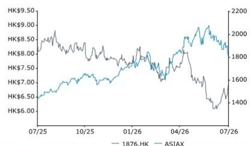

<table><tr><td>估值指标</td><td>F25A</td><td>F26E</td><td>F27E</td></tr><tr><td>调整后市盈率（倍）</td><td>23.8</td><td>17.9</td><td>18.1</td></tr><tr><td>调整后PEG（倍）</td><td>(0.7)</td><td>0.5</td><td>(14.5)</td></tr><tr><td>企业价值/销售额（倍）</td><td>0.2</td><td>0.2</td><td>0.2</td></tr><tr><td>企业价值/息税前利润（倍）</td><td>1.2</td><td>1.2</td><td>1.1</td></tr><tr><td>报告PEG（倍）</td><td>(0.7)</td><td>0.5</td><td>(14.5)</td></tr><tr><td>报告市盈率（倍）</td><td>23.8</td><td>17.9</td><td>18.1</td></tr><tr><td>企业价值/自由现金流（倍）</td><td>1.8</td><td>1.6</td><td>1.4</td></tr></table>

## 目录

二季度关键业绩指标....2  
Bernstein模型调整....3  
分部业绩详情....4  
估值指标....6

## 详情

## 二季度关键业绩指标

图表1：百威亚太业绩与Bernstein及公司汇总市场预期的对比

<table><tr><td>FY26Q2有机增长</td><td>实际</td><td>Bernstein</td><td>市场一致预期</td></tr><tr><td>销量</td><td>(4.1%)</td><td>0.1%</td><td>(1.1%)</td></tr><tr><td>收入</td><td>(2.1%)</td><td>(1.1%)</td><td>(1.6%)</td></tr><tr><td>EBITDA</td><td>(9.7%)</td><td>(8.7%)</td><td>(6.9%)</td></tr></table>

资料来源：公司报告、Bernstein分析与预测

图表2：百威亚太固定汇率业绩摘要

<table><tr><td>（百万美元，另有说明除外）[有机固定汇率口径]</td><td>FY25Q2</td><td>FY26Q2</td><td>同比（%/基点）</td><td>Bernstein FY26Q2</td><td>差异</td></tr><tr><td>销量（百万百升）</td><td>23.9</td><td>22.9</td><td>(4.1%)</td><td>23.9</td><td>(4.2%)</td></tr><tr><td>收入</td><td>1,675</td><td>1,640</td><td>(2.1%)</td><td>1,657</td><td>(1.0%)</td></tr><tr><td>每百升收入（美元）</td><td>70.1</td><td>71.6</td><td>2.1%</td><td>69.3</td><td>3.3%</td></tr><tr><td>销售成本</td><td>(807)</td><td>(787)</td><td>(2.5%)</td><td></td><td></td></tr><tr><td>每百升（美元）</td><td>(33.8)</td><td>(34.3)</td><td>1.6%</td><td></td><td></td></tr><tr><td>毛利</td><td>868</td><td>853</td><td>(1.7%)</td><td></td><td></td></tr><tr><td>占收入百分比</td><td>51.8%</td><td>52.0%</td><td>21</td><td></td><td></td></tr><tr><td>正常化息税前利润</td><td>348</td><td>313</td><td>(10.1%)</td><td>310</td><td>1.1%</td></tr><tr><td>占收入百分比</td><td>20.8%</td><td>19.1%</td><td>(170)</td><td>18.7%</td><td></td></tr><tr><td>正常化EBITDA</td><td>498</td><td>450</td><td>(9.7%)</td><td>454</td><td>(1.0%)</td></tr><tr><td>正常化EBITDA利润率</td><td>29.7%</td><td>27.4%</td><td>(231)</td><td>27.4%</td><td></td></tr></table>

资料来源：公司报告、Bernstein分析与预测

图表3：百威亚太报告货币业绩摘要

<table><tr><td>（百万美元，另有说明除外）[报告货币口径]</td><td>FY25Q2</td><td>FY26Q2</td><td>同比（%/基点）</td><td>Bernstein FY26Q2</td><td>差异</td><td>彭博 FY26Q2</td><td>差异</td></tr><tr><td>销量（百万百升）</td><td>23.9</td><td>22.9</td><td>(4.2%)</td><td>23.9</td><td>(4.3%)</td><td>23.7</td><td>(3.4%)</td></tr><tr><td>收入</td><td>1,675</td><td>1,678</td><td>0.2%</td><td>1,716</td><td>(2.2%)</td><td>1,690</td><td>(0.7%)</td></tr><tr><td>每百升收入（美元）</td><td>70.1</td><td>73.3</td><td>4.6%</td><td>71.8</td><td>2.1%</td><td>71.3</td><td>2.8%</td></tr><tr><td>销售成本</td><td>(807)</td><td>(796)</td><td>(1.4%)</td><td></td><td></td><td></td><td></td></tr><tr><td>每百升（美元）</td><td>(33.8)</td><td>(34.8)</td><td>2.9%</td><td></td><td></td><td></td><td></td></tr><tr><td>毛利</td><td>868</td><td>882</td><td>1.6%</td><td></td><td></td><td></td><td></td></tr><tr><td>占收入百分比</td><td>51.8%</td><td>52.6%</td><td></td><td></td><td></td><td></td><td></td></tr><tr><td>正常化息税前利润</td><td>348</td><td>322</td><td>(7.5%)</td><td>321</td><td>0.5%</td><td>302</td><td>6.8%</td></tr><tr><td>占收入百分比</td><td>20.8%</td><td>19.2%</td><td></td><td>18.7%</td><td></td><td>17.8%</td><td></td></tr><tr><td>正常化EBITDA</td><td>498</td><td>463</td><td>(7.0%)</td><td>471</td><td>(1.6%)</td><td>463</td><td>(0.1%)</td></tr><tr><td>正常化EBITDA利润率</td><td>29.7%</td><td>27.6%</td><td>(214)</td><td>27.4%</td><td></td><td>27.4%</td><td></td></tr><tr><td>税前利润</td><td>353</td><td>346</td><td>(2.0%)</td><td>326</td><td>6.0%</td><td>313</td><td>10.7%</td></tr><tr><td>所得税</td><td>(168)</td><td>(90)</td><td>(46.4%)</td><td>(155)</td><td>(42.1%)</td><td></td><td></td></tr><tr><td>实际税率（%）</td><td>47.6%</td><td>26.0%</td><td></td><td>47.6%</td><td></td><td></td><td></td></tr><tr><td>税后利润</td><td>185</td><td>256</td><td>38.4%</td><td>171</td><td>49.7%</td><td></td><td></td></tr><tr><td>净利润</td><td>175</td><td>247</td><td>41.1%</td><td>162</td><td>52.6%</td><td>184</td><td>34.4%</td></tr><tr><td>占收入百分比</td><td>10.4%</td><td>14.7%</td><td></td><td>9.4%</td><td></td><td>10.9%</td><td></td></tr><tr><td>正常化净利润</td><td>239</td><td>247</td><td>3.3%</td><td></td><td></td><td></td><td></td></tr><tr><td>占收入百分比</td><td>14.3%</td><td>14.7%</td><td>45</td><td></td><td></td><td></td><td></td></tr></table>

资料来源：彭博、公司报告、Bernstein分析与预测

## Bernstein模型调整

我们将2026年每股收益预期上调9%，同时将EBITDA预期下调2%，反映了持续的渠道投入和收入端表现，以及公司二季度实际税率降低和净财务成本高于预期所带来的积极影响。

我们目前预计亚太西部地区三季度固定汇率收入增长4%，固定汇率正常化EBITDA下降2%；四季度分别增长8%和10%，全年固定汇率收入和固定汇率正常化EBITDA增长分别为+1%和-8%。

我们预计亚太东部地区三季度固定汇率收入和固定汇率正常化EBITDA分别增长+2.5%和+3%；四季度分别增长+4%和+8%，全年固定汇率收入和固定汇率正常化EBITDA增长分别为+2%和+6%。

就整体业务而言，我们预计三季度固定汇率收入和固定汇率正常化EBITDA分别增长+4%和-1%；四季度均为7%，全年固定汇率收入和固定汇率正常化EBITDA增长分别为+1.5%和-5%。

按报告货币计算，我们预计全年收入/正常化EBITDA分别增长+4%和-2%。

图表4：我们目前预计百威亚太FY26收入增长1.5%，EBITDA下降4.7%，利润率总计收缩166个基点

百威亚太FY26E固定汇率同比增长%

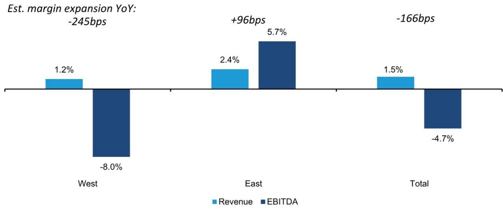  
资料来源：Bernstein分析与预测  
图表5：我们将西部地区固定汇率收入增长下调0.4%，使FY26整体固定汇率收入增长降至+1.5%  
Bernstein预测：百威亚太FY26e固定汇率收入同比增长%

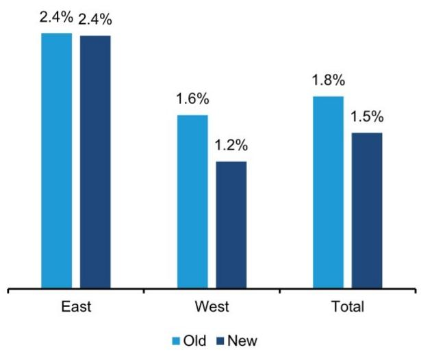  
资料来源：Bernstein分析与预测  
图表6：我们将东部地区固定汇率EBITDA增长上调至+5.7%，但将西部地区下调3.5%，目前预计FY26整体固定汇率EBITDA增长下降4.7%  
Bernstein预测：百威亚太FY26e固定汇率正常化EBITDA同比增长%

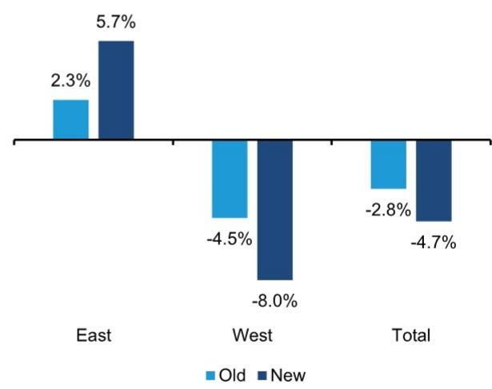  
资料来源：Bernstein分析与预测

## 分部业绩详情

中国地区销量降幅从一季度的-1.5%扩大至本季度的-9.7%。在行业整体受不利天气影响、即饮渠道持续承压的背景下，百威中国表现弱于同业（中国啤酒六月更新）。然而，二季度价格组合转正（+1.2%），主要得益于超高端产品的强劲势头，家庭渠道表现良好，科罗娜推出了新包装。印度市场继续获得份额增长，二季度实现双位数收入增长。区域利润率下降381个基点，主要由于中国市场的运营去杠杆效应，印度的一次性商业投入也构成拖累。政府补助本次降至"接近零"，据公司表示将维持在该水平。

韩国市场销量实现低双位数增长，得益于去年四月提价前发货节奏带来的较低基数。区域利润率上升413个基点，主要受运营杠杆驱动，家庭渠道的积极包装组合也是利好因素。

图表7：百威亚太各区域固定汇率增长

<table><tr><td>FY26Q2有机增长</td><td>西部</td><td>中国</td><td>东部</td><td>韩国</td></tr><tr><td>销量</td><td>-6.0%</td><td>-9.7%</td><td>10.1%</td><td>+低双位数</td></tr><tr><td>收入</td><td>-4.6%</td><td>-8.6%</td><td>8.5%</td><td></td></tr><tr><td>每百升收入</td><td>1.5%</td><td>1.2%</td><td>-1.5%</td><td>-低个位数</td></tr><tr><td>EBITDA</td><td>-16.5%</td><td>-15.9%</td><td>26.3%</td><td>+强劲双位数</td></tr><tr><td>EBITDA利润率</td><td>27.0%</td><td></td><td>29.2%</td><td>大幅扩张</td></tr></table>

资料来源：公司报告、Bernstein分析  
百威亚太FY26Q2收入有机同比增长%

图表8：西部地区收入未达预期，中国构成拖累；东部地区超出预期

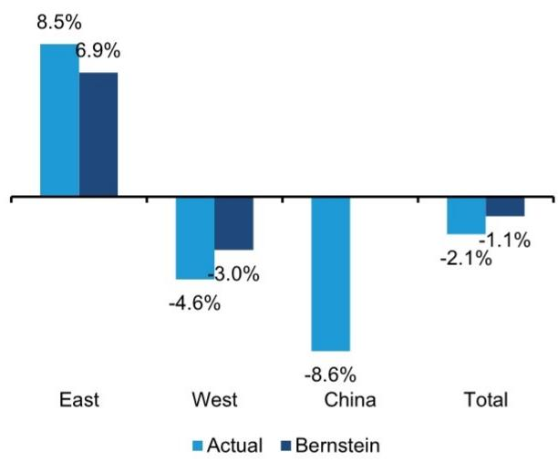  
资料来源：公司报告、Bernstein分析与预测  
图表9：东部地区EBITDA大幅超出我们预期，受韩国运营杠杆驱动；西部地区未达预期，中国增长动能持续  
百威亚太FY26Q2 EBITDA有机同比增长%

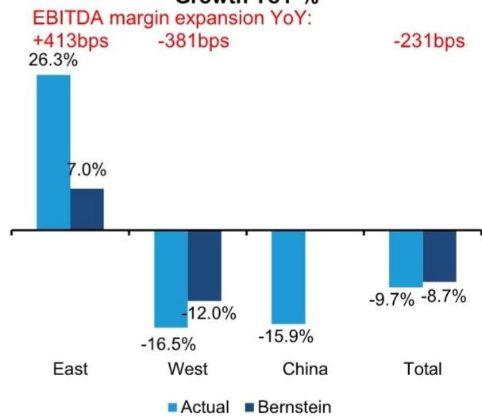  
资料来源：公司报告、Bernstein分析与预测

图表10：我们预计亚太西部EBITDA降幅在FY26E收窄至-8%，FY27E回升至+4%；东部在FY26/27E分别增长6%/5%

百威亚太FY24-FY27E固定汇率EBITDA同比增长%  
  
资料来源：公司报告、Bernstein分析与预测

## 估值指标

图表11：百威亚太当前估值较历史平均倍数低0.8个标准差

百威亚太市场一致预期NTM市盈率  
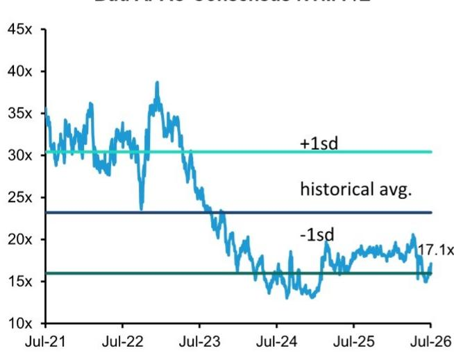  
资料来源：彭博、Bernstein分析  
图表12：相对基准指数的折价较历史平均水平低0.1个标准差  
百威亚太市场一致预期NTM市盈率 vs MSCI中国必需消费品指数

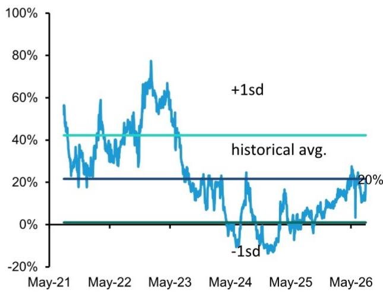  
资料来源：彭博、Bernstein分析

图表13：市场预期在过去12个月持续调整  
百威亚太每股收益市场一致预期历史  
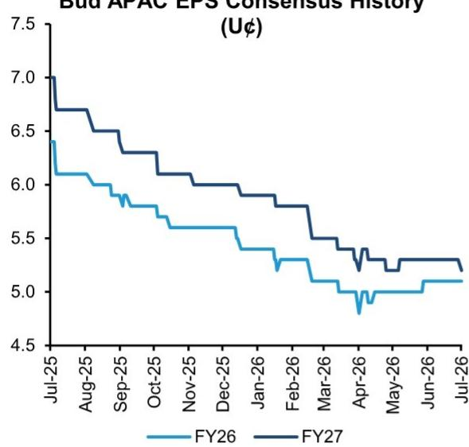  
资料来源：彭博、Bernstein分析

图表14：我们今年每股收益预期较市场一致预期高10%，但预计市场预期将逐步靠拢  
百威亚太每股收益（美分）  
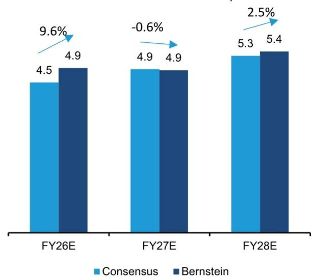  
资料来源：彭博、Bernstein分析与预测

图表15：美元兑人民币  
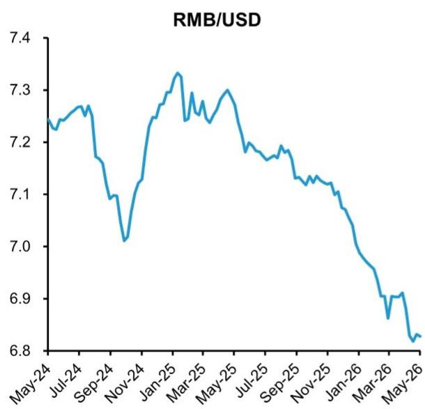  
资料来源：彭博、Bernstein分析

图表16：美元兑韩元  
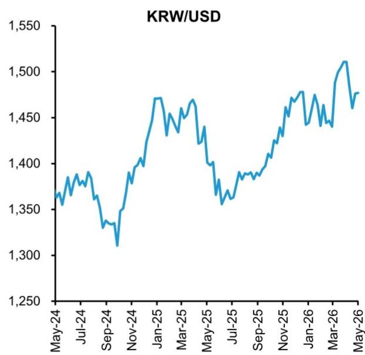  
资料来源：彭博、Bernstein分析

## 附录 - 财务预测

图表17：百威亚太利润表

<table><tr><td colspan="7">百威亚太利润表（百万美元，另有说明除外）</td></tr><tr><td></td><td>FY23</td><td>FY24</td><td>FY25</td><td>FY26e</td><td>FY27e</td><td>FY28e</td></tr><tr><td>销量（百万百升）</td><td>92.8</td><td>84.8</td><td>79.7</td><td>79.3</td><td>81.6</td><td>83.9</td></tr><tr><td>收入</td><td>6,856</td><td>6,246</td><td>5,764</td><td>5,997</td><td>6,342</td><td>6,707</td></tr><tr><td>销售成本</td><td>(3,403)</td><td>(3,099)</td><td>(2,877)</td><td>(2,993)</td><td>(3,165)</td><td>(3,348)</td></tr><tr><td>毛利</td><td>3,453</td><td>3,147</td><td>2,887</td><td>3,003</td><td>3,176</td><td>3,359</td></tr><tr><td>分销费用</td><td>(520)</td><td>(496)</td><td>(441)</td><td></td><td></td><td></td></tr><tr><td>销售及营销费用</td><td>(1,201)</td><td>(1,129)</td><td>(1,091)</td><td></td><td></td><td></td></tr><tr><td>管理费用</td><td>(470)</td><td>(477)</td><td>(454)</td><td></td><td></td><td></td></tr><tr><td>其他营业收入/支出</td><td>107</td><td>115</td><td>85</td><td></td><td></td><td></td></tr><tr><td>正常化息税前利润</td><td>1,369</td><td>1,160</td><td>986</td><td>974</td><td>1,036</td><td>1,153</td></tr><tr><td>折旧及摊销</td><td>654</td><td>647</td><td>602</td><td>578</td><td>579</td><td>581</td></tr><tr><td>正常化EBITDA</td><td>2,023</td><td>1,807</td><td>1,588</td><td>1,552</td><td>1,616</td><td>1,734</td></tr><tr><td>非经常性项目</td><td>(80)</td><td>(62)</td><td>(83)</td><td>(78)</td><td>(78)</td><td>(78)</td></tr><tr><td>营业利润</td><td>1,289</td><td>1,098</td><td>903</td><td>896</td><td>958</td><td>1,075</td></tr><tr><td>非经常性财务成本</td><td>0</td><td>0</td><td>0</td><td>0</td><td>0</td><td>0</td></tr><tr><td>净财务收入/成本</td><td>10</td><td>31</td><td>10</td><td>16</td><td>16</td><td>16</td></tr><tr><td>联营公司业绩份额</td><td>28</td><td>31</td><td>38</td><td>44</td><td>44</td><td>44</td></tr><tr><td>税前利润</td><td>1,327</td><td>1,160</td><td>951</td><td>956</td><td>1,018</td><td>1,135</td></tr><tr><td>所得税</td><td>(447)</td><td>(410)</td><td>(431)</td><td>(276)</td><td>(346)</td><td>(386)</td></tr><tr><td>税后利润</td><td>880</td><td>750</td><td>520</td><td>681</td><td>672</td><td>749</td></tr><tr><td colspan="7">归属于：</td></tr><tr><td>权益持有人</td><td>852</td><td>726</td><td>489</td><td>653</td><td>645</td><td>719</td></tr><tr><td>非控股权益</td><td>28</td><td>24</td><td>31</td><td>28</td><td>27</td><td>30</td></tr><tr><td>基本每股收益（美元）</td><td>0.06</td><td>0.06</td><td>0.04</td><td>0.05</td><td>0.05</td><td>0.05</td></tr><tr><td>基本发行股数（百万）</td><td>13,220</td><td>13,187</td><td>13,196</td><td>13,234</td><td>13,234</td><td>13,234</td></tr><tr><td colspan="7">关键比率</td></tr><tr><td>收入同比增长%</td><td>5.8%</td><td>-8.9%</td><td>-7.7%</td><td>4.0%</td><td>5.8%</td><td>5.8%</td></tr><tr><td>EBITDA同比增长%</td><td>4.7%</td><td>-10.7%</td><td>-12.1%</td><td>-2.3%</td><td>4.1%</td><td>7.3%</td></tr><tr><td>净利润同比增长%</td><td>-6.7%</td><td>-14.8%</td><td>-32.6%</td><td>33.5%</td><td>-1.3%</td><td>11.5%</td></tr><tr><td>毛利占收入百分比</td><td>50.4%</td><td>50.4%</td><td>50.1%</td><td>50.1%</td><td>50.1%</td><td>50.1%</td></tr><tr><td>息税前利润率</td><td>20.0%</td><td>18.6%</td><td>17.1%</td><td>16.2%</td><td>16.3%</td><td>17.2%</td></tr><tr><td>EBITDA利润率</td><td>29.5%</td><td>28.9%</td><td>27.6%</td><td>25.9%</td><td>25.5%</td><td>25.9%</td></tr><tr><td>净利润率</td><td>12.4%</td><td>11.6%</td><td>8.5%</td><td>10.9%</td><td>10.2%</td><td>10.7%</td></tr><tr><td>投入资本回报率%</td><td>11.6%</td><td>10.4%</td><td>7.6%</td><td>9.8%</td><td>9.8%</td><td>11.1%</td></tr><tr><td>有形投入资本回报率%</td><td>36.5%</td><td>29.5%</td><td>22.3%</td><td>30.5%</td><td>31.6%</td><td>35.5%</td></tr></table>

资料来源：公司报告、Bernstein分析与预测

图表18：百威亚太资产负债表

<table><tr><td>百威亚太资产负债表（百万美元，另有说明除外）</td><td>FY23</td><td>FY24</td><td>FY25</td><td>FY26e</td><td>FY27e</td><td>FY28e</td></tr><tr><td>存货</td><td>444</td><td>376</td><td>343</td><td>374</td><td>396</td><td>418</td></tr><tr><td>贸易及其他应收款</td><td>609</td><td>496</td><td>505</td><td>504</td><td>516</td><td>527</td></tr><tr><td>衍生工具</td><td>23</td><td>29</td><td>43</td><td>43</td><td>43</td><td>43</td></tr><tr><td>现金及现金等价物</td><td>3,141</td><td>2,867</td><td>2,828</td><td>2,795</td><td>2,845</td><td>2,973</td></tr><tr><td>向AB InBev的现金池存款</td><td>25</td><td>48</td><td>71</td><td>71</td><td>71</td><td>71</td></tr><tr><td>其他流动资产</td><td>17</td><td>16</td><td>25</td><td>25</td><td>25</td><td>25</td></tr><tr><td>流动资产合计</td><td>4,259</td><td>3,832</td><td>3,815</td
