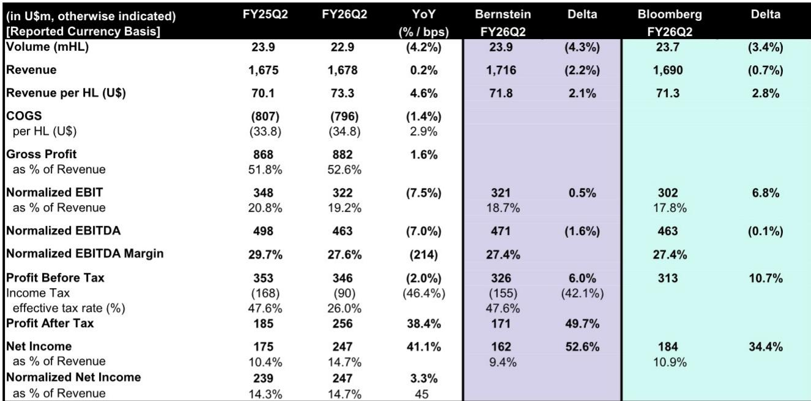
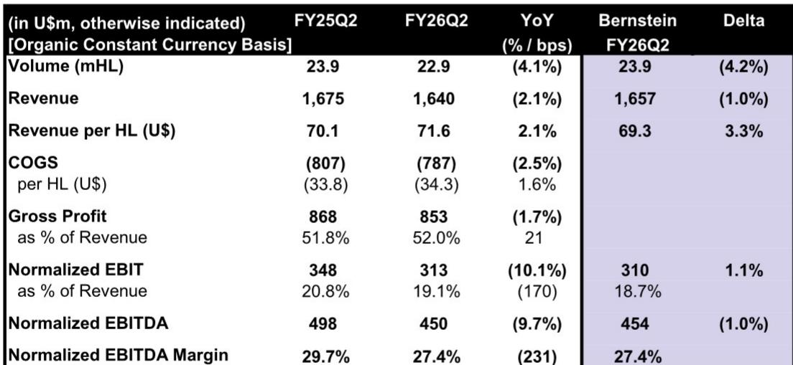
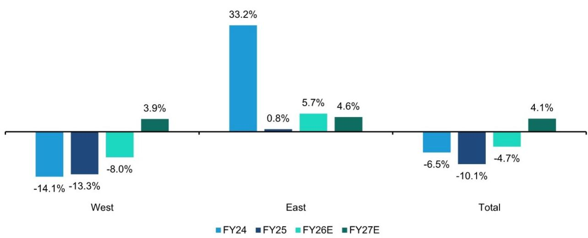

# 百威亚太的中国市场挑战：从周期性波动到战略性的资本再配置

百威亚太第二季度业绩呈现分化格局，这一结果值得关注的程度远超表面数字。尽管市场目光聚焦于利润端的表现——在较低有效税率推动下，经调整净利润增长3.3%——但核心运营引擎在中国市场正以超出预期的速度发生变化。中国市场销量当季下降9.7%，较一季度1.5%的降幅明显扩大，公司管理层也明确提及餐饮渠道持续承压、商业投入需求上升以及原材料成本压力。这并非天气因素或暂时的渠道扰动。百威亚太正主动选择在其最大市场加大投入以穿越当前阶段，以短期利润换取以渠道拓展为主导的复苏，而这一策略的效果尚待验证。战略问题已不再是市场是否会回暖，而是公司的投入逻辑是否与一个本质上不同于其高端定位所依赖的消费环境相匹配。

将本季度业绩置于区域分化的背景下，矛盾更为突出。以中国为主的亚太西区，固定汇率下EBITDA下降16.5%，利润率收缩381个基点。以韩国为主导的亚太东区，固定汇率下EBITDA增长26.3%，利润率扩张413个基点。两个区域之间的差距并非暂时性分化——它反映的是两种不同的运营现实。韩国正在收获定价能力和运营杠杆带来的成果。中国则处于投入阶段，在一个规模收缩的品类中为捍卫市场份额而投入，高端细分虽在增长，但增速不足以抵消大众档的销量下滑。市场已开始为这一分化定价。过去12个月，百威亚太相对MSCI中国必需消费指数的表现落后43.8个百分点，当前估值也低于其历史平均倍数。对观察者而言，问题是这一折价是机会，还是对公司尚未解决的结构性问题的准确反映。

## 中国市场销量降幅扩大，公司应对方式是加大投入

本季度最值得关注的数据点并非降幅本身，而是其变化轨迹。中国销量二季度下降9.7%，较一季度1.5%的降幅明显加速。这一变化难以仅用基数效应或天气因素解释。持续承压的餐饮渠道仍未改善，行业整体也偏弱。但在行业偏弱的背景下，百威亚太的表现落后于同业，这指向公司层面的执行问题，而非纯粹的宏观因素驱动。公司的应对是加大居家场景直供零售渠道的拓展投入，为科罗娜推出新包装，并进入此前渗透率较低的渠道。这是一个合理的长期布局——在传统批发渠道整合的市场中建立直接分销能力——但需要付出成本。销量下降带来的运营去杠杆效应，加上增量投入，导致区域利润率收缩381个基点。

中国市场的投入逻辑基于一个假设：高端及超高端细分最终将弥补大众档的销量损失。本季度的证据喜忧参半。价格组合转正至1.2%，由超高端品类的强劲表现驱动，公司也强调了新包装带来的居家场景良好势头。但固定汇率下收入下降8.6%揭示了真实情况：产品组合改善不足以抵消销量下滑。公司本质上是在加速奔跑以维持原位，而投入节奏恰逢消费环境趋弱。管理层对餐饮渠道持续承压和商业投入需求上升的指引表明，这一态势将延续至下半年。对亚太西区下半年利润率进一步收缩100个基点的预期，确认了投入阶段尚未接近尾声。

与同业相比，这一局面的战略性问题更为突出。百威亚太并非只是在应对偏弱的市场——它正在失去份额。报告指出，公司在行业偏弱的背景下表现落后于同业。在销量下滑的市场中，份额流失会加剧问题，因为公司面临的不仅是缩小的蛋糕，还是蛋糕中更小的一块。居家场景RTM拓展正是为应对这一问题而设计，通过建立与零售商的直接关系来应对，但这是一个回报周期不确定的多年期项目。与此同时，公司正在投入资源以捍卫一个正在收缩的市场地位。下半年基数将有所改善，但如果投入逻辑未能转化为份额企稳，与同业之间的轨迹差距不太可能实质性收窄。不应将基数改善误认为复苏，而应关注投入是否正在产生预期的份额增长。

## 韩国利润率扩张真实存在，但难以持续，市场对单季表现存在过度外推

韩国是二季度的突出亮点，销量实现低双位数增长，EBITDA增长强劲。413个基点的利润率扩张由运营杠杆和居家场景的正面产品组合驱动。这是真实的运营成果，也证明了公司东区业务具备定价能力和成本纪律。但这一表现的可持续性存疑。销量增长部分得益于2025年4月提价前的出货节奏带来的较低比较基数。这一节奏效应现已完全消化，报告也明确指出韩国业务轨迹将在下半年回归常态。利润率扩张同样受到比较基期的有利影响——上年同期公司正在消化提价实施的成本。

韩国的战略启示并非百威亚太找到了抵消中国问题的增长引擎——而是公司东区业务处于一个根本不同的市场结构中。韩国啤酒市场集中度更高，竞争格局更清晰，渠道碎片化程度远低于中国。韩国展现的定价能力是市场结构的结果，而非管理层的特别才能。公司于2025年4月提价，销量反应可控，运营杠杆得以释放。在这样的市场中，高端啤酒企业能够蓬勃发展，因为分销体系更可预测，消费者对品牌的忠诚度更高。中国不具备这样的环境。对观察者的启示是，东区业务是可靠的现金流来源，但并非能够抵消中国结构性挑战的增长故事。市场对韩国表现的 enthusiasm 应有所节制，认识到这是回归常态，而非新的增长轨迹。

公司自身的指引支持这一解读。报告中的模型修正显示，亚太东区FY26固定汇率EBITDA增长为5.7%，高于此前的2.3%，但这仍较二季度增速有所放缓。全年预估已纳入下半年正常化因素。市场不应将二季度的利润率扩张外推为持续趋势。韩国是成熟市场，销量增长空间有限；利润率扩张是提价和产品组合变化带来的一次性运营收益，而非将复利增长的结构性改善。风险在于，市场可能锚定二季度表现而忽视正常化指引，从而对公司2027年的盈利能力形成过度乐观的判断。

## 税率变化是一次性收益，掩盖了核心盈利的变化

二季度利润端的表现主要受较低有效税率驱动，税率为26.0%，而上年同期为47.6%。这一巨大变化解释了为何在EBITDA下降9.7%的情况下，经调整净利润仍增长3.3%。报告指出，政府补助本季度降至"接近于零"并将维持在该水平，这表明税率收益并非可持续项目。公司有效税率历来波动较大，FY26所得税预估为2.76亿，而FY25为4.31亿，隐含税率显著低于历史水平。这不是可持续的运行状态。

风险在于市场可能关注利润超预期而忽视运营层面的变化。报告中的模型修正具有参考意义：分析师将FY26 EBITDA下调2%，但因税率降低将EPS上调9%。这是典型的财务因素——税收收益和财务成本可以美化利润端，而核心业务正在发生变化。关注EPS的读者可能会忽略固定汇率EBITDA预计在FY26下降4.7%、亚太西区EBITDA下降8%的事实。公司的盈利质量正在变化，即使报表利润有所增长。这不是可持续的估值基础。

税率问题也造成了与市场预期比较的扭曲。报告指出，分析师当前年度EPS预估比市场一致预期高10%，但预计一致预期将逐步跟上。这表明市场尚未完全消化税收收益，意味着即使运营面恶化，EPS仍有上调空间。读者应对这一动态保持警惕——它制造了一种虚假的动能感，当税收收益正常化时将发生逆转。FY25有效税率为45.3%（4.31亿税/9.51亿税前利润），而FY26预估隐含税率为28.9%（2.76亿/9.56亿）。这一显著变化不太可能持续。FY27预估为3.46亿/10.18亿，隐含税率34.0%，更为现实但仍低于FY25水平。税率是盈利波动的一个来源，应予以折扣而非追捧。

## 投入逻辑的核心：中国高端化加速能否跑赢大众档下滑

百威亚太的核心战略问题是，中国居家场景渠道和超高端产品组合的投入能否产生足够增长以抵消大众档销量下滑。公司的路径是建立直达零售的分销能力，为科罗娜等品牌推出新包装，并进入增长较强的超高端细分。这是一个合理的长期策略，但取决于中国高端化进程的速度。二季度的证据是超高端细分在增长，价格组合转正至1.2%，但整体收入下降8.6%表明高端增长不足以抵消大众档下滑。公司本质上是在用核心业务 declining 的现金流为一个多年期投入计划提供资金。

报告中的模型修正具有参考意义。分析师将FY26亚太西区EBITDA增长从-4.5%下调至-8.0%，并将FY27 EBITDA下调6.3%，以反映中国市场的持续变化和原材料成本压力。这不是一家接近投入周期末端的公司——而是一家在市场变化中加深投入的公司。原材料成本压力增加了另一层压力，投入成本上升恰逢公司试图为扩张提供资金。销量下降、投入支出和成本上升的组合对利润率形成三重挤压。公司对餐饮渠道持续承压的指引表明，渠道结构仍在从高利润的餐饮渠道向低利润的居家场景转移，进一步加剧利润率压力。

投入逻辑仍有可能成立，但时间跨度比市场愿意接受的要长。公司正在建设的能将在消费环境企稳后体现价值，超高端产品组合也为长期高端化趋势做好了定位。但市场并未为多年投入期定价。当前估值约为前瞻市盈率17.9倍，低于历史平均但不足以补偿盈利变化。相对MSCI中国必需消费指数的表现不佳，过去12个月一致预期EPS多次下调。市场对投入故事的耐心正在消耗，公司需要在销量企稳方面展示切实进展，估值才有望重新评估。

## 分析框架：区分资产质量与盈利轨迹

分析百威亚太的挑战在于区分其资产质量与盈利轨迹。公司拥有亚洲最具价值的啤酒品牌，在进入壁垒较高的市场运营，资产负债表为净现金状态。这些是真实的优势，长期内支撑较高的估值。但近期盈利轨迹正在变化，公司正主动选择牺牲利润以在中国捍卫市场份额。需要一个框架来权衡这些因素。

第一个考量是中国投入阶段的持续时间。管理层已指出商业投入需求保持高位，报告预计下半年利润率将进一步收缩。关键问题是投入是否正在产生可衡量的份额增长。二季度数据并不令人鼓舞——公司在行业偏弱的背景下落后于同业。如果投入未能转化为份额企稳，公司就是在花钱而未实现战略目标。应关注相对同业的销量轨迹作为关键先行指标。

第二个考量是韩国盈利的可持续性。二季度表现由提价带来的运营杠杆驱动，而提价效应现已完全消化。下半年正常化已在预期之中，亚太东区FY26 EBITDA增长5.7%的预估是更为现实的运行水平。韩国是可靠的现金流来源，但不是增长引擎。不应期待二季度表现重复。

第三个考量是税率正常化。FY26 EPS预估受到远低于历史水平税率的支撑。FY27预估隐含税率较高，将对EPS增长形成压力。应按正常化税率建模，而非当前年度的税率，以避免高估公司盈利能力。

第四个考量是原材料成本环境。报告指出原材料成本压力将在下半年对利润率形成压力。这是公司特定问题，与销量和投入挑战叠加。投入成本上升并非暂时因素——它反映了农产品和包装市场结构性变化，将持续存在。

最后一个考量是估值。当前估值约为前瞻市盈率17.9倍，低于历史平均但并非深度折价。一致预期NTM P/E较历史平均低0.8个标准差，相对MSCI中国必需消费指数的折价较历史平均低0.1个标准差。这表明市场已计入显著变化，但盈利预估仍处于调整过程中，市场认为风险收益相对平衡。

综合这些因素，百威亚太是资产质量较高、估值合理但盈利轨迹正在变化的公司。公司正押注中国高端化进程，这一策略可能在多年时间跨度内产生回报，但近期盈利将受到销量下降、投入支出和成本上升的压力。具有长期视野并对中国投入阶段有耐心的读者可能认为当前水平具有吸引力。视野较短的读者则应保持谨慎，因为在投入逻辑开始产生回报之前，盈利预估可能进一步下调。

公司维持17.5倍市盈率倍数的决定，在盈利轨迹变化的情况下，是一个可辩护的立场，但对未与长期中国逻辑对齐的读者而言，并未留下安全边际。这是一个需要验证的故事——市场需要看到中国投入正在稳定销量的证据，才会重新评估估值倍数。在此之前，估值可能在区间内波动，韩国现金流提供下限，中国市场的持续变化提供上限。

*仅供参考。部分内容可能基于原始材料由AI辅助生成、翻译、摘要或编辑，可能存在遗漏或错误。请独立核实。本文不构成投资、法律、税务、会计或其他专业建议。*

仅供参考。部分内容可能基于原始材料由AI辅助生成、翻译、摘要或编辑，可能存在遗漏或错误。请独立核实。本文不构成投资、法律、税务、会计或其他专业建议。

