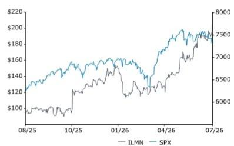
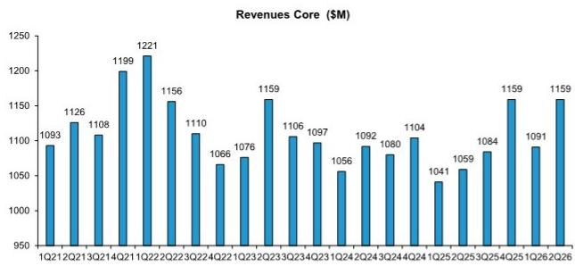
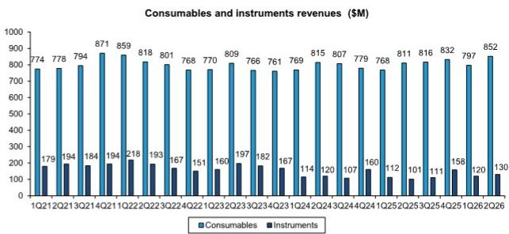
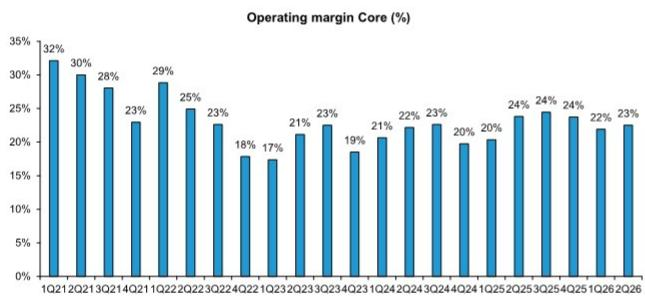
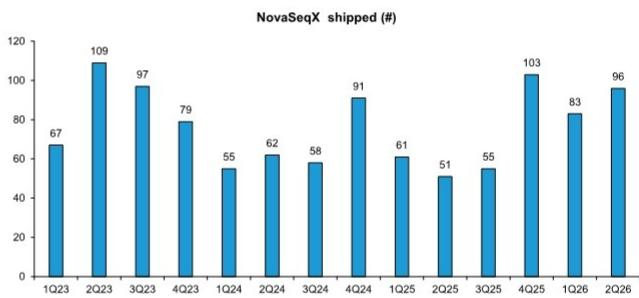

# 美国生命科学与诊断行业：Illumina公司研究更新

**评级：与市场同步**

**目标报价：215.00美元（原185.00美元）**

**估算调整**

Eve Burstein  
+1 917 344 8313  
eve.burstein@bernsteinsg.com

Louisa Qiu  
+1 917 344 8495  
louisa.qiu@bernsteinsg.com

**专业销售**

Christian Moore  
+1 917 344 8555  
christian.moore@bernsteinsg.com

## Illumina 2026年第二季度：把握临床应用的浪潮

Illumina于周四市场收盘后公布了2026年第二季度业绩。营收为11.59亿美元，较市场一致预期的11.10亿美元高出4%；每股收益1.31美元，较一致预期的1.23美元高出7%。公司上调了2026财年营收指引至46.0亿至46.4亿美元（此前为45.2亿至46.2亿美元），除中国以外地区有机增长上调至5%以上（此前为2%至4%），每股收益中值上调约0.13美元。

NovaSeq X的装机量无疑是本季度的亮点；超过95台的装机量较第一季度的83台实现了可观的环比增长。值得注意的是，这些装机中约70%来自临床客户（尽管在当前融资环境下，我们原本不会预期研究领域有太多装机）。可以想见，其中许多采购来自诊断领域的参与者，他们期望大幅扩展现有检测项目（例如Guardant扩展Shield和Reveal）。但同样可以想见，其中一部分流向了临床研发领域——这或许表明客户在考虑了其他主要新进入者的定价和性能之后，正在重新选择Illumina。

临床耗材的“断崖”已转变为……可供驾驭的“浪潮”？此前存在一种担忧：当临床客户从6000系列转向X系列时，他们很快会降低每个样本的支出，但不会相应增加通量，导致收入出现“断崖式”下滑。然而，临床转型的很大一部分已经完成：第二季度X系列占高通量测序碱基出货量的79%，占高通量耗材收入的59%。随着临床耗材增长保持强劲（除中国以外地区增长15%，美国增长超过20%……尽管看空者可能会指出第一季度除中国以外地区增长为20%），这一风险的说服力持续减弱。首席执行官Jacob Thaysen表示：“这不是断崖，而是浪潮。我们正在驾驭它。”

## 研究启示

我们对本次财报的乐观程度较此前有所提升。然而，市场在财报发布前的乐观程度已高于我们（过去一个月报价上涨16.6%，当日上涨5.3%），因此我们可能不会看到太大的反应（盘后交易下跌1%）。我们维持“与市场同步”评级。基于上调的估算和当前2026年水平的倍数（EV/EBITDA从22倍上调至2027年25倍，市盈率从34倍上调至2027年40倍），我们将目标报价上调至215美元。加权平均资本成本9.25%和3%的永续增长率保持不变。模型：ILMN公司模型

<table><tr><td>收盘日期</td><td>2026年7月30日</td></tr><tr><td>ILMN收盘价（美元）</td><td>205.09</td></tr><tr><td>目标报价（美元）</td><td>215.00</td></tr><tr><td>上行/（下行）空间</td><td>5%</td></tr><tr><td>52周区间</td><td>205.47/88.00</td></tr><tr><td>SPX</td><td>7,437.63</td></tr><tr><td>财年截止</td><td>12月</td></tr><tr><td>股息率</td><td>不适用</td></tr><tr><td>市值（百万美元）</td><td>31,030</td></tr><tr><td>企业价值（百万美元）</td><td>32,339</td></tr></table>

<table><tr><td>表现</td><td>年初至今</td><td>1个月</td><td>6个月</td><td>12个月</td></tr><tr><td>相对表现（%）</td><td>56.4</td><td>16.6</td><td>41.6</td><td>92.3</td></tr><tr><td>SPX（%）</td><td>8.6</td><td>(0.8)</td><td>7.2</td><td>16.9</td></tr><tr><td>相对表现（%）</td><td>47.7</td><td>17.5</td><td>34.4</td><td>75.4</td></tr></table>

来源：彭博社、Bernstein估算与分析。

一年期报价表现  

<table><tr><td>调整后每股收益</td><td>F25A</td><td>F26E</td><td>F27E</td><td>财务数据</td><td>F25A</td><td>F26E</td><td>F27E</td><td>复合年增长率</td><td>估值指标</td><td>F25A</td><td>F26E</td><td>F27E</td></tr><tr><td>ILMN（美元）</td><td>4.86</td><td>5.34</td><td>6.14</td><td>营收（百万）</td><td>4,343</td><td>4,632</td><td>4,937</td><td>--</td><td>调整后市盈率（倍）</td><td>42.2</td><td>38.4</td><td>33.4</td></tr><tr><td>原值</td><td>--</td><td>5.22</td><td>5.94</td><td></td><td></td><td></td><td></td><td></td><td></td><td></td><td></td><td></td></tr></table>

来源：彭博社、Bernstein估算与分析。

## 详细内容

## 季度表现

以下为Illumina第二季度业绩与一致预期及Bernstein估算的对比（图表1），以及业绩与第二季度指引的对比（图表2）。

图表1：ILMN季度业绩与一致预期及Bernstein估算对比

<table><tr><td colspan="6">当前季度：2026年第二季度</td><td colspan="2">同比比较：2025年第二季度</td><td colspan="2">环比比较：2026年第一季度</td></tr><tr><td></td><td>实际</td><td>一致预期</td><td>实际vs一致预期</td><td>Bernstein</td><td>实际vs Bernstein</td><td>实际</td><td>同比变化</td><td>实际</td><td>环比变化</td></tr><tr><td>产品</td><td>982</td><td>965</td><td>2%</td><td>968</td><td>1%</td><td>912</td><td>8%</td><td>917</td><td>7%</td></tr><tr><td>耗材</td><td>852</td><td>841</td><td>1%</td><td>846</td><td>1%</td><td>811</td><td>5%</td><td>797</td><td>7%</td></tr><tr><td>仪器</td><td>130</td><td>123</td><td>6%</td><td>123</td><td>6%</td><td>101</td><td>29%</td><td>120</td><td>8%</td></tr><tr><td>服务及其他</td><td>177</td><td>165</td><td>7%</td><td>162</td><td>9%</td><td>147</td><td>20%</td><td>174</td><td>2%</td></tr><tr><td>利润表（调整后）</td><td></td><td></td><td></td><td></td><td></td><td></td><td></td><td></td><td></td></tr><tr><td>营收</td><td>1,159</td><td>1,110</td><td>4%</td><td>1,131</td><td>2%</td><td>1,059</td><td>9%</td><td>1,091</td><td>6%</td></tr><tr><td>销售成本</td><td>369</td><td>349</td><td>6%</td><td>363</td><td>2%</td><td>324</td><td>14%</td><td>347</td><td>6%</td></tr><tr><td>毛利润</td><td>790</td><td>761</td><td>4%</td><td>768</td><td>3%</td><td>735</td><td>7%</td><td>744</td><td>6%</td></tr><tr><td>毛利率</td><td>68.2%</td><td>68.6%</td><td>-0.4个百分点</td><td>67.9%</td><td>0.3个百分点</td><td>69.4%</td><td>-1.2个百分点</td><td>68.2%</td><td>0.0个百分点</td></tr><tr><td>销售及管理费用</td><td>278</td><td>270</td><td>3%</td><td>263</td><td>6%</td><td>241</td><td>15%</td><td>267</td><td>4%</td></tr><tr><td>研发费用</td><td>252</td><td>252</td><td>0%</td><td>253</td><td>0%</td><td>243</td><td>4%</td><td>239</td><td>5%</td></tr><tr><td>营业利润</td><td>260</td><td>251</td><td>3%</td><td>251</td><td>3%</td><td>252</td><td>3%</td><td>239</td><td>9%</td></tr><tr><td>营业利润率</td><td>22.5%</td><td>22.1%</td><td>0.4个百分点</td><td>22.2%</td><td>0.3个百分点</td><td>23.8%</td><td>-1.3个百分点</td><td>21.9%</td><td>0.6个百分点</td></tr><tr><td>所得税</td><td>52</td><td>48</td><td>8%</td><td>49</td><td>7%</td><td>54</td><td>-4%</td><td>46</td><td>13%</td></tr><tr><td>净利润</td><td>201</td><td>189</td><td>6%</td><td>188</td><td>7%</td><td>187</td><td>7%</td><td>177</td><td>14%</td></tr><tr><td>每股收益（摊薄）</td><td>1.31</td><td>1.23</td><td>7%</td><td>1.22</td><td>7%</td><td>1.19</td><td>10%</td><td>1.15</td><td>14%</td></tr><tr><td>摊薄股数</td><td>153</td><td>154</td><td>0%</td><td>153</td><td>0%</td><td>157</td><td>-3%</td><td>154</td><td>-1%</td></tr></table>

来源：公司报告、彭博社、Bernstein分析与估算

图表2：ILMN季度业绩与指引对比

<table><tr><td></td><td>实际</td><td>2026年第二季度指引</td></tr><tr><td>总营收</td><td>11.6亿美元</td><td>11.2亿至11.4亿美元</td></tr><tr><td>报告营收增长</td><td>9.50%</td><td>6%至8%</td></tr><tr><td>除中国以外地区有机增长</td><td>8.10%</td><td>4%至6%</td></tr><tr><td>非GAAP营业利润率</td><td>22.5%</td><td>约22%</td></tr><tr><td>非GAAP每股收益</td><td>1.31美元</td><td>1.20至1.25美元</td></tr></table>

来源：公司报告、Bernstein分析

## 指引

Illumina上调了2026财年指引；关键指标见2026财年图表3和2026年第三季度图表4，补充说明如下。

图表3：ILMN财年指引

<table><tr><td>截至的2026财年指引</td><td>2026年第二季度</td><td>2026年第一季度</td><td>2025年第四季度</td></tr><tr><td>营收</td><td>46.0亿至46.4亿美元</td><td>45.2亿至46.2亿美元</td><td>45.0亿至46.0亿美元</td></tr><tr><td>报告营收增长</td><td>未重申</td><td>4%至6%</td><td>4%至6%</td></tr><tr><td>除中国以外地区有机增长</td><td>>5%</td><td>2%至4%</td><td>2%至4%</td></tr><tr><td>大中华区营收</td><td>未重申</td><td>未重申</td><td>2.1亿至2.2亿美元</td></tr><tr><td>非GAAP营业利润率</td><td>23.4%至23.6%</td><td>23.4%至23.6%</td><td>23.3%至23.5%</td></tr><tr><td>测序仪器（固定汇率，除中国以外）</td><td>+低个位数</td><td>持平至+低个位数</td><td>-低个位数至持平</td></tr><tr><td>测序耗材（固定汇率，除中国以外）</td><td>+中个位数</td><td>+低个位数至+中个位数</td><td>+低个位数至+中个位数</td></tr><tr><td>非GAAP税率</td><td>未重申</td><td>未重申</td><td>20.5%</td></tr><tr><td>非GAAP摊薄每股收益</td><td>5.30至5.40美元</td><td>5.15至5.30美元</td><td>5.05至5.20美元</td></tr></table>

来源：公司报告、Bernstein分析

## 图表4：ILMN 2026年第三季度指引

<table><tr><td></td><td>2026年第三季度指引</td></tr><tr><td>总营收</td><td>11.4亿至11.6亿美元</td></tr><tr><td>报告营收增长</td><td>未提供</td></tr><tr><td>除中国以外地区有机增长</td><td>约4.5%</td></tr><tr><td>ILMN有机增长</td><td>约4.5%</td></tr><tr><td>非GAAP营业利润率</td><td>约24%</td></tr><tr><td>非GAAP每股收益</td><td>1.33至1.38美元</td></tr></table>

来源：公司报告、Bernstein分析

## 指引补充说明

## 2026年下半年

- NovaSeq X装机量预计在2026年下半年保持较高水平，同比增速将有所放缓。
- 耗材增长预计保持稳定，而季度间波动可能来自仪器装机，预计2026年下半年仍将保持较高水平，但自2025年下半年起已处于高位。
- 2026年第三季度预计反映常规季节性，第四季度仍将是公司全年最大的季度。
- 2026年第四季度的额外销售周预计将为2026财年营收增长贡献约50个基点，主要通过耗材实现。

## 2026财年及以后

- 临床测序耗材增长预计为中等两位数，而研究与应用耗材预计在2026财年下降中至高个位数。
- 近期NovaSeq X装机的出色表现预计将为2026财年耗材营收带来适度贡献，大部分收益将在2027财年体现，因为临床客户通常需要至少六至九个月才能达到常态化的耗材拉动水平。
- 继续以2027财年高个位数营收增长为目标，其中包括来自新产品的1至2个百分点贡献。

## 电话会议及回访评论

## 测序结果

- 装机超过95台NovaSeq X仪器，得益于大型临床客户的多个多单元产能扩展订单，包括与新临床试验相关的订单。在回访中，管理层表示未看到仪器订单的提前采购现象。
- 约70%的NovaSeq X装机为临床客户，30%为研究客户。
- 在回访中，管理层指出，由于转型已基本完成，大多数X系列研究装机为增量需求（而非6000系列的升级）。约50%的临床装机为增量需求（而非6000系列的升级），报销、新试验和产能扩展是需求驱动因素。
- 装机超过10台NovaSeq 6000，部分客户预计将在该平台上继续使用多年。现有的已上市临床检测在替换过程中更可能继续使用NovaSeq 6000，而新检测更可能在NovaSeq X上启动。
- 测序耗材同比增长5%，主要受高通量通量驱动，因为NovaSeq X装机基础扩大且拉动效应增强。
- 临床耗材除中国以外地区增长15%，其中美国-加拿大增长超过20%，约占测序耗材收入的65%。中东和拉丁美洲的偏弱表现导致第二季度除中国以外地区增长放缓至15%，而第一季度为20%。
- 研究与应用耗材除中国以外地区同比下降7%，但环比改善9%。管理层表示，现在判断终端市场复苏仍为时过早。
- NovaSeq X约占高通量测序通量的83%和高通量耗材收入的59%，平台上约78%的临床通量。临床通量转化率预计到2026年底将达到80%至85%。
- 肿瘤学仍是领先的临床应用。治疗选择在金额上仍占较大比重，而微小残留病检测开始带来增长动力；罕见病、筛查和无创产前检测也持续增长。
- 低通量需求保持强劲，受MiSeq i100支持，而中通量需求仍较为温和，因其对宏观环境较为敏感。

## 其他评论

- 研究客户在融资不确定性下仍保持谨慎。美国资金拨付和报价活动在2026年第二季度末有所改善，但现在判断复苏仍为时过早。
- 定价更加理性，多包装和多盒耗材订单的折扣有限，但没有广泛的降价。战略领域和大批量机会仍可提供投资性装机。
- Billion Cell Atlas开始产生收入，已交付超过3亿个细胞，拥有六家生物制药合作伙伴，支持人工智能驱动的药物发现和预测性生物学模型。
- 内存和运费成本上升影响了2026年第二季度，但Illumina已确保未来几个季度的关键组件供应，并通过定价和运营效率应对通胀。
- 以平均每股129.07美元回购90万股，耗资1.22亿美元。截至2026年第二季度末，现有回购授权下剩余约18亿美元，并计划继续择机回购。
- 产生1.62亿美元自由现金流；经营现金流受到税款支付时点和为保障关键组件而进行的库存采购的影响。

## 模型更新

## 图表5：ILMN模型更新

<table><tr><td></td><td>2026年第三季度E</td><td>2026年第四季度E</td><td>2026财年E</td><td>2027财年E</td><td>2028财年E</td></tr><tr><td>营收（核心）</td><td>1,152</td><td>1,229</td><td>4,632</td><td>4,937</td><td>5,312</td></tr><tr><td>原值</td><td>1,127</td><td>1,222</td><td>4,571</td><td>4,813</td><td>5,135</td></tr><tr><td>差异</td><td>2%</td><td>1%</td><td>1%</td><td>3%</td><td>3%</td></tr><tr><td colspan="6"></td></tr><tr><td>仪器</td><td>111</td><td>145</td><td>506</td><td>467</td><td>472</td></tr><tr><td>原值</td><td>102</td><td>146</td><td>490</td><td>460</td><td>465</td></tr><tr><td>差异</td><td>9%</td><td>-1%</td><td>3%</td><td>1%</td><td>1%</td></tr><tr><td>耗材</td><td>861</td><td>892</td><td>3,402</td><td>3,723</td><td>4,069</td></tr><tr><td>原值</td><td>852</td><td>890</td><td>3,384</td><td>3,634</td><td>3,927</td></tr><tr><td>差异</td><td>1%</td><td>0%</td><td>1%</td><td>2%</td><td>4%</td></tr><tr><td>核心营业利润率</td><td>24%</td><td>26%</td><td>24%</td><td>25%</td><td>26%</td></tr><tr><td>原值</td><td>24%</td><td>25%</td><td>24%</td><td>25%</td><td>26%</td></tr><tr><td>差异</td><td>0%</td><td>0%</td><td>0%</td><td>0%</td><td>0%</td></tr><tr><td colspan="6"></td></tr><tr><td>摊薄每股收益</td><td>1.36</td><td>1.52</td><td>5.34</td><td>6.14</td><td>6.99</td></tr><tr><td>原值</td><td>1.34</td><td>1.51</td><td>5.22</td><td>5.94</td><td>6.71</td></tr><tr><td>差异</td><td>2%</td><td>1%</td><td>2%</td><td>3%</td><td>4%</td></tr></table>

来源：公司报告、Bernstein分析与估算

## 历史数据

图表6：Illumina核心营收  
  
来源：公司报告、Bernstein分析

图表7：Illumina耗材与仪器营收  
  
来源：公司报告、Bernstein分析

图表8：Illumina核心营业利润率  
  
来源：公司报告、Bernstein分析

图表9：NovaSeq X出货量  
  
我们根据Illumina报告的2026年第二季度“超过95台”装机量，估算NovaSeq X装机量为96台。来源：公司报告、Bernstein分析

## 附录——财务预测

图表10：ILMN营收与利润表

<table><tr><td>营收（百万美元）</td><td>2018</td><td>2019</td><td>2020</td><td>2021</td><td>2022</td><td>2023</td><td>2024</td><td>2025</td><td>2026E</td><td>2027E</td><td>2028E</td></tr><tr><td>耗材</td><td>2,177</td><td>2,392</td><td>2,304</td><td>3,217</td><td>3,246</td><td>3,106</td><td>3,170</td><td>3,227</td><td>3,402</td><td>3,723</td><td>4,069</td></tr><tr><td>同比增速</td><td></td><td>9.9%</td><td>(3.7%)</td><td>39.6%</td><td>0.9%</td><td>(4.3%)</td><td>2.1%</td><td>1.8%</td><td>5.4%</td><td>9.4%</td><td>9.3%</td></tr><tr><td>仪器</td><td>572</td><td>537</td><td>431</td><td>751</td><td>729</td><td>706</td><td>501</td><td>482</td><td>506</td><td>467</td><td>472</td></tr><tr><td>同比增速</td><td></td><td>(6.1%)</td><td>(19.7%)</td><td>74.2%</td><td>(2.9%)</td><td>(3.2%)</td><td>(29.0%)</td><td>(3.8%)</td><td>5.0%</td><td>(7.7%)</td><td>1.0%</td></tr><tr><td>服务及其他</td><td>584</td><td>614</td><td>504</td><td>558</td><td>578</td><td>626</td><td>661</td><td>634</td><td>724</td><td>747</td><td>772</td></tr><tr><td>同比增速</td><td></td><td>5.1%</td><td>(17.9%)</td><td>10.7%</td><td>3.6%</td><td>8.3%</td><td>5.6%</td><td>(4.1%)</td><td>14.2%</td><td>3.3%</td><td>3.3%</td></tr><tr><td>总营收</td><td>3,333</td><td>3,543</td><td>3,239</td><td>4,526</td><td>4,553</td><td>4,438</td><td>4,332</td><td>4,343</td><td>4,632</td><td>4,937</td><td>5,312</td></tr><tr><td>同比增速</td><td></td><td>6.3%</td><td>(8.6%)</td><td>39.7%</td><td>0.6%</td><td>(2.5%)</td><td>(2.4%)</td><td>0.3%</td><td>6.6%</td><td>6.6%</td><td>7.6%</td></tr></table>

<table><tr><td>利润表，合并，非GAAP</td><td>2018</td><td>2019</td><td>2020</td><td>2021</td><td>2022</td><td>2023</td><td>2024</td><td>2025</td><td>2026E</td><td>2027E</td><td>2028E</td></tr><tr><td>总净销售额</td><td>3,333</td><td>3,543</td><td>3,239</td><td>4,518</td><td>4,552</td><td>4,438</td><td>4,332</td><td>4,343</td><td>4,632</td><td>4,937</td><td>5,312</td></tr><tr><td>销售成本</td><td>998</td><td>1,042</td><td>1,008</td><td>1,301</td><td>1,439</td><td>1,520</td><td>1,384</td><td>1,379</td><td>1,459</td><td>1,518</td><td>1,562</td></tr><tr><td>毛利润</td><td>2,335</td><td>2,501</td><td>2,231</td><td>3,217</td><td>3,113</td><td>2,918</td><td>2,973</td><td>2,964</td><td>3,173</td><td>3,419</td><td>3,750</td></tr><tr><td>销售及管理费用</td><td>785</td><td>781</td><td>796</td><td>1,140</td><td>1,069</td><td>1,016</td><td>1,069</td><td>1,009</td><td>1,084</td><td>1,132</td><td>1,218</td></tr><tr><td>研发费用</td><td>623</td><td>644</td><td>680</td><td>989</td><td>996</td><td>1,001</td><td>982</td><td>950</td><td>997</td><td>1,046</td><td>1,120</td></tr><tr><td>营业利润</td><td>927</td><td>1,076</td><td>755</td><td>1,088</td><td>1,050</td><td>899</td><td>922</td><td>1,004</td><td>1,090</td><td>1,237</td><td>1,407</td></tr><tr><td>净利息及其他费用</td><td>28</td><td>63</td><td>130</td><td>(17)</td><td>27</td><td>(37)</td><td>(51)</td><td>(54)</td><td>(62)</td><td>(48)</td><td>(48)</td></tr><tr><td>税前利润</td><td>955</td><td>1,139</td><td>885</td><td>1,071</td><td>1,077</td><td>862</td><td>868</td><td>950</td><td>1,028</td><td>1,189</td><td>1,359</td></tr><tr><td>税费</td><td>150</td><td>175</td><td>224</td><td>187</td><td>118</td><td>228</td><td>206</td><td>195</td><td>211</td><td>250</td><td>285</td></tr><tr><td>归属于少数股东权益的净利润</td><td>44</td><td>12</td><td>-</td><td>-</td><td>-</td><td>-</td><td>-</td><td>-</td><td>-</td><td>-</td><td>-</td></tr><tr><td>净利润</td><td>849</td><td>976</td><td>661</td><td>884</td><td>959</td><td>634</td><td>662</td><td>756</td><td>817</td><td>939</td><td>1,074</td></tr><tr><td>调整后EBITDA</td><td>1,067</td><td>1,227</td><td>911</td><td>1,264</td><td>1,250</td><td>1,119</td><td>1,131</td><td>1,207</td><td>1,304</td><td>1,464</td><td>1,652</td></tr><tr><td colspan="12"></td></tr><tr><td>调整后摊薄每股收益</td><td>5.72</td><td>6.57</td><td>4.50</td><td>5.85</td><td>6.11</td><td>4.00</td><td>4.16</td><td>4.86</td><td>5.34</td><td>6.14</td><td>6.99</td></tr><tr><td>摊薄股数（百万）</td><td>149</td><td>149</td><td>148</td><td>151</td><td>157</td><td>158</td><td>159</td><td>156</td><td>153</td><td>153</td><td>154</td></tr><tr><td colspan="12"></td></tr><tr><td colspan="12">利润率分析，调整后利润表</td></tr><tr><td>毛利率</td><td>70.1%</td><td>70.6%</td
