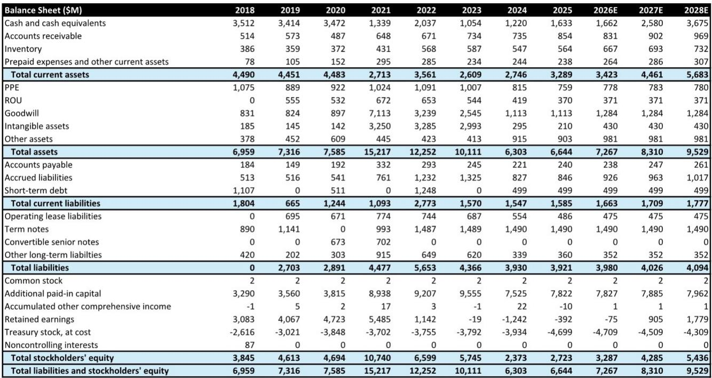
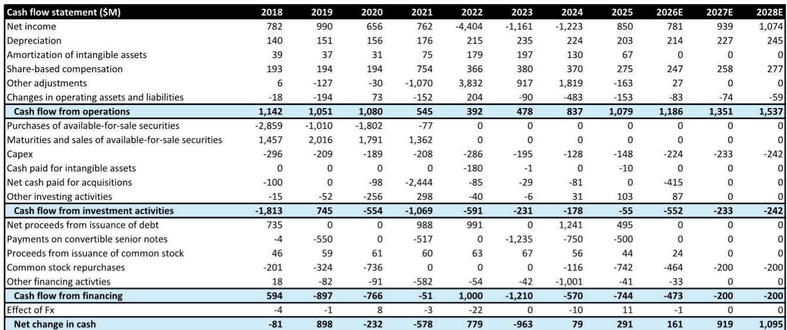
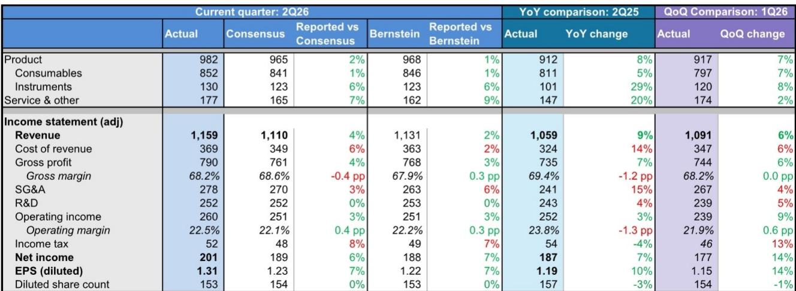

# 临床业务增长趋势明确，市场定价已有所反映

Illumina 2026年第二季度业绩不仅超出预期，更标志着业务叙事的转变。季度收入11.59亿美元，较市场一致预期高出4%；每股收益1.31美元，较预期高出7%。公司同时上调全年收入指引至46.0至46.4亿美元，非GAAP每股收益指引上调至5.30至5.40美元。最受关注的指标是NovaSeq X的装机数量：当季超过95台，较第一季度的83台环比显著提升，其中70%流向临床客户。这有力地表明，此前市场担忧的“临床耗材断崖”——即客户从NovaSeq 6000转向X平台后单样本付费降低、且用量未能提升的情形——并未出现。相反，平台迁移正在成为推动收入增长的浪潮，而非侵蚀价值的滑坡。

这一结果之所以重要，是因为过去两年Illumina的研究逻辑一直呈现分化态势。一方面，研究市场持续承压，美国资金环境的不确定性抑制了需求；另一方面，临床基因组学在肿瘤学、治疗选择和微小残留病检测的推动下快速扩张。核心问题始终在于：临床业务的扩张能否抵消研究业务的收缩以及平台转换带来的价格拖累。第二季度的数据给出了明确答案：可以——但市场已开始将这一预期计入定价。

公司股价年初至今上涨56.4%，过去十二个月累计上涨92.3%，大幅跑赢同期标普500指数8.6%和16.9%的回报表现。财报发布当日股价上涨5.3%，但盘后交易回落1%，表明利好消息在很大程度上已被市场提前消化。这是读者面临的核心张力：经营面持续改善，但估值已逐步跟上基本面。问题已不再是Illumina能否执行到位，而是当前报价是否已充分反映其执行成果。

## NovaSeq X装机量攀升是需求信号，而非单纯的出货数字

第二季度超过95台的NovaSeq X装机量，较第一季度的83台呈现明显加速，而装机构成比数量本身更具参考价值。管理层表示，其中70%流向临床客户，其余30%进入研究场景。在当前仍偏谨慎的资金环境下，研究端的装机更可能是增量订单而非替换需求。管理层指出，研究客户从NovaSeq 6000向X的迁移已基本完成，因此该领域新增的X装机大多是在扩充存量设备基础，而非替换旧机型。

临床端的装机情况则更为细致。管理层估计，临床X装机中约50%属于增量，其余一半是从6000升级而来。这并非负面信号，而是反映出：现有已上市的临床检测在设备替换期间更倾向于继续使用6000平台，而新开发的检测项目则更可能直接在X平台上推出。临床客户选择升级至X平台，本身就说明他们对自身的检测量和报销路径具备信心。装机中还包含来自大型临床客户的多台扩容订单，其中部分与新的临床试验相关。管理层明确表示未观察到设备订单的前置现象，这表明需求是自然增长，而非在涨价或产品变更前提前下单。

设备收入1.30亿美元，较一致预期高出6%，同比增长29%。这不仅是超预期的问题，更表明装机动能正在转化为实际收入。不过更重要的指标是装机之后的耗材拉动情况。临床客户通常需要六至九个月才能达到正常的耗材消耗水平，因此第二季度的装机主要将惠及2027财年收入，而非2026财年。管理层指引称，近期装机的超预期表现将为2026财年耗材收入带来适度贡献，大部分影响将在2027财年体现。这是经典的“剃刀与刀片”模式，而刀片收入正在开始流入。

装机结构的意義不仅限于短期收入影响。它表明Illumina正在临床平台迁移的竞争中占据优势。客户已有充分时间评估竞争平台的定价和性能，最终选择继续与Illumina合作。这是对公司技术路线图和临床合作伙伴关系在竞争压力下依然稳固的战略性验证。此外，超过10台NovaSeq 6000的装机也表明存量设备基础并未被放弃——部分客户预计将在6000平台上继续运行多年，这为X平台持续放量期间提供了稳定的收入底盘。

## 耗材“断崖”已成“浪潮”，结构变化方向有利

第二季度最重要的财务进展是临床耗材的持续强劲表现。除中国市场外，临床耗材同比增长15%，其中美加地区增速超过20%。这一增速较第一季度20%的增长有所放缓，但放缓的原因在于中东和拉美地区的表现，而非核心临床市场的恶化。临床耗材目前约占测序耗材收入的65%，较往年占比明显提升。这一结构变化至关重要，因为临床用量的可预测性更强，对资金周期的敏感度也低于研究用量。

NovaSeq X目前约占高通量测序量的83%，占高通量耗材收入的59%。平台上的临床用量转化率约为78%，管理层预计到2026年底将达到80%至85%。这是读者关注了两年的平台迁移进程。此前的担忧是：客户从6000转向X后，单样本付费降低而用量未能提升，从而形成收入断崖。当前数据则显示相反的情况：临床客户的用量增速快于单样本价格降幅，带来净耗材增长。

测序耗材整体同比增长5%，主要由高通量用量驱动，得益于X平台存量设备增加和耗材拉动率提升。除中国市场外，研究及应用耗材同比下降7%，但环比改善9%。管理层表示，现在判断研究终端市场复苏仍为时过早，但环比改善是积极信号。研究市场是过去一年多来拖累Illumina增长的主要因素，该领域若能企稳，将为整体增长提供显著助力。

耗材的故事不仅关乎总量，更关乎驱动总量的应用结构。肿瘤学仍是领先的临床应用领域，其中治疗选择在金额上占比更大，微小残留病检测则开始形成增长动能。罕见病、筛查和无创产前检测也持续增长。这种多元化布局降低了单一应用在报销或采用方面出现问题而影响整体临床增长故事的风险。MRD开始形成动能尤其值得关注，这是一个高增长、高产量的应用领域，有望在未来几年成为耗材收入的重要驱动因素。

## 定价纪律与新的竞争均衡

第二季度一个容易被低估的方面是定价环境。管理层指出，定价已变得更加有纪律，多包装和多盒耗材订单有适度折扣，但未出现全面降价。战略领域和大批量机会仍可提供投资性装机，但公司并未参与价格战。这与过去两年新进入者积极降价以争夺市场份额的竞争格局形成显著差异。

定价纪律表明竞争均衡已发生转变。Illumina的客户在评估替代平台后发现，包括迁移成本和存量设备可靠性在内的总拥有成本更倾向于继续选择Illumina。公司在保持定价的同时实现用量增长，这印证了基因组学市场固有的转换成本。一旦实验室完成平台验证并围绕其构建工作流程，转向竞争对手的成本是巨大的——不仅体现在资金上，还体现在时间和监管风险上。

定价纪律对毛利率也有积极意义。第二季度毛利率为68.2%，同比下降1.2个百分点，但环比持平。同比下降主要归因于内存和运费成本上升，管理层表示这些因素影响了第二季度。公司已锁定未来几个季度的关键零部件供应，并通过定价和运营效率来应对通胀压力。Illumina能够在不大幅流失用量的情况下传导部分成本上升，这再次体现了其定价能力。

这并不是说竞争已经消失。管理层承认，低通量需求依然强劲，得益于MiSeq i100的支持，而中通量需求则相对平淡，因其对宏观环境较为敏感。竞争压力可能在中通量领域最为激烈，该领域的客户对价格更敏感，可选方案也更多。但整体图景是一个趋于稳定的市场，Illumina守住了自身地位，并在临床领域甚至有所拓展。

## 研究市场趋于稳定，但复苏尚未确认

研究板块仍是Illumina展望中的关键不确定因素。第二季度除中国市场外，研究及应用耗材同比下降7%，较此前几个季度的两位数降幅有所改善。环比来看，研究耗材改善9%，这是数个季度以来首次有意义的环比改善。管理层表示，判断终端市场复苏仍为时过早，但数据表明最困难的阶段可能已经过去。

美国资金环境是研究需求的主要驱动因素。管理层指出，第二季度末资金拨付和报价活动有所改善，但判断复苏仍为时过早。NIH预算的不确定性一直是研究市场的持续拖累，虽然出现改善迹象，但资金环境仍存在波动。研究客户保持谨慎，这与更广泛的宏观环境一致——学术机构和政府实验室仍在应对预算不确定性。

研究市场的企稳之所以重要，有两个原因。第一，它消除了整体增长的一个显著逆风。如果研究耗材能够持平而非下降，Illumina的整体耗材增速将明显更高。第二，它影响NovaSeq X的装机结构。研究端装机比临床端更可能是增量，因此研究需求的复苏将带动额外的设备装机，并最终转化为耗材收入。

“十亿细胞图谱”是一项值得关注的新举措，有望支持研究需求。该计划在第二季度开始产生收入，已交付超过3亿个细胞，拥有六家生物制药合作伙伴。该计划支持AI驱动的药物发现和预测性生物学模型，有望推动研究及应用市场对高通量测序的需求。虽然目前收入贡献仍然较小，但它代表了一个可能扩大整体可及市场的新应用方向。

## 关于Illumina定位的决策框架

对于读者而言，第二季度的业绩为评估Illumina提供了一个清晰的框架。第一个问题是：你是否相信临床浪潮具有可持续性？数据支持乐观看法：临床耗材以中双位数速度增长，X平台存量设备持续扩张，结构正向肿瘤学和MRD等高价值应用倾斜。第二个问题是：研究市场是否会复苏？研究耗材的环比改善令人鼓舞，但管理层的谨慎态度表明全面复苏尚未确定。第三个问题是估值——当前报价已包含多少预期？按2026年预估每股收益5.34美元计算，市盈率约为28倍；按2027年预估每股收益6.14美元计算，市盈率约为33倍。这是一个溢价估值，其前提是公司能够持续兑现执行。

决策框架本质上是一个三情景分析。在乐观情景下，临床浪潮加速，研究市场企稳，公司实现高个位数收入增长并伴随营业利润率扩张。在该情景下，报价有望进一步上移，当前估值将显得合理。在基准情景下，临床增长维持中双位数，研究市场持平或小幅下降，公司兑现其给出的指引。在该情景下，报价处于合理水平，上行空间有限。在悲观情景下，临床增长因报销政策变化或竞争加剧而放缓，研究市场持续低迷。在该情景下，当前估值将被证明过高。

需要关注的核心指标是除中国外的临床耗材增速。如果该增速保持在15%以上，说明临床浪潮依然稳固。如果放缓至高个位数，则表明竞争压力超出预期。第二个需要关注的指标是研究耗材。如果环比改善持续，说明研究市场正在复苏；如果停滞，则逆风依然存在。第三个指标是NovaSeq X装机量。公司预计下半年装机量将保持较高水平，但同比增速将有所放缓。如果装机量超出预期，说明临床管线比预期更为强劲。

下半年指引提供了一份路线图。管理层预计第三季度收入为11.4至11.6亿美元，有机增长约4.5%。第四季度预计为全年最大季度，额外的一个销售周将为全年收入增长贡献约50个基点。营业利润率预计在第三季度提升至约24%，第四季度约26%，反映收入规模扩大带来的经营杠杆效应。全年非GAAP营业利润率指引为23.4%至23.6%，意味着下半年将看到有意义的利润率扩张。

长期展望同样具有建设性。管理层继续以2027财年高个位数收入增长为目标，其中1至2个百分点来自新产品。耗材增长预计将随着X平台存量设备成熟和临床客户达到正常耗材拉动水平而加速。研究市场若实现复苏，将提供额外上行空间。公司同时也在向股东返还资本，第二季度回购了90万股，金额1.22亿美元，现有授权下剩余约18亿美元。

投资结论是微妙的。Illumina执行良好，临床浪潮是真实的。公司已顺利度过平台迁移期而未出现收入断崖，竞争地位看似稳固。然而，报价已实现显著重估，当前估值容错空间有限。市场正在为执行力买单，而Illumina也确实在兑现。问题在于，这种兑现能否以支撑溢价估值的速度持续。证据表明可以，但安全边际较薄。读者可以基于临床增长故事持有该标的，但若研究市场未能复苏或竞争压力加剧，则需为波动做好准备。

战略层面的启示是：Illumina已成功将业务结构向临床应用转型，这一领域比研究业务周期性更弱、增长性更高。NovaSeq X平台现已成为高通量系统的主导者，耗材拉动率正按预期提升。定价环境稳定，竞争威胁并未如预期般显现。公司正在产生自由现金流，向股东返还资本，并投资于“十亿细胞图谱”等新应用。经营面强劲，指引反映了信心。风险在于报价已包含这一乐观预期，对新进入者而言上行空间有限。对于现有持有者而言，故事依然完整，但最轻松的收益阶段已经过去。

*仅供参考。部分内容可能基于原始材料由AI辅助生成、翻译、摘要或编辑，可能存在遗漏或错误。请独立核实。本文不构成投资、法律、税务、会计或其他专业建议。*

仅供参考。部分内容可能基于原始材料由AI辅助生成、翻译、摘要或编辑，可能存在遗漏或错误。请独立核实。本文不构成投资、法律、税务、会计或其他专业建议。

