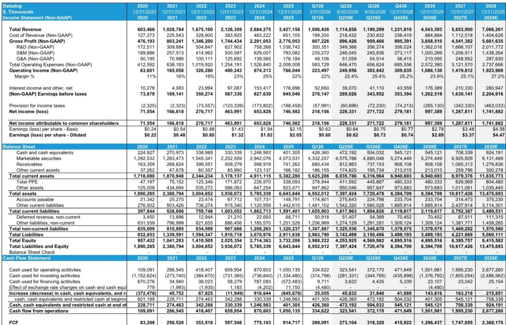
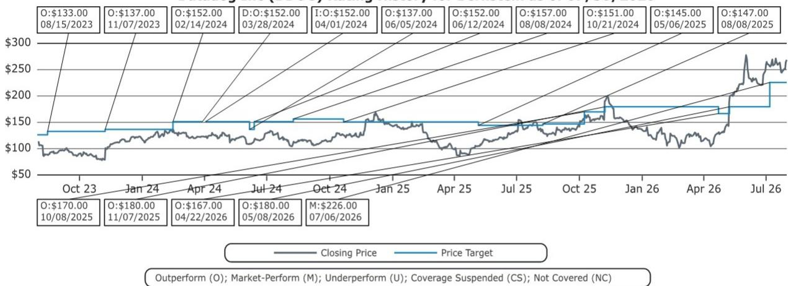

# AWS Q2 信号指向 Datadog 核心业务中个位数加速，但 Q4 基数效应比 AI 热潮更值得关注

AWS 在 Q2 实现了 36.7% 的同比增长，较上季度的 28.4% 明显提升，但这一整体增速对于评估 Datadog 近期收入轨迹而言，可能带来一些干扰。增长的主要部分来自 AI 相关收入——AWS 披露其年化运行率已超过 250 亿美元，而 Q1 为 150 亿美元以上。剔除 AI 部分后，AWS 核心云消费的环比增长大约在 6% 左右——这是一个稳健但并不突出的结果，与我们此前发布的 Datadog 模型预期基本一致。

这一区分之所以重要，是因为 Datadog 的收入结构并非同质化。核心企业客户——即消费模式与传统云工作负载相关的客户——约占 Datadog 收入的 85%。其余约 15% 来自“原生 AI”客户，而该部分中超过一半集中在两家最大的 AI 实验室。对于试图区分可持续增长与 AI 驱动波动的观察者而言，AWS 剔除 AI 后的信号是最清晰的领先指标，它传递的信息很明确：Datadog 核心收入增长在当前季度将进一步抬升，但第四季度面临的基数效应问题，是任何程度的 AI 热度都无法平滑的。

市场已给予 Datadog 反映 AI 叙事的溢价估值。该股年初至今上涨 97.5%，而标普 500 同期上涨 8.6%，目前交易价格约为前瞻调整后盈利的 100 倍、前瞻销售额的 20 倍。问题在于基本面信号是否支撑这一重新定价。基于 AWS 的读出来看，答案是复杂的：近期核心业务加速是真实的，但进入 Q4 的格局比股价动能所暗示的更为脆弱。

## AWS 剔除 AI 后的信号是 Datadog 核心业务最清晰的领先指标，并确认 Q3 增长将上一个台阶

AWS 消费与 Datadog 核心收入之间的关系并非巧合，而是结构性的。Datadog 的可观测性平台深度嵌入 AWS 生态系统，其基于使用量的定价模式意味着收入确认与客户云基础设施消费之间存在大约一个季度的滞后。AWS 的网络指标——特别是我们追踪的单点登录流量模式——可作为客户活动的代理变量，与 Datadog 收入增长的相关系数约为 0.9 中段。这一统计关系足够强，具有参考价值，尽管仍存在一定误差空间。

AWS Q2 剔除 AI 后的环比增长约 6%，与 Datadog 核心收入增长进一步抬升约 100 个基点的判断一致。我们的模型估计上季度核心增长约为 26.0%，而 AWS 信号指向本季度增长在 27% 低段至中段。这不是戏剧性的加速，但却是实质性的，并且与“Datadog 增长完全依赖 AI 工作负载”的说法相反。核心业务正在凭借自身基本面重新加速，驱动因素来自传统企业客户云消费模式的改善。

这一加速的时点值得注意。Q2 网络指标显示季度后半段增长趋于平稳，但这一相对疲软是相对于异常强劲的 4 月而言。当前消费轨迹仍高于 2025 年同期水平——2025 年因相关因素干扰，直到季度后期才有所恢复。2025 年低基数效应为 Q3 收入确认提供了顺风，为 Datadog 核心增长带来了尚未完全反映在一致预期中的额外提振。

## Q4 基数效应是真正的风险点，且起点已经偏弱

如果说 Q3 是好消息，那么 Q4 就是复杂因素。预示 Q3 加速的同一组网络指标，也提示 Q4 面临近 200 个基点的同比增长压力。这不是对基本面恶化的预测，而是由比较基数决定的数学必然性。去年同期基数异常强劲，而当前季度的起点相对于这一高基数偏弱。

7 月数据说明了这一挑战。该月起点低于往年同期，反映了 Q2 持续存在的偏弱状态。虽然轨迹与 2025 年模式相似——在 7 月 4 日假期后改善并从疲弱起点追赶——但模型假设这一追赶将产生接近或略高于 2023 年水平、但仍低于 2025 年的环比增长。这一结果将在 Q4 收入确认时转化为显著的同比增长压力。

这类细节在 AI 叙事中容易被忽略。市场关注的是 Datadog 对 AI 基础设施投入的敞口——这是真实且不断增长的——但核心业务仍贡献了大部分收入，并为增长轨迹定下基调。Q4 核心增长面临 200 个基点的压力将在报告数据中清晰可见，即使 AI 收入继续快速增长。问题在于观察者会将其视为暂时的基数效应还是增长放缓的信号——答案将取决于管理层如何表述指引。

## AI 收入板块真实存在但高度集中，且会干扰信号解读

Datadog 约 15% 的收入来自原生 AI 客户，这是一把双刃剑。一方面，它提供了核心业务所不具备的增量增长引擎。另一方面，它高度集中——该板块超过一半由两家最大的 AI 实验室驱动——这种集中带来了与多元化核心客户群不同类型的风险。

AWS 披露 AI 收入在 Q2 达到超过 250 亿美元的年化运行率（Q1 为 150 亿美元以上），表明 AI 基础设施投入的增速超过了核心云市场。Datadog 凭借其可观测性平台作为现代云原生应用监控的事实标准，有能力获取这部分投入的份额。但集中风险是真实的：如果两家最大的 AI 实验室中任何一家放缓支出、优化使用或内部化可观测性能力，对 Datadog AI 相关收入的影响将是即时且实质性的。

读出模型的潜在误差在数百万美元级别，我们认为更可能偏向上行，但更大的不确定性在于 AI 板块能否以足以抵消核心业务任何放缓的速度继续增长。AWS 数据表明 AI 投入仍在加速，但 Q4 的基数效应问题适用于核心业务而非 AI 板块。两个增长引擎处于不同轨迹，报告数据将反映两者的混合结果。

## 估值已计入完美执行情景，容错空间有限

Datadog 的股价在过去一年经历了显著重新定价，当前估值几乎没有容错空间。以约 100 倍前瞻调整后盈利和 20 倍前瞻销售额计算，市场正在为一个核心业务持续再加速、AI 板块保持快速增长、运营利润率向 25% 中段扩张的情景定价。我们的估计显示非 GAAP 运营利润率将从 2025 年的 22.4% 升至 2026 年的 23.9% 和 2027 年的 25.1%——这是一个合理的轨迹，但并不足以支撑激进的倍数扩张。

这一差距反映了对增长轨迹可持续性的根本性分歧。市场在为持续加速买单；我们的分析表明 Q4 的基数效应将使这一目标难以实现。该股年初至今 97.5% 的涨幅已消化了大部分利好，对于未针对潜在 Q4 失望情绪做好布局的读者而言，风险回报特征已不对称。

2025 年实际数据对应的调整后市盈率为 130.7 倍，2026 年预估为 100.0 倍，表明市场正在透过近期盈利看向更长期的增长故事。对于拥有 Datadog 这样竞争地位和市场机会的公司而言，这是合理的方法，但要求公司完美执行。AWS 的读出表明 Q3 执行在轨道上，但 Q4 的格局更具挑战性，而当前估值似乎并未反映这一风险。

## 围绕 Q4 基数效应进行布局的决策框架

对于试图把握未来两个季度的观察者而言，AWS 网络指标提供了一个校准预期的实用框架。第一步是将核心业务与 AI 板块分开，各自独立评估。核心业务应基于 AWS 剔除 AI 后的消费（滞后一个季度）进行建模，而 AI 板块应基于已披露的 AI 基础设施投入趋势进行建模。将两者混合会掩盖底层动态，导致判断偏差。

第二步是认识到 Q3 可能是积极因素——核心增长抬升至 27% 低段至中段——而 Q4 可能是消极因素——面临近 200 个基点的同比增长压力。市场会对增长的环比变化做出反应，而非相对水平，Q4 的增速回落可能触发估值压缩，即使底层业务保持健康。观察者需要考虑是穿越这一过渡期还是围绕其进行布局。

第三步是监测 7 月和 8 月的网络指标，判断 Q4 起点相对于模型假设是在改善还是恶化。当前轨迹假设一个“正常”的环比增长季度，这将产生我们概述的 Q4 压力。如果数据显著改善，压力可能小于预期；如果恶化，压力可能更大。该模型是方向性的而非精确的，数百万美元的潜在误差更可能偏向上行，但相对于 200 个基点的关键摆动，这一误差幅度较小。

最后一步是权衡 AI 板块的集中风险与核心业务的多元化。两家最大的 AI 实验室在 Datadog AI 相关收入中占有重要份额，其支出任何放缓都将对报告数据产生超比例影响。相比之下，核心业务分散在数千家企业客户中，其再加速是持久需求的更可靠信号。Datadog 的研究逻辑在于核心业务持续改善，同时 AI 板块提供增量上行空间——AWS 的读出在 Q3 支持这一论点，但对 Q4 而言并非没有保留。

*仅供参考。部分内容可能基于原始材料由 AI 辅助生成、翻译、摘要或编辑，可能包含遗漏或错误。请独立核实。本文不构成投资、法律、税务、会计或其他专业建议。*

仅供参考。部分内容可能基于原始材料由 AI 辅助生成、翻译、摘要或编辑，可能包含遗漏或错误。请独立核实。本文不构成投资、法律、税务、会计或其他专业建议。

