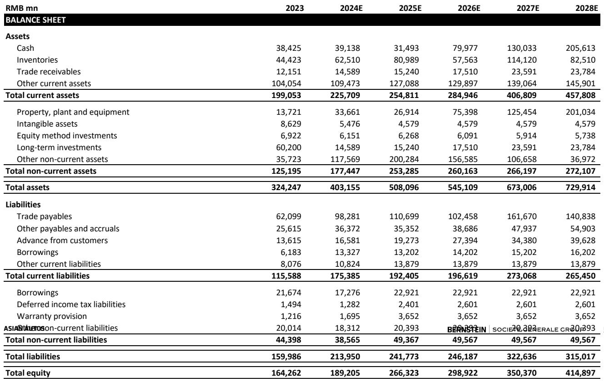
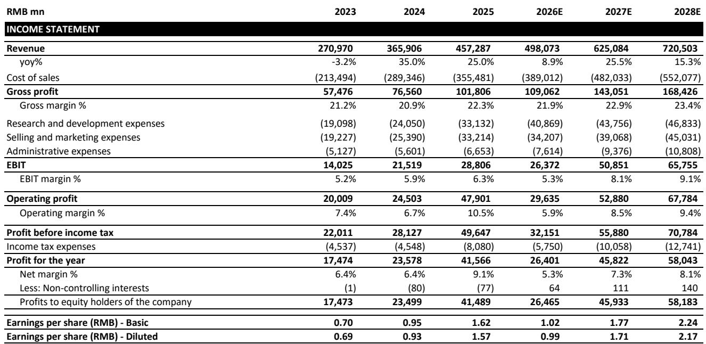
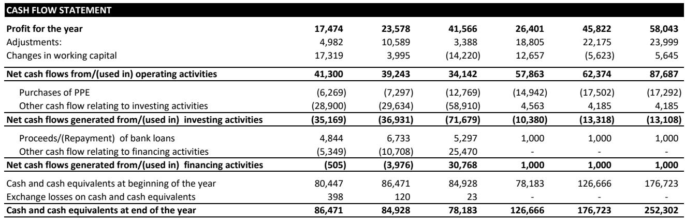

# 小米SkyNomad发布：重新定义中国高端家庭SUV市场的价值基准

小米将其全尺寸七座增程式电动SUV定价为299,900元人民币——比最直接竞品理想L9的起售价低160,000元，比问界M9低180,000元。在今日SkyNomad首发中公布的这一价格决策，不仅仅是价格竞争；它重新定义了一个已习惯于大型家庭用车高定价的细分市场的价值基准。N90 Max提供最高464公里的纯电续航和1,705公里的综合续航，而较小的N70 Max（中大型五座车型）预售价为259,900元，纯电续航最高505公里。

竞争威胁是直接且结构性的。理想汽车和问界一直主导着中国高端增程式电动SUV细分市场，但它们的定价模式假设了一定程度免受规模驱动的市场变化影响。小米的进入，背靠数亿用户的智能手机生态系统，以及一个已通过SU7和YU7展现出规模化交付能力的品牌，改变了这一格局。问题不再是小米能否造车——它已经在造——而是传统高端增程式玩家能否在面临一个似乎愿意牺牲短期利润率换取市场份额的竞争者时，守住自己的价格点。

SkyNomad的发布也明确了小米更广泛的战略意图。公司目标是年销量55万辆，这要求SU7和YU7合计月交付量达到35,000至40,000辆，SkyNomad从9月起每月贡献约30,000辆。这些数字颇具雄心，执行风险真实存在——产能爬坡将十分紧张，9月交付量可能有限。但定价策略表明小米玩的是规模游戏，而非利润率游戏，这对该细分市场的每个竞争者都具有深远影响。

## 价格差距不是折扣；而是整个细分市场的结构性重新定价

小米N90 Max定价299,900元，较理想L9低35%，较问界M9低37%。这不是促销价或限时优惠；这是预售价，按行业惯例，最终发布时可能再下调10,000元或更多。更低配置版本应会更便宜。这一价格声明表明小米意图重置消费者对全尺寸七座增程式电动SUV应有价格的预期。

对比十分鲜明。理想L9起售价459,800元，问界M9增程版起售价479,800元。小米提供的续航数据相当甚至更优——纯电464公里、综合1,705公里——同时强调宽敞空间和灵活座舱布局。第三排座椅可折叠放平，前排座椅可旋转180度面向第二排，营造出小米所称的“小客厅”。其中一些功能可能实际应用场景有限，但它们传递出这是一款围绕家庭需求设计的产品，而不仅仅是技术参数的堆砌。

对理想汽车和问界而言，影响是深远的。它们当前车型的定价较小米产品有显著溢价，且品牌建立在高端家庭SUV细分市场之上。如果小米能以低35%的价格提供相当的质量和续航，现有玩家的价值主张将明显弱化。中国家庭SUV市场的消费者对价格敏感，即使在高端区间也是如此，160,000元的价差不容忽视。

这一价格也对整个细分市场形成压力，而不仅仅是直接竞争对手。如果小米为全尺寸增程式电动SUV确立新的价格基准，该细分市场的其他制造商都需要相对于小米的产品来论证自身定价的合理性。这可能引发高端家庭SUV市场更广泛的重新定价，压缩全行业利润率。

## SkyNomad的销量潜力由市场结构驱动，而非仅靠产品吸引力

SkyNomad N70和N90的可及市场规模可观。2025年中国SUV市场为1,150万辆，其中纯电动汽车310万辆，插电混动和增程式电动车290万辆，燃油车550万辆。SkyNomad车型所瞄准的B至D级SUV细分——年总量约550万辆——其中32%为纯电，34%为插混和增程。

销量估算中的关键假设是燃油车需求的转化。如果B至D级细分中50%的燃油车需求转向插电混动动力系统，总可及市场每年可达约300万辆。这是一个庞大的潜在需求池，小米正将自己定位为获取其中可观份额。

小米的销量预估虽然激进但并非不可信。N90 Max月销可能超过10,000辆，N70 Max月销可能达到15,000辆。这些数字基于同级车型的销量和指导价，并假设小米能够完成生产和交付。然而，N90和N70之间存在相互蚕食的风险，取决于最终定价。如果N70定价过于接近N90，买家可能选择更大车型，从而降低合计销量潜力。

产能问题仍未解决。小米尚未获得二期工厂的官方批准，尽管管理层表示现有工厂内有增加生产线的空间。交付爬坡将十分紧张，尤其是9月份，届时SkyNomad预计每月贡献约30,000辆。如果产能无法跟上需求，销量预估可能偏乐观。

## 小米的生态系统优势改变电动汽车市场竞争格局

小米不是传统汽车制造商，这一区别至关重要。公司拥有数亿活跃用户的智能手机生态系统、与年轻科技消费者产生共鸣的品牌，以及传统车企难以匹敌的营销和渠道能力。SU7和YU7已证明了小米激发需求并将兴趣转化为销售的能力。

SkyNomad的发布将这一优势延伸至新细分市场。家庭SUV市场不仅仅是参数和价格；它关乎信任、品牌认知和整体用车体验。小米的生态系统——涵盖手机、智能家居设备，如今还有汽车——创造了没有可比生态系统的竞争对手无法复制的连贯用户体验。已经使用小米产品的家庭更可能考虑小米汽车，车辆与更广泛生态系统之间的整合可能成为差异化优势。

这一生态系统优势还对客户留存和终身价值产生影响。小米可以通过软件服务、车联网以及与其更广泛产品线的整合来实现车辆关系的变现。传统车企，尤其是那些只专注于汽车的车企，缺乏这种交叉销售能力。结果是小米可以更激进地定价，因为长期收入潜力超越了首次销售。

对理想汽车和问界而言，生态系统差距是一个战略弱点。它们在车辆属性上竞争——续航、空间、舒适性——但无法匹敌小米更广泛的生态布局。随着电动汽车市场成熟，软件成为日益重要的差异化因素，这一差距可能扩大。

## 财务模型显示短期利润率压力但长期战略收益

小米对汽车业务的财务预测反映了销量与利润率之间的战略权衡。公司营业利润率预计从2025年的10.5%下降至2026年的5.9%，随后在2027年恢复至8.5%。净利润率呈现类似走势，从9.1%降至5.3%，然后恢复至7.3%。2026年的回落反映了与SkyNomad发布和产能爬坡相关的投入阶段。

收入轨迹则呈现不同图景。收入预计从2025年的4,570亿元增长至2026年的4,980亿元，增幅8.9%，随后在2027年随着汽车业务规模化而加速至25.5%的增长。毛利率预计保持相对稳定，约22%，表明小米即使在大力投入汽车业务的同时，也能在毛利层面维持盈利能力。

每股收益走势与利润率轨迹一致。报告EPS预计从2025年的1.62元下降至2026年的1.02元，随后在2027年恢复至1.77元。2026年的下降是SkyNomad发布及相关产能投入的直接结果。仅关注短期盈利的读者可能有所顾虑，但战略逻辑清晰：小米正以短期盈利换取在可能产生显著长期回报的细分市场中建立主导地位。

估值影响显著。按当前价格31.04港元计算，小米对应2025年报告盈利16.5倍，2026年预期26.2倍，2027年预期15.1倍。2026年倍数看似偏高，但反映了投入阶段对应的盈利低谷。2027年倍数更为合理，且假设汽车业务达到预期的规模和盈利能力。

## 评估小米汽车策略的分析框架

对于市场观察者和行业研究者而言，SkyNomad发布提供了一个清晰的框架来评估小米的汽车策略及其对更广泛市场的影响。该框架包含三个维度：定价能力、生产执行和生态杠杆。

定价能力是第一个检验。小米已在高端家庭SUV细分市场确立了明确的价格优势，但问题在于随着竞争对手回应，它能否维持这一优势。理想汽车和问界可能会调整定价或推出新车型来应对小米的进入。小米价格优势的可持续性取决于其成本结构以及在规模化生产的同时维持利润率纪律的能力。

生产执行是第二个检验。小米的销量预估假设其能在9月前将SkyNomad车型的月产量提升至约30,000辆。这是一个激进的时间表，且公司尚未获得二期工厂的批准。如果产量不及预期，销量预估将偏乐观，财务预测也需要相应下调。

生态杠杆是第三个检验。小米的生态优势是真实的，但并非自动实现。公司需要证明其车辆与更广泛产品线之间的整合为消费者创造了切实价值。如果生态整合流于表面，随着竞争对手发展自身的软件和连接能力，这一优势将随时间消蚀。

该框架表明，小米的汽车策略是一场高风险、高回报的押注。定价策略激进，生产时间表紧张，竞争回应不确定。然而，潜在回报可观。如果小米能在三个维度上都执行到位，它可能在中国高端家庭SUV市场建立主导地位，并为其向其他车型细分市场的扩张创造模板。

SkyNomad的发布不仅仅是新产品推出；它是一份战略声明。小米在告诉市场，它意图成为全球电动汽车行业的重要参与者，并愿意为实现这一目标进行必要投入。未来数月将揭示这一战略能否转化为执行成果，但方向是明确的。

*仅供参考。部分内容可能基于原始材料由AI辅助生成、翻译、摘要或编辑，可能存在遗漏或错误。请独立核实。本文不构成投资、法律、税务、会计或其他专业建议。*
