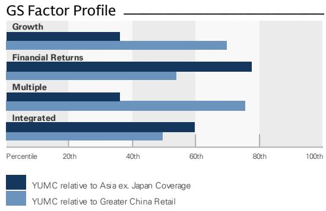
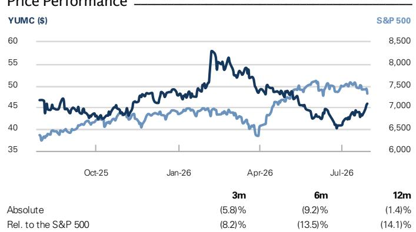

# Yum China Holdings (YUMC)

# 业绩回顾：宏观环境波动下的韧性表现；新业态推进积极；维持报告评级（CL）

<table><tr><td>YUMC</td><td>12个月目标价：$59.00</td><td>现价：$45.85</td><td>潜在空间：28.7%</td></tr><tr><td>9987.HK</td><td>12个月目标价：HK$459.00</td><td>现价：HK$365.80</td><td>潜在空间：25.5%</td></tr></table>

百胜中国2Q26稳健的业绩及电话会议要点进一步印证了我们的积极看法。尽管消费环境存在波动，公司2Q26同店销售增长（SSSG）仍实现改善，且管理层对3Q初期的展望亦展现出信心，好于业绩发布前市场因消费情绪、不利天气及去年同期高基数等因素而形成的谨慎预期。除了一贯稳健的执行力外，新业态/新模式（如K coffee Cafe、K Pro、必胜客汉堡吧等）表现良好，为母店贡献增量，开辟了新的收入来源；公司亦进一步加快了新业态的铺设步伐。管理层关于餐饮行业连锁化率提升以及市场促销定价趋于理性的评论同样令人鼓舞。展望未来，我们看到了明确的积极因素：得益于外卖占比提升带来的费用压力减轻，下半年利润率基数将更为有利。此外，管理层指出，在完成收购后（据管理层称，收购将于2026年8月按计划完成），必胜客的增长及盈利能力存在进一步改善的潜力。维持报告评级（CL），目标价上调至US$59/HK$459（此前为US$58/HK$452）。

业绩电话会议要点包括：1) 展望3Q26，管理层目标为实现正SSSG，并指出7月表现基本符合预期；餐厅利润率预计同比持平或略有提升，外卖占比同比提升带来的不利影响减弱，且持续的成本优化/效率提升亦有贡献；营业利润率（OPM）预计同比持平或略有改善，尽管政府补贴带来的同比利好将减少（据管理层称，其指引未包含必胜客收购影响，预计该收购将在3Q带来20-30个基点的OPM利好）。管理层重申，在不考虑必胜客品牌收购（预计8月完成）影响的情况下，对实现全年目标抱有信心，并预计该收购今年将对利润率产生小幅增厚作用。

## 买入 CL

Michelle Cheng
+852-2978-6631 | michelle.cheng@gs.com
GS (Asia) L.L.C.

Xinyu Ruan
+852-2978-7347 | xinyu.ruan@gs.com
GS (Asia) L.L.C.

Molly Dai
+852-3966-4000 | molly.dai@gs.com
GS (Asia) L.L.C.

<table><tr><td>关键数据</td></tr><tr><td>市值：$15.8bn</td></tr><tr><td>企业价值：$16.8bn</td></tr><tr><td>3个月平均日交易额：$73.5mn</td></tr><tr><td>中国</td></tr><tr><td>大中华区零售</td></tr><tr><td>并购排名：3</td></tr><tr><td>净债务及EV中是否包含租赁？：是</td></tr></table>

<table><tr><td colspan="5">GS预测</td></tr><tr><td></td><td>12/25</td><td>12/26E</td><td>12/27E</td><td>12/28E</td></tr><tr><td>收入（$ mn）新</td><td>11,797.0</td><td>12,952.6</td><td>13,842.1</td><td>14,828.8</td></tr><tr><td>收入（$ mn）旧</td><td>11,797.0</td><td>12,683.1</td><td>13,286.9</td><td>14,237.4</td></tr><tr><td>EBITDA（$ mn）</td><td>1,737.5</td><td>1,923.6</td><td>2,080.2</td><td>2,256.1</td></tr><tr><td>每股收益（$）新</td><td>2.50</td><td>2.94</td><td>3.36</td><td>3.77</td></tr><tr><td>每股收益（$）旧</td><td>2.50</td><td>2.87</td><td>3.28</td><td>3.69</td></tr><tr><td>市盈率（X）</td><td>18.4</td><td>15.6</td><td>13.7</td><td>12.2</td></tr><tr><td>市净率（X）</td><td>3.0</td><td>3.1</td><td>2.9</td><td>2.7</td></tr><tr><td>股息率（%）</td><td>2.1</td><td>2.6</td><td>2.9</td><td>3.3</td></tr><tr><td>CROCI（%）</td><td>10.5</td><td>15.1</td><td>33.3</td><td>22.7</td></tr><tr><td></td><td>3/26</td><td>6/26</td><td>9/26E</td><td>12/26E</td></tr><tr><td>每股收益（$）</td><td>0.87</td><td>0.70</td><td>0.89</td><td>0.46</td></tr></table>

  
来源：公司数据，GS预测。详情请参阅披露。

  
百胜中国控股（YUMC）
自2019年4月17日起评级

比率与估值

<table><tr><td></td><td>12/25</td><td>12/26E</td><td>12/27E</td><td>12/28E</td></tr><tr><td>市盈率（X）</td><td>18.4</td><td>15.6</td><td>13.7</td><td>12.2</td></tr><tr><td>市净率（X）</td><td>3.0</td><td>3.1</td><td>2.9</td><td>2.7</td></tr><tr><td>自由现金流回报表现（%）</td><td>4.8</td><td>6.3</td><td>6.9</td><td>8.1</td></tr><tr><td>EV/EBITDAR（X）</td><td>9.8</td><td>8.5</td><td>7.5</td><td>6.7</td></tr><tr><td>EV/EBITDA（不含租赁）（X）</td><td>8.7</td><td>7.5</td><td>6.6</td><td>5.9</td></tr><tr><td>CROCI（%）</td><td>10.5</td><td>15.1</td><td>33.3</td><td>22.7</td></tr><tr><td>净资产回报表现（%）</td><td>16.4</td><td>19.5</td><td>21.9</td><td>23.1</td></tr><tr><td>净债务/权益（%）</td><td>(4.6)</td><td>3.6</td><td>1.2</td><td>(1.8)</td></tr><tr><td>净债务/权益（不含租赁）（%）</td><td>(34.5)</td><td>(28.4)</td><td>(29.4)</td><td>(31.1)</td></tr><tr><td>利息覆盖倍数（X）</td><td>-</td><td>-</td><td>-</td><td>-</td></tr><tr><td>存货周转天数</td><td>13.0</td><td>12.9</td><td>13.0</td><td>12.8</td></tr><tr><td>应收账款天数</td><td>2.7</td><td>3.0</td><td>3.4</td><td>3.8</td></tr><tr><td>应付账款天数</td><td>222.2</td><td>215.1</td><td>219.0</td><td>218.5</td></tr><tr><td>杜邦净资产回报表现（%）</td><td>15.0</td><td>17.5</td><td>18.3</td><td>19.1</td></tr><tr><td>周转率（X）</td><td>1.1</td><td>1.2</td><td>1.3</td><td>1.3</td></tr><tr><td>杠杆率（X）</td><td>1.8</td><td>1.9</td><td>1.8</td><td>1.8</td></tr><tr><td>总现金投资（不含现金）（$）</td><td>22,012.8</td><td>7,313.8</td><td>7,740.6</td><td>8,155.7</td></tr><tr><td>平均动用资本（$）</td><td>3,822.5</td><td>4,039.0</td><td>4,145.7</td><td>4,244.5</td></tr><tr><td>每股账面价值（$）</td><td>15.19</td><td>14.77</td><td>15.73</td><td>16.78</td></tr></table>

利润表（$ mn）

<table><tr><td></td><td>12/25</td><td>12/26E</td><td>12/27E</td><td>12/28E</td></tr><tr><td>总收入</td><td>11,797.0</td><td>12,952.6</td><td>13,842.1</td><td>14,828.8</td></tr><tr><td>销售成本</td><td>(3,455.0)</td><td>(3,776.9)</td><td>(3,978.5)</td><td>(4,211.1)</td></tr><tr><td>销售、一般及管理费用</td><td>(3,934.0)</td><td>(4,260.9)</td><td>(4,606.7)</td><td>(4,985.4)</td></tr><tr><td>研发费用</td><td>-</td><td>-</td><td>-</td><td>-</td></tr><tr><td>其他营业收支</td><td>(131.5)</td><td>(140.0)</td><td>(149.0)</td><td>(161.0)</td></tr><tr><td>EBITDA</td><td>1,737.5</td><td>1,923.6</td><td>2,080.2</td><td>2,256.1</td></tr><tr><td>折旧与摊销</td><td>(448.0)</td><td>(473.6)</td><td>(506.9)</td><td>(541.0)</td></tr><tr><td>EBIT</td><td>1,289.5</td><td>1,450.0</td><td>1,573.3</td><td>1,715.1</td></tr><tr><td>净利息收入/支出</td><td>92.0</td><td>49.1</td><td>38.0</td><td>41.0</td></tr><tr><td>联营公司损益</td><td>-</td><td>-</td><td>-</td><td>-</td></tr><tr><td>税前利润</td><td>1,357.5</td><td>1,482.1</td><td>1,611.2</td><td>1,756.1</td></tr><tr><td>所得税拨备</td><td>(369.0)</td><td>(400.2)</td><td>(435.0)</td><td>(474.1)</td></tr><tr><td>少数股东权益</td><td>(75.0)</td><td>(81.2)</td><td>(86.6)</td><td>(92.8)</td></tr><tr><td>优先股股息</td><td>-</td><td>-</td><td>-</td><td>-</td></tr><tr><td>净利润（扣除特殊项目前）</td><td>913.5</td><td>1,000.7</td><td>1,089.6</td><td>1,189.2</td></tr><tr><td>税后特殊项目</td><td>15.0</td><td>13.0</td><td>15.0</td><td>15.0</td></tr><tr><td>净利润（扣除特殊项目后）</td><td>928.5</td><td>1,013.7</td><td>1,104.6</td><td>1,204.2</td></tr><tr><td>每股收益（基本，扣除特殊项目前）（$）</td><td>2.48</td><td>2.92</td><td>3.33</td><td>3.75</td></tr><tr><td>每股收益（摊薄，扣除特殊项目前）（$）</td><td>2.46</td><td>2.90</td><td>3.31</td><td>3.73</td></tr><tr><td>每股收益（基本，扣除特殊项目后）（$）</td><td>2.52</td><td>2.96</td><td>3.38</td><td>3.80</td></tr><tr><td>每股收益（摊薄，扣除特殊项目后）（$）</td><td>2.50</td><td>2.94</td><td>3.36</td><td>3.77</td></tr><tr><td>每股股息（$）</td><td>0.96</td><td>1.17</td><td>1.34</td><td>1.51</td></tr><tr><td>股息支付率（%）</td><td>38.6</td><td>40.2</td><td>40.2</td><td>40.2</td></tr></table>

增长与利润率（%）

<table><tr><td></td><td>12/25</td><td>12/26E</td><td>12/27E</td><td>12/28E</td></tr><tr><td>总收入增长率</td><td>4.4</td><td>9.8</td><td>6.9</td><td>7.1</td></tr><tr><td>EBITDA增长率</td><td>6.1</td><td>10.7</td><td>8.1</td><td>8.5</td></tr><tr><td>每股收益增长率</td><td>7.2</td><td>17.4</td><td>14.2</td><td>12.5</td></tr><tr><td>每股股息增长率</td><td>51.1</td><td>22.6</td><td>14.2</td><td>12.5</td></tr><tr><td>EBIT利润率</td><td>10.9</td><td>11.2</td><td>11.4</td><td>11.6</td></tr><tr><td>EBITDA利润率</td><td>14.7</td><td>14.9</td><td>15.0</td><td>15.2</td></tr><tr><td>净利润率</td><td>7.7</td><td>7.7</td><td>7.9</td><td>8.0</td></tr></table>

价格表现  
  
来源：FactSet。价格为2026年7月29日收盘价。

资产负债表（$ mn）

<table><tr><td colspan="5">资产负债表（$ mm）</td></tr><tr><td></td><td>12/25</td><td>12/26E</td><td>12/27E</td><td>12/28E</td></tr><tr><td>现金及现金等价物</td><td>2,136.0</td><td>1,650.0</td><td>1,780.6</td><td>1,962.6</td></tr><tr><td>应收账款</td><td>95.0</td><td>115.2</td><td>142.0</td><td>169.2</td></tr><tr><td>存货</td><td>438.0</td><td>478.8</td><td>504.4</td><td>533.9</td></tr><tr><td>其他流动资产</td><td>366.0</td><td>391.8</td><td>416.0</td><td>444.2</td></tr><tr><td>流动资产合计</td><td>3,035.0</td><td>2,635.8</td><td>2,843.0</td><td>3,109.9</td></tr><tr><td>不动产、厂房及设备净额</td><td>2,543.0</td><td>2,672.9</td><td>2,768.7</td><td>2,829.5</td></tr><tr><td>无形资产净额</td><td>2,111.0</td><td>2,177.7</td><td>2,244.4</td><td>2,311.0</td></tr><tr><td>总投资</td><td>387.0</td><td>387.0</td><td>387.0</td><td>387.0</td></tr><tr><td>其他长期资产</td><td>2,707.0</td><td>2,707.0</td><td>2,707.0</td><td>2,707.0</td></tr><tr><td>总资产</td><td>10,783.0</td><td>10,580.4</td><td>10,950.0</td><td>11,344.4</td></tr><tr><td>应付账款</td><td>2,127.0</td><td>2,325.2</td><td>2,449.3</td><td>2,592.5</td></tr><tr><td>短期债务</td><td>30.0</td><td>30.0</td><td>30.0</td><td>30.0</td></tr><tr><td>短期租赁负债</td><td>-</td><td>-</td><td>-</td><td>-</td></tr><tr><td>其他流动负债</td><td>89.0</td><td>89.0</td><td>89.0</td><td>89.0</td></tr><tr><td>流动负债合计</td><td>2,246.0</td><td>2,444.2</td><td>2,568.3</td><td>2,711.5</td></tr><tr><td>长期债务</td><td>-</td><td>-</td><td>-</td><td>-</td></tr><tr><td>长期租赁负债</td><td>1,823.0</td><td>1,823.0</td><td>1,823.0</td><td>1,823.0</td></tr><tr><td>其他长期负债</td><td>615.0</td><td>608.3</td><td>601.6</td><td>594.8</td></tr><tr><td>长期负债合计</td><td>2,438.0</td><td>2,431.3</td><td>2,424.6</td><td>2,417.8</td></tr><tr><td>总负债</td><td>4,684.0</td><td>4,875.5</td><td>4,992.8</td><td>5,129.3</td></tr><tr><td>优先股</td><td>-</td><td>-</td><td>-</td><td>-</td></tr><tr><td>普通股权益合计</td><td>5,379.0</td><td>4,903.7</td><td>5,069.3</td><td>5,234.5</td></tr><tr><td>少数股东权益</td><td>720.0</td><td>801.2</td><td>887.9</td><td>980.6</td></tr><tr><td>总负债及权益</td><td>10,783.0</td><td>10,580.4</td><td>10,950.0</td><td>11,344.4</td></tr><tr><td>净债务（调整后）</td><td>(2,106.0)</td><td>(1,620.0)</td><td>(1,750.6)</td><td>(1,932.6)</td></tr></table>

<table><tr><td colspan="5">现金流量表（$ mn）</td></tr><tr><td></td><td>12/25</td><td>12/26E</td><td>12/27E</td><td>12/28E</td></tr><tr><td>净利润</td><td>913.5</td><td>1,000.7</td><td>1,089.6</td><td>1,189.2</td></tr><tr><td>加回折旧与摊销</td><td>448.0</td><td>473.6</td><td>506.9</td><td>541.0</td></tr><tr><td>加回少数股东权益</td><td>75.0</td><td>81.2</td><td>86.6</td><td>92.8</td></tr><tr><td>营运资金变动净额</td><td>(109.0)</td><td>111.4</td><td>47.5</td><td>58.4</td></tr><tr><td>其他经营活动现金流</td><td>123.5</td><td>-</td><td>-</td><td>-</td></tr><tr><td>经营活动现金流</td><td>1,466.0</td><td>1,679.9</td><td>1,745.6</td><td>1,896.3</td></tr><tr><td>资本支出</td><td>(626.0)</td><td>(645.1)</td><td>(644.4)</td><td>(643.5)</td></tr><tr><td>收购</td><td>-</td><td>-</td><td>-</td><td>-</td></tr><tr><td>处置</td><td>-</td><td>-</td><td>-</td><td>-</td></tr><tr><td>其他</td><td>(12.0)</td><td>(25.0)</td><td>(25.0)</td><td>(25.0)</td></tr><tr><td>投资活动现金流</td><td>(651.0)</td><td>(670.1)</td><td>(669.4)</td><td>(668.5)</td></tr><tr><td>偿还租赁负债</td><td>-</td><td>-</td><td>-</td><td>-</td></tr><tr><td>已支付股息（普通股及优先股）</td><td>(353.0)</td><td>(402.4)</td><td>(438.5)</td><td>(478.1)</td></tr><tr><td>债务增加/减少</td><td>-</td><td>-</td><td>-</td><td>-</td></tr><tr><td>其他融资现金流</td><td>(1,325.0)</td><td>(1,093.3)</td><td>(507.2)</td><td>(567.7)</td></tr><tr><td>融资活动现金流</td><td>(1,678.0)</td><td>(1,495.7)</td><td>(945.7)</td><td>(1,045.7)</td></tr><tr><td>总现金流</td><td>(863.0)</td><td>(486.0)</td><td>130.6</td><td>182.1</td></tr><tr><td>自由现金流</td><td>840.0</td><td>1,034.7</td><td>1,101.3</td><td>1,252.8</td></tr></table>

来源：公司数据，GS预测。

2) 新业态进展令人鼓舞。KCoffee Cafe有望在年底前达到5000家门店，今年销售额预计同比翻番至人民币20亿元；管理层再次上调K Pro开店指引至年底800家（此前为600家），并正将该模式向低线城市拓展。与此同时，其他多项新业态亦展现出良好前景，包括必胜客汉堡吧（已拓展至200多家门店，为母店带来双位数销售增量/可观利润贡献），以及肯德基汽车穿梭餐厅（今年销售额预计超过人民币10亿元）。3) 据管理层称，必胜客品牌收购将进一步释放增长与利润率潜力。收购完成后，管理层预计必胜客餐厅利润率（扣除增值税后）将提升2.8个百分点，这将改善单店经济模型，并降低实现2-3年回本的新店销售门槛；同时，管理层强调这将带来更大的运营灵活性。管理层将2027-28年新增门店指引从此前每年超过600家上调至每年超过800家。关于融资安排，公司将首先使用12个月期约12亿美元过桥贷款（利率约2%），并正在评估不同的后续融资方案。管理层重申了股东回报指引，并指出必胜客更快的增长亦将有利于自由现金流。4) 关于竞争格局的评论：管理层指出定价趋势已趋稳定，并认为外卖平台竞争更趋理性、行业持续连锁化以及针对“幽灵厨房”的整治对公司而言均为有利因素。

我们上调了2026-28年盈利预测约2.5%，以反映2Q26业绩、更新的汇率假设以及下半年利润率的同比改善。尽管消费环境存在波动，我们认为百胜中国通过新业态的强劲执行实现市场空间（TAM）扩张，以及持续的效率提升，将支撑盈利可见性。我们当前的预测未反映必胜客品牌收购的影响。

我们感谢何女士对本报告的贡献。

## 电话会议要点

近期趋势：管理层指出，尽管极端天气造成部分地区暂时性干扰，7月经营情况基本符合预期。咖啡、轻食、创新产品及体验方面的消费需求保持韧性。定价趋势持续企稳，外卖平台之间的竞争更趋理性。管理层指出，得益于“幽灵厨房”监管以及连锁品牌表现优于全国社零总额增长，领先品牌仍有进一步整合的空间。

## 对FY26/2H26/3Q26/必胜客品牌交易后/长期的展望：

公司重申了2026年全年目标（不含必胜客品牌交易），包括SSSG为0-2%、系统销售额增长为中个位数至高个位数、营业利润增长高个位数、每股收益增长双位数，以及餐厅利润率和营业利润率均略有改善。公司亦有望在年底前达到2万家门店。

3Q26，管理层目标为实现正SSSG和正交易量增长。不含必胜客交易影响，管理层预计餐厅利润率同比持平或略有提升，因骑手成本增量压力有所缓解。营业利润率预计大致持平或略有改善，部分原因在于3Q25确认的政府补贴不再重现。

2H26，对于必胜客，管理层预计餐厅利润率同比改善幅度将大于1H26，得益于效率提升、骑手成本压力缓解、销售成本大致稳定以及持续的效率改善。管理层维持FY26必胜客销售成本率约34%的指引以及约31%（±1%）的长期目标。

必胜客品牌交易进展：管理层指出交易仍按计划于8月完成。据管理层称，节省的3%必胜客许可费预计将为必胜客餐厅利润率（扣除增值税后）增加约2.8个百分点，为百胜中国整体利润率增加约60个基点。管理层预计该交易将在3Q26为餐厅利润率和营业利润率贡献约30-40个基点，在FY26贡献约20-30个基点（扣除交易成本、融资费用及税费后）；预计2026年每股收益影响为小幅增厚，2027-28年为中个位数增厚。管理层预计必胜客2027年和2028年净新增门店均超过800家，高于此前超过600家的目标。

## 必胜客品牌收购：

融资：公司按计划于8月完成对中国大陆必胜客品牌的收购，并计划获得约12亿美元等值离岸过桥贷款为交易融资，利率约2%。据管理层称，长期融资方案尚处初步阶段，可能包括银团贷款、债券或可转换债券。如使用可转换债券，集团致力于最小化潜在稀释，包括采用高转换溢价及净股份结算的 capped calls。

战略利益：管理层预计许可费节省将使必胜客餐厅利润率更接近肯德基水平，使更多新店能够满足2-3年回本要求。凭借改善后的利润率水平，管理层上调了开店扩张目标。长期来看，管理层预计品牌所有权将带来更大的运营灵活性，如产品和菜单创新。

## 新业态进展

KCoffee Cafe：2Q26门店数达到3,300家，较上季度净增约700家。管理层目标2026年销售额同比翻番至人民币20亿元，并维持2027年底5,000家门店的目标。KCoffee Cafe持续为肯德基母店带来中个位数销售增量。

K Pro：门店数从上季度的280家增至450多家，为母店带来约20%的销售增量。管理层将年底目标上调至800家（此前为600家）。K Pro为肯德基母店带来约20%的销售增量，利润率改善明显，并正拓展至一线、二线及部分低线城市。管理层预计K Pro 2026年销售额同比增长四倍，2027年超过人民币10亿元。

肯德基汽车穿梭餐厅及车道取餐：公司拥有超过8,000家肯德基汽车穿梭餐厅，但活跃会员渗透率仅约3%，采用率增长空间显著。管理层目标2026年该渠道销售额达到人民币10亿元。

■ 必胜客汉堡吧：必胜客汉堡吧市场反响良好。约六个月内拓展至200多家门店，为必胜客母店带来双位数销售增量，并贡献可观的利润（尽管初始销售成本较高、利润率低于品牌平均水平）。管理层计划2026年底加速拓展至500-600家门店，相当于必胜客门店数的约10%，今年销售额目标超过人民币10亿元，约占必胜客销售额的5-6%。管理层表示汉堡销售对集团而言具有增量性，该模式为顾客提供了更多选择，且与肯德基在产品属性上形成差异化。

■ 必胜客Wow：必胜客Wow门店持续帮助品牌渗透低线城市，门店数已超过400家。

关于SSSG与开店节奏的评论：管理层指出，更快的开店速度并不必然导致SSSG下降，并列举了应对措施，包括发掘未开发的市场空白机会、战略渠道、高线城市核心区域等。

定价与竞争：管理层观察到行业定价持续企稳，更多参与者愿意采取定价行动，外卖平台竞争更趋理性。肯德基平均客单价同比下降3%至人民币36元，主要由于KCoffee、K Pro及其他新消费场景带来的增量小订单，而交易量增长4%。必胜客平均客单价下降11%至人民币68元，正接近大众化策略下人民币60-70元的目标区间，而交易量增长13%。管理层继续优先关注客流、性价比及增量消费场景，而非单纯的客单价增长。

股东回报：公司重申2026年向股东返还15亿美元的计划。自2027年起，集团重申将返还扣除少数股东股息后年度自由现金流的约100%，意味着2027年和2028年返还金额为9亿至超过10亿美元，2028年将超过10亿美元。此外，管理层指出，收购完成后必胜客增长及盈利能力改善存在进一步上行空间。

图表1：销售额及SSSG拆分

<table><tr><td>按外卖及堂食划分的销售额</td><td>1Q24</td><td>2Q24</td><td>3Q24</td><td>4Q24</td><td>1Q25</td><td>2Q25</td><td>3Q25</td><td>4Q25</td><td>1Q26</td><td>2Q26</td></tr><tr><td>百胜中国固定汇率销售额同比增长</td><td>7%</td><td>4%</td><td>4%</td><td>4%</td><td>2%</td><td>4%</td><td>4%</td><td>7%</td><td>4%</td><td>6%</td></tr><tr><td>外卖占公司销售额比例</td><td>39%</td><td>38%</td><td>40%</td><td>42%</td><td>43%</td><td>45%</td><td>50%</td><td>53%</td><td>54%</td><td>54%</td></tr><tr><td>外卖固定汇率同比增长</td><td>13%</td><td>10%</td><td>17%</td><td>14%</td><td>13%</td><td>24%</td><td>31%</td><td>34%</td><td>31%</td><td>26%</td></tr><tr><td>外卖贡献的固定汇率销售额增长估算</td><td>5%</td><td>4%</td><td>6%</td><td>5%</td><td>5%</td><td>9%</td><td>12%</td><td>14%</td><td>13%</td><td>12%</td></tr><tr><td>堂食贡献的固定汇率销售额增长估算</td><td>2%</td><td>0%</td><td>-2%</td><td>-1%</td><td>-3%</td><td>-5%</td><td>-8%</td><td>-7%</td><td>-9%</td><td>-6%</td></tr></table>

<table><tr><td>按交易量及价格划分的SS
