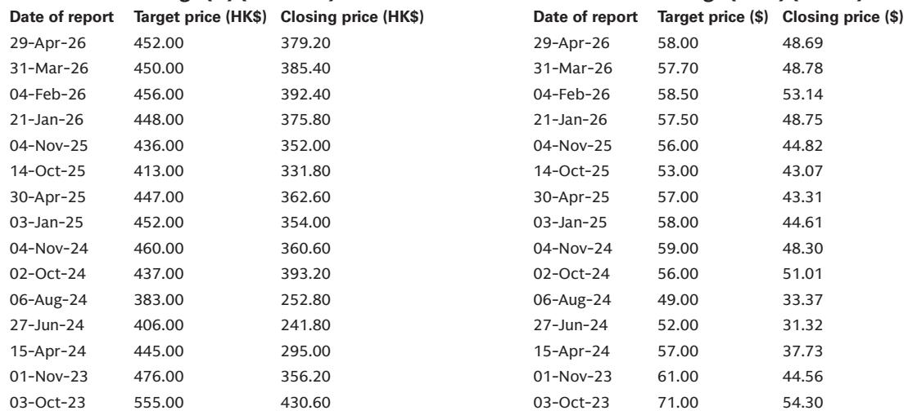
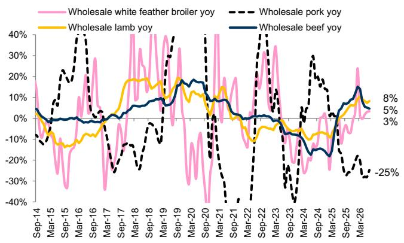
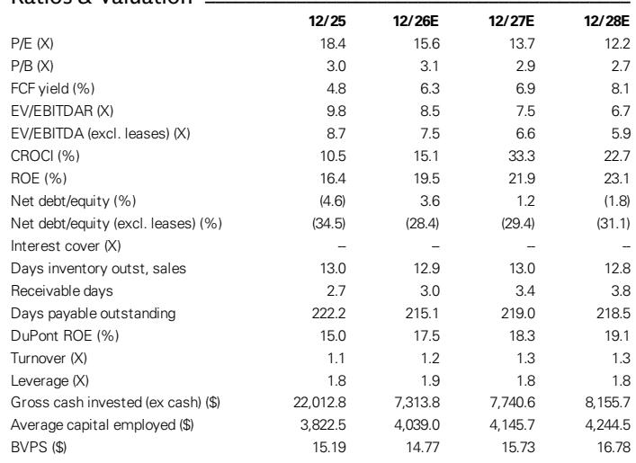

# 中国餐饮巨头的规模优势不再是增长引擎

百胜中国第二季度财报中最具参考价值的数字，并非收入数据或每股收益表现，而是修订后的开店指引：2027年和2028年每年新增超过800家必胜客门店，高于此前超过600家的目标。这一修订本身，浓缩了一次战略转向——公司不再主要依靠肯德基核心品牌的规模扩张来驱动增长，而是通过一系列小型门店形态实验、全资品牌架构以及严格的成本管理，在消费环境仍显谨慎的背景下，从运营中挖掘更多利润空间。

市场对这份财报的反应，以及随后的读者讨论，焦点在于这究竟是周期性复苏的故事，还是结构性重新定价。从财报电话会议透露的信息来看，证据明显倾向于后者。管理层预计第三季度同店销售额将实现正增长，7月交易情况基本符合预期，尽管部分地区受到天气干扰。但更具深远意义的信号是结构性的：K Coffee Cafe和K Pro等新形态门店的扩张速度超出计划；必胜客品牌收购按计划于8月完成，并具备清晰的利润率提升路径；管理层明确提到行业整合和打击幽灵厨房是顺风因素。这不是一家在等待消费者回归的公司，而是一家正在重新调整成本基础和门店经济模型，以便在消费者可能暂时不会恢复到此前消费水平的环境中持续发展的公司。

## 同店销售拐点真实存在，但组合变化才是利润率故事的关键

财报发布前，市场的主要担忧是百胜中国能否在去年同期高基数以及消费信心偏弱的环境中保持自身表现。公司有力地回应了这一担忧。第二季度同店销售增长环比改善，管理层对第三季度的信心——同店销售正增长以及餐厅利润率保持稳定或略有上升——不仅仅是运营层面的乐观表态。关键机制在于外卖占比的变化。2025年全年，外卖订单占比上升通过骑手成本对利润率形成压力。到2026年下半年，这一不利因素在同比基础上有所缓解。同比基数变得更容易，成本结构则受益于管理层所说的持续效率提升。

这一变化不仅仅是日历效应，更在于组合正常化与新门店形态经济模型之间的相互作用。例如，K Coffee Cafe有望在年底前达到5000家门店，销售额预计同比弹性较高至20亿元人民币。该形态的成本结构低于标准肯德基门店，且服务于不同的时段和消费场景。同样，K Pro——更轻量、更注重健康的肯德基变体——开店指引再次上调，从600家上调至年底800家，并向下线城市扩张。这些新形态不仅仅是增量门店，它们是利润率架构的一部分，使公司能够在无需承担传统门店全部运营成本的情况下，参与咖啡驱动的增长和注重性价比的餐饮消费。

顺序也很重要。公司重申了全年指引（不含必胜客品牌收购），包括同店销售增长0-2%、系统销售额增长中到高个位数、营业利润增长高个位数。这一指引现在得到了下半年利润率顺风的支持，来源是外卖组合正常化和促销环境更加理性。管理层指出，定价趋势已趋稳定，外卖平台之间的竞争也变得更加理性。对于过去两年一直在应对促销强度的公司来说，这是利润率桥梁的重要输入。

## 新形态不是附属实验——它们是新的单店经济引擎

财报电话会议中最被低估的方面，是新形态门店推出的广度和速度。仅K Coffee Cafe一项，今年销售额就有望弹性较高至20亿元人民币。K Pro正在加速扩张。必胜客汉堡吧的并排形态已扩展到超过200家门店，管理层表示该形态正在推动双位数百分比的销售提升，并为母店带来可观的利润贡献。肯德基汽车餐厅今年销售额预计将超过10亿元人民币。这些不是试点项目，它们正在成为损益表的重要贡献者。

战略逻辑很清晰。中国的快餐市场正在变得更加细分。大众市场的肯德基品牌覆盖了广泛的中端消费群体，但消费者偏好正在向不同价位、时段和饮食偏好分化。单一品牌无法高效服务所有这些场景。新形态使百胜中国能够捕捉相邻消费——咖啡、轻食、性价比午餐——而不会蚕食核心品牌或拖累门店层面的利润率。K Pro积极向下线城市扩张尤其说明问题，这表明公司找到了一种在标准肯德基门店模型可能规模不足或竞争不那么激烈的市场中行之有效的形态。

财务影响已经体现在预测修订中。公司上调了2026-28年盈利预测约2.5%，纳入了第二季度业绩、更新的汇率假设以及下半年同比利润率改善。2026年收入预测从126.8亿美元上调至129.5亿美元，2027年和2028年的收入数据也相应上调。这不是单季度的超预期加上调，而是多个增长引擎跨多年的复合效应。

## 必胜客品牌收购是改变投资计算方式的利润率催化剂

收购中国内地必胜客品牌（计划于8月完成）是整个故事中最大的战略催化剂。机制很直接。百胜中国目前为使用必胜客品牌支付许可费。收购完成后，这笔费用将被消除。管理层量化了收益：对必胜客餐厅利润率（扣除增值税后）约2.8个百分点的提升，对百胜中国整体利润率约60个基点的提升。公司预计该交易将在第三季度为餐厅利润率和营业利润率贡献30-40个基点，全年贡献20-30个基点（扣除交易成本、融资费用和税费后）。每股收益影响预计在2026年略有增厚，2027-28年达到中个位数百分比的增厚。

战略意义超越了直接的利润率提升。许可费的消除改善了每一家新必胜客门店的单店经济模型。管理层指出，改善后的利润率状况降低了新店实现2-3年回本期所需的销售额门槛。这反过来支持了修订后的开店指引——2027-28年每年新增超过800家，高于此前超过600家的目标。这是一个良性循环：更低的许可成本改善回报，回报改善支持更快的扩张，扩张推动系统销售额增长，进而转化为运营杠杆。

融资结构也值得关注。公司计划使用12亿美元过桥贷款，前12个月利率约2%，并正在评估长期选项，包括银团贷款、债券或可转换债券。管理层承诺如果使用可转换债券，将尽量减少稀释，包括采用高溢价转换的上限看涨期权和净股份结算。对于一家拥有净现金资产负债表、自由现金流回报表现预计2026年达到6.3%、2028年达到8.1%的公司来说，这笔收购在财务上是可消化的，不会给资产负债表带来压力，也不会迫使削减股东回报。管理层重申了股东回报指引，并指出必胜客更快的增长也可能有利于自由现金流。

## 下半年消费板块观察的决策框架

对于在评估百胜中国与其他中国消费板块敞口的读者来说，财报电话会议为未来两个季度如何看待该公司提供了清晰的标准。第一个标准是，在仍然偏弱的消费环境中，同店销售增长能否保持正增长。管理层预计第三季度同店销售正增长，7月基本符合预期。第二个标准是，利润率扩张是真实的，还是仅仅是同比基数效应。在这方面，证据更具结构性：外卖组合正常化、许可费消除和持续的成本优化是三个独立的顺风因素，不依赖于消费者变得更强。

第三个标准是资本配置。公司正在将资本部署到更高回报的形态中，收购必胜客品牌以获取许可费节省，并维持股东回报计划，包括股息回报表现预计2026年达到2.6%、2027年达到2.9%。2026年6.3%和2027年6.9%的自由现金流回报表现提供了估值下限。第四个标准是竞争格局。管理层明确提到打击幽灵厨房和餐饮行业持续连锁化是顺风因素。规模较小、不受监管的参与者正在被挤出，而拥有规模、品牌和运营纪律的领先连锁企业正在获得份额。这是一个整合的故事，百胜中国是主要的整合者之一。

第五个标准，也是经常被忽视的，是必胜客自身的利润率轨迹。管理层维持了必胜客全年COGS指引约34%，长期目标约31%上下一个百分点。下半年，必胜客餐厅利润率预计将比上半年有更大的同比改善，驱动因素包括效率提升、骑手成本压力缓解以及COGS基本稳定。许可费消除和COGS纪律的结合表明，必胜客可以逐步缩小与肯德基的利润率差距。这就是结构性重新定价的机会。

## 估值仍为执行溢价扩张留有空间

该公司的估值水平为2026年预期盈利的15.6倍，2027年降至13.7倍，2028年降至12.2倍。每股收益增长轨迹——2026年17.4%、2027年14.2%、2028年12.5%——尚未完全反映在倍数中。股息回报表现从2025年的2.1%上升至2028年的预测3.3%。自由现金流回报表现同期从4.8%扩大至8.1%。从市净率角度看，该公司的估值为2026年账面价值的3.1倍，净资产回报表现预计从2025年的16.4%上升至2028年的23.1%。改善中的回报状况尚未被定价。

盈利修订幅度温和——2026-28年约2.5%——但方向一致，且有可识别的驱动因素支撑。收入提升由新形态更快扩张和必胜客收购驱动。利润率提升由许可费节省和外卖组合正常化驱动。每股收益提升由两者共同驱动，加上略微更有利的汇率环境。市场对中国消费类公司一直持谨慎态度，这家公司也不例外。但财报电话会议提供了清晰的视野，看到下半年利润率拐点，且不依赖于宏观复苏。

关键问题在于，市场是否会为新形态组合和必胜客利润率故事支付溢价，还是继续因宏观担忧而折价。电话会议中的证据表明，公司正在按照自己的时间表执行，无论宏观环境如何。新形态在扩张，收购在推进，成本议程按计划进行。公司不是在等待消费者回来，而是在构建一个适应当下消费者现状的结构。这就是看好该公司的理由，而且是一个有力的理由。

*仅供参考。部分内容可能基于原始材料由AI辅助生成、翻译、总结或编辑，可能包含遗漏或错误。请独立核实。本文不构成投资、法律、税务、会计或其他专业建议。*

仅供参考。部分内容可能基于原始材料由AI辅助生成、翻译、总结或编辑，可能包含遗漏或错误。请独立核实。本文不构成投资、法律、税务、会计或其他专业建议。

