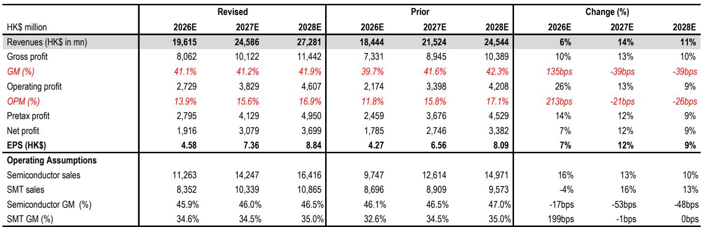
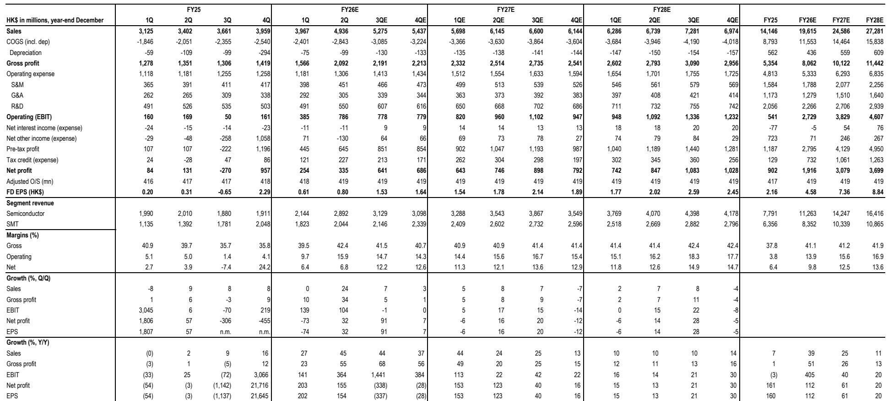
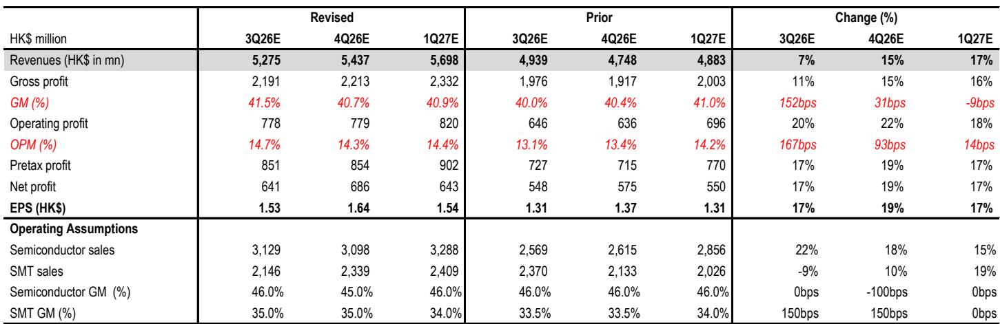

# JPM：资金结构与相关数据观察

ASMPT在7月底公布的2Q26业绩和三季度指引均明显高于市场预期。JPM在最新报告中把2026至2028年每股盈利预测上调7%至12%，核心依据不是单一产品线的爆发，而是经营杠杆、订单结构和技术路线三件事同时发生。这份报告最值得注意的判断是：热压键合（TCB）设备的增长引擎正在从存储芯片转向逻辑芯片，同时光电子业务开始贡献实质性收入。

报告给出几个具体数字。2Q26收入49.36亿港元，环比增长24%，同比增长45%；经营利润率达到15.9%，远超JPM预测的10.6%和市场一致预期的10.2%。更关键的是，7月单月来自头部OSAT客户的C2S逻辑TCB设备订单超过50台，直接支撑了三季度订单环比高个位数增长的指引。这些数据合在一起说明，ASMPT的增长叙事已经从"HBM4何时恢复"切换到"逻辑先进封装和光电子能贡献多少增量"。

## 1. 逻辑TCB订单放量，C2W有望成为下一阶段增长点

报告指出，7月超过50台C2S TCB工具订单来自领先OSAT客户，ASMPT在这一细分市场占据接近100%的份额。JPM认为，OSAT创纪录的资本开支正在转化为设备研究，C2S需求会继续走强。更值得关注的判断是C2W：随着更多AI加速器转向基于SoIC的Chiplet封装，CoWoS中的C2W步骤将强制使用TCB以应对大封装尺寸的翘曲问题。AMD MI450是第一个朝这个方向走的产品，但报告认为2027年下半年可能出现更大规模的迁移。

> **KC评论：** 逻辑TCB的订单数据比存储更值得跟踪。7月50台C2S订单已经是可核验的月度数字，而C2W的放量时间点报告给的是2027年下半年，中间存在时间差，订单能见度需要逐季验证。

英特尔EMIB-T也被视为C2S需求的关键驱动因素。基板内嵌入式芯片放置需要高强度的细间距TCB工具，这不仅是最终C2S步骤的需求，还增加了中间环节的设备用量。报告预计未来两年逻辑TCB仍是TCB增长的主要引擎，C2W则成为新的增长向量。

## 2. 存储TCB上半年同比下滑，HBM4出货重启决定下半年节奏

存储TCB的情况比逻辑复杂。由于HBM4相关设备向某家韩国大客户出货延迟，ASMPT上半年存储TCB收入同比下滑，韩国地区收入同比下降65%。JPM认为存储TCB将在下半年恢复动能，HBM4订单开始出货，并延续到2027年。

管理层还提到JEDEC可能放宽堆叠厚度标准，从当前的775微米放宽到900微米。如果落地，TCB的生命周期可能从HBM4延伸到HBM5。但报告同时给出一个反向观察：部分公司正在为未来HBM世代降低堆叠高度，例如英伟达Rubin和AMD MI450的某些版本可能采用8层HBM4，16层即使在HBM4e时代也可能只是小众配置。这会限制TCB工具的需求上限。

ASMPT正在与一家头部存储厂商（报告认为是三星电子）就HBM5技术标准进行联合评估，采用无焊剂TCB方案。JPM将此视为ASMPT在韩国客户中巩固地位的积极信号。

> **KC评论：** JEDEC标准放宽和堆叠高度降低是两股相反的力量。前者延长TCB生命周期，后者压缩单设备用量。报告两者都写了，但市场往往只记住前者，忽略后者对需求弹性的约束。

## 3. 光电子收入半年增长两倍，CPO布局打开设备市场空间

光电子是这份报告新增的重点。ASMPT上半年光电子收入达到7500万美元，同比增长两倍。当前收入主要由800G和1.6T可插拔光模块驱动，公司参与了多个工艺步骤：SMT用于DSP和无源元件贴装，SEMI用于收发器贴装、芯片基座组装和光电附件。

CPO方面的布局更值得注意。ASMPT Amicra在可插拔收发器芯片贴装领域占据主导地位，公司已与多家领先CPO厂商就TCB、混合键合和超高精度光电子方案展开合作。JPM据此判断，ASMPT的芯片贴装潜在市场（TAM）在未来2至3年可能增长2至3倍。

## 4. 主流SEMI业务受益于OSAT高稼动率，SMT战略选项仍在推进

主流SEMI业务（包括引线键合和芯片键合）上半年增长显著，驱动因素是头部OSAT的高稼动率。AI外围需求（如电源管理）和传统应用（消费、工业、汽车）的复苏同时发生。管理层预计AI和传统两端的强势都会延续到下半年。JPM将2026和2027年主流SEMI增长预测上调至59%和15%。

SMT业务二季度订单创历史新高，主要由AI服务器需求驱动。报告认为公司仍在为SMT业务探索战略选项，近期订单和积压订单的改善意味着更高的退出估值。出售所得资金将支持先进封装和其他高增长领域的加速研究。

## 5. 经营杠杆兑现，利润率上调是盈利预测上修的核心

2Q26经营利润环比增长超过一倍，而收入环比增长24%，经营利润率达到15.9%，比市场预期高出573个基点。JPM将2026至2028年经营利润率预测上调至14%、16%和17%，并相应上调每股盈利预测7%至12%。报告认为，未来几个季度经营杠杆仍会持续，尽管下半年运营支出可能因佣金费用环比增加。

> **KC评论：** 这份报告最值得关注的不是收入增速，而是利润率跳升的斜率。2Q26经营利润率从上一季度的个位数跳到15.9%，如果三季度能维持在这个水平附近，全年盈利预测还有进一步上修空间。

整体来看，JPM对ASMPT的核心判断是：存储TCB的暂时性下滑掩盖了逻辑TCB和光电子的结构性增长，而经营杠杆的释放让利润增速显著快于收入增速。C2W的突破时间点、JEDEC标准调整的落地节奏，以及SMT业务战略选项的最终结果，是后续需要逐季验证的变量。

For informational purposes only. Portions may be generated,translated,summarized,or edited with AI assistance based on source materials and may contain omissions or errors. Please verify independently. This is not investment,legal,tax,accounting,or other professional advice.

For informational purposes only. Portions may be generated,translated,summarized,or edited with AI assistance based on source materials and may contain omissions or errors. Please verify independently. This is not investment,legal,tax,accounting,or other professional advice.

