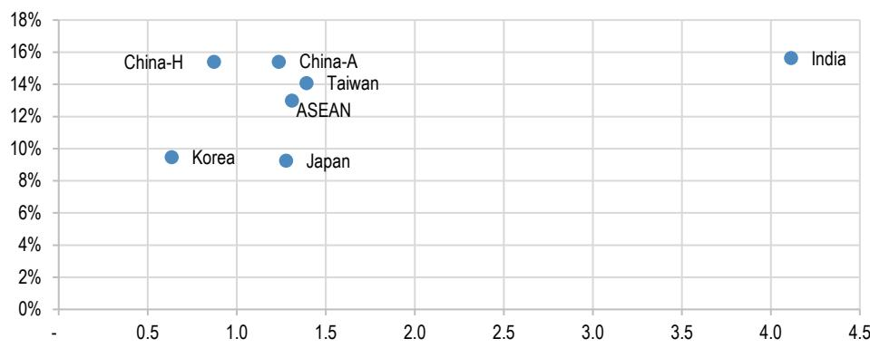
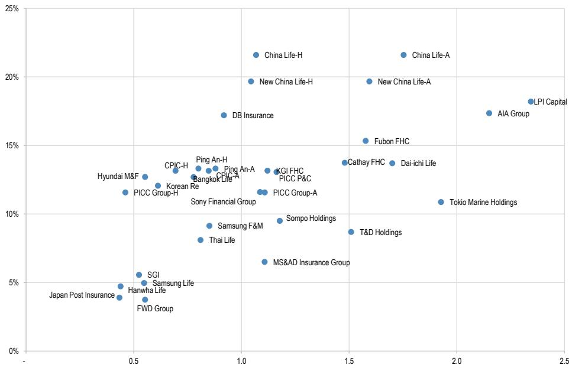
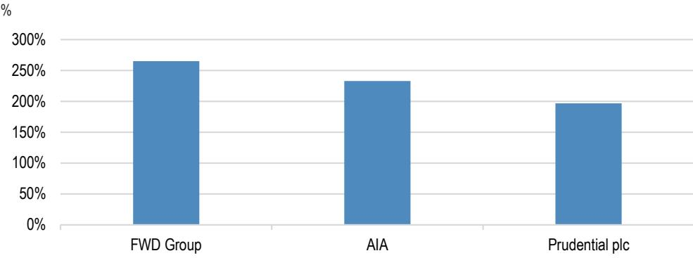
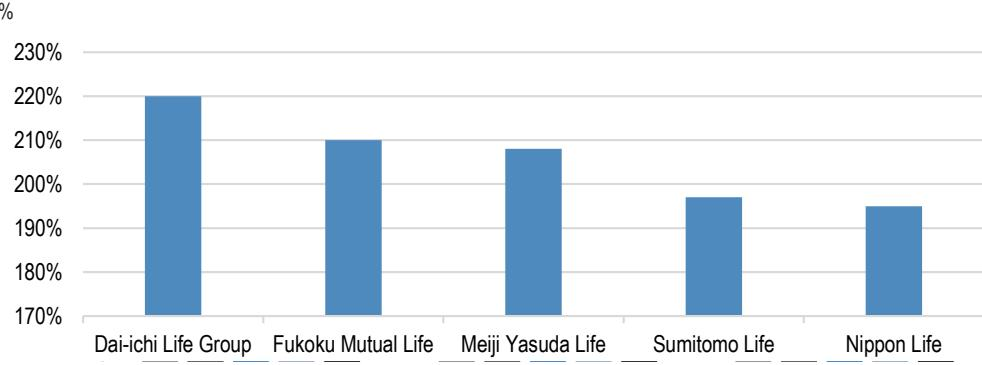
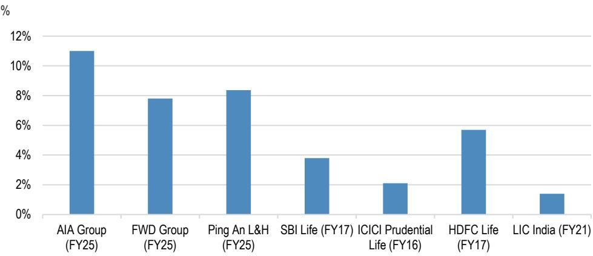
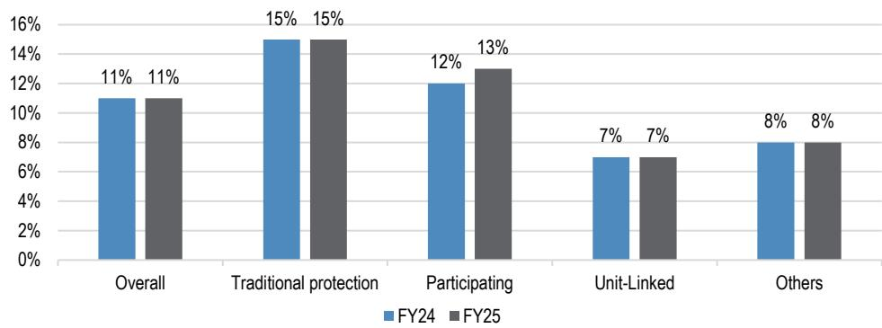
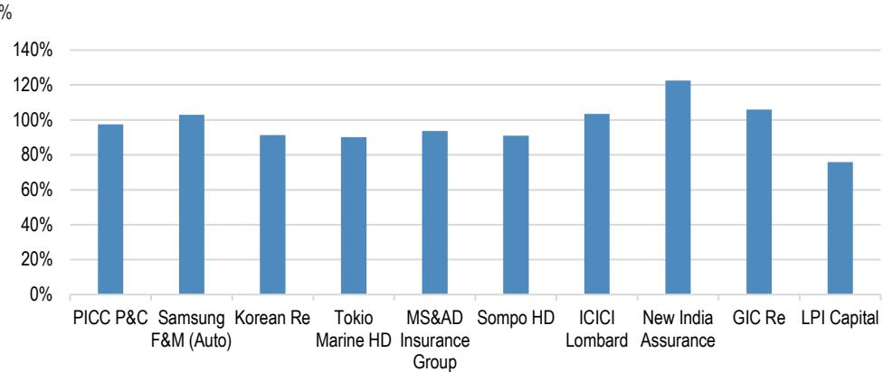
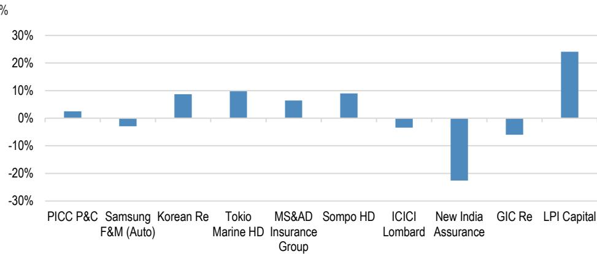
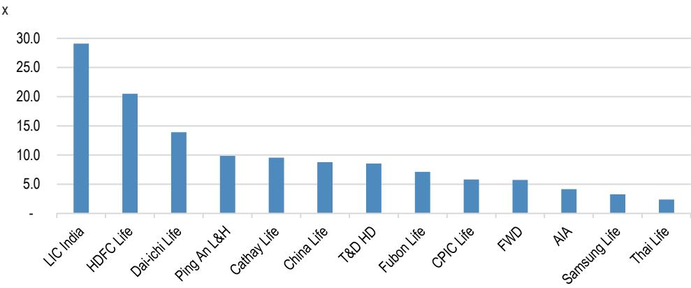

本材料不面向中国内地读者分发，亦不构成在中国内地境内提供证券投资咨询服务。未经JPM书面同意，不得转载、出售或重新分发本材料或其任何部分。

## 亚洲保险业

## 夏季系列：保险业中的杠杆；回报表现可观，但并非没有代价

杠杆是保险经济的一个核心特征。保费预先收取，赔付在之后发生，由此产生的浮存金使保险公司能够在相对其资本基础更大的资产负债表上运营。这就是该行业将通常低于10%的微薄承保利润率转化为可观回报表现的方式。代价同样明确：更高的杠杆带来了对承保周期、资产市场、融资环境和偿付能力状况更高的敏感性。对于股权读者而言，杠杆处于估值讨论的中心。过多的过剩资本会摊薄回报表现，但过高的杠杆会提高隐含的股权成本，并可能导致估值折价。正确的问题不在于杠杆是好是坏，而在于杠杆的使用是否具备足够的资本韧性和盈利质量。在本报告中，我们通过三个视角评估保险杠杆：承保杠杆、资产杠杆和财务杠杆。总体而言，我们认为行业杠杆处于可控范围，除非发生严重的宏观冲击。我们的股权选择包括友邦保险、平安-H、T&D控股、三星火灾海上保险、富邦金控、SBI人寿和泰国人寿。在信用方面，我们的选择包括日本的明治安田生命和香港的友邦保险。

- **承保杠杆**。这衡量的是每单位资本所承担的保险风险。对于非寿险，我们使用净已赚保费与IFRS账面价值的倍数。对于寿险，我们使用资产负债表上的保险准备金与IFRS账面价值的倍数。其吸引力显而易见：每1美元盈余对应3美元保费，以5%的承保利润率计算，可产生15%的盈余回报。风险同样显而易见：周期性、不利的理赔发展和准备金薄弱可能迅速侵蚀回报。在亚洲，拥有保守准备金历史的保险公司似乎享有估值溢价和较低的波动性。这些公司包括友邦保险、三星生命和泰国人寿。

- **资产杠杆**。这衡量的是每单位资本所承担的投资风险，使用总资产除以IFRS账面价值。在10倍资产杠杆下，在其他条件相同的情况下，投资回报表现提高1%可为税前回报表现增加10个百分点。然而，当利率、利差、股权市场或信用损失对资产负债表不利时，同样的杠杆可能对资本、账面价值和偿付能力比率造成压力。亚洲寿险/非寿险公司的平均资产杠杆分别为14倍/4倍，反映了负债久期和现金流特征的差异。印度保险公司较高的资产杠杆似乎反映了简单的产品结构和较宽松的偿付能力资本框架，而友邦保险、三星生命和泰国人寿则显得更为保守。

- **财务杠杆**。这衡量的是每单位资本所承担的债务风险，使用借款除以借款、IFRS账面价值和净CSM之和。债务可以在不稀释股权的情况下为增长或并购提供资金，但其灵活性不如股权。在压力时期，子公司现金回流减弱和再融资条件收紧可能对控股公司流动性、股息和股东总回报造成压力。因此，偿债能力是评估财务杠杆时的另一个重要视角。

- **偿付能力是约束条件**。偿付能力比率将可用资本与所需资本进行比较。更高的杠杆可以提高回报表现，但通常会增加所需资本并降低偿付能力缓冲。因此，偿付能力框架旨在抑制过度杠杆，特别是在承保、资产或债务风险可能在压力下削弱资本韧性的情况下。在亚洲，寿险/非寿险公司FY26E平均回报表现为13%/12%。

## 保险业

MW Kim AC
(852) 2800-8517
mw.kim@JPM.com
JPM证券（亚太）有限公司/JPM经纪（香港）有限公司

Koki Sato AC
(81-3) 6736-8609
koki.sato@JPM.com
JPM证券日本有限公司

Jemmy S Huang AC
(886-2) 2725-9870
jemmy.s.huang@JPM.com
JPM证券（台湾）有限公司/JPM证券（亚太）有限公司/JPM经纪（香港）有限公司

(91-22) 6157-3594
madhukar.ladha@JPM.com
JPM印度私人有限公司，JPM Tower, Off. C.S.T. Road, Kalina, Santacruz - East, Mumbai - 400098，SEBI注册号：INH000001873，(91-22) 6157-3000。

Dan Wang
(86-21) 6106-6349
dan.wang@JPM.com
SAC注册号：S1730524080001
JPM证券（中国）有限公司

Julia Kim
(852) 2800-8540
julia.c.kim@JPM.com
JPM证券（亚太）有限公司/JPM经纪（香港）有限公司

Emma Xing
(852) 2800-8727
emma.xing@JPM.com
JPM证券（亚太）有限公司

(81-3) 6736-8619
yuka.azami@JPM.com
JPM证券日本有限公司

Amanda Chang
(886-2) 2725-9861
amanda.chang@JPM.com
JPM证券（台湾）有限公司

分析师认证和重要披露，包括非美国分析师披露，请参见第24页。

## 即将举行的网络研讨会 - 8月5日下午4点（香港时间）/上午9点（英国时间）

资本运用——探索杠杆，从资本充足到资本效率（注册）

## 相关出版物

亚洲保险：夏季系列：寿险公司分析：股息需要现金，而不仅仅是IFRS利润，2026年7月21日

亚洲保险：夏季系列：超越所有缩写的偿付能力资本指南，2026年7月14日

亚洲保险：夏季系列：中国的人形机器人为财险增长开辟新领域，2026年6月22日

亚洲保险：夏季系列：中国海上保险：海上风险的战略回归，2026年7月6日

## 投资论点

## 保险杠杆：风险与回报的三个视角

我们夏季系列的最后一篇报告聚焦于保险杠杆的三个关键衡量指标：1）承保杠杆，2）资产杠杆，3）财务杠杆。杠杆是保险经济的核心。保险公司今天承担风险以换取未来的义务：保费预先收取，而理赔和给付在之后发生。这种时间差在保单持有人负债结算之前创造了一个可观的可投资资本池。这产生了三种不同形式的杠杆。首先，承保杠杆捕捉了相对于资本基础所承保的保险风险规模。其次，资产杠杆衡量了相对于IFRS资本的投资资产负债表规模。第三，财务杠杆反映了整体资本结构中债务的使用情况。

根据现有财务数据，我们的观察是，亚洲保险公司历来更关注“资本充足”而非“资本效率”。因此，资产负债表的杠杆管理似乎比发达市场更为保守。我们认为，该地区相对较低的承保杠杆可能反映了几个因素：每单位资本消耗的承保盈利能力较低，鉴于寿险中低利润率储蓄产品的历史主导地位；非寿险产品承保周期性更强；相对于发达市场保险公司，风险建模经验不够成熟；监管对定价的干预，包括汽车保险和医疗责任险；以及用于长期风险建模的经验表发展不足，特别是发病率风险。

话虽如此，我们认为亚洲保险公司的杠杆指标是可控的，除非在可预见的未来发生严重的宏观冲击。我们的股权选择包括友邦保险、平安-H、T&D控股、三星火灾海上保险、富邦金控、SBI人寿和泰国人寿。在信用方面，我们的首选包括日本的明治安田生命和香港的友邦保险。

图1：亚洲保险：各市场FY26E P/B与回报表现对比

来源：彭博财经、JPM估计。价格数据截至2026年7月28日。

总的来说，保险是一种受到严格监管的金融产品，承保利润率通常较低，往往低于10%，在许多情况下约为5%或更低。对于股权成本高于10%的保险公司来说，如果没有杠杆，低利润率的独立承保模式不太可能满足股东的回报预期。因此，保险公司利用杠杆将微薄的操作利润率转化为更具吸引力的回报表现。

从估值角度来看，只要杠杆使用审慎，它可以成为估值倍数扩张的重要驱动力。我们认为有两条主要途径可以提高资本效率：减少稀释回报表现的过剩资本，以及通过适当使用杠杆提高盈利能力。关键在于在高回报和足够的偿付能力韧性之间取得适当的平衡。代价是资产负债表的敏感性。更高的杠杆可以提高回报表现，但也增加了对承保波动、资产市场变动、融资环境和偿付能力压力的敞口。

监管机构通过偿付能力资本框架来解决这个问题，该框架旨在限制过度杠杆并保护保单持有人。更高的杠杆通常会增加所需资本，这反过来在其他条件相同的情况下降低了偿付能力比率。最低偿付能力要求，加上股息批准的监管门槛，作为通过市场和承保周期保护客户的工具。此外，通过仅承认债务融资的一部分作为相对于所需资本的可用资本，监管机构阻止保险公司承担过度的资产负债表杠杆。

对于股权读者来说，这创造了一个明确的估值讨论。过剩资本可能因资本配置效率低下和回报表现稀释而受到批评，但过度杠杆也会因资产负债表风险较高而受到惩罚。在实践中，读者通常通过更高的隐含股权成本和在许多情况下的估值折价来反映杠杆上升。

因此，保险公司面临的核心挑战是在维持足够的偿付能力缓冲的同时，产生高于股权成本的可持续回报表现。在亚洲，寿险和非寿险公司FY26E平均回报表现分别为13%和12%（图1）。

图2：亚洲保险：各公司FY26E P/B与回报表现对比 x, %

来源：彭博财经、JPM估计。注：1）价格数据截至2026年7月28日。2）为简化展示，印度被排除在外。

表1：亚洲保险：估值对比表
本币，%，x

<table><tr><td>公司</td><td>彭博代码</td><td>评级</td><td>价格（2026年7月28日）</td><td>目标价（2026年12月）</td><td>上行/下行空间</td><td>市盈率 26e</td><td>市盈率 27e</td><td>市净率 26e</td><td>市净率 27e</td></tr><tr><td colspan="10">中国</td></tr><tr><td>友邦保险集团</td><td>1299 HK Equity</td><td>增持</td><td>77.9</td><td>112.0</td><td>44%</td><td>13</td><td>11</td><td>2.2</td><td>2.0</td></tr><tr><td>富卫集团</td><td>1828 HK Equity</td><td>增持</td><td>29.5</td><td>47.0</td><td>60%</td><td>17</td><td>13</td><td>0.6</td><td>0.5</td></tr><tr><td>中国人寿-H</td><td>2628 HK Equity</td><td>增持</td><td>27.9</td><td>40.0</td><td>43%</td><td>5</td><td>4</td><td>1.1</td><td>1.0</td></tr><tr><td>中国人寿-A</td><td>601628 CH Equity</td><td>中性</td><td>40.2</td><td>39.0</td><td>-3%</td><td>20</td><td>18</td><td>1.8</td><td>1.7</td></tr><tr><td>平安-H</td><td>2318 HK Equity</td><td>增持</td><td>57.1</td><td>90.0</td><td>58%</td><td>7</td><td>6</td><td>0.8</td><td>0.7</td></tr><tr><td>平安-A</td><td>601318 CH Equity</td><td>增持</td><td>54.2</td><td>83.0</td><td>53%</td><td>7</td><td>7</td><td>0.9</td><td>0.8</td></tr><tr><td>太保-H</td><td>2601 HK Equity</td><td>增持</td><td>30.0</td><td>43.0</td><td>43%</td><td>6</td><td>6</td><td>0.7</td><td>0.6</td></tr><tr><td>太保-A</td><td>601601 CH Equity</td><td>增持</td><td>31.7</td><td>50.0</td><td>58%</td><td>7</td><td>7</td><td>0.8</td><td>0.8</td></tr><tr><td>新华保险-H</td><td>1336 HK Equity</td><td>中性</td><td>47.6</td><td>45.0</td><td>-6%</td><td>6</td><td>5</td><td>1.0</td><td>1.0</td></tr><tr><td>新华保险-A</td><td>601336 CH Equity</td><td>中性</td><td>62.8</td><td>59.0</td><td>-6%</td><td>8</td><td>8</td><td>1.6</td><td>1.5</td></tr><tr><td>人保集团-H</td><td>1339 HK Equity</td><td>中性</td><td>5.3</td><td>5.8</td><td>9%</td><td>6</td><td>5</td><td>0.5</td><td>0.4</td></tr><tr><td>人保集团-A</td><td>601319 CH Equity</td><td>中性</td><td>7.5</td><td>6.9</td><td>-8%</td><td>12</td><td>10</td><td>1.1</td><td>1.0</td></tr><tr><td>人保财险</td><td>2328 HK Equity</td><td>中性</td><td>16.2</td><td>14.0</td><td>-14%</td><td>9</td><td>8</td><td>1.2</td><td>1.1</td></tr><tr><td colspan="10">韩国</td></tr><tr><td>三星生命*</td><td>032830 KP Equity</td><td>增持</td><td>285,000</td><td>580,000</td><td>104%</td><td>13</td><td>13</td><td>0.5</td><td>0.5</td></tr><tr><td>韩华人寿</td><td>088350 KP Equity</td><td>减持</td><td>4,295</td><td>2,100</td><td>-51%</td><td>7</td><td>8</td><td>0.4</td><td>0.4</td></tr><tr><td>三星火灾海上保险*</td><td>000810 KP Equity</td><td>增持</td><td>609,000</td><td>800,000</td><td>31%</td><td>11</td><td>10</td><td>0.9</td><td>0.8</td></tr><tr><td>现代海上火灾保险</td><td>001450 KP Equity</td><td>减持</td><td>38,450</td><td>22,000</td><td>-43%</td><td>5</td><td>4</td><td>0.6</td><td>0.5</td></tr><tr><td>DB保险</td><td>005830 KP Equity</td><td>增持</td><td>159,000</td><td>250,000</td><td>57%</td><td>5</td><td>5</td><td>0.9</td><td>0.9</td></tr><tr><td>韩国再保险</td><td>003690 KP Equity</td><td>增持</td><td>13,600</td><td>17,000</td><td>25%</td><td>5</td><td>7</td><td>0.6</td><td>0.6</td></tr><tr><td>首尔保证保险</td><td>031210 KP Equity</td><td>增持</td><td>41,700</td><td>90,000</td><td>116%</td><td>10</td><td>8</td><td>0.5</td><td>0.5</td></tr><tr><td colspan="10">东盟</td></tr><tr><td>曼谷人寿**</td><td>BLA TB Equity</td><td>增持</td><td>25.5</td><td>29.1</td><td>14%</td><td>6</td><td>6</td><td>0.8</td><td>0.7</td></tr><tr><td>泰国人寿**</td><td>TLI TB Equity</td><td>增持</td><td>11.7</td><td>17.5</td><td>50%</td><td>10</td><td>9</td><td>0.8</td><td>0.8</td></tr><tr><td>LPI资本</td><td>LPI MK Equity</td><td>增持</td><td>15.0</td><td>20.0</td><td>33%</td><td>13</td><td>12</td><td>2.3</td><td>2.3</td></tr><tr><td colspan="10">台湾</td></tr><tr><td>国泰金控***</td><td>2882 TT Equity</td><td>增持</td><td>95.4</td><td>130.0</td><td>36%</td><td>11</td><td>11</td><td>1.5</td><td>1.3</td></tr><tr><td>富邦金控***</td><td>2881 TT Equity</td><td>增持</td><td>125.5</td><td>69.8</td><td>-44%</td><td>11</td><td>12</td><td>1.6</td><td>1.4</td></tr><tr><td>开发金控***</td><td>2883 TT Equity</td><td>增持</td><td>29.6</td><td>41.0</td><td>39%</td><td>10</td><td>10</td><td>1.1</td><td>1.0</td></tr><tr><td></td><td></td><td></td><td rowspan="2">价格（2026年7月28日）</td><td rowspan="2">目标价（2026年12月）</td><td rowspan="2">上行/下行空间</td><td rowspan="2">市盈率 FY27e</td><td rowspan="2">市盈率 FY28e</td><td rowspan="2">市净率 FY27e</td><td rowspan="2">市净率 FY28e</td></tr><tr><td>日本</td><td>彭博代码</td><td>评级</td></tr><tr><td>第一生命</td><td>8750 JT Equity</td><td>中性</td><td>1,903</td><td>1,900</td><td>0%</td><td>13</td><td>13</td><td>1.7</td><td>1.7</td></tr><tr><td>T&D控股</td><td>8795 JT equity</td><td>增持</td><td>5,032</td><td>5,300</td><td>5%</td><td>17</td><td>11</td><td>1.5</td><td>1.5</td></tr><tr><td>日本邮政保险</td><td>7181 JT Equity</td><td>增持</td><td>1,753</td><td>1,790</td><td>2%</td><td>12</td><td>11</td><td>0.4</td><td>0.4</td></tr><tr><td>索尼金融集团</td><td>8729 JP Equity</td><td>中性</td><td>156.1</td><td>150</td><td>-4%</td><td>446</td><td>17</td><td>1.1</td><td>1.0</td></tr><tr><td>MS&AD保险集团***</td><td>8725 JT Equity</td><td>中性</td><td>5,039</td><td>5,000</td><td>-1%</td><td>13</td><td>11</td><td>1.1</td><td>1.1</td></tr><tr><td>东京海上控股***</td><td>8766 JT Equity</td><td>中性</td><td>8,234</td><td>8,100</td><td>-2%</td><td>18</td><td>16</td><td>1.9</td><td>1.8</td></tr><tr><td>损保控股***</td><td>8630 JT Equity</td><td>中性</td><td>7,264</td><td>7,000</td><td>-4%</td><td>13</td><td>12</td><td>1.2</td><td>1.1</td></tr><tr><td colspan="10">印度****</td></tr><tr><td>HDFC人寿</td><td>HDFCLIFE IN Equity</td><td>增持</td><td>559</td><td>810</td><td>45%</td><td>53</td><td>49</td><td>5.9</td><td>5.4</td></tr><tr><td>SBI人寿</td><td>SBILIFE IN Equity</td><td>增持</td><td>1,889</td><td>2,510</td><td>33%</td><td>58</td><td>44</td><td>8.6</td><td>7.3</td></tr><tr><td>ICICI保诚人寿</td><td>IPRU IN Equity</td><td>增持</td><td>510</td><td>670</td><td>31%</td><td>51</td><td>46</td><td>4.8</td><td>4.2</td></tr><tr><td>ICICI伦巴第</td><td>ICICIGI IN Equity</td><td>增持</td><td>1,684</td><td>1,990</td><td>18%</td><td>30</td><td>23</td><td>5.0</td><td>4.4</td></tr><tr><td>新印度保险</td><td>NIACL IN Equity</td><td>中性</td><td>163</td><td>175</td><td>7%</td><td>13</td><td>9</td><td>1.1</td><td>1.0</td></tr><tr><td>印度综合再保险</td><td>GICRE IN Equity</td><td>增持</td><td>358</td><td>500</td><td>40%</td><td>8</td><td>7</td><td>1.1</td><td>1.0</td></tr><tr><td>印度人寿保险</td><td>LICI IN Equity</td><td>增持</td><td>427</td><td>505</td><td>18%</td><td>9</td><td>8</td><td>2.4</td><td>1.9</td></tr><tr><td>Max金融服务</td><td>MAXF IN Equity</td><td>增持</td><td>1,507</td><td>2160</td><td>43%</td><td>95</td><td>83</td><td>9.1</td><td>8.3</td></tr></table>

来源：彭博财经、JPM估计。*：目标价截至2027年6月，**：价格数据截至2026年7月27日，***：目标价截至2027年12月，****：目标价截至2027年3月。

## 固定收益

保险公司债权人相对于其股权读者的优先地位意味着他们不分享盈利增长。然而，如果杠杆增加降低了公司的韧性，他们确实会遭受损失。这种不对称性意味着更高的偿付能力更可取。事实上，这为我们的许多建议提供了依据。我们在固定收益方面的首选包括香港和日本的保险公司。

明治安田生命（债券代码：MYLIFE）是我们的首选之一。2055年到期/2035年可赎回的次级债券报价为z+189个基点（SOT+145个基点，100.1美元，6.1%），我们认为该债券相对于较弱的同行看起来价格偏低。其经济偿付能力比率为208%，与日本同行相比具有优势。

在香港保险公司中，友邦保险的2040年到期债券是首选。报价为z+137个基点（SOT+110个基点，75.8美元，5.7%），我们认为它们是该领域结构最稳健的“必须支付”票息债券。其股东资本比率为221%，我们认为这支持其信用状况。

图3：香港寿险公司偿付能力比率

集团LCSM覆盖率截至2025年12月31日
来源：公司报告

图4：日本寿险公司偿付能力比率

经济价值偿付能力比率（ESR）截至2026年3月31日
来源：公司报告

## 承保杠杆

总的来说，保险公司的盈利可以分解为两个部分：保险利润和投资利润。我们的观察是，对于寿险和非寿险公司，股权读者通常对承保盈利给予更高的估值倍数，通常在10倍至20倍市盈率左右，而对投资盈利的估值则更常见于2倍至3倍市盈率。我们认为这是因为承保利润与特许经营质量、定价纪律、风险选择和执行力更为紧密相关。

然而，保险产品受到严格监管，在许多情况下需要获得监管批准。这限制了保险公司仅通过产品定价产生结构性高利润的空间，因为重点是保护保单持有人。因此，适度的承保利润率在整个行业中很常见。对于非寿险公司和再保险公司，承保利润率通常低于10%，而对于寿险公司，利润率往往在5%或更低。

我们在图5和图8中展示了寿险和非寿险公司的这种微薄利润率情况。对于非寿险公司，我们将利润率计算为100%减去综合成本率。对于寿险公司，我们使用新业务CSM或新业务价值除以新业务保费现值（PVNBP）。

图5：亚洲寿险：产品利润率

来源：友邦保险集团、富卫集团、平安集团FY25年报及SBI人寿、ICICI保诚人寿、HDFC人寿、印度人寿保险IPO招股说明书。注：PVNBP指新业务保费现值。产品利润率按新业务价值除以PVNBP计算。

图6：友邦保险集团：按产品组划分的新业务价值利润率（PVNBP基础）%

来源：友邦保险集团FY25业绩演示材料。

## 非寿险杠杆：保费杠杆驱动承保回报表现

对于非寿险公司和再保险公司，保单期限相对较短，通常不到一年。旅行保险和汽车保险是很好的例子，因为保单通常为明确的短期期限而签发，理赔经验相对较快地显现。因此，保费量是风险敞口的有用代理指标。在这种情况下，综合成本率是衡量承保表现的关键指标，因为它捕捉了相对于已赚保费的理赔和费用：

综合成本率 =（已发生理赔和理赔费用 + 承保费用）/ 已赚保费

简单来说：

综合成本率 =（理赔 + 费用）/ 保费

因此，承保利润率可以表示为：承保利润率 = 1 - 综合成本率

承保杠杆衡量相对于资本所承保的保险风险量。对于非寿险公司和再保险公司，我们将其定义为净已赚保费除以账面价值或保单持有人盈余。这是一个实用的衡量指标，因为今天承保的保费大致对应于今天承担的理赔风险。

例如，如果一家保险公司的账面价值为1亿美元，净保费为3亿美元，则承保杠杆为3倍。简而言之，该保险公司每1美元盈余对应3美元保费。回报影响是直接的。如果该保险公司报告95%的综合成本率，则承保利润率为5%（=1-95%）。以3倍承保杠杆计算，仅承保业务就能产生15%的盈余回报。

不包括投资收益和税收，非寿险公司和再保险公司的简化回报表现等式为：

非寿险承保回报表现 =（保费 / 账面价值）x（1 - 综合成本率）

在图7和图8中，我们展示了亚洲保险公司的综合成本率和承保杠杆供参考。

一个重要的注意事项是，今天报告的综合成本率主要基于估计的最终理赔。因此，准备金充足性是分析的关键部分。理赔损失发展表有助于评估准备金是保守还是激进，这对承保利润率、准备金杠杆和偿付能力风险有直接影响。

然而，在本报告中，我们专注于杠杆的概念框架，而不是对损失发展表的详细审查。有关准备金分析的更深入探讨，包括基于Python的损失发展表建模，请参阅我们的夏季系列：亚洲保险：夏季系列：中国海上保险：海上风险的战略回归。

图7：亚洲非寿险：综合成本率趋势（FY25）

来源：各公司FY25年报、JPM计算。注：1）ICICI伦巴第基于FY26，因财年不同。2）三星火灾海上保险的综合成本率仅针对汽车业务。3）东京海上FY25综合成本率基于IFRS（90.2%），J-GAAP综合成本率为95.6%。

图8：亚洲非寿险：非寿险承保利润率

来源：各公司FY25年报、JPM计算。注：1）承保利润率按100% - 综合成本率计算。2）ICICI伦巴第基于FY26，因财年不同。3）三星火灾海上保险的综合成本率仅针对汽车业务。4）东京海上FY25综合成本率基于IFRS（90.2%），J-GAAP综合成本率为95.6%。

最后，我们强调承保盈利能力具有周期性。定价、理赔通胀、损失趋势和再保险成本都可能经历周期，为股权读者创造风险和研究线索。

## 寿险杠杆：准备金杠杆比保费量更重要

对于寿险公司，保费量作为风险敞口的衡量指标意义较小。寿险保单通常跨越更长的期限，在某些情况下可延伸至数十年。因此，当年的保费量并不能完全捕捉已生效保单中蕴含的未来风险。

定期寿险或健康保障保单是一个有用的例子。年度保费可能相对较小，但如果保险事件发生，如终末期疾病或重大疾病（包括癌症、心脏病发作或中风），保单可能产生重大的未来理赔支出。因此，关键风险不仅仅是今年的保费产出，而是已经存在于资产负债表上的长期保单义务。

总的来说，寿险承保利润来自相对于假设的有利经验，我们称之为“经验利润率”。这可能包括低于预期的死亡率、更好的发病率经验、相对于建模假设的费用节省，或更低的保单失效率，这使保险公司能够在更长时间内从现有保单中赚取费用和未来利润。换句话说，寿险业务的利润是在一个较长的时期内赚取的，而不是在销售时立即实现。

这就是为什么寿险分析从负债准备金开始。准备金代表为满足未来对保单持有人的义务而预留的金额。在IFRS-17下，这包括最佳估计负债（BEL），它反映了未来现金流的最佳估计，风险调整（RA），以及合同服务边际（CSM）。与非寿险保险不同，非寿险的保费量通常是风险敞口的有用代理指标，而寿险杠杆应更关注资产负债表上的准备金和相关资本要求。

在分析的初始阶段，准备金与账面价值的杠杆是一个有用的指标。它帮助读者评估股东权益对精算假设变化的敏感性，包括死亡率、发病率、失效率、费用和折现率。

从概念上讲，寿险承保盈利驱动因素可以表示为：

## 寿险承保盈利 = 准备金基础 x 经验利润率

为了评估寿险承保杠杆，我们将保险准备金视为IFRS账面价值或保单持有人盈余的倍数。简而言之，寿险准备金杠杆问的是：每单位资本支持多少长期保单义务？

因此，不包括投资收益和税收，寿险承保回报表现可以简化为：

## 寿险承保回报表现 =（准备金 / 账面价值）x 经验利润率

例如，假设一家寿险公司的准备金为1,000美元，账面价值为100美元。这意味着10倍准备金杠杆。如果实际经验仅将准备金盈利能力提高0.5%，利润影响将为5美元（= 1,000美元 x 0.5%）。相对于100美元的账面价值，这将为回报表现增加5%。这说明了即使准备金经验的微小改善，在准备金杠杆较高时也能产生有意义的回报表现提升。

反之亦然，这就是为什么读者密切关注负债准备金质量。准备金假设的微小变化可能对盈利和资本产生重大影响。

准备金变动与核心资本、资产负债表容量、业务增长和股息潜力密切相关。这就是为什么准备金质量和准备金杠杆是读者关注的重要领域。

使用同样的例子，假设公司的精算师得出结论，由于修订的发病率假设，健康理赔准备金需要增加仅2%。这将需要20美元（=1,000美元 x 2%）的准备金加强。在其他条件相同的情况下，账面价值将从100美元降至80美元，下降20%。这表明当准备金杠杆较高时，一个看似适度的准备金调整可能造成显著的资本损害。

在图9中，我们展示了亚洲寿险公司的准备金杠杆。总的来说，具有持续保守准备金记录的保险公司往往相对于同行享有估值溢价，并在整个周期中表现出较低的股价波动性。在我们的覆盖范围内，友邦保险集团、三星生命和泰国人寿在这方面表现突出。

图9：亚洲寿险：准备金杠杆对比

来源：各公司FY25年报。注：1）印度保险公司数据基于FY26，因财年不同。2）对于国泰金控和富
