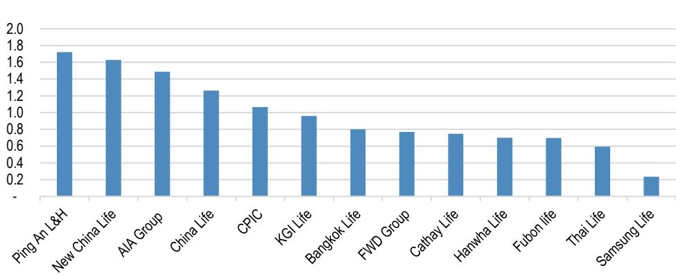
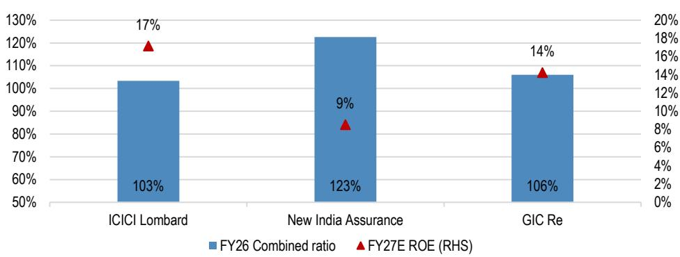

# JPM：资金结构与相关数据观察

保险业的核心宏观环境学特征，是用杠杆把承保端不足10%的薄利转化为有吸引力的ROE。保费先收、赔付后付，这段时差让保险公司得以在资本金之上运行更大的资产负债表。JPM在最新一期亚洲保险夏季系列报告中，将杠杆拆成承保杠杆、资产杠杆和财务杠杆三个维度，并给出一个总体判断：除非出现严重的宏观冲击，亚洲保险业的杠杆水平整体可控。

报告同时点出亚洲市场的特殊性。亚洲保险公司历史上更关注资本充足而非资本效率，资产负债表杠杆比发达市场保守。这背后有产品结构的原因——寿险长期以低利润率储蓄型产品为主，单位资本消耗对应的承保利润偏低；也有非寿险承保周期波动、不确定性建模经验不足、监管对车险和医疗责任险定价干预等因素。报告认为，相对较低的承保杠杆并非单一原因造成，而是多重约束叠加的结果。

## 1. 承保杠杆衡量每单位资本对应的保险不确定性

承保杠杆用净承保保费（非寿险）或保险准备金（寿险）对IFRS账面价值的倍数来衡量。报告给出的测算逻辑很直接：1美元盈余对应3美元保费，按5%承保利润率计算，就能产生15%的盈余回报。但反向不确定性同样清晰——承保周期、赔付出现变化、准备金不足都会快速侵蚀回报。

在亚洲，准备金计提保守的公司似乎享有估值溢价和更低的波动性。报告点名AIA、三星生命和Thai Life属于这一类。这个观察对理解亚洲保险股的估值分化有实际意义：市场并非对所有低杠杆公司一视同仁，而是通过准备金历史来区分杠杆质量。

## 2. 资产杠杆放大回报表现率对ROE的贡献

资产杠杆用总资产除以IFRS账面价值。报告给出一个关键倍数关系：在10倍资产杠杆下，回报表现率每提高1个百分点，税前ROE增加10个百分点。这个放大效应在利率、利差、权益市场或信用损失朝不利方向变动时，同样会作用于资本、账面价值和偿付能力。

亚洲寿险和非寿险公司的平均资产杠杆分别为14倍和4倍，差异反映负债久期和现金流特征的不同。印度保险公司资产杠杆偏高，报告认为可能与其产品结构简单、偿付能力资本框架要求较宽松有关；AIA、三星生命和Thai Life则显得更为保守。这里报告用了“似乎”一词，说明该判断基于现有财务数据的观察，而非确定结论。

> **KC评论：** 资产杠杆是理解利率敏感型保险股的关键入口。14倍杠杆意味着研究端回报表现每变动1个百分点，对寿险公司ROE的影响接近14个百分点，这个放大系数远比承保端利润率变化来得直接。

## 3. 财务杠杆与偿付能力构成约束边界

财务杠杆用借款除以借款、IFRS账面价值和净CSM之和来衡量。债务可以为增长或并购提供资金而不稀释股权，但灵活性不如股权。在不确定性时期，子公司现金上缴能力减弱和再融资条件收紧，会同时影响控股公司流动性、分红和股东总回报。

偿付能力是最终的约束条件。高杠杆能提升ROE，但通常也增加最低资本要求、压缩偿付能力缓冲。监管框架的设计初衷就是抑制过度杠杆，尤其是那些可能在不确定性情景下削弱资本韧性的承保、资产或债务不确定性。报告给出的亚洲寿险和非寿险公司FY26E平均ROE分别为13%和12%，这个水平能否持续覆盖股权成本，取决于杠杆使用是否留有足够的安全边际。

## 4. 股权与债权读者对杠杆的定价逻辑不同

报告在固定收益部分点出一个不对称性：保险公司债权人的受偿顺序优先于股权读者，因此不分享盈利上升的好处，却要承担杠杆上升带来的韧性下降。这种不对称意味着，对债权人而言，更高的偿付能力总是更可取。报告在信用端的首选包括日本的明治安田生命和香港的AIA，理由分别是宏观环境偿付能力比率208%优于日本同业，以及股东资本比率221%对信用状况形成支撑。

同一份杠杆数据，股权读者看的是ROE提升空间，债权读者看的是节奏变化保护厚度。两种视角的差异，恰恰说明杠杆本身没有相对的好坏，关键在资本韧性和盈利质量的配合。

> **KC评论：** 报告把偿付能力比率放在信用分析的中心位置，这个框架对理解保险债定价很有用。208%和221%的偿付能力水平，在同类发行体中属于偏保守的一端，对应的是更厚的缓冲垫，而非更高的票息补偿。

亚洲保险业当前处于一个微妙的平衡点：资本充足但效率偏低，杠杆保守但ROE尚可。报告给出的观察框架——承保、资产、财务三重杠杆叠加偿付能力约束——为区分不同公司的杠杆质量提供了可复用的分析路径。真正需要持续跟踪的，是那些准备金历史不够透明、资产杠杆偏高且偿付能力缓冲偏薄的公司，在利率和信用环境变化时的实际表现。

For informational purposes only. Portions may be generated,translated,summarized,or edited with AI assistance based on source materials and may contain omissions or errors. Please verify independently. This is not investment,legal,tax,accounting,or other professional advice.

For informational purposes only. Portions may be generated,translated,summarized,or edited with AI assistance based on source materials and may contain omissions or errors. Please verify independently. This is not investment,legal,tax,accounting,or other professional advice.
