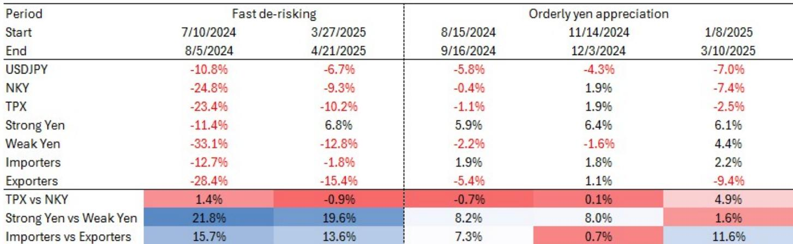
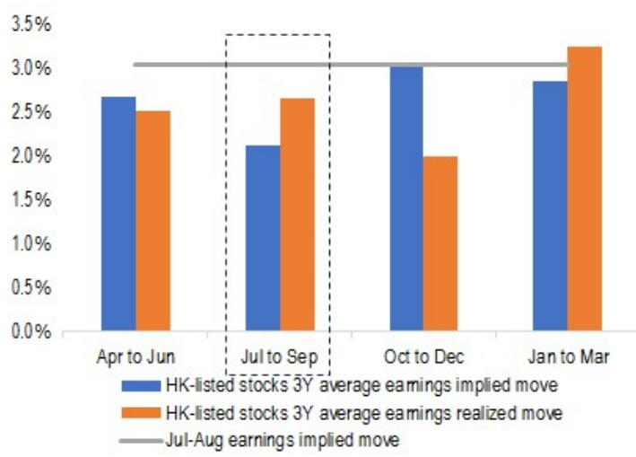
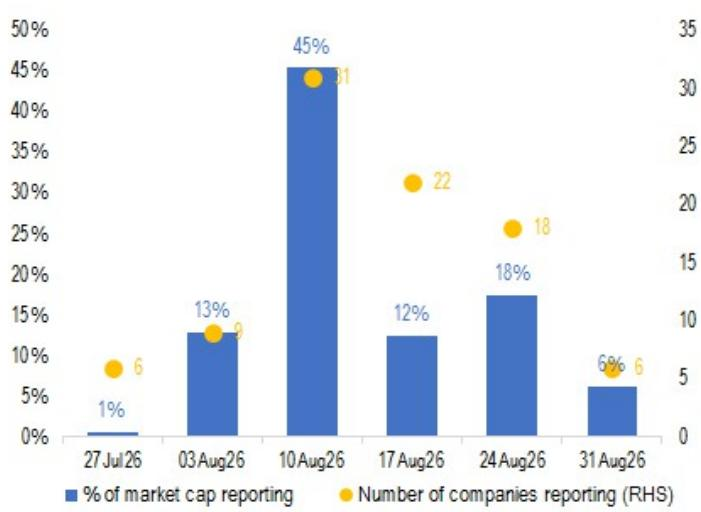

# 日元汇率波动风险下的配置思路：从指数对冲转向主题篮子

随着美元兑日元汇率在2026年第四季度接近164的预测水平，8月窗口已成为日元阶段性走强风险的关键观察期，而权益衍生品市场已发出信号：宽泛的指数对冲可能不足以应对这一风险。日本国债回报表现上升、日本央行加息预期以及8月7日GPIF（日本政府养老金投资基金）6月底持仓数据的公布，三者叠加形成了政策驱动的催化因素，可能促使资金从今年主导日本市场表现的拥挤的出口商及AI相关交易中轮动出来。那些通过日经指数敞口和出口类篮子享受日元贬值顺风的读者，如今面临一个显著的不对称性：推动其回报的宏观力量同样可能迅速逆转这些回报，而历史经验表明，主题篮子——而非指数看跌期权——才是表达这一风险最精准的工具。

关键在于区分有序的日元升值与快速的去风险化阶段。在美元兑日元有序回落的过程中，日元走强篮子（JPJBSYEN）和进口商篮子（JPJBIMPO）历史上均能实现相对收益，提供真正的对冲而非仅仅是相对保护。而在快速去风险化阶段——如2024年8月的套息交易平仓或2025年4月的“解放日”事件——这些篮子虽然仍跑赢对应标的，但更多体现为相对韧性而非相对收益。这种分化对读者如何构建对冲具有深远意义：日元走强篮子或进口商篮子的零成本看涨价差领口结构适用于表达有序回落观点，而挂钩美元兑日元下行的日经/东证指数最优看跌期权则用于应对尾部风险情景。2024年8月的事件中，日经指数下跌24.8%而日元走强篮子仅下跌11.4%，表明表达机制的选择与方向性观点本身同样重要。

当前市场结构中浮现的第二个主题，是在波动率上升的环境下分散配置韩国回购篮子（JPKRBUBK）的合理性。随着韩国“价值提升计划”从信号阶段进入执行阶段——辅以股息税减免和披露标准的提高——该篮子提供了一种与政策动能同向而非逆向的防御性权益表达。随着始于6月和7月的动量平仓持续发酵，韩国回购篮子展现出韧性，使其成为读者在维持权益敞口的同时降低日本出口商和AI板块集中度风险的一个有吸引力的分散工具。

## 8月政策日历构成日元走强的集中窗口，需要提前布局

8月风险窗口的时点并非随意设定，而是特定政策日历与市场头寸拉伸状态相交汇的产物。美元兑日元接近164的预测目标，意味着汇率已计入大量日元贬值预期，在均值回归力量占据主导之前，进一步贬值的空间已相当有限。更重要的是，日元走弱的驱动因素正从货币政策分化转向国内利率动态，这一转变改变了风险的性质。

随着日本央行进一步正常化预期的升温，日本国债回报表现持续上升，但更值得关注的发展是围绕政府增长举措和潜在消费税下调的财政不确定性。这一财政角度之所以重要，是因为它改变了政策响应函数：当局的焦点正从汇率稳定转向控制国债回报表现上升。当政策目标变为回报表现管控而非汇率防御时，推动日元走强的措施——如鼓励国内对日本国债的需求——出台的可能性将显著增加。

8月7日GPIF持仓数据的公布是可能将上述预期具体化的特定催化剂。虽然该公布并非战略资产配置评估，但读者将密切关注其是否显示国内债券持仓持续增加。如果数据显示GPIF确实在向国内债券倾斜，将强化这样一种叙事：政策制定者正通过国内需求协调更广泛的利率市场稳定努力。外汇策略师估计的日元兑美元升值15日元的尾部风险情景，将代表向国内资产的持续再配置——这一情景虽然不是核心预期，但恰恰是期权市场设计用于对冲的那类尾部风险。

在这一宏观背景下，头寸数据同样值得关注。今年外资对日本股票的净买入使市场容易受到季节性获利了结的影响，而出口商和AI相关板块的集中意味着日元逆转将触发双重效应：汇率驱动的盈利修正与头寸平仓相互叠加。6月和7月的调整已经预示了这一动态，动量平仓比往常来得更早。但平仓提前发生并不意味着已经完成；外资敞口仍然可观，8月的政策窗口可能以更大强度重新点燃轮动。

## 主题篮子框架区分有序与无序的日元回落，表达工具的选择至关重要

JPM汇率敏感主题篮子提供了一个比指数层面工具更精细的日元观点表达框架。日元走强篮子（JPJBSYEN）拥有94%的国内收入敞口，与美元兑日元呈负相关（-14%）和负贝塔（-0.21），是日元走强利好国内导向型企业的最纯粹表达。其集中于零售贸易（31%）、食品（19%）和服务业（17%）的构成，意味着它捕捉了在出口主导的上涨行情中被忽视的日本消费和国内需求侧。

进口商篮子（JPJBIMPO）提供了互补但不同的敞口。凭借78%的国内收入和接近零的美元兑日元相关性，它捕捉的是日元升值时受益于投入成本下降的企业——食品（37%）、钢铁（37%）和纸浆与造纸（16%）是最大的行业组。接近零的相关性尤其有价值，因为这意味着无论日元方向如何，该篮子都能提供分散化收益，同时在日元走强降低成本压力时仍具有上行空间。

与日元走弱篮子（JPJBWYEN）和出口商篮子（JPJBEXPO）的对比十分鲜明。日元走弱篮子与美元兑日元呈正相关（15%）和正贝塔（0.41），国内收入占60%、海外占40%——这一特征今年迄今实现了20.6%的回报，但承载着显著的逆转风险。出口商篮子仅有33%的国内收入，贝塔为0.45，敞口更为集中，主要分布在电气设备（32%）、运输设备（14%）和机械（13%）。出口商篮子36.4%的实际波动率与进口商篮子15.7%的对比量化了风险差异：今年有效的交易恰恰是逆转风险最大的交易。

这些篮子之间的相对价值表达提供了额外的精细度。日元走弱篮子相对于日元走强篮子在机械（+17.5%）和电气设备（+16%）上净超配，在零售贸易（-24%）上净低配。出口商篮子相对于进口商篮子更为集中，在电气设备（+35%）上净超配，在食品（-34%）和钢铁（-36%）上净低配。当美元兑日元变动与更广泛的出口商和AI领导板块轮动同时发生时，这些相对价值交易尤为相关，因为它们捕捉的是板块轮动动态而不仅仅是汇率效应。

## 历史日元走强阶段揭示一致模式：有序回落中日元走强和进口商篮子有效，快速去风险化需要不同的对冲结构

自2024年以来五次日元走强阶段的历史表现数据提供了一个清晰的决策框架。在三次有序日元升值阶段——2024年8月至9月、2024年11月至12月以及2025年1月至3月——日元走强篮子分别上涨5.9%、6.4%和6.1%，进口商篮子分别上涨1.9%、1.8%和2.2%。这些是相对收益而不仅仅是相对表现，确认了这些篮子在受控的美元兑日元回落中确实起到真正对冲的作用。

两次快速去风险化阶段则呈现不同图景。在2024年8月的套息交易平仓中，日元走强篮子下跌11.4%，进口商篮子下跌12.7%，但日元走弱篮子下跌33.1%，出口商篮子下跌28.4%，日经指数下跌24.8%，东证指数下跌23.4%。相对表现令人瞩目：日元走强篮子相对于日元走弱篮子实现了21.8%的相对收益，进口商篮子相对于出口商篮子实现了15.7%。在2025年4月的“解放日”事件中，这一模式重现，日元走强篮子实际上涨6.8%，而日元走弱篮子下跌12.8%，出口商篮子下跌15.4%。

这意味着对冲工具的选择取决于情景概率分布。对于认为有序美元兑日元回落更有可能的读者——或许因为政策响应是审慎的且日本央行清晰传达其意图——日元走强篮子或进口商篮子的零成本看涨价差领口结构是合适的表达。这些结构提供篮子升值的上行参与，同时限制对冲成本。对于更担心尾部风险平仓的读者，挂钩美元兑日元下行的日经/东证指数最优看跌期权更为简洁，因为它直接针对权益贝塔占主导、即使防御性篮子也相对下跌的情景。

挂钩美元兑日元下行的东证指数优于日经指数表现的结构是第三种表达，它在不对汇率本身采取方向性观点的情况下捕捉板块轮动动态。日经指数在电气设备上的集中度更高（37%对东证的20%），使其更容易受到日元升值和AI板块平仓的影响，因此东证优于日经的结构受益于向更偏国内、更广泛市场敞口的轮动。

## 韩国回购篮子提供防御性分散配置，在不放弃权益敞口的前提下补充日本轮动策略

韩国回购篮子（JPKRBUBK）解决了一个不同的问题：如何在波动市场中维持权益敞口的同时降低集中度风险。该篮子在近期动量平仓中的韧性值得关注，其基本面驱动因素——价值提升计划——提供了独立于日元和AI交易动态的政策支持催化剂。

价值提升计划正从信号阶段走向执行阶段，这一转变对股东回报的可持续性至关重要。股息税减免和价值提升披露要求的提高是具体的政策措施，为回购和库存股注销创造了有利环境。这不是推测性的未来政策，而是已经在改变企业行为的已实施政策。该篮子的防御性特征使其成为适合那些希望继续配置亚太权益但担心日本出口商和AI板块集中度及逆转风险的读者的工具。

韩国回购篮子的实施选项较为直接：做多该篮子或利用看涨价差领口结构来利用高波动率。在当前环境下，领口结构尤其具有吸引力，因为高波动率使卖出期权更具吸引力，从而降低对冲成本。对于已经做多日本权益并担心8月窗口的读者，增加韩国回购篮子作为分散工具提供了对不同政策周期和不同企业基本面的敞口，降低了整体组合对日元和AI交易的敏感度。

## 决策框架：将对冲结构与情景概率匹配，而非仅看方向性观点

将日本和韩国主题综合为连贯的决策框架，需要区分三种情景并为每种情景匹配适当的表达工具。对于有序日元升值情景——历史证据表明鉴于催化剂的政策驱动性质，这是更可能的结果——最优表达是日元走强篮子或进口商篮子的零成本看涨价差领口结构。该结构在篮子中提供相对收益同时限制成本，适合那些希望维持现有权益敞口同时增加对受控美元兑日元回落对冲的读者。

对于快速去风险化情景——以2024年8月和2025年4月为代表——最优表达是挂钩美元兑日元下行的日经/东证指数最优看跌期权。该结构更为简洁，因为它直接针对权益贝塔占主导、即使防御性篮子也相对下跌的情景。最优特征在两个指数之间提供更有利的支付，反映了在去风险化环境中东证指数将跑赢日经指数的预期，因为前者在出口商和AI板块的集中度较低。

对于希望表达板块轮动观点而不对汇率采取方向性立场的读者，挂钩美元兑日元下行的东证指数优于日经指数表现的结构是合适的工具。该结构捕捉了日元走强阶段中一致出现的相对表现差异：在研究的五次阶段中，东证指数平均跑赢日经指数1.3%，跑赢幅度从-0.7%到4.9%不等。

韩国回购篮子作为组合层面的分散工具，与日元交易正交。对于担心8月窗口但不想降低整体权益敞口的读者，将部分组合配置于韩国回购篮子——无论是直接做多还是通过看涨价差领口——提供了政策支持的防御性特征，而没有日本出口商板块固有的集中度风险。

## 8月窗口是风险管理事件而非危机预测，准备应反映这一区别

证据不支持对2024年8月重演的预测。宏观背景不同，政策响应可能更为审慎，市场已经在6月和7月经历了部分动量平仓。但美元兑日元处于拉伸水平、日本国债回报表现上升、GPIF数据形式的政策催化剂以及外资头寸偏高，这些因素共同构成了偏向阶段性日元走强的风险分布。理性的回应不是放弃日本权益敞口，而是构建与情景概率相匹配的对冲结构。

日元走强篮子或进口商篮子的零成本看涨价差领口结构尤其具有吸引力，因为它不需要方向性信念来证明实施的合理性。该结构以零前期成本提供对有序日元回落的保护，使其成为审慎的保险购买而非投机性交易。对于已经通过出口商和AI敞口布局日元走弱的读者，领口结构提供了部分对冲，使其能够维持核心头寸同时降低尾部风险。

韩国回购篮子——无论是直接持有还是通过看涨价差领口——满足了波动市场中组合层面分散化的需求。价值提升政策的动能提供了独立于日元和AI交易的基本面驱动因素，篮子的防御性特征使其成为日本敞口的合适补充。实施规模应根据读者整体组合中日本的集中度以及对价值提升政策轨迹的信心程度来确定。

战略结论是，8月代表一个需要准备的风险管理事件，而非需要重新定位的方向性预测。现有工具足以精确且以合理成本表达从有序日元升值到快速去风险化的全部情景。本文概述的决策框架提供了一种系统方法，将对冲结构与情景概率相匹配，使读者能够以信心而非不确定性来应对8月窗口。

*仅供参考。部分内容可能基于原始材料由AI辅助生成、翻译、摘要或编辑，可能包含遗漏或错误。请独立核实。本文不构成投资、法律、税务、会计或其他专业建议。*

仅供参考。部分内容可能基于原始材料由AI辅助生成、翻译、摘要或编辑，可能包含遗漏或错误。请独立核实。本文不构成投资、法律、税务、会计或其他专业建议。

