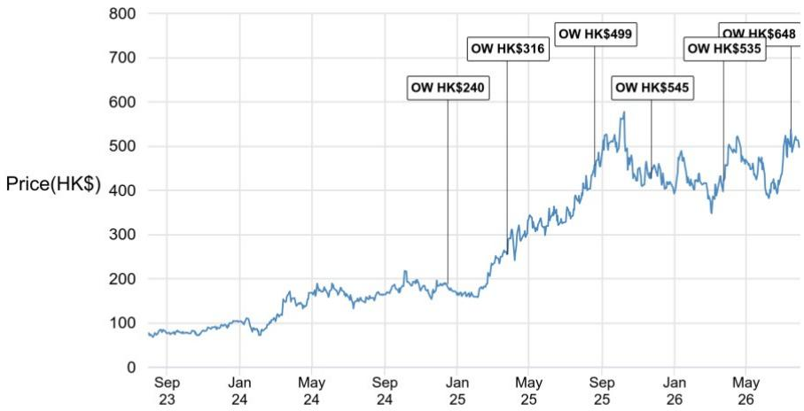
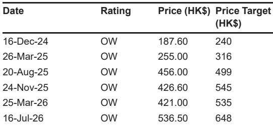

# JPM：中国医疗健康GSK与阿斯利康2026年二季度业绩及翰森、恒瑞

GSK与阿斯利康2026年二季度业绩披露中，中国创新药资产的全球开发进度成为最值得关注的线索。JPM在最新研报中梳理了两家跨国药企对从中国引进的ADC和抗体项目的推进计划，并据此更新了对翰森制药、恒瑞医药和科伦博泰的判断。

报告的核心信息不是“中国资产被买走”，而是跨国药企正在为这些资产投入大规模后期开发资源。GSK为翰森制药授权的B7-H3 ADC和B7-H4 ADC规划了多项新的III期研究，阿斯利康则宣布其CLDN18.2 ADC在全球III期试验中达到总生存期终点。这些进展表明，中国创新药资产已进入跨国药企的全球商业化核心管线，而非停留在许可引进阶段。

## 1. GSK为翰森ADC组合规划多项III期研究

GSK在二季度业绩中明确加快后期研发投入，包括为从翰森制药引进的Ris-Rez（B7-H3 ADC）和Mo-Rez（B7-H4 ADC）启动多项新III期研究。JPM预计，到2028年GSK可能同时运行6项Ris-Rez III期试验和5项Mo-Rez III期试验，并计划在2028年提交Ris-Rez用于二线小细胞肺癌的BLA申请。

这一规划的意义在于GSK正在重新分配资本，优先支持其认为价值最高的后期资产。两个ADC项目能够通过内部评估，说明其在疗效、安全性和商业前景上已获得跨国药企的认可。结合此前Ris-Rez在小细胞肺癌和骨肉瘤中的积极III期数据，翰森制药的ADC平台价值正在被逐步验证。

> **KC评论：** 跨国药企愿意为一个引进资产同时铺开多项注册性试验，是比首付款更能说明问题的信号。读者可以关注GSK后续是否按计划推进这些试验，以及BLA提交时间点是否如期兑现。

## 2. 恒瑞抗TSLP抗体进入注册性开发阶段

GSK决定启动GSK'283（长效抗TSLP抗体，原研来自恒瑞医药）在哮喘、慢阻肺和慢性鼻窦炎伴鼻息肉三个适应症的III期开发。该资产最初由恒瑞授权给Aiolos Bio，GSK通过收购Aiolos Bio获得该药物。进入注册性研究意味着该资产已通过GSK内部的技术和商业评估。

恒瑞医药有资格获得总计超过10亿美元的里程碑付款，外加分级特许权使用费。JPM认为，这一进展降低了执行不确定性，增加了未来里程碑兑现的可见度。对于恒瑞而言，这是其呼吸领域资产获得跨国药企认可的直接证据。

## 3. 阿斯利康CLDN18.2 ADC达到总生存期终点

阿斯利康宣布Sone-Ve（CLDN18.2 ADC）在全球III期试验CLARITY-Gastric01中达到总生存期主要终点，这是首个在CLDN阳性胃癌中显示总生存期获益的CLDN18.2 ADC。该资产由阿斯利康从乐普生物和康诺亚引进。

这一结果对胃癌治疗格局有直接影响。CLDN18.2作为胃癌靶点此前已有抗体药物获批，但ADC在总生存期上的数据尚属首次。JPM将这一进展视为中国创新药能力的又一验证，同时也说明跨国药企引进中国资产后愿意投入资源推进全球注册。

## 4. 科伦博泰sac-TMT的全球竞争位置

JPM认为，阿斯利康Dato-DXd即将公布的多个读数不会对科伦博泰的sac-TMT在非小细胞肺癌领域构成明显竞争威胁。基于现有临床数据，两家TROP2 ADC在适应症布局和疗效表现上存在差异。

科伦博泰与默沙东的合作已建立17项全球III期研究，覆盖多种肿瘤类型和治疗场景。近期sac-TMT在子宫内膜癌的全球III期成功、中国非小细胞肺癌III期阳性结果，以及中国三阴乳腺癌优先审评资格，都在强化其竞争地位。JPM认为，sac-TMT在默沙东手中已成为TROP2 ADC领域全球开发项目最广泛的资产之一。

> **KC评论：** 判断TROP2 ADC竞争格局时，不能只看头对头数据，还要看适应症覆盖广度和注册节奏。科伦博泰的优势在于默沙东愿意为sac-TMT同时推进17项全球III期研究，这种资源投入本身就是竞争壁垒。

跨国药企对中国创新药资产的态度，已经从“引进后自行评估”转向“引进后立即投入大规模后期开发”。GSK为翰森ADC组合规划的多项III期试验、恒瑞抗TSLP抗体的注册性开发启动，以及阿斯利康CLDN18.2 ADC的总生存期阳性结果，共同指向一个判断：中国创新药资产的全球商业化价值正在通过跨国药企的资源配置得到验证。后续需要跟踪的是这些III期试验的入组进度和读数时间点，以及里程碑付款的兑现节奏。

For informational purposes only. Portions may be generated,translated,summarized,or edited with AI assistance based on source materials and may contain omissions or errors. Please verify independently. This is not investment,legal,tax,accounting,or other professional advice.

For informational purposes only. Portions may be generated,translated,summarized,or edited with AI assistance based on source materials and may contain omissions or errors. Please verify independently. This is not investment,legal,tax,accounting,or other professional advice.

