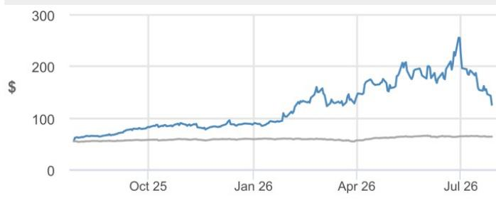
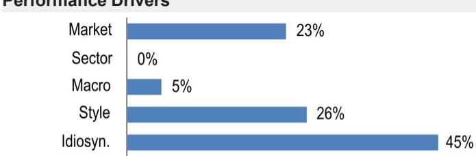

# JPM

## Corning

## 2Q26 业绩回顾：未达买方高预期，但长期光通信逻辑依然完整

Corning 2Q26 业绩超出卖方预期，但未达到买方更为严苛的预期水平。这一结果与我们此前在季报前的判断一致：企业级光通信业务表现强劲（AI相关销售额接近弹性较高，订单增速加快），但光通信运营商业务表现低于预期（传统客户订单节奏波动），其余业务板块基本符合预期。除光通信外，本次业绩对 Gorilla Glass 及智能手机市场下半年展望持谨慎态度，主要受内存成本因素影响；同时公司下调了2027年及以后的日元汇率假设至150（此前为120），并计划通过套期保值、定价和成本控制等既有工具来对冲净收益影响。资本开支方面，公司为支持光通信产能建设提高了投入水平（2026年约20亿美元，2027年约25亿美元），但值得注意的是，这部分投入有客户资金和长期协议作为支撑。重要的是，尽管这些因素可能令短期预期承压，但我们认为它们不会改变长期盈利格局——管理层对企业级和运营商级光通信、规模化扩展及即将到来的升级机遇均保持强烈乐观态度。太阳能业务方面，随着维护性不利因素消退，该业务开始步入正轨，管理层预计3Q26及以后销售和盈利能力将持续改善，这可能是其对营业利润率走势持更积极看法的重要原因，尽管公司重申了近期20%以上的目标。基于此，我们适度上调了GLW的近期预测，以反映好于预期的业绩和指引，同时基本维持远期预测不变，认为本次业绩继续强化了中长期展望。不过，我们将2027年12月目标价从200美元下调至170美元，因为我们将目标估值倍数调整为30倍，这与更广泛的光通信同业群体更为一致。

- **2Q26业绩**：每股收益超出卖方一致预期，主要得益于好于预期的收入。收入为47.38亿美元（对比JPM预测46.41亿美元、一致预期46.45亿美元、公司指引46亿美元），受AI产品驱动的企业级光通信需求强劲支撑。毛利率为39.6%（对比JPM预测38.6%、一致预期38.5%），主要因光通信业务毛利率/利润好于预期；营业利润率为20.9%（对比JPM预测20.7%、一致预期20.4%）。综合来看，更好的营业利润率推动每股收益达到0.78美元（对比JPM预测0.77美元、一致预期0.76美元、此前指引0.73-0.77美元）。

- **3Q26指引**：收入指引略低于预期，每股收益小幅超预期。收入指引为49.5亿美元（对比JPM预测49.12亿美元、一致预期49.97亿美元），光通信展望强劲但玻璃创新业务展望相对温和。每股收益指引为0.85-0.89美元（中值约0.87美元，对比JPM预测0.86美元、一致预期0.86美元），光通信业务占比提升应带动整体盈利能力改善。

## 中性

GLW， GLW US
价格（2026年7月28日）：126.01美元

▼目标价（2027年12月）：170.00美元
此前（2027年12月）：200.00美元

## IT硬件/电信与网络设备

Joseph Cardoso AC
(1-212) 622-9036
joseph.cardoso@jpmchase.com

Marc Vitenzon
(1-212) 622-3342
marc.vitenzon@jpmchase.com

Manmohanpreet Singh
(1-212) 622-4527
manmohanpreet.singh@jpmchase.com

Akanksh Chauhan
(1-212) 622-0045
akanksh.chauhan@JPM.com
JPM Securities LLC

<table><tr><td colspan="4">主要变动（12月财年）</td></tr><tr><td></td><td>此前</td><td>当前</td><td>变动</td></tr><tr><td>调整后每股收益 - 2026E（美元）</td><td>3.20</td><td>3.25</td><td>1.3%</td></tr></table>

<table><tr><td></td><td>2025A</td><td>2026E</td><td>2027E</td></tr><tr><td>Q1</td><td>0.54</td><td>0.70A</td><td>0.85</td></tr><tr><td>Q2</td><td>0.60</td><td>0.78A</td><td>0.95</td></tr><tr><td>Q3</td><td>0.67</td><td>0.86</td><td>1.01</td></tr><tr><td>Q4</td><td>0.72</td><td>0.90</td><td>1.05</td></tr><tr><td>全年</td><td>2.54</td><td>3.25</td><td>3.85</td></tr></table>

## 风格暴露

<table><tr><td rowspan="2">量化因子</td><td rowspan="2">当前百分位</td><td colspan="4">历史百分位（1=最高）</td></tr><tr><td>6个月</td><td>1年</td><td>3年</td><td>5年</td></tr><tr><td>价值</td><td>78</td><td>60</td><td>45</td><td>20</td><td>23</td></tr><tr><td>成长</td><td>13</td><td>38</td><td>46</td><td>90</td><td>31</td></tr><tr><td>动量</td><td>18</td><td>19</td><td>35</td><td>78</td><td>61</td></tr><tr><td>质量</td><td>27</td><td>16</td><td>33</td><td>26</td><td>35</td></tr><tr><td>低波动</td><td>48</td><td>11</td><td>9</td><td>6</td><td>22</td></tr><tr><td>ESGQ</td><td>24</td><td>86</td><td>86</td><td>85</td><td>96</td></tr></table>

价格表现

— GLW价格（美元） — 标普500（重新基准）

<table><tr><td></td><td>年初至今</td><td>1个月</td><td>3个月</td><td>12个月</td></tr><tr><td>相对</td><td>43.9%</td><td>-43.0%</td><td>-17.7%</td><td>127.4%</td></tr><tr><td>相对</td><td>35.4%</td><td>-44.0%</td><td>-21.7%</td><td>111.2%</td></tr></table>

公司数据

<table><tr><td>流通股数（百万）</td><td>871</td></tr><tr><td>52周区间（美元）</td><td>271.78-54.92</td></tr><tr><td>总市值（百万美元）</td><td>109,754.70</td></tr><tr><td>汇率</td><td>1.00</td></tr><tr><td>自由流通比例（%）</td><td>91.9%</td></tr><tr><td>3个月日均成交量（百万股）</td><td>14.81</td></tr><tr><td>3个月日均成交额（百万美元）</td><td>2,806.0</td></tr><tr><td>波动率（90日）</td><td>95</td></tr><tr><td>指数</td><td>标普500</td></tr><tr><td>彭博分析师评级（买入|持有|卖出）</td><td>12|5|0</td></tr></table>

关键指标（12月财年）

<table><tr><td>百万美元</td><td>FY25A</td><td>FY26E</td><td>FY27E</td><td>FY28E</td></tr><tr><td colspan="5">财务预测</td></tr><tr><td>收入</td><td>16,408</td><td>19,134</td><td>21,736</td><td>26,681</td></tr><tr><td>调整后营业利润</td><td>3,160</td><td>4,102</td><td>4,778</td><td>6,265</td></tr><tr><td>调整后EBITDA</td><td>4,397</td><td>5,558</td><td>6,408</td><td>8,266</td></tr><tr><td>调整后净利润</td><td>2,199</td><td>2,836</td><td>3,362</td><td>4,604</td></tr><tr><td>调整后每股收益</td><td>2.54</td><td>3.25</td><td>3.85</td><td>5.30</td></tr><tr><td>彭博每股收益</td><td>2.52</td><td>3.17</td><td>4.21</td><td>5.83</td></tr><tr><td>经营活动现金流</td><td>2,695</td><td>4,296</td><td>4,655</td><td>6,228</td></tr><tr><td>无杠杆自由现金流</td><td>1,654</td><td>2,521</td><td>2,423</td><td>3,968</td></tr><tr><td colspan="5">利润率与增长</td></tr><tr><td>收入同比增长（%）</td><td>13.4%</td><td>16.6%</td><td>13.6%</td><td>22.8%</td></tr><tr><td>营业利润率</td><td>19.3%</td><td>21.4%</td><td>22.0%</td><td>23.5%</td></tr><tr><td>营业利润同比增长（%）</td><td>24.9%</td><td>29.8%</td><td>16.5%</td><td>31.1%</td></tr><tr><td>EBITDA利润率</td><td>26.8%</td><td>29.0%</td><td>29.5%</td><td>31.0%</td></tr><tr><td>EBITDA同比增长（%）</td><td>17.0%</td><td>26.4%</td><td>15.3%</td><td>29.0%</td></tr><tr><td>净利润率</td><td>13.4%</td><td>14.8%</td><td>15.5%</td><td>17.3%</td></tr><tr><td>调整后每股收益增长</td><td>29.1%</td><td>27.9%</td><td>18.7%</td><td>37.7%</td></tr><tr><td colspan="5">比率</td></tr><tr><td>调整后税率</td><td>19.2%</td><td>18.9%</td><td>19.5%</td><td>18.8%</td></tr><tr><td>利息保障倍数</td><td>14.8</td><td>19.0</td><td>21.6</td><td>27.9</td></tr><tr><td>净债务/权益</td><td>0.6</td><td>0.4</td><td>0.3</td><td>0.2</td></tr><tr><td>净债务/EBITDA</td><td>1.6</td><td>1.0</td><td>0.8</td><td>0.5</td></tr><tr><td>净资产回报表现</td><td>18.8%</td><td>21.6%</td><td>22.8%</td><td>27.8%</td></tr><tr><td colspan="5">估值</td></tr><tr><td>无杠杆自由现金流回报表现</td><td>1.5%</td><td>2.3%</td><td>2.2%</td><td>3.6%</td></tr><tr><td>股息回报表现</td><td>0.9%</td><td>0.9%</td><td>1.0%</td><td>1.1%</td></tr><tr><td>企业价值/收入</td><td>7.1</td><td>6.1</td><td>5.4</td><td>4.4</td></tr><tr><td>企业价值/EBITDA</td><td>26.6</td><td>21.0</td><td>18.3</td><td>14.2</td></tr><tr><td>调整后市盈率</td><td>49.7</td><td>38.8</td><td>32.7</td><td>23.8</td></tr></table>

## 研究逻辑与估值摘要

## 研究逻辑

我们维持对Corning的中性评级，基于以下平衡：一方面，光通信需求环境强劲，公司在数据中心内外光纤光缆和连接器领域具有领先地位，有望充分受益；另一方面，市场给予该公司的估值溢价较高，我们认为这一溢价已包含较为乐观的预期情景，对光通信产能和采用率相关风险以及非光通信业务部分留有的容错空间有限。

## 估值

我们将2027年12月目标价从200美元下调至170美元，基于对2028E每股收益采用30倍市盈率估值（此前为35倍）。我们认为约30倍的估值倍数与更广泛的光通信同业群体更为一致，同时仍反映了Corning作为美国本土、垂直一体化、大规模光纤光缆和连接器供应商的独特定位——这些产品有望受益于AI基础设施建设的宏观背景。

业绩驱动因素

<table><tr><td>因子</td><td>6个月相关性</td><td>1年相关性</td></tr><tr><td>市场：MSCI美国</td><td>0.16</td><td>0.48</td></tr><tr><td>行业：科技</td><td>0.02</td><td>0.06</td></tr><tr><td>板块：科技硬件设备</td><td>0.43</td><td>0.27</td></tr><tr><td>宏观：</td><td></td><td></td></tr><tr><td>非能源大宗商品</td><td>-0.23</td><td>-0.23</td></tr><tr><td>美国10年期回报表现</td><td>-0.24</td><td>-0.19</td></tr><tr><td>美元</td><td>-0.14</td><td>0.13</td></tr><tr><td>量化风格：</td><td></td><td></td></tr><tr><td>动量</td><td>0.41</td><td>0.50</td></tr><tr><td>规模</td><td>0.34</td><td>0.39</td></tr><tr><td>股息率</td><td>0.11</td><td>-0.13</td></tr></table>

# 研究逻辑、估值与风险

Corning（中性；目标价：170.00美元）

## 研究逻辑

我们维持对Corning的中性评级，基于以下平衡：一方面，光通信需求环境强劲，公司在数据中心内外光纤光缆和连接器领域具有领先地位，有望充分受益；另一方面，市场给予该公司的估值溢价较高，我们认为这一溢价已包含较为乐观的预期情景，对光通信产能和采用率相关风险以及非光通信业务部分留有的容错空间有限。

## 估值

我们将2027年12月目标价从200美元下调至170美元，基于对2028E每股收益采用30倍市盈率估值（此前为35倍）。我们认为约30倍的估值倍数与更广泛的光通信同业群体更为一致，同时仍反映了Corning作为美国本土、垂直一体化、大规模光纤光缆和连接器供应商的独特定位——这些产品有望受益于AI基础设施建设的宏观背景。

Corning市盈率目标分析

百万美元，除每股数据外

<table><tr><td></td><td>未来四个季度</td><td>2028E</td></tr><tr><td>JPM净利润</td><td>2,968</td><td>4,604</td></tr><tr><td>加回：股权激励支出</td><td>295</td><td>315</td></tr><tr><td>JPM净利润（不含股权激励）</td><td>3,263</td><td>4,919</td></tr><tr><td>JPM每股收益</td><td>3.39美元</td><td>5.30美元</td></tr><tr><td>JPM每股收益（不含股权激励）</td><td>3.73美元</td><td>5.67美元</td></tr><tr><td>市盈率倍数</td><td>37倍</td><td></td></tr><tr><td>市盈率倍数（不含股权激励）</td><td>34倍</td><td></td></tr><tr><td>JPM市盈率倍数</td><td></td><td>30倍</td></tr><tr><td>隐含权益价值</td><td>109,755</td><td>147,564</td></tr><tr><td>平均摊薄股数</td><td>871</td><td>868</td></tr><tr><td>隐含股价</td><td>126.0美元</td><td>170.0美元</td></tr><tr><td>当前每股价值</td><td>126.01美元</td><td>126.01美元</td></tr><tr><td>相对当前的上行空间</td><td></td><td>35%</td></tr><tr><td>备注：</td><td></td><td></td></tr><tr><td>（-）净现金/（净债务）</td><td>(7,218)</td><td>(3,982)</td></tr><tr><td>企业价值</td><td>116,973</td><td>151,546</td></tr><tr><td>JPM EBITDA</td><td>5,774</td><td>8,258</td></tr><tr><td>隐含企业价值/EBITDA</td><td>20.3倍</td><td>18.4倍</td></tr></table>

资料来源：JPM预测。

## 评级与目标价风险

## 行业上行风险

显示面板定价可能强于预期。尽管过去几年显示业务（包括消费设备用玻璃）增长稳健，但定价历史上呈下降趋势，不过近年来已出现企稳和改善的迹象。尽管如此，显示面板市场定价若强于预期，可能带来我们预测的上行空间。

## 行业下行风险

规模化扩展领域铜转光通信的进程延迟。受客户架构选择、供应链挑战或光子学路线图推迟的创新等因素影响，机架内光通信采用速度若慢于预期，可能导致我们预测的下行空间。

## 公司上行风险

光纤光缆和连接器的供应链领先地位。Corning是少数几家美国本土垂直一体化的光通信公司之一，业务覆盖从光纤预制棒到光缆和连接器的完整链条。若在无源光通信内容方面获得好于预期的市场份额——得益于更好的成本控制、供应可靠性或美国本土制造——可能推动我们预测的上行空间。

Hemlock太阳能解决方案采用速度快于预期。我们预计随着客户寻求受益于美国联邦政策支持（鼓励本土替代），Hemlock太阳能解决方案的采用率将不断提升。若采用速度快于预期，可能推动我们预测的上行空间。

## 公司下行风险

内存成本压力可能对Corning玻璃创新业务的产品销量产生不利影响。内存价格持续上涨将改变电视和手机等终端市场的成本结构，可能减少对显示面板的需求，进而对Corning玻璃创新业务的产品销量产生不利影响。

Gorilla盖板玻璃的抗跌落性能要求可能触及天花板。Gorilla盖板玻璃溢价定价的主要驱动因素之一是其相对于竞品的卓越抗跌落性能，Corning每一代产品都在此方面持续改进。然而，客户可能认为超过一定水平的抗跌落性能改进不再必要，可能不愿为超出一定水平的改进持续支付溢价，从而限制Corning的平均售价提升空间。

Corning：财务摘要

<table><tr><td>利润表 - 年度</td><td>FY25A</td><td>FY26E</td><td>FY27E</td><td>FY28E</td><td>FY29E</td></tr><tr><td>收入</td><td>16,408</td><td>19,134</td><td>21,736</td><td>26,681</td><td>30,981</td></tr><tr><td>营业成本</td><td>(10,115)</td><td>(11,570)</td><td>(13,150)</td><td>(16,076)</td><td>(18,634)</td></tr><tr><td>毛利润</td><td>6,293</td><td>7,564</td><td>8,585</td><td>10,605</td><td>12,347</td></tr><tr><td>销售及管理费用</td><td>(2,028)</td><td>(2,291)</td><td>(2,450)</td><td>(2,811)</td><td>(3,231)</td></tr><tr><td>调整后EBITDA</td><td>4,397</td><td>5,558</td><td>6,408</td><td>8,266</td><td>9,753</td></tr><tr><td>折旧与摊销</td><td>(1,237)</td><td>(1,456)</td><td>(1,630)</td><td>(2,001)</td><td>(2,324)</td></tr><tr><td>调整后营业利润</td><td>3,160</td><td>4,102</td><td>4,778</td><td>6,265</td><td>7,430</td></tr><tr><td>净利息</td><td>(298)</td><td>(292)</td><td>(296)</td><td>(296)</td><td>(296)</td></tr><tr><td>调整后税前利润</td><td>2,903</td><td>3,777</td><td>4,466</td><td>5,953</td><td>7,118</td></tr><tr><td>税费</td><td>(558)</td><td>(716)</td><td>(869)</td><td>(1,120)</td><td>(1,374)</td></tr><tr><td>少数股东权益</td><td>(146)</td><td>(225)</td><td>(235)</td><td>(230)</td><td>(230)</td></tr><tr><td>调整后净利润</td><td>2,199</td><td>2,836</td><td>3,362</td><td>4,604</td><td>5,514</td></tr><tr><td>报告每股收益</td><td>2.54</td><td>3.25</td><td>3.85</td><td>5.30</td><td>6.40</td></tr><tr><td>调整后每股收益</td><td>2.54</td><td>3.25</td><td>3.85</td><td>5.30</td><td>6.40</td></tr><tr><td>每股股息</td><td>1.12</td><td>1.12</td><td>1.23</td><td>1.36</td><td>1.49</td></tr><tr><td>派息率</td><td>44.1%</td><td>34.5%</td><td>32.0%</td><td>25.5%</td><td>23.3%</td></tr><tr><td>流通股数</td><td>867</td><td>874</td><td>873</td><td>868</td><td>862</td></tr><tr><td>资产负债表与现金流量表</td><td>FY25A</td><td>FY26E</td><td>FY27E</td><td>FY28E</td><td>FY29E</td></tr><tr><td>现金及现金等价物</td><td>1,526</td><td>2,781</td><td>3,090</td><td>4,442</td><td>6,566</td></tr><tr><td>应收账款</td><td>2,779</td><td>2,795</td><td>3,172</td><td>3,938</td><td>4,426</td></tr><tr><td>存货</td><td>3,077</td><td>3,382</td><td>3,844</td><td>4,737</td><td>5,587</td></tr><tr><td>其他流动资产</td><td>7,410</td><td>8,232</td><td>9,071</td><td>10,731</td><td>12,068</td></tr><tr><td>流动资产合计</td><td>8,936</td><td>11,013</td><td>12,161</td><td>15,173</td><td>18,634</td></tr><tr><td>固定资产</td><td>14,825</td><td>15,430</td><td>16,270</td><td>16,769</td><td>16,945</td></tr><tr><td>长期投资</td><td>0</td><td>0</td><td>0</td><td>0</td><td>0</td></tr><tr><td>其他非流动资产</td><td>4,069</td><td>4,026</td><td>4,026</td><td>4,026</td><td>4,026</td></tr><tr><td>总资产</td><td>30,976</td><td>33,555</td><td>35,543</td><td>39,054</td><td>42,692</td></tr><tr><td>短期借款</td><td>804</td><td>668</td><td>668</td><td>668</td><td>668</td></tr><tr><td>应付账款</td><td>1,934</td><td>2,029</td><td>2,114</td><td>2,606</td><td>2,926</td></tr><tr><td>其他短期负债</td><td>2,890</td><td>3,061</td><td>3,478</td><td>4,269</td><td>4,957</td></tr><tr><td>流动负债合计</td><td>5,628</td><td>5,759</td><td>6,260</td><td>7,543</td><td>8,551</td></tr><tr><td>长期债务</td><td>7,630</td><td>7,756</td><td>7,756</td><td>7,756</td><td>7,756</td></tr><tr><td>其他长期负债</td><td>13,041</td><td>13,808</td><td>13,808</td><td>13,808</td><td>13,808</td></tr><tr><td>总负债</td><td>18,669</td><td>19,567</td><td>20,068</td><td>21,351</td><td>22,359</td></tr><tr><td>股东权益</td><td>12,307</td><td>13,981</td><td>15,468</td><td>17,696</td><td>20,325</td></tr><tr><td>少数股东权益</td><td>-</td><td>-</td><td>-</td><td>-</td><td>-</td></tr><tr><td>总负债与权益</td><td>30,976</td><td>33,548</td><td>35,536</td><td>39,047</td><td>42,685</td></tr><tr><td>每股净资产</td><td>14.39</td><td>16.26</td><td>18.04</td><td>20.75</td><td>24.00</td></tr><tr><td>同比增长</td><td>10.9%</td><td>13.0%</td><td>10.9%</td><td>15.0%</td><td>15.7%</td></tr><tr><td>净债务/（净现金）</td><td>6,908</td><td>5,643</td><td>5,334</td><td>3,982</td><td>1,858</td></tr><tr><td>经营活动现金流</td><td>2,695</td><td>4,296</td><td>4,655</td><td>6,228</td><td>7,509</td></tr><tr><td>其中：折旧与摊销</td><td>1,237</td><td>1,456</td><td>1,630</td><td>2,001</td><td>2,324</td></tr><tr><td>其中：营运资本变动</td><td>0</td><td>0</td><td>0</td><td>0</td><td>0</td></tr><tr><td>投资活动现金流</td><td>(1,243)</td><td>(1,819)</td><td>(2,470)</td><td>(2,500)</td><td>(2,500)</td></tr><tr><td>其中：资本开支</td><td>(1,282)</td><td>(2,011)</td><td>(2,470)</td><td>(2,500)</td><td>(2,500)</td></tr><tr><td>占收入比例</td><td>7.8%</td><td>10.5%</td><td>11.4%</td><td>9.4%</td><td>8.1%</td></tr><tr><td>融资活动现金流</td><td>(1,672)</td><td>(1,262)</td><td>(1,875)</td><td>(2,376)</td><td>(2,885)</td></tr><tr><td>其中：已支付股息</td><td>(999)</td><td>(985)</td><td>(1,075)</td><td>(1,176)</td><td>(1,285)</td></tr><tr><td>其中：净债务发行/（偿还）</td><td>(55)</td><td>(242)</td><td>0</td><td>0</td><td>0</td></tr><tr><td>现金净变动</td><td>(202)</td><td>1,215</td><td>310</td><td>1,352</td><td>2,124</td></tr><tr><td>调整后无杠杆自由现金流</td><td>1,654</td><td>2,521</td><td>2,423</td><td>3,968</td><td>5,248</td></tr><tr><td>同比增长</td><td>38.0%</td><td>52.5%</td><td>(3.9%)</td><td>63.8%</td><td>32.2%</td></tr></table>

资料来源：公司报告和JPM预测。
注：百万美元（除每股数据外）。财年截至12月。

<table><tr><td colspan="2">利润表 - 季度</td><td>1Q26A</td><td>2Q26A</td><td>3Q26E</td><td>4Q26E</td></tr><tr><td colspan="2">收入</td><td>4,345A</td><td>4,738A</td><td>4,950</td><td>5,101</td></tr><tr><td colspan="2">营业成本</td><td>(2,645)A</td><td>(2,864)A</td><td>(2,975)</td><td>(3,086)</td></tr><tr><td colspan="2">毛利润</td><td>1,700A</td><td>1,874A</td><td>1,975</td><td>2,015</td></tr><tr><td colspan="2">销售及管理费用</td><td>(546)A</td><td>(590)A</td><td>(594)</td><td>(561)</td></tr><tr><td colspan="2">调整后EBITDA</td><td>1,210A</td><td>1,357A</td><td>1,455</td><td>1,535</td></tr><tr><td colspan="2">折旧与摊销</td><td>(334)A</td><td>(368)A</td><td>(371)</td><td>(383)</td></tr><tr><td colspan="2">调整后营业利润</td><td>876A</td><td>989A</td><td>1,084</td><td>1,153</td></tr><tr><td colspan="2">净利息</td><td>(70)A</td><td>(82)A</td><td>(70)</td><td>(70)</td></tr><tr><td colspan="2">调整后税前利润</td><td>797A</td><td>898A</td><td>1,005</td><td>1,077</td></tr><tr><td colspan="2">税费</td><td>(157)A</td><td>(168)A</td><td>(186)</td><td>(205)</td></tr><tr><td colspan="2">少数股东权益</td><td>(28)A</td><td>(50)A</td><td>(65)</td><td>(82)</td></tr><tr><td colspan="2">调整后净利润</td><td>612A
