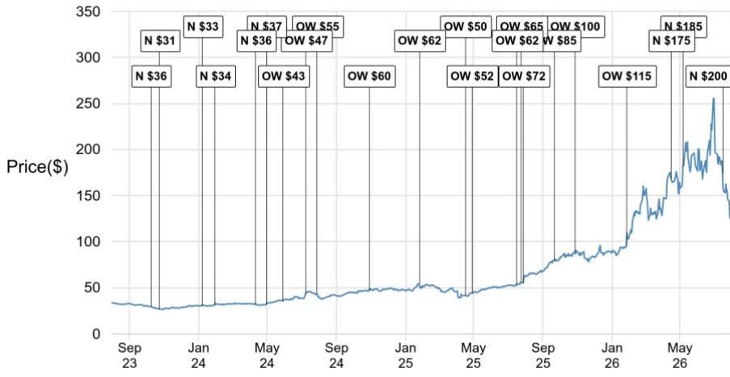
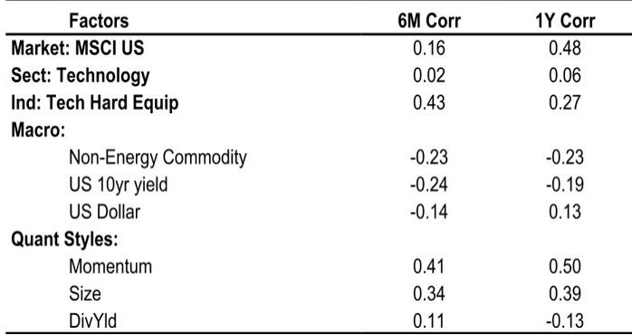
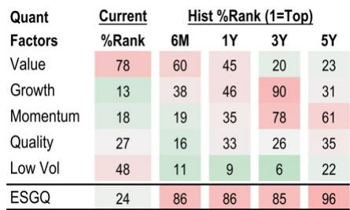

# JPM：康宁业务与季度数据观察

康宁2026年第二季度交出了一份超出卖方一致预期的成绩单，但JPM在7月28日的报告中指出，这份业绩并未达到买方更严格的预期。核心原因在于光通信业务内部的分化：企业级光通信产品中AI相关销售接近弹性较高，订单增速加快，而运营商级光通信业务因传统客户下单节奏波动，明显低于预期。这份报告最值得关注的判断是，短期业绩噪音并未改变康宁在AI基础设施研究中的长期光通信叙事，但估值倍数需要向光通信同行靠拢。

，估值倍数从35倍降至30倍。JPM认为，30倍更接近更广泛的光通信同业水平，同时仍反映了康宁作为美国本土垂直整合光纤光缆和连接器供应商的独特地位。这一调整发生在康宁报价过去12个月上涨127.4%之后，报告同时更新公司观点。

## 1. 企业级光通信增长强劲，运营商业务影响整体表现

第二季度收入为47.38亿美元，高于JPM预期的46.41亿美元和公司指引的46亿美元。毛利率39.6%，超出预期的38.6%，主要得益于光通信业务利润好于预期。每股收益0.78美元，高于预期的0.77美元。

但光通信内部的分化值得注意。企业级产品中AI相关销售接近弹性较高，订单增速加快，这是报告中最具信息量的信号。运营商级光通信则因传统客户下单波动明显低于预期。这种分化说明，AI数据中心的光纤需求仍在加速，而电信运营商的资本开支节奏并未同步跟上。

> **KC评论：** 企业级与运营商级光通信的分化是理解这份报告的关键。AI相关销售接近弹性较高说明数据中心内部的光纤需求真实存在，而运营商业务的波动更多是客户下单节奏问题，未必反映终端需求变化。

## 2. 第三季度指引显示光通信强劲，玻璃创新业务偏弱

第三季度收入指引为49.5亿美元，低于市场预期的49.97亿美元，但每股收益指引中点约0.87美元，高于预期的0.86美元。这种收入偏弱、盈利偏强的组合，源于光通信业务占比提升带来的产品结构改善。

报告同时提到，玻璃创新业务面临存储器价格上涨带来的终端需求不确定性。存储器成本上升会改变电视和手机等终端市场的成本结构，进而影响显示面板需求。康宁管理层对大猩猩玻璃和智能手机市场下半年的态度偏谨慎，这一判断与光通信的乐观基调形成对比。

## 3. 资本开支上调至2026年约20亿美元，客户资金提供支撑

报告显示，康宁将资本开支提升至2026年约20亿美元、2027年约25亿美元，以支持光通信产能建设。值得注意的是，这部分开支有客户资金和长期协议作为支撑。这一细节说明，AI基础设施研究的确定性正在转化为上游供应商的产能扩张承诺。

日元假设从120调整至150，公司计划通过套期保值、定价和成本削减来对冲净利润影响。太阳能业务在维护性逆风消退后开始改善，管理层预计第三季度及以后销售和盈利能力将提升。

## 4. 估值倍数调整反映市场对光通信定价的重新校准

，估值倍数从35倍降至30倍。这一调整的实质是，市场对光通信公司的定价正在从AI叙事的溢价区间，回归到更可验证的盈利增长轨道。报告认为，康宁的长期盈利能力和光通信市场地位没有改变，但估值需要与同行对齐。

从财务预测看，2026年调整后每股收益预期从3.20美元小幅上调至3.25美元，2027年维持3.85美元不变。2028年预期为5.30美元，对应收入266.81亿美元和23.5%的EBIT利润率。这些数字说明，报告对康宁的长期盈利轨迹保持信心，调整主要集中在估值层面。

，这种组合说明报告的核心判断是估值问题而非基本面问题。30倍倍数对应2028年预期盈利，隐含约35%的上行空间，但前提是光通信需求按预期兑现。

康宁的案例提供了一个观察AI基础设施研究如何传导至上游供应商的窗口。光纤光缆和连接器作为数据中心建设的核心组件，需求确定性较高，但市场对这类公司的定价正在从概念溢价转向盈利验证。报告更新公司观点，既承认光通信的长期需求逻辑，也提示当前估值已包含较多乐观预期。

For informational purposes only. Portions may be generated,translated,summarized,or edited with AI assistance based on source materials and may contain omissions or errors. Please verify independently. This is not investment,legal,tax,accounting,or other professional advice.

