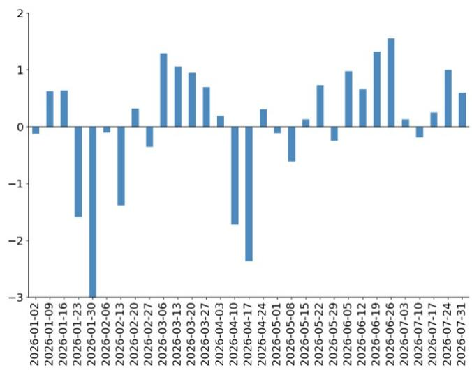
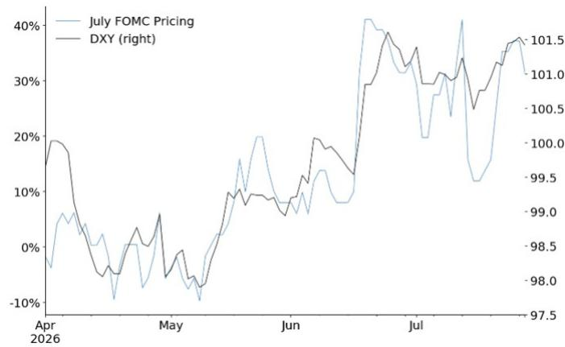
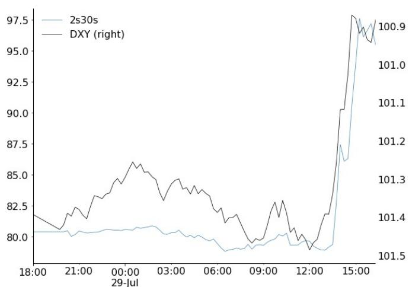
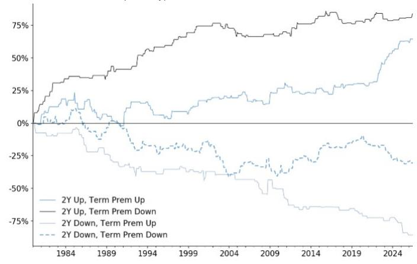
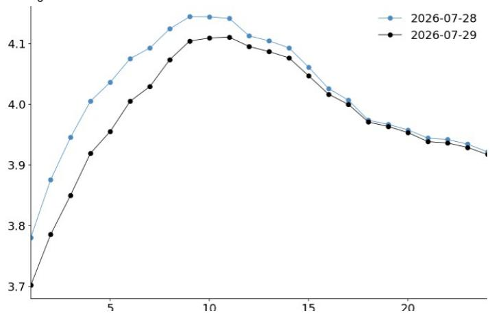
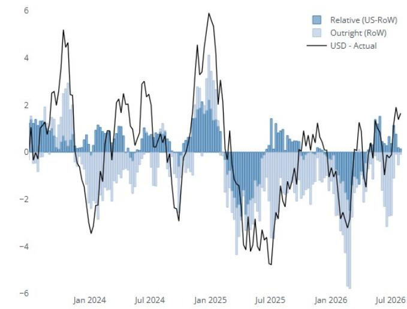

## 海外利率会议后的市场观察

## 美元多头立场维持，尽管通胀风险溢价回升

- 周三对美元而言是一次明显的回撤，但美元多头交易尚未就此终结。

- 尽管会议初期及事先准备的发言中包含偏紧缩的表述，但根据我们的研究团队观察，新闻发布会中的部分内容重新引发了市场对于政策制定者在控制通胀方面公信力的讨论。

- 这体现在回报表现曲线（2年期与30年期）出现显著的陡峭化变动，与美元在新闻发布会期间因市场对政策公信力及通胀风险溢价重新定价而出现的回落走势相吻合（图1）。

- 这一现象与美元在过往特定时期（如2025年7月）及更广泛情况下的表现一致，即短端利率下行与长端利率上行往往伴随美元走弱。

- 政策公信力方面的讨论可能有利于对利率变化较为敏感的货币（如瑞典克朗），并对与长端债券关联度较高的货币（如英镑）构成外溢影响。但这并非我们的主要判断，我们仍维持对瑞典克朗的谨慎看法。

- 美元存在一定的支撑因素。我们认为政策委员会将采取措施以维护其公信力，可能在12月进行调整；9月会议同样值得关注，将取决于后续数据表现。短端利率的重新定价尚未显著削弱美元所具备的利差保护效应。此外，能源价格因素也为美元提供了一定支撑。

- 因此，我们维持看多美元兑一篮子G10低息货币（欧元、瑞士法郎、瑞典克朗、加元、新西兰元）的立场。

图1：美元走势与回报表现曲线陡峭化变动相吻合
左轴：2s30s；右轴：DXY（反向）

  
来源：JPM，彭博

## 全球外汇市场研究

Arindam Sandilya
(65) 6882-7759
arindam.x.sandilya@JPM.com
JPM Chase Bank, N.A., Singapore Branch

Patrick R Locke AC
(1-212) 834-4254
patrick.r.locke@jpmchase.com
JPM Securities LLC

参见第5页的分析师认证与重要披露。

Meera Chandan
(44-20) 7134-2924
meera.chandan@JPM.com
JPM Securities plc

James Nelligan
(44-20) 3493-6829
james.nelligan@JPM.com
JPM Securities plc

## 通胀风险溢价抬头拖累美元走低——但美元多头交易仍有其他支撑

周三对美元而言是一次明显的回撤，但美元多头交易尚未就此终结。我们此前预计本周利率会议前美元存在上行风险，这反映了近期偏紧缩的政策表态频出，以及随之而来的潜在分歧可能。会议声明确实出现了三份异议，且事先准备的发言偏紧缩，表面上符合我们看多美元的条件。然而美元依然走低——部分原因在于市场在最后一刻对实际调整的预期升温，以及对美元上行保护的需求增加（图2、图3）。

图2：会议前几周美元上行需求保持活跃，为美元带来一定的战术性回撤风险
美元净期权流动（看涨减看跌，名义金额）（5年Z-score）

  
来源：JPM，DTCC

图3：上周对7月会议预期的快速重新定价，也为美元多头交易增添了战术性风险与持仓变化
左轴：7月定价调整；右轴：DXY。截至7月28日。  
  
来源：JPM

对美元而言，更值得关注的是新闻发布会环节重新引发了市场对政策机构公信力的讨论，以及随之而来的美元通胀风险溢价上升。在发布会上，主席：1）对PCE作为通胀目标的前景提出疑问；2）未能清晰阐述实现通胀目标的路径；3）对异议的性质仅提供了有限说明；4）相当程度上强调了市场在会议间隔期间的重新定价。根据我们研究团队（M. Feroli）的观点，这些因素“引发了市场对新任主席在实现通胀目标方面公信力的疑问”，并如利率策略团队（J. Barry）所言，“降低了对政策框架的信心”。

与此一致的是，美元在回报表现曲线出现异常陡峭化变动的同时走低。正如我们的美国利率策略同事所指出的，当日回报表现曲线出现了15个基点的全程陡峭化变动，这是过去十年中利率决议日最大的单日曲线变动。图4显示，这一陡峭化（短端下行，长端升至2007年以来高位）与新闻发布会期间美元更明显的走弱高度相关。同时，盈亏平衡通胀率上升4-7个基点，美元因通胀风险溢价上升而走低，这与我们此前观察到的政策独立性受到质疑时的情形类似（例如2025年7月）。更广泛地看，这与我们关于期限溢价的实证研究一致，即回报表现曲线陡峭化对美元而言通常构成不利因素（图5）。值得注意的是，我们的利率团队已启动了5年x5年通胀互换的做宽交易，考虑到长期通胀预期可能部分失锚的风险。

通胀盈亏平衡率上升而实际回报表现下降，在政策公信力受到讨论时对美元构成不利组合，尽管此前实际回报表现在会议前的上升提供了一定的支撑基础。美元的后续走势仍将取决于数据表现，因此下一次就业数据若表现稳健仍可能支撑美元走强，但若数据偏弱则显然会进一步对美元构成压力。

图4：美元走势与回报表现曲线陡峭化变动相吻合
左轴：2s30s；右轴：DXY（反向）

  
来源：JPM，彭博

图5：我们此前的研究显示，当短端利率下行而长端利率上行时，美元通常表现不佳
不同利率情景下的美元累计回报（月度）。  
  
来源：JPM

就G10其他货币而言，如果美国期限溢价因政策公信力问题而上升，并开始外溢至全球长端债券市场，英镑和日元可能面临下行风险，尽管这不是我们的基准情景。英镑和日元市场对财政政策较为敏感，长端债券的财政风险溢价可能传导至汇率。黄金价格可以作为美元的一个观察指标，反映与期限溢价上升相关的货币贬值交易是否重新出现。对于欧元而言，政策公信力风险可能减缓其向公允价值的收敛速度，但不应改变我们认为欧元整体偏弱的趋势。如果政策反应函数偏鸽派，对通胀问题态度较为宽松，则可能有利于对利率变化敏感、利率传导效率较高且财政政策稳健的G10货币，如瑞典克朗。然而，总体而言，我们仍认为美国回报表现环境、经济数据表现、能源价格以及整体的利差环境对美元构成支撑，我们偏好的表达方式是持有美元兑低息货币篮子（欧元、瑞典克朗、新西兰元、加元、瑞士法郎）的多头。

最后，仍有一些支撑因素有助于缓解美元的弱势，我们最终建议尽管本周出现波动，仍维持美元多头仓位。原因包括：

- 我们实际上提前了对政策调整的预期。虽然9月调整的风险溢价有所下降，但我们仍上调了对下一次政策动作的预期；我们现在预计12月可能进行调整。部分原因在于政策委员会感到有必要“采取行动以维护其公信力”，这将有助于缓解美元相关的风险溢价。

- 9月会议仍然值得关注。在反应函数没有明显变化的情况下，数据表现将起主导作用，我们的研究团队再次指出，如果通胀再度升温，9月会议将是活跃的，这意味着数据依赖可能重新激发美元上行空间。

- 与此一致的是，短端利率差异的收窄程度并不极端。美国1个月远期隔夜指数互换利率在整个会议期间平均仅下降约5-6个基点，而市场仍定价终端利率较当前水平高出50个基点（图6）。这一正斜率以及仍然稳固的利差效应，应为美元提供一定的保护，使其免受更激进的抛售影响（假设长端企稳）。

- 整体数据表现仍然较为稳健。初请失业金人数等指标对美元仍具建设性意义，尽管在新闻发布会上提及不多，但这是一个未被充分认识的支撑因素。

- 地缘因素再度升温。美元应从能源价格和地缘相关避险情绪中获得支撑，若局势持续，贸易条件方面的支撑也将重新显现。

- 全球权益市场走弱将支撑美元。虽然美元相对于权益市场表现有所超调（图7），且美国主导的科技股回调影响较为复杂，但更广泛的全球权益市场回调将发挥美元的逆周期特性（图7）；我们此前指出，过去十年中全球权益市场约5.5%的回调大致对应美元贸易加权指数约1%的上升。

图6：虽然美国短端回报表现走低，但终端利率预期变化不大，重申了美元的利差支撑
美国1个月远期OIS的1日变化  
  
来源：JPM

图7：风险环境恶化可能对美元更为有利
两因子权益模型对美元贸易加权指数的贡献。均为3个月百分比变化。  
  
来源：JPM，彭博

## 披露

分析师认证：本报告封面标注“AC”的研究分析师证明（或，当本报告由多位研究分析师主要负责时，封面或文档内标注“AC”的研究分析师分别证明）：(1) 本报告中表达的所有观点准确反映了研究分析师对相关证券或发行人的个人观点；(2) 研究分析师的薪酬中没有任何部分直接或间接与本报告中表达的具体建议或观点相关。对于封面列出的所有韩国研究分析师，如适用，他们同时根据KOFIA要求证明，其分析基于诚信原则，观点反映其自身判断，未受不当影响或干预。

本报告中列出的所有作者均为独立开展研究的研究分析师，除非另有说明。在欧洲，行业专家（销售与交易）可能作为联系人出现在本报告中，但并非报告作者或研究部门成员。

公司特定披露：重要披露，包括价格图表和信用意见历史表（如适用），可在 https://www.jpmm.com/research/disclosures 查阅，或致电 1-800-477-0406，或发送邮件至 research.disclosure.inquiries@JPM.com。

## 研究交流历史：

JPM过去12个月内发布的研究交流历史可在 http://www.JPMmarkets.com 的研究与评论页面查阅，也可按分析师姓名、行业或金融工具进行搜索。

分析师薪酬：负责编写本报告的研究分析师的薪酬基于多种因素，包括研究的质量和准确性、客户反馈、竞争因素以及公司整体收入。

## 其他披露

JPM是JPM Chase & Co.及其全球子公司和关联公司投资银行业务的市场名称。

英国MIFID FICC研究解除捆绑豁免：英国客户应参阅英国MIFID研究解除捆绑豁免，了解JPM对FICC研究豁免的实施情况以及相关FICC研究分类的指引。

本研究材料中对中国的任何长格式表述均指中国大陆；香港特别行政区（中国）；台湾（中国）；澳门特别行政区（中国）。

JPM可能不时撰写关于受美国、欧盟、英国或其他相关司法管辖区政府机构实施或管理的经济或金融制裁所针对的发行人或证券（受制裁证券）的内容。本报告中的任何内容均无意被解读为鼓励、促进、推动或以其他方式批准对受制裁证券的投资或交易。客户在做出投资决策时应了解自身的法律和合规义务。

本研究报告中讨论的任何数字或加密资产均处于快速变化的监管环境中。有关加密资产（包括比特币和以太币）的相关监管提示，请参阅 https://www.JPM.com/disclosures/cryptoasset-disclosure。

本研究报告的作者可能未获许可在您的司法管辖区开展受监管活动，如未获许可，则不会声称能够开展此类活动。

交易所交易基金（ETF）：JPM Securities LLC（“JPMS”）是几乎所有美国上市ETF的授权参与者。如果本报告中提及任何ETF，JPMS可能因分销这些ETF份额而赚取佣金和基于交易的报酬，并可能因提供其他与交易相关的服务（如向ETF份额的卖空者提供证券借贷）而收取费用。JPMS还可能为ETF本身提供服务，包括担任ETF的经纪商或交易商。此外，JPMS的关联公司可能为ETF提供服务，包括信托、托管、管理、借贷、指数计算和/或维护及其他服务。

期权和期货相关研究：如果本报告包含的信息涉及期权或期货相关研究，该信息仅向已收到适当期权或期货风险披露文件的人士提供。请通过 https://www.theocc.com/components/docs/riskstoc.pdf 联系您的JPM代表或访问该网站获取期权清算公司的标准化期权特征与风险说明，或访问 https://www.finra.org/sites/default/files/2020-08/Security\_Futures\_Risk\_Disclosure\_Statement\_2020.pdf 获取证券期货风险披露声明。

银行间报价利率（IBOR）及其他基准利率的变更：某些利率基准正在或可能在未来受到持续的国际、国内及其他监管指导、改革和改革提案的影响。更多信息请参阅：https://www.JPM.com/global/disclosures/interbank\_offered\_rates

私人银行客户：如果您作为JPM Chase & Co.及其子公司（“JPM私人银行”）私人银行业务的客户接收研究，该研究由JPM私人银行提供，而非JPM的任何其他部门，包括但不限于JPM企业与投资银行及其全球研究部门。

负责制作和分发研究的法律实体：本材料中Reg AC研究分析师姓名下方标识的法律实体是负责制作本研究的法律实体。如果多位Reg AC研究分析师编写了本材料，且其姓名下方标识了不同的法律实体，则这些法律实体共同负责制作本研究。如果分析师姓名下方列有多个法律实体，除非另有说明，第一个法律实体负责制作。来自JPM各关联公司的研究分析师可能为本材料的制作做出了贡献，但可能未获许可在您的司法管辖区开展受监管活动（且不会声称能够开展此类活动）。除非下文法律实体披露中另有说明，本材料已由负责制作的法律实体分发，或者如果分析师姓名下方列有多个法律实体，则由第一个法律实体负责分发。如有任何疑问，请联系您所在司法管辖区的相关研究分析师或分发本研究材料的实体。

## 法律实体披露及国家/地区特定披露：

阿根廷：JPM Chase Bank N.A Sucursal Buenos Aires受阿根廷中央银行（BCRA）和阿根廷证券委员会（CNV - ALYC y AN Integral N°51）监管。

澳大利亚：JPM Securities Australia Limited（“JPMSAL”）（ABN 61 003 245 234/AFS牌照号：238066）受澳大利亚证券和投资委员会监管，是ASX Limited的市场参与者、ASX Clear Pty Limited的清算和结算参与者以及ASX Clear（期货）Pty Limited的清算参与者。本材料由JPMSAL在澳大利亚仅向“批发客户”（定义见《2001年公司法》第761G条）发行和分发。所有金融产品的覆盖列表可在 https://www.jpmm.com/research/disclosures 查阅。JPM致力于覆盖国内外读者关注的所有全球行业分类标准（GICS）行业以及不同市值规模的公司。如适用，在对标的公司进行公开尽职调查过程中，研究分析师团队可能通过公司拜访、与管理层讨论、管理层演示等公司互动方式进行尽职调查。JPMSAL发布的研究已根据JPM澳大利亚研究独立性政策编制，该政策可在以下链接查阅：JPM澳大利亚 - 研究独立性政策。

巴西：Banco JPM S.A.受巴西证券委员会（CVM）和巴西中央银行监管。JPM监察员：0800-7700847 / 0800-7700810（听障专线）/ ouvidoria.jp.morgan@jpmchase.com。

加拿大：JPM Securities Canada Inc.是一家注册投资交易商，受加拿大投资监管组织和安大略省证券委员会监管，是加拿大交易所的参与成员。本材料在加拿大由JPM Securities Canada Inc.分发。

智利：Inversiones JPM Limitada是一家在智利注册的未受监管实体。

中国：JPM证券（中国）有限公司已获中国证监会批准开展证券投资咨询业务。

哥伦比亚：Banco JPM Colombia S.A.受哥伦比亚金融监管局（SFC）监管。本材料中对哥伦比亚境外实体提供的产品或服务的任何引用仅用于描述目的。此类引用不构成也不应被解释为在哥伦比亚境内进行的促销活动或金融产品或服务的提供，如适用哥伦比亚法规所定义。

迪拜国际金融中心（DIFC）：JPM Chase Bank, N.A., Dubai Branch受迪拜金融服务管理局（DFSA）监管，注册地址为Dubai International Financial Centre - The Gate, West Wing, Level 3 and 9 PO Box 506551, Dubai, UAE。本材料由JPM Chase Bank, N.A., Dubai Branch向符合DFSA规则定义的专业客户或市场对手方分发。

欧洲经济区（EEA）：除非另有说明，研究在EEA由JPM SE（“JPM SE”）分发，JPM SE是一家由联邦金融监管局（BaFin）授权并受其与德国中央银行（Deutsche Bundesbank）和欧洲中央银行（ECB）共同监管的信贷机构。JPM SE总部位于法兰克福，注册地址为TaunusTurm, Taunustor 1, Frankfurt am Main, 60310, Germany。本材料在EEA根据MiFID II第4条第1款第10项及附件II及其在各自母国的实施规定，向专业读者（或同等资格）分发（“EEA专业读者”）。非EEA专业读者不得依据或依赖本材料。本材料涉及的任何投资或投资活动仅面向EEA相关人士，且仅与EEA相关人士进行。

香港：JPM Securities (Asia Pacific) Limited（CE编号AAJ321）受香港金融管理局和香港证券及期货事务监察委员会监管，JPM Broking (Hong Kong) Limited（CE编号AAB027）受香港证券及期货事务监察委员会监管。JPM Chase Bank, N.A., Hong Kong Branch（CE编号AAL996）受香港金融管理局和香港证券及期货事务监察委员会监管，根据美国法律组建，承担有限责任。如本材料的分发在香港属于受监管活动，则本材料在香港由JPM Securities (Asia Pacific) Limited和/或JPM Broking (Hong Kong) Limited分发。

印度：JPM India Private Limited（公司识别号 - U67120MH1992FTC068724），注册地址为JPM Tower, Off. C.S.T. Road, Kalina, Santacruz - East, Mumbai – 400098，已在印度证券交易委员会（SEBI）注册为“研究分析师”，注册号INH000001873。JPM India Private Limited还已在SEBI注册为印度国家证券交易所和孟买证券交易所成员（SEBI注册号 – INZ000239730）以及商人银行家（SEBI注册号 - MB/INM000002970）。电话：91-22-6157 3000，传真：91-22-6157 3990，网站：http://www.jpmipl.com。JPM Chase Bank, N.A. - Mumbai Branch已获得印度储备银行（RBI）许可（牌照号53/Licence No. BY.4/94；SEBI - IN/CUS/014/ CDSL：IN-DP-CDSL-444-2008/ IN-DP-NSDL-285-2008/ INBI00000984/ INE231311239），作为印度的在册商业银行，这是其开展银行业务及印度银行分支机构允许从事的其他活动的主要牌照。对于非本地研究材料，本材料不由JPM India Private Limited在印度分发。合规官：Ashutosh Sharma；ashutosh.j.sharma@jpmchase.com；+912261575002。投诉官：Ramprasadh K，jpmipl.research.feedback@JPM.com；+912261573000。SEBI的注册和NISM的认证不以任何方式保证中介机构的业绩或向读者提供任何回报保证。请访问条款与条件及最重要条款与条件（MITC）。年度合规审计报告可在 http://www.jpmipl.com/#research 查阅。

印度尼西亚：PT JPM Sekuritas Indonesia是印度尼西亚证券交易所的成员，并在金融服务管理局（OJK）注册和监管。

韩国：JPM Securities (Far East) Limited, Seoul Branch是韩国交易所（KRX）的成员。JPM Chase Bank, N.A., Seoul Branch在韩国注册为外资银行分行。两个实体均受金融服务委员会（FSC）和金融监督院（FSS）监管。对于非宏观研究材料，该材料在韩国由JPM Securities (Far East) Limited, Seoul Branch分发。

日本：JPM Securities Japan Co., Ltd.和JPM Chase Bank, N.A., Tokyo Branch受日本金融厅监管。

马来西亚：本材料由JPM Securities (Malaysia) Sdn Bhd（18146-X）在马来西亚发行和分发，该公司是Bursa Malaysia Berhad的参与组织，持有马来西亚证券委员会颁发的资本市场服务牌照。

墨西哥：JPM Casa de Bolsa, S.A. de C.V., JPM Grupo Financiero是墨西哥证券交易所（Bolsa Mexicana de Valores）和机构证券交易所（Bolsa Institucional de Valores）的成员，并获国家银行和证券委员会（Comisión Nacional Bancaria y de Valores）授权作为经纪交易商运营。

新西兰：本材料由JPMSAL在新西兰仅向“批发客户”（定义见《2013年金融市场行为法》）发行和分发。JPMSAL根据《2008年金融服务提供商（注册和争议解决）法》注册为金融服务提供商。

菲律宾：JPM Securities Philippines Inc.是菲律宾证券交易所的交易参与者，也是菲律宾证券清算公司和证券读者保护基金的成员。它受证券交易委员会监管。

新加坡：本材料由JPM Securities Singapore Private Limited（JPMSS）[MDDI (P) 057/08/2025及公司注册号：199405335R]和/或JPM Chase Bank, N.A., Singapore branch（JPMCB Singapore）在新加坡发行和分发，两者均受新加坡金融管理局监管。本材料仅向《证券及期货法》（第289章）第4A条定义的认可读者、专家读者和机构读者在新加坡发行和分发。本材料不面向零售读者或不属于“认可读者”、“专家读者”或“机构读者”类别的任何其他读者发行或分发。新加坡的接收者如对本材料有任何疑问，请联系JPMSS或JPMCB Singapore。

南非：JPM Equities South Africa Proprietary Limited和JPM Chase Bank, N.A., Johannesburg Branch是约翰内斯堡证券交易所的成员，受金融部门行为监管局（FSCA）监管。

台湾：JPM Securities (Taiwan) Limited是台湾证券交易所（公司制）的参与者，受台湾证券期货局监管。与权益证券相关的材料在台湾由JPM Securities (Taiwan) Limited发行和分发，受牌照范围及台湾适用法律法规的约束。如果JPM Securities (Taiwan) Limited制作关于未在台湾证券交易所或台北交易所上市的证券（“非台湾上市证券”）的研究材料，该材料不构成台湾适用法规下的证券推荐，且为避免疑义，JPM Securities (Taiwan) Limited不担任非台湾上市证券的经纪商。根据《证券商推介客户买卖有价证券管理办法》第7-1条第2款（经修订或补充）和/或其他适用法律法规，请注意本材料的接收者不得从事与本材料相关的可能产生利益冲突的任何活动，除非本材料中的“重要披露”另有披露。

泰国：本材料由JPM Securities (Thailand) Ltd.在泰国发行和分发，该公司是泰国证券交易所的成员，受财政部和证券交易委员会监管。注册地址为548 One City Center Building, 50th Floor, Ploenchit Road, Lymphini, Pathum Wan, Bangkok 10330。

英国：研究在英国由JPM Securities plc（“JPMS plc”）制作，该公司是伦敦证券交易所的成员，获审慎监管局授权并受金融行为监管局和审慎监管局监管；或由JPM Markets Limited（“JPMML Ltd”）制作，该公司获金融行为监管局授权并受其监管。除非另有说明，本材料在英国由JPMS plc分发，且仅面向：(a) 具有投资相关事务专业经验的人士（符合《2000年金融服务与市场法（金融促销）令》2005年第19(5)条）；(b) 该法令第49条所述人士（高净值公司、非法人协会或合伙企业、高价值信托的受托人等）；或(c) 本通信可以合法发送给的任何其他人士；所有此类人士统称为“英国相关人士”。非英国相关人士不得依据或依赖本材料。本材料涉及的任何投资或投资活动仅面向英国相关人士，且仅与英国相关人士进行。JPM EMEA关于研究与制作相关的利益冲突预防和避免政策的描述可在以下链接查阅：JPM EMEA - 研究独立性政策。

美国：JPM Securities LLC（“JPMS”）是NYSE、FINRA、SIPC和NFA的成员。JPM Chase Bank, N.A.是FDIC的成员。非美国关联公司发布的材料在美国由JPMS分发，JPMS对其内容承担责任。

一般信息：如需更多信息，可另行索取。本材料中的信息来自被认为可靠的来源。尽管已采取合理措施确风险自担材料中陈述的事实准确且其中包含的预测、观点和预期公平合理，但JPM Chase & Co.或其关联公司和/或子公司（统称“JPM”）不对所提供材料的完整性或准确性作出任何陈述或保证，但有关JPM和研究分析师与标的发行人关系的披露除外。因此，不应依赖本材料所含信息的准确性、公平性或完整性。由于计算、调整、翻译成不同语言和/或当地监管限制（如适用），本材料中可能存在某些数据差异和/或内容限制。这些差异不应影响对标的公司的整体投资分析、观点和/或建议。人工智能工具可能已用于本材料的准备，包括协助数据分析、模式识别和研究材料的内容起草。JPM对因使用本材料或其内容而产生的任何损失不承担任何责任，JPM及其各自的董事、高级管理人员或员工不对本内容承担任何责任，但相关监管机构在相关司法管辖区或该监管制度下施加的责任和义务除外。本材料中包含的观点、预测或预测性陈述仅代表JPM截至材料日期当前的看法或判断，因此如有变更，恕不另行通知。可能根据公司特定发展或公告、市场状况或任何其他公开信息对公司/行业进行定期更新。无法保证未来结果或事件将与任何此类观点、预测或预测性陈述一致，这些仅代表一种可能的结果。此外，此类观点、预测或预测性陈述受某些未经证实的风险、不确定性和假设的影响，未来实际结果或事件可能存在重大差异。本材料中提及的任何投资的价值或收入可能波动和/或受汇率变化影响。除非另有说明，所有定价均为所讨论证券收盘时的指示性价格。过往表现不代表未来结果。因此，读者可能收回低于初始投资的金额。本材料不构成对任何金融工具购买或出售的要约或招揽。本材料中的观点和建议未考虑个别客户的情况、目标或需求，不构成对特定客户推荐特定证券、金融工具或策略。本材料可能包含对结构性证券、期权、期货和其他衍生品的看法。这些是复杂工具，可能涉及高度风险，可能仅适合能够理解和承担相关风险的成熟读者。本材料接收者必须就本材料中提及的任何证券或金融工具自行做出独立决定，并应寻求他们认为必要的独立财务、法律、税务或其他顾问的建议。JPM可能基于研究分析师的观点和研究进行自营交易，也可能以与本研究观点不一致的方式为自己的账户或客户账户进行交易，JPM没有义务确保此类其他沟通被本材料的任何接收者知悉。JPM内部的其他人士，包括策略师、销售人员和其它研究分析师，可能持有与本材料不一致的观点。未参与本材料编写的JPM员工可能持有本材料中提及的证券（或此类证券的衍生品）的投资，并可能以与本材料讨论不同的方式进行交易。本材料不是对任何发行人或其产品或服务或其证券在任何司法管辖区的广告或营销。

保密与安全通知：本传输可能包含特权、机密、法律特权信息和/或适用法律豁免披露的信息。如果您不是预期接收者，特此通知您，对本材料所含信息的任何披露、复制、分发或使用（包括任何依赖）均被严格禁止。尽管本传输及任何附件被认为不含任何可能影响接收和打开其的计算机系统的病毒或其他缺陷，但接收者有责任确保其无病毒，JPM Chase & Co.及其子公司和关联公司（如适用）对因使用本材料而以任何方式产生的任何损失或损害不承担任何责任。如果您错误地收到本传输，请立即联系发件人并彻底销毁该材料，无论是电子版还是纸质版。本消息受电子监控约束：https://www.JPM.com/disclosures/email

MSCI：本材料中的某些信息（“信息”）经MSCI Inc.、其关联公司和信息提供商（“MSCI”）许可复制，©2026。未经适当许可，不得复制或传播本信息。MSCI对信息不作任何明示或暗示的保证（包括适销性或适用性），并在法律允许的范围内免除所有责任。任何信息均不构成研究交流，但MSCI ESG Research的任何适用信息除外。另请参阅 msci.com/disclaimer
