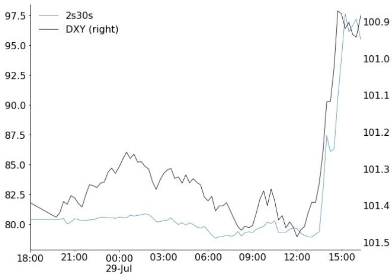

# JPM：价格数据与市场变化观察

周三的FOMC会议对美元是一次实质性回撤，但JPM外汇策略团队在会后报告中维持做多美元的观点。报告的核心判断是：美联储信誉问题重新引入通胀不确定性溢价，导致2s30s曲线出现十年来FOMC日最大单日扭曲陡峭化，美元随之走弱；但短端利率重定价幅度有限、12月加息预期升温以及地缘不确定性带来的贸易条件支撑，仍为美元提供缓冲。

这份报告的独特之处在于，它把美元走势与美联储信誉变量直接挂钩。新闻发布会中，新任主席对PCE作为通胀目标的前景提出质疑、未能阐明实现通胀目标的路径、对异议票细节披露有限，这些细节被该机构宏观环境学家解读为"对新任主席降低通胀可信度的质疑"。市场以+15bp的端到端扭曲陡峭化回应——短端节奏变化、长端升至2007年以来高位——美元在新闻发布会期间同步走弱。

## 1. 扭曲陡峭化与美元走弱呈现同步关系

报告引用的图表显示，2s30s曲线形态与DXY（反向）在新闻发布会期间几乎完全吻合。这并非孤立事件。该机构此前的研究表明，短端利率节奏变化叠加长端利率上行，历史上对美元是特别谨慎的组合。2025年7月美联储独立性受到质疑时，美元也出现过类似反应。

通胀盈亏平衡点单日跳升4-7bp，实际回报表现回落，这一组合对美元具有腐蚀性。但报告同时指出，FOMC前实际回报表现的累积上行提供了起点支撑，美元后续走向仍取决于数据——下一次非农就业若表现强劲，美元仍可走强；若偏软，则进一步承压。

> **KC评论：** 这里的关键不是曲线陡峭化本身，而是陡峭化的成因。如果长端上行源于增长预期改善，美元未必走弱；但这次长端上行伴随盈亏平衡通胀上升，市场在为美联储信誉不确定性定价，这对美元才是实质性的。

## 2. 短端利率重定价幅度有限支撑美元利差缓冲

报告提供了一个容易被忽略的数据点：FOMC会议期间，美国1个月远期OIS（1年内）平均仅节奏变化约5-6bp，而市场仍定价终端利率高于当前水平50bp。这意味着短端利率侵蚀远未达到损害美元利差保护的程度。

该机构同时将美联储加息预期从9月推迟至12月，理由是委员会将"为维护信誉而行动"。9月仍是活跃窗口，取决于数据表现。如果通胀再度升温，数据依赖机制可以重新激活美元上行空间。

## 3. 长端债券市场的溢出不确定性集中于英镑和日元

报告指出，若美国期限溢价上升因美联储信誉问题向全球长端债券市场溢出，英镑和日元可能面临节奏变化不确定性。这两个货币对财政政策不确定性溢价敏感，长端债券走弱会直接传导至汇率。欧元方面，美联储信誉不确定性可能节奏变化其向公允价值收敛的速度，但不会改变欧元走弱的方向。

该机构仍建议做多美元兑G10低回报表现货币篮子（欧元、瑞郎、瑞典克朗、加元、新西兰元）。一个值得注意的细节是，报告认为若美联储反应函数转向更鸽派，瑞典克朗这类对利率敏感、传导机制快、财政政策稳健的货币将受益，但这并非基准情形，该机构仍持有瑞典克朗空头。

## 4. 不确定性偏好出现变化与能源价格构成美元额外支撑

报告列出了几个未被市场充分定价的美元支撑因素：初请失业金数据仍对美元构成建设性支撑；伊朗局势再度升温，能源价格和地缘不确定性偏好回落将带来贸易条件支撑；全球市场若出现广泛回调，美元的逆周期属性将发挥作用——该机构测算，过去十年全球市场约5.5%的回调大致对应美元贸易加权指数约1%的上行。

> **KC评论：** 报告对美元多头的坚持建立在多层缓冲之上：利差、数据、地缘、不确定性偏好。但最值得跟踪的单一变量是美联储信誉——如果后续沟通继续模糊，通胀不确定性溢价可能进一步侵蚀这些缓冲。

黄金价格在该机构框架中被视为美元"贬值交易"的风向标——若期限溢价上升重新激活这一交易，黄金将率先反应。这份报告的价值不在于给出单一方向，而在于提供了一个观察框架：当美联储信誉成为变量时，美元定价从利差驱动转向不确定性溢价驱动，曲线形态比点位更重要。

For informational purposes only. Portions may be generated,translated,summarized,or edited with AI assistance based on source materials and may contain omissions or errors. Please verify independently. This is not investment,legal,tax,accounting,or other professional advice.

For informational purposes only. Portions may be generated,translated,summarized,or edited with AI assistance based on source materials and may contain omissions or errors. Please verify independently. This is not investment,legal,tax,accounting,or other professional advice.

