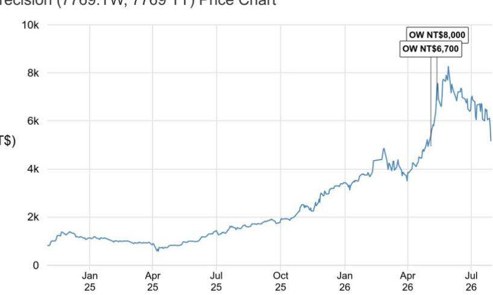

# 关于爱德万测试业绩说明会的观察

## 精密科技

爱德万测试FY1Q26业绩说明会带来积极信号——AI需求更加多元化且好于预期，SoC测试设备产能建设加速

\- 爱德万测试的相关信息：1) 爱德万测试观察到推理AI的快速应用正在带动ASIC、CPU和DRAM领域的半导体需求——这三者的增长速度均超出此前预期。GPU市场仍是最大单一市场，需求同样强劲。2) 爱德万测试上调了FY26展望，预计2026年SoC和存储测试设备市场将大于其4月份时的预期。3) 爱德万测试正在加快产能扩张计划。其V93K测试设备的年度产能目标原为2027年3月达到5,000台、2028年底或2029年初达到10,000台。公司预计将在2027年3月前超额完成5,000台目标，并提前实现10,000台目标。4) 爱德万测试SoC测试设备的多层驱动因素包括芯片出货量增长和每一代产品测试内容的增加（即更长的测试时间和额外的测试插入）。5) 爱德万测试的客户需求可见度在许多情况下已延长至18个月，而历史上客户仅提供6个月的预测。6) CPU出货量增长显著，正在推动SoC测试设备市场规模的扩大。在最终测试（FT）阶段，由于芯片复杂度不同，CPU的测试时间明显低于加速器。

爱德万测试（6857 JT）由JPM分析师Mio Shikanai负责覆盖，详见其FY1Q26业绩说明。

## 对精密科技的传导观察

\- 在最终测试环节，测试设备与分选机的关系为1:1；精密科技在AI及高性能计算分选机领域占据主导地位。爱德万测试上调2026年SoC测试设备市场规模预期，同时加快近期和中期产能扩张计划，这对精密科技的测试分选机需求构成积极传导。精密科技是全球半导体测试分选机的领先企业，在AI和高性能计算应用（GPU、ASIC、CPU等）的最终测试分选机领域占据主导份额。

\- CPU和ASIC需求好于预期，为精密科技的基本面和公司叙事提供支撑。部分市场参与者仍将精密科技主要视为与NV GPU相关，因此将其报价前景与NV GPU进展过度关联。精密科技一直在向ASIC和CPU领域多元化拓展，并预计其AI GPU与ASIC的需求结构将从2025年的约75–80% / 约25–30%转变为2026年的约50% / 约50%。此外，在系统级测试（SLT）分选机业务中，精密科技在AI ASIC和CPU领域同样占据主导份额，其客户包括MediaTek TPU和AMD Venice CPU。

\- 爱德万测试约18个月的客户需求可见度，为精密科技此前的增长指引提供了支撑。精密科技此前指引其设备出货金额（同时反映台数与价格）在2026年同比增长超过40%，2027年同比增长超过50%，此后仍将保持快速扩张。精密科技的分选机供应持续紧张。若能及时获得更多生产场地，其增长指引仍有进一步上修空间。

\- 精密科技受益于同样的多层需求驱动因素，并通过规格升级提升平均售价。芯片出货量增长、更长的测试时间和额外的测试插入将持续推动精密科技的分选机出货。我们还注意到，精密科技的ATC分选机平均售价有望实现两位数年复合增长，这反映了关键增值功能，如热控能力升级（路线图延伸至2028年）、将光学检测功能集成到分选机中、CPO测试插入4光电协同测试、面向超大封装（120×150毫米及以上）的新平台等。

\- 精密科技将于7月30日发布业绩，并于7月30日台湾时间下午2:30召开业绩说明会。详见我们7月12日的报告。

# 投资论点、估值与风险

精密科技（评级：增持；目标价：NT\$8,000.00）

## 投资论点

我们对精密科技持增持评级。精密科技是全球半导体测试分选机的领先企业，市场份额超过35%，其中约80%的收入来自AI与高性能计算。基于AI与高性能计算芯片的出货量和规格升级趋势，我们预计2025-28年分选机出货量/平均售价的年复合增长率分别为38%/15%，带动收入和每股收益均实现61%的年复合增长。我们认为市场低估了其在测试规格快速升级背景下的多年平均售价扩张潜力。精密科技同时也是CPO的推动者/受益者，并正在成为分选机整体解决方案提供商。我们看好精密科技的每股收益能力、估值重估潜力以及在未来AI芯片测试中的推动者角色。

## 估值

我们对2027年6月目标价NT\$8,000的设定基于2027年预期市盈率38倍，略高于该公司自2024年11月在兴柜挂牌以来的平均值加2个标准差（34倍）。

我们设想一个乐观情景：当市场将预期滚动至2028年预期每股收益并给予35-40倍市盈率时，精密科技的报价有望挑战NT\$10,000水平。

## 评级与目标价的风险

主要下行风险包括：AI需求放缓、测试密度下降、竞争加剧以及先进封装技术进展缓慢。

主要上行催化因素包括：全球AI/AI半导体资本支出上调、AI需求更强且持续时间更长、先进封装技术迁移加速以及关键项目取得突破。

分析师认证：本报告封面标注“AC”的研究分析师证明（或，当本报告由多位研究分析师主要负责时，封面或文档中标注“AC”的研究分析师分别就其在本研究中覆盖的每只证券或发行人证明）：(1) 本报告中表达的所有观点准确反映了研究分析师对任何及所有标的证券或发行人的个人观点；(2) 研究分析师的任何部分薪酬过去、现在或将来均不会直接或间接与本报告中表达的具体建议或观点相关。对于封面列出的所有韩国研究分析师（如适用），其还根据KOFIA要求证明，研究分析师的分析是善意进行的，观点反映了研究分析师自身的判断，未受到不当影响或干预。

本报告中列出的所有作者均为独立开展研究的研究分析师，除非另有说明。在欧洲，行业专家（销售和交易）可能作为联系人出现在本报告中，但并非报告作者或研究部门成员。

## 重要披露

\- 做市商/流动性提供者：JPM是精密科技或相关实体金融工具的做市商和/或流动性提供者。

\- 债务头寸：JPM可能持有精密科技或相关实体的债务证券头寸（如有）。

公司特定披露：JPM确实并寻求与其研究报告所覆盖的公司开展业务。因此，读者应注意，公司可能存在影响本报告客观性的利益冲突。读者应将本报告视为做出投资决策的单一因素。重要披露，包括价格图表和信用意见历史表（如适用），可在https://www.jpmm.com/research/disclosures查阅，或致电1-800-477-0406，或发送邮件至research.disclosure.inquiries@JPM.com。

精密科技（7769.TW, 7769 TT）价格图表

<table><tr><td>日期</td><td>评级</td><td>价格（NT$）</td><td>目标价（NT$）</td></tr><tr><td>2026年5月4日</td><td>增持</td><td>4,945.00</td><td>6,700</td></tr><tr><td>2026年5月13日</td><td>增持</td><td>6,870.00</td><td>8,000</td></tr></table>

来源：Bloomberg Finance L.P. 和 JPM；价格数据已根据拆股和股息进行调整。
2026年5月4日开始覆盖。所有股价均为前一交易日收盘价。
图表显示JPM对该股票的持续覆盖；现任分析师可能并非在整个期间内覆盖该股票。
JPM评级或标识：OW = 增持，N = 中性，UW = 减持，NR = 未评级

## 股票研究评级、标识和分析师覆盖范围说明：

JPM采用以下评级体系：增持（在本报告所示目标价期间内，我们预计该股票的表现将优于研究分析师或研究分析师团队覆盖范围内股票的平均总回报）；中性（在本报告所示目标价期间内，我们预计该股票的表现将与研究分析师或研究分析师团队覆盖范围内股票的平均总回报一致）；减持（在本报告所示目标价期间内，我们预计该股票的表现将逊于研究分析师或研究分析师团队覆盖范围内股票的平均总回报。NR为未评级。在此情况下，JPM已因缺乏充分的基本面依据或法律、监管或政策原因移除了该股票的评级及（如适用）目标价。此前的评级和（如适用）目标价不应再被依赖。NR标识并非建议或评级。部分被覆盖股票有评级但无目标价；在此类情况下，我们预计该股票的表现将优于/一致/逊于研究分析师或研究分析师团队覆盖范围内股票在相关区域内的平均总回报。在我们的亚洲（除澳大利亚和印度）和英国中小市值股票研究中，每只股票的预期总回报是与基准国家市场指数的预期总回报进行比较，而非与研究分析师覆盖范围进行比较。如本报告重要披露部分未显示，认证研究分析师的覆盖范围可在JPM研究网站https://www.JPMmarkets.com上查阅。

覆盖范围：Huang, Jimmy：ACM Research (ACMR)、ACM Research (上海) (688082.SS)、All Ring Tech (6187.TW)、环球晶圆 (6488.TWO)、Grand Process Technology (3131.TW)、精密科技 (7769.TW)、旺宏 (2337.TW)、NCE Power - A (605111.SS)、SICC - A (688234.SS)、辛耘 (3583.TW)、斯达半导 - A (603290.SS)、United Nova - A (688469.SS)、华邦电子 (2344.TW)
Tsai, Jerry：群光电能 (6412.TW)、致茂电子 (2360.TW)、中华精测 (6510.TWO)、元太科技 (8069.TWO)、联茂电子 (2383.TW)、台郡科技 (6269.TW)、瑞仪光电 (6176.TW)、建准电机 (2421.TW)、台湾表面贴装科技 (6278.TW)、台光电子 (3044.TW)、欣兴电子 (3037.TW)、稳懋半导体 (3105.TWO)、国巨 (2327.TW)

JPM股票研究评级分布，截至2026年7月4日

<table><tr><td></td><td>增持（买入）</td><td>中性（持有）</td><td>减持（卖出）</td></tr><tr><td>JPM全球股票研究覆盖*</td><td>53%</td><td>36%</td><td>12%</td></tr><tr><td>投行客户**</td><td>83%</td><td>80%</td><td>73%</td></tr><tr><td>JPMS股票研究覆盖*</td><td>51%</td><td>37%</td><td>12%</td></tr><tr><td>投行客户**</td><td>95%</td><td>92%</td><td>87%</td></tr></table>

\*请注意，由于四舍五入，百分比可能不等于100%。

\*\*JPM在过去12个月内为"买入"、"持有"和"卖出"各类别中的标的公司提供投资银行服务的比例。

就FINRA评级分布规则而言，我们的增持评级属于报告评级类别；中性评级属于持有评级类别；减持评级属于报告评级类别。请注意，标有NR的股票未包含在上表中。该信息截至最近一个日历季度末。

股票估值与风险：有关被覆盖公司或目标价的估值方法和风险，请参阅http://www.JPMmarkets.com上最新的公司特定研究报告，联系首席分析师或您的JPM代表，或发送邮件至research.disclosure.inquiries@JPM.com。有关专有模型的实质性信息，请参阅公司特定研究报告中的财务摘要和公司一览表，可在我们的客户网站http://www.JPMmarkets.com的公司页面下载。本报告还列出了所使用的实质性基础假设。

## 研究交流历史：

JPM在过去12个月内发布的研究交流历史可在http://www.JPMmarkets.com的研究与评论页面查阅，您还可以按分析师姓名、行业或金融工具进行搜索。

分析师薪酬：负责编写本报告的研究分析师的薪酬基于多种因素，包括研究的质量和准确性、客户反馈、竞争因素以及公司整体收入。

非美国分析师注册：除非另有说明，本报告封面列出的非美国分析师是JPM Securities LLC非美国关联公司的员工，可能未根据FINRA规则注册为研究分析师，可能不是JPM Securities LLC的关联人员，且可能不受FINRA规则2241或2242关于与所覆盖公司沟通、公开露面以及研究分析师账户持有证券交易的限制。

## 其他披露

JPM是JPM Chase & Co.及其全球子公司和关联公司投资银行业务的营销名称。

英国MIFID FICC研究分拆豁免：英国客户应参阅UK MIFID Research Unbundling exemption，了解JPM实施FICC研究豁免的详情以及相关FICC研究分类的指引。

所有向客户提供的研究材料均同时在我们的客户网站JPM Markets上提供，除非相关法律特别允许。并非所有研究内容都会重新分发、通过电子邮件发送或提供给第三方聚合平台。如需获取特定股票的所有研究材料，请联系您的销售代表。

本研究材料中对中国的任何长格式称谓为：中国大陆；中国香港特别行政区；中国台湾；中国澳门特别行政区。

JPM可能不时撰写关于受美国、欧盟、英国或其他相关司法管辖区政府当局实施的经济或金融制裁所针对的发行人或证券（受制裁证券）的内容。本报告中的任何内容均无意被解读为鼓励、促进、推动或以其他方式批准对受制裁证券的投资或交易。客户在做出投资决策时应了解自身的法律和合规义务。

本研究报告中讨论的任何数字或加密资产均面临快速变化的监管环境。有关加密资产（包括比特币和以太坊）的相关监管提示，请参阅https://www.JPM.com/disclosures/cryptoasset-disclosure。

本研究报告的作者可能未获许可在您的司法管辖区开展受监管活动，如未获许可，则不会声称能够开展此类活动。

交易所交易基金（ETF）：JPM Securities LLC（"JPMS"）作为几乎所有美国上市ETF的授权参与者。如果本报告中提及任何ETF，JPMS可能因分销这些ETF份额而赚取佣金和基于交易的报酬，并可能因执行其他与交易相关的服务（如向ETF份额的卖空者提供证券借贷）而赚取费用。JPMS还可能为ETF本身提供服务，包括担任ETF的经纪商或交易商。此外，JPMS的关联公司可能为ETF提供服务，包括信托、托管、管理、借贷、指数计算和/或维护及其他服务。

期权和期货相关研究：如果本文包含的信息涉及期权或期货相关研究，则该信息仅提供给已收到适当期权或期货风险披露文件的人士。请联系您的JPM代表或访问https://www.theocc.com/components/docs/riskstoc.pdf获取期权清算公司的《标准化期权的特征和风险》副本，或访问https://www.finra.org/sites/default/files/2020-08/Security\_Futures\_Risk\_Disclosure\_Statement\_2020.pdf获取证券期货风险披露声明副本。

银行间报价利率（IBOR）和其他基准利率的变更：某些利率基准正在或可能在未来受到持续的国际、国内和其他监管指引、改革和改革提案的影响。更多信息请参阅：https://www.JPM.com/global/disclosures/interbank\_offered\_rates

私人银行客户：如果您作为JPM Chase & Co.及其子公司（"JPM私人银行"）私人银行业务的客户接收研究，则研究由JPM私人银行提供，而非JPM的任何其他部门，包括但不限于JPM企业与投资银行及其全球研究部门。

负责制作和分发研究的法律实体：本材料作者Reg AC研究分析师姓名下方标识的法律实体是负责制作本研究的法律实体。如果多位Reg AC研究分析师撰写了本材料且其姓名下方标识了不同的法律实体，则这些法律实体共同负责制作本研究。如果分析师姓名下方列出一个以上法律实体，则除非另有说明，第一个法律实体负责制作。来自各JPM关联公司的研究分析师可能为本材料的制作做出了贡献，但可能未获许可在您的司法管辖区开展受监管活动（且不会声称能够开展此类活动）。除非下文法律实体披露中另有说明，本材料已由负责制作的法律实体分发，或者如果分析师姓名下方列出一个以上法律实体，则第一个法律实体负责分发。如有任何疑问，请联系您所在司法管辖区的相关研究分析师或分发本研究材料的实体。

## 法律实体披露和国家/地区特定披露：

阿根廷：JPM Chase Bank N.A Sucursal Buenos Aires受阿根廷中央银行（BCRA）和阿根廷国家证券委员会（CNV - ALYC y AN Integral N°51）监管。

澳大利亚：JPM Securities Australia Limited（"JPMSAL"）（ABN 61 003 245 234/AFS牌照号：238066）受澳大利亚证券和投资委员会监管，是ASX Limited的市场参与者、ASX Clear Pty Limited的清算和结算参与者以及ASX Clear（期货）Pty Limited的清算参与者。本材料在澳大利亚由JPMSAL或代表JPMSAL仅向"批发客户"（定义见《2001年公司法》第761G条）发行和分发。所有覆盖金融产品的列表可在https://www.jpmm.com/research/disclosures查阅。JPM寻求覆盖与国内外读者相关的所有全球行业分类标准（GICS）行业以及不同市值规模的公司。如适用，在对标的公司进行公开尽职调查过程中，研究分析师团队可能通过公司拜访、与公司代表讨论、管理层演示等公司互动方式开展尽职调查。JPMSAL发布的研究已按照JPM澳大利亚研究独立性政策编制，该政策可在以下链接查阅：JPM Australia - Research Independence Policy。

巴西：Banco JPM S.A.受巴西证券委员会（CVM）和巴西中央银行监管。JPM监察员：0800-7700847 / 0800-7700810（听障人士）/ ouvidoria.jp.morgan@jpmchase.com。

加拿大：JPM Securities Canada Inc.是一家注册投资交易商，受加拿大投资监管组织和安大略省证券委员会监管，是加拿大交易所的参与会员。本材料在加拿大由JPM Securities Canada Inc.或代表其分发。

智利：Inversiones JPM Limitada是一家在智利注册的未受监管实体。

中国：JPM证券（中国）有限公司已获中国证监会批准开展证券投资咨询业务。

哥伦比亚：Banco JPM Colombia S.A.受哥伦比亚金融监管局（SFC）监管。本材料中对哥伦比亚境外实体提供的产品或服务的任何引用仅供说明目的。此类引用不构成、也不应被解释为在哥伦比亚境内进行的促销活动或金融产品或服务的提供，如适用哥伦比亚法规所定义。

迪拜国际金融中心（DIFC）：JPM Chase Bank, N.A., Dubai Branch受迪拜金融服务管理局（DFSA）监管，注册地址为Dubai International Financial Centre - The Gate, West Wing, Level 3 and 9 PO Box 506551, Dubai, UAE。本材料已由JPM Chase Bank, N.A., Dubai Branch分发给根据DFSA规则被视为专业客户或市场对手方的人士。

欧洲经济区（EEA）：除非另有说明，研究在EEA由JPM SE（"JPM SE"）分发，JPM SE是一家由联邦金融监管局（BaFin）授权的信贷机构，受BaFin、德国中央银行（Deutsche Bundesbank）和欧洲中央银行（ECB）共同监管。JPM SE总部位于法兰克福，注册地址为TaunusTurm, Taunustor 1, Frankfurt am Main, 60310, Germany。本材料已在EEA分发给根据MiFID II第4条第1款第10项和附件二及其在各自母国的实施被视为专业读者（或同等资格）的人士（"EEA专业读者"）。非EEA专业读者不得依据或依赖本材料。本材料涉及的任何投资或投资活动仅面向EEA相关人士，且仅与EEA相关人士进行。

香港：JPM Securities (Asia Pacific) Limited（CE编号AAJ321）受香港金融管理局和香港证券及期货事务监察委员会监管，JPM Broking (Hong Kong) Limited（CE编号AAB027）受香港证券及期货事务监察委员会监管。JPM Chase Bank, N.A., Hong Kong Branch（CE编号AAL996）受香港金融管理局和证券及期货事务监察委员会监管，根据美国法律组建，承担有限责任。如本材料的分发在香港属于受监管活动，则本材料在香港由JPM Securities (Asia Pacific) Limited和/或JPM Broking (Hong Kong) Limited分发或通过其分发。

印度：JPM India Private Limited（公司识别号 - U67120MH1992FTC068724），注册办公地址为JPM Tower, Off. C.S.T. Road, Kalina, Santacruz – East, Mumbai – 400098，已在印度证券交易委员会（SEBI）注册为"研究分析师"，注册号INH000001873。JPM India Private Limited还已在SEBI注册为印度国家证券交易所和孟买证券交易所会员（SEBI注册号 – INZ000239730）以及商人银行家（SEBI注册号 - MB/INM000002970）。电话：91-22-6157 3000，传真：91-22-6157 3990，网站：http://www.jpmipl.com。JPM Chase Bank, N.A. - Mumbai Branch已获得印度储备银行（RBI）许可（牌照号：53/Licence No. BY.4/94；SEBI - IN/CUS/014/ CDSL：IN-DP-CDSL-444-2008/ IN-DP-NSDL-285-2008/ INBI00000984/ INE231311239），作为印度的持牌商业银行，这是其开展银行业务及印度银行分支机构允许开展的其他活动的主要牌照。对于非本地研究材料，本材料不由JPM India Private Limited在印度分发。合规官：Ashutosh Sharma；ashutosh.j.sharma@jpmchase.com；+912261575002。投诉官：Ramprasadh K，jpmipl.research.feedback@JPM.com；+912261573000。SEBI的注册和NISM的认证不以任何方式保证中介机构的业绩或向读者提供回报保证。请访问条款和条件及最重要条款和条件（MITC）。年度合规审计报告可在http://www.jpmipl.com/#research查阅。

印度尼西亚：PT JPM Sekuritas Indonesia是印度尼西亚证券交易所的会员，并在金融服务管理局（OJK）注册和监管。

韩国：JPM Securities (Far East) Limited, Seoul Branch是韩国交易所（KRX）的会员。JPM Chase Bank, N.A., Seoul Branch已获许可为在韩国的外资银行分行（JPM Chase Bank, N.A.）。两个实体均受金融服务委员会（FSC）和金融监督院（FSS）监管。对于非宏观研究材料，该材料在韩国由JPM Securities (Far East) Limited, Seoul Branch分发或通过其分发。

日本：JPM Securities Japan Co., Ltd.和JPM Chase Bank, N.A., Tokyo Branch受日本金融厅监管。

马来西亚：本材料在马来西亚由JPM Securities (Malaysia) Sdn Bhd（18146-X）发行和分发，该公司是Bursa Malaysia Berhad的参与组织，持有马来西亚证券委员会颁发的资本市场服务牌照。

墨西哥：JPM Casa de Bolsa, S.A. de C.V., JPM Grupo Financiero是墨西哥证券交易所（Bolsa Mexicana de Valores）和机构证券交易所（Bolsa Institucional de Valores）的会员，并获国家银行和证券委员会（Comisión Nacional Bancaria y de Valores）授权作为经纪交易商运营。

新西兰：本材料由JPMSAL在新西兰仅向"批发客户"（定义见《2013年金融市场行为法》）发行和分发。JPMSAL已根据《2008年金融服务提供商（注册和争议解决）法》注册为金融服务提供商。

菲律宾：JPM Securities Philippines Inc.是菲律宾证券交易所的交易参与者，也是菲律宾证券清算公司和证券读者保护基金的会员。其受证券交易委员会监管。

新加坡：本材料在新加坡由JPM Securities Singapore Private Limited（JPMSS）[MDDI (P) 057/08/2025，公司注册号：199405335R]分发或通过其分发，JPMSS是新加坡交易所证券交易有限公司的会员，和/或由JPM Chase Bank, N.A., Singapore branch（JPMCB Singapore）分发，两者均受新加坡金融管理局监管。本材料在新加坡仅向《证券及期货法》（第289章）第4A条定义的认可读者、专家读者和机构读者发行和分发。本材料不面向零售读者或不属于"认可读者"、"专家读者"或"机构读者"类别的任何其他读者发行或分发。新加坡的接收者如对本材料有任何疑问，请联系JPMSS或JPMCB Singapore。

南非：JPM Equities South Africa Proprietary Limited和JPM Chase Bank, N.A., Johannesburg Branch是约翰内斯堡证券交易所的会员，受金融服务行为监管局（FSCA）监管。

台湾：JPM Securities (Taiwan) Limited是台湾证券交易所（公司制）的参与者，受台湾证券期货局监管。与股票证券相关的材料在台湾由JPM Securities (Taiwan) Limited根据许可证范围和台湾适用法律法规发行和分发。如JPM Securities (Taiwan) Limited就未在台湾证券交易所或台北交易所上市的证券（"非台湾上市证券"）制作研究材料，该等材料不构成台湾适用法规下的证券推荐，且为免疑义，JPM Securities (Taiwan) Limited不担任非台湾上市证券的经纪商。根据《证券商推介客户买卖有价证券管理办法》第7条之1第2项（经修订或补充）和/或其他适用法律法规，请注意本材料的接收者不得从事与本材料相关的可能产生利益冲突的任何活动，除非本材料"重要披露"部分另有披露。

泰国：本材料在泰国由JPM Securities (Thailand) Ltd.发行和分发，该公司是泰国证券交易所的会员，受财政部和证券交易委员会监管。注册地址为548 One City Center Building, 50th Floor, Ploenchit Road, Lymphini, Pathum Wan, Bangkok 10330。

英国：研究在英国由JPM Securities plc（"JPMS plc"）制作，该公司是伦敦证券交易所的会员，获审慎监管局授权并受金融行为监管局和审慎监管局监管；或由JPM Markets Limited（"JPMML Ltd"）制作，该公司获金融行为监管局授权并受其监管。除非另有说明，本材料在英国由JPMS plc分发，且仅面向：(a) 具有投资相关事务专业经验的人士（属于《2000年金融服务和市场法（金融促销）令》2005年第19(5)条范围）；(b) 该命令第49条所述人士（高净值公司、非法人协会或合伙企业、高价值信托的受托人等）；或(c) 可以合法接收本通讯的任何其他人士；所有此类人士统称为"英国相关人士"。非英国相关人士不得依据或依赖本材料。本材料涉及的任何投资或投资活动仅面向英国相关人士，且仅与英国相关人士进行。JPM EMEA关于预防和避免研究制作相关利益冲突的政策说明可在以下链接查阅：JPM EMEA - Research Independence Policy。

美国：JPM Securities LLC（"JPMS"）是NYSE、FINRA、SIPC和NFA的会员。JPM Chase Bank, N.A.是FDIC的会员。非美国关联公司发布的材料在美国由JPMS分发，JPMS对其内容承担责任。

一般信息：如需更多信息，可应要求提供。本材料中的信息来自据信可靠的来源。虽然已采取一切合理谨慎措施确风险自担材料中陈述的事实准确，且其中包含的预测、意见和预期公平合理，但JPM Chase & Co.或其关联公司和/或子公司（合称"JPM"）不对所提供材料的完整性或准确性作出任何陈述或保证，但有关JPM和研究分析师参与本材料主题发行人的披露除外。因此，不应依赖本材料所含信息的准确性、公平性或完整性。由于计算、调整、翻译成不同语言和/或当地监管限制（如适用），本材料中的数据可能存在某些差异和/或内容有限。这些差异不应影响对材料中可能讨论的标的公司的整体投资分析、观点和/或建议。人工智能工具可能已用于本材料的准备，包括协助数据分析、模式识别和研究材料的内容起草。JPM对因使用本材料或其内容而产生的任何损失不承担任何责任，JPM及其各自的董事、高级管理人员或员工不对本材料的内容承担任何责任，但相关司法管辖区监管机构或其监管制度可能施加的责任和义务除外。本材料中包含的意见、预测或预测性陈述仅代表JPM截至材料日期当前的意见或判断，因此如有变更，恕不另行通知。可能会根据公司特定发展或公告、市场状况或任何其他公开信息对公司/行业提供定期更新。无法保证未来结果或事件与任何此类意见、预测或预测性陈述一致，这些仅代表一种可能的结果。此外，此类意见、预测或预测性陈述受某些未经验证的风险、不确定性和假设的影响，未来实际结果或事件可能与之存在重大差异。本材料中提及的任何投资的价值或收入可能会波动和/或受汇率变动影响。除非另有说明，所有价格均为所讨论证券的市场收盘价。过往表现不代表未来结果。因此，读者可能收回的资金少于原始投资。本材料不构成任何金融工具的买入或卖出要约或招揽。本文中的意见和建议未考虑个别客户的情况、目标或需求，不构成对特定客户推荐的特定证券、金融工具或策略。本材料可能包含对结构性证券、期权、期货和其他衍生品的观点。这些是复杂工具，可能涉及高度风险，可能仅适合能够理解和承担相关风险的成熟读者。本材料接收者必须就其中提及的任何证券或金融工具做出自己的独立决策，并应寻求其认为必要的独立财务、法律、税务或其他顾问的建议。JPM可能基于研究分析师的觀點和研究以主事人身份进行交易，也可能为自己的账户或客户账户进行与本材料观点不一致的交易，JPM没有义务确保此类其他通讯被本材料的任何接收者知悉。JPM内部的其他人士，包括策略师、销售人员和其他研究分析师，可能持有与本材料观点不一致的观点。未参与本材料编制的JPM员工可能持有本材料中提及的证券（或该等证券的衍生品）的投资，并可能以与本材料讨论方式不同的方式进行交易。本材料不是任何发行人在任何司法管辖区的广告或营销，也不是其产品或服务或其证券的广告或营销。

保密和安全通知：本传输可能包含特权、保密、法律特权信息和/或根据适用法律豁免披露的信息。如果您不是预期接收者，特此通知您，严禁披露、复制、分发或使用本文所含信息（包括任何依赖）。尽管相信本传输及其任何附件不含任何可能影响接收和打开它的任何计算机系统的病毒或其他缺陷，但接收者有责任确保其无病毒，JPM Chase & Co.及其子公司和关联公司（如适用）不对因使用而产生的任何损失或损害承担责任。如果您错误地收到本传输，请立即联系发件人并彻底销毁该材料，无论是电子版还是硬拷贝版。本消息受电子监控：https://www.JPM.com/disclosures/email

MSCI：本文中的某些信息（"信息"）经MSCI Inc.、其关联公司和信息提供商（"MSCI"）许可复制，©2026。未经适当许可，不得复制或传播信息。MSCI对信息不作任何明示或暗示的保证（包括适销性或适用性），并在法律允许的范围内免除所有责任。任何信息均不构成研究交流，但MSCI ESG Research的任何适用信息除外。另请参阅msci.com/disclaimer

Sustainalytics：本文中包含的某些信息、数据、分析和意见经Sustainalytics许可复制，并且：(1) 包含Sustainalytics的专有信息；(2) 除非特别授权，不得复制或再分发；(3) 不构成研究交流，也不构成对任何产品或项目的认可；(4) 仅供信息参考；(5) 不保证完整、准确或及时。Sustainalytics不对任何交易决策、损害或与其或其使用相关的其他损失负责。数据的使用受https://www.sustainalytics.com/legal-disclaimers所列条件的约束。©2026 Sustainalytics. 保留所有权利。

"其他披露"最后修订于2026年7月4日。

版权所有2026 JPM Chase & Co.保留所有权利。未经JPM书面同意，不得重印、出售或再分发本材料或其任何部分。严禁在未经JPM事先书面同意的情况下，将JPM或授权第三方（"JPM数据"）提供的任何研究材料用于任何第三方人工智能（"AI"）系统或模型中，当该JPM数据可被第三方访问时。
