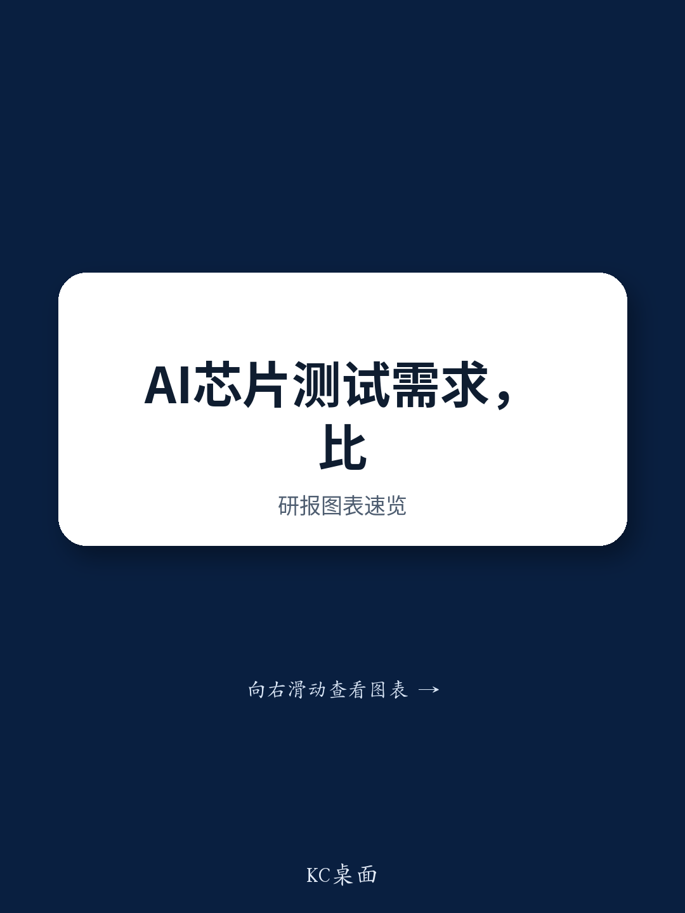

# 测试设备需求前置信号：AI算力验证环节正成为新的关注焦点

半导体测试设备市场近期出现了一个值得关注的信号：AI需求已不再局限于单一芯片领域。爱德万在2026财年第一季度财报电话会议中上调了多项预期，其影响远超自身订单范围——公司对2026年SoC及存储测试设备市场的判断较三个月前更为乐观，将10,000台V93K产能目标从2028年底或2029年初提前，并报告客户需求可见度在许多情况下已延伸至18个月，而历史预测周期为六个月。对于关注AI半导体供应链的观察者而言，这不仅是设备供应商的更新，更意味着瓶颈正从芯片设计环节转向测试环节，提供芯片与验证之间物理接口的企业正进入一场为期多年的产能竞赛。

这一信号对全球半导体测试分选机龙头鸿劲精密（市占率超过35%）的传导是直接且机械的。在最终测试环节，测试机与分选机的关系是一对一的：每台出货的测试机都需要配套分选机。当测试机厂商加速产能扩张计划时，实际上是在预先承诺一定规模的测试基础设施，这需要相应规模的分选设备与之匹配。鸿劲约80%的收入来自AI及高性能计算应用，是这一耦合关系的主要受益者。公司预计2026年设备出货金额同比增长超过40%，2027年超过50%，目前分选机供应仍处于紧张状态。爱德万的表态不仅支撑了这些数字，更解释了为何这些数字可能偏于保守。

更深层的战略意义在于，AI测试需求的基础正在拓宽，而许多市场参与者尚未充分认识到这一点。市场倾向于将鸿劲视为GPU概念的延伸，其股价与单一加速器厂商的兴衰高度相关。爱德万的表态打破了这一框架。公司明确指出，AI推理应用的快速普及正推动半导体需求覆盖ASIC、CPU和DRAM，这三个领域增速均超预期，GPU市场仍是最大单一引擎但已不再是相对少见动力。鸿劲内部也已显现这一变化：其AI GPU与ASIC需求组合预计将从2025年的约75-80% GPU、25-30% ASIC，转变为2026年的约50-50。爱德万对非GPU领域加速增长的确认，表明这一组合转变可能仍偏保守。

## 18个月可见度窗口改变整个测试供应链的风险评估逻辑

爱德万电话会议中最被低估的数据点，是客户需求可见度从6个月延长至18个月。这并非细枝末节的运营调整，而是半导体测试供应链规划方式的系统性变化。以往，测试机和分选机制造商依赖相对较短的订单周期，客户大约提前两个季度提供预测。18个月的可见度窗口意味着AI芯片设计者在其产品周期中更早地确定测试产能需求，测试基础设施的建设由此成为AI芯片生产的先行指标，而非滞后指标。

这一延长的可见度对产能规划影响深远。当客户提供18个月预测时，实际上是在要求供应商提前预留产能。对于已处于供应紧张状态的鸿劲而言，约束条件不再是需求而是生产执行。公司能否获得额外生产场地并提升产出，将决定其能否超越已相当积极的增长预期。爱德万提前产能目标正是对这一可见度的直接回应：当客户提前18个月告知需要更多测试机时，你不会等到临近再开始建设。

可见度的延长也改变了整个测试设备领域的风险特征。有了18个月的承诺，需求突然下滑的风险降低，但过度承诺的风险上升。如果AI芯片需求大幅减速，测试供应链将面临基于延长预测而建设的过剩产能。这是长可见度的经典双刃剑：它提高了规划效率，但也将风险集中在预测与现实交汇之处。对于观察者而言，关键监测问题不是18个月预测是否准确，而是这些预测在整个供应链中是否一致。如果测试机制造商、分选机制造商和封测厂看到相同的18个月需求图景，协调过度建设的概率增加，但AI建设具备真正多年持续性的概率也随之增加。

## CPU与ASIC测试需求正以GPU中心模型未覆盖的方式扩展市场空间

爱德万表态中最重要的分析修正涉及SoC测试机需求的构成。市场习惯于将AI测试需求等同于GPU测试需求，爱德万的框架打破了这一等同关系。公司指出CPU出货量大幅增长并推动SoC测试机市场空间扩大，ASIC增长同样贡献显著。这一区分至关重要，因为CPU的测试特征与加速器有实质差异。如爱德万所述，在最终测试阶段，CPU的测试时间远低于加速器，这源于芯片复杂度的差异。

这里的分析看似反直觉但具有战略重要性。单颗CPU测试时间较低并不意味着总测试需求减少，而是意味着CPU驱动的测试机需求随出货量而非单芯片测试内容扩展。CPU出货量远大于加速器，即使单设备测试时间较短，总测试工时和测试插入次数仍可能相当可观。更重要的是，测试内容逐代增加——更长的测试时间和额外的测试插入——适用于所有芯片类型。爱德万识别的多层需求驱动因素——芯片出货量增长加上每代测试内容增加——形成了比任何单一芯片类别都更广泛的复合增长动力。

对鸿劲而言，CPU和ASIC的扩展具有特定且有利的含义。公司不仅在AI和高性能计算最终测试分选机领域占据主导份额，在AI ASIC和CPU的系统级测试分选机领域同样如此，供应关系涵盖联发科TPU和AMD Venice CPU。跨芯片类型的多元化意味着鸿劲的增长不依赖于任何单一产品周期。即使GPU测试需求趋于平稳，CPU和ASIC领域也提供独立的增长路径。从75-80% GPU向50-50 GPU-ASIC的预期组合转变并非防御性调整，而是向测试市场更快增长领域的进攻性扩展。

## 分选机均价提升是第二增长引擎，由规格升级而非出货量驱动

出货量故事只是鸿劲研究逻辑的一半，另一半是平均售价提升，爱德万的传导效应同样支持这一点。鸿劲的分选机均价预计以两位数年复合增长率增长，驱动因素是一代又一代新增的关键增值功能。热管理能力路线图延伸至2028年，每次升级使分选机能够应对下一代AI芯片日益增长的功率密度和热负荷。光学检测功能直接集成到分选机中，整合了以往需要独立设备的测试步骤。CPO测试插入的加入用于光电协同测试，反映了行业向共封装光学器件的趋势，分选机必须在单次测试中同时管理电接口和光接口。针对超大封装（120×150毫米及以上）的新平台，应对先进AI加速器物理尺寸的增大。

这些规格升级并非可选功能，而是测试下一代AI芯片的前提条件。随着芯片复杂度提升，测试分选机必须更加精密以维持测试完整性。热管理至关重要，因为AI芯片在测试中产生更多热量，分选机必须保持精确的温度控制以确保测试结果有效。光学检测集成是必要的，因为行业正转向更高密度封装，视觉检查无法在不减慢测试流程的情况下作为独立步骤执行。CPO协同测试必不可少，因为光电设备需要同时验证两个域的性能。大封装平台则应对先进AI加速器在集成更多计算和存储资源时物理尺寸增大的现实。

均价故事的重要性在于它将鸿劲的收入增长与出货量增长脱钩。公司预计2025-2028年分选机出货量复合年增长率为38%，均价复合年增长率为15%，共同推动收入和每股收益61%的复合年增长率。如果规格升级加速推动均价增长加快，收入和每股收益轨迹将更为强劲。爱德万对逐代测试时间延长和测试插入增加的确认，支持规格升级周期正在加速而非趋于平稳的观点。每一代新芯片对分选机提出更高要求，每一代分选机也对应更高价格。

## AI测试基础设施建设中的定位决策框架

爱德万的传导效应为评估AI测试基础设施建设中的参与度提供了结构化方法。第一个问题是目标公司是否直接或间接参与测试机-分选机耦合关系。最终测试中的一对一关系形成了机械联动：每台出货的测试机需要配套分选机，每台出货的分选机也需要测试机。处于这一耦合关系任一侧的公司，其出货量可见度与另一侧的产能扩张计划直接相关。鸿劲作为主导分选机供应商，充分受益于爱德万的产能前置。

第二个问题是公司的收入组合是否反映了AI需求超越GPU的拓宽趋势。市场将AI测试需求视为GPU测试需求的倾向是一种系统性误判，创造了定价偏差机会。像鸿劲这样已多元化进入ASIC和CPU测试分选机的公司，对单一供应商GPU风险的敞口较低，而对AI计算跨所有架构的总体增长敞口较高。从75-80% GPU向50-50 GPU-ASIC的预期组合转变是对这一拓宽的直接回应，爱德万的确认表明这一转变正在加速发生。

第三个问题是公司是否通过规格升级而非仅出货量增长拥有定价能力。测试基础设施领域最持久的增长来自测试要求日益提高所驱动的均价提升。能够为每一代设备争取更高价格的公司——因为该设备确实具备更强能力——拥有独立于出货量的增长引擎。鸿劲两位数的均价复合年增长率，由热管理能力升级、光学检测集成、CPO协同测试和大封装平台驱动，正是这种定价能力的体现。

第四个问题是公司是否具备满足18个月可见度所隐含需求的产能。当前环境的约束不是需求而是执行。鸿劲仍处于供应紧张状态，其获取额外生产场地的能力将决定能否超越已相当积极的增长预期。能够扩大产能以满足延长客户承诺的公司将充分把握当前需求周期的上行空间，无法做到的公司将让渡份额给竞争对手。

第五个也是最后一个问题，公司的估值是否反映了多年增长轨迹，还是仅反映当前季度。鸿劲的市盈率已包含持续增长的预期，但爱德万的传导效应表明市场可能仍低估了AI测试需求周期的持续时间和广度。18个月可见度、产能目标前置以及ASIC、CPU和DRAM领域的拓宽，都指向远超当前预测范围的多年度建设周期。看多情形——随着市场将预期滚动至2028年盈利并给予35-40倍市盈率，鸿劲股价可能挑战新台币10,000元水平——正是基于这种持续的需求可见度。

综合爱德万传导效应与鸿劲定位的分析，可以得出清晰结论：AI测试基础设施领域正进入一个产能受限、持续多年的扩张阶段，而控制芯片与验证之间物理接口的企业是最直接的受益者之一。主导读者思维的GPU中心叙事正让位于一个更广泛、更持久的AI计算增长故事——跨多种架构。测试环节，长期被视为半导体价值链中必要但不引人注目的部分，已成为战略性瓶颈，今天的产能决策将决定未来数年AI部署的节奏。

*仅供参考。部分内容可能基于原始材料由AI辅助生成、翻译、总结或编辑，可能存在遗漏或错误。请独立核实。本文不构成投资、法律、税务、会计或其他专业建议。*

仅供参考。部分内容可能基于原始材料由AI辅助生成、翻译、总结或编辑，可能存在遗漏或错误。请独立核实。本文不构成投资、法律、税务、会计或其他专业建议。

