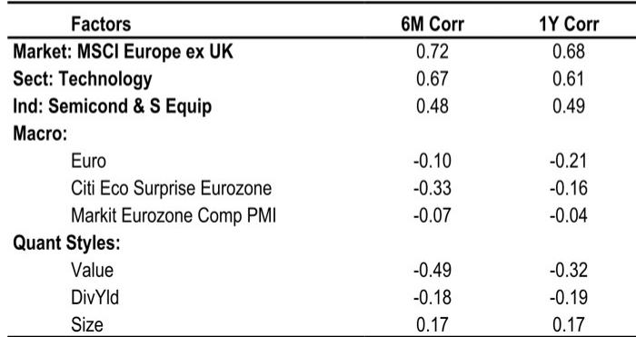
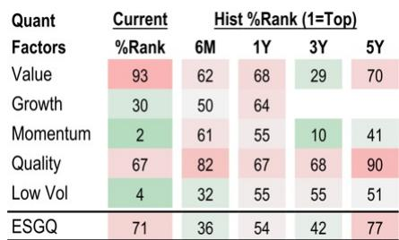
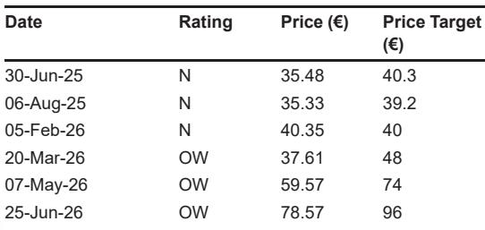

# 英飞凌的定价能力：不只是AI热潮，更将重塑盈利轨迹

市场对英飞凌科技的关注，一直集中在其作为AI数据中心功率半导体领先供应商的地位上。这个逻辑是成立的，但它只是故事的一半。更直接的催化剂，藏在一个不那么引人注目的机制里：定价。该公司在今年4月和7月两次上调了价格，而这些调整带来的二阶效应，即将在第四财季的业绩指引中显现。此刻，正是AI叙事与周期复苏交汇的节点，两者叠加的力量，比任何单一驱动力都更为强劲。

英飞凌将于8月5日公布其第三财季业绩，当前的市场环境对其颇为有利。市场对本季度的普遍预期与公司指引大体一致，这意味着实现即时超预期的门槛并不算高。真正的看点在于前瞻指引。公司已表明，将在市场条件允许的情况下上调价格，而价格上调与汽车半导体市场明显回暖的迹象相结合，指向一种情景：英飞凌有望在第四季度同时上调其营收和利润率指引。市场目前仍将其作为一家周期性半导体公司来定价，但种种迹象表明，它正在转型为一家兼具周期顺风的结构性增长公司。

当前格局中的张力在于，市场已为英飞凌的AI功率业务赋予了显著的估值溢价，然而过去一年，其股价表现却落后于半导体同行。相对表现差距——过去十二个月下跌近39%，而费城半导体指数表现相对较好——表明其AI溢价尚未被市场充分认可，或者市场正在等待其执行力的证明。即将到来的财报季，正是提供这一证明的时刻。问题不在于英飞凌是否处于有利位置，而在于它能否在未来两个季度内，将其市场份额优势转化为可见的财务表现。

## 同行业绩确认汽车行业低谷已过，英飞凌是最大的纯正受益者

即将发布的财报中，最被低估的数据点并非关于AI，而是关于汽车半导体市场——该市场约占英飞凌营收的一半。其最接近的同行已公布了季度业绩，释放的信号十分明确。德州仪器报告称，其汽车业务营收同比增长了百分之十几，管理层明确指出，本季度来自中国电动汽车和混动汽车的需求有所加速。更重要的是，他们描述客户持有的库存水平低得不可持续，并将此情况视为一个非常广泛周期的开端。恩智浦半导体报告称，其汽车业务经调整后营收同比增长17%，驱动力来自软件定义汽车、电动化和互联——关键在于，管理层强调增长是由内容驱动，而非补库存。

区分内容驱动增长与补库存，是分析的关键点。补库存周期是一种暂时的库存修正，为营收带来一次性提振。而内容驱动增长则是单车半导体含量的结构性提升，会在多年内持续叠加。恩智浦将其增长定性为内容驱动，并指出软件定义汽车是其业务中增长最快的部分，这表明汽车半导体复苏的持续性超越了库存周期本身。英飞凌在微控制器、传感器和汽车以太网等细分领域都是重要参与者，其在这些市场的规模意味着它能从内容增长中获取超比例的份额。

市场对英飞凌第三季度的普遍预期，仍假设其汽车业务仅环比增长4%，低于公司平均水平。鉴于同行已公布的数据，这一预期显得保守。德州仪器和恩智浦都强调了其在中国的电动汽车和混动汽车领域的强劲表现，而英飞凌拥有相当的业务敞口。当前预期的风险偏向于上行，而这一点并未反映在当前的股价中。市场一直聚焦于AI功率叙事，但汽车业务的复苏，是更安静、更可靠的驱动力，可能带来业绩上的惊喜。

## 价格上涨是市场共识尚未充分计入的隐性利润率杠杆

市场花费了大量时间对英飞凌来自AI基础设施的业务量增长进行建模，但定价动态同样重要，且更未被充分理解。该公司在4月和7月两次提价，管理层表示将在市场条件允许的情况下继续提价。这并非全面的通胀成本转嫁，而是在供应受限的特定产品类别中，有针对性的定价能力的体现。

最有趣的动态出现在MOSFET（一种核心功率半导体产品）领域。来自AI功率应用的需求收紧了这些组件的供应，由此产生的价格强势正外溢至非AI市场。这是一个典型的供需失衡，在不依赖业务量增长的情况下就能创造利润率扩张。对于英飞凌这样在制造端拥有大量固定成本的公司而言，价格上涨会以较高的增量比率传导至营业利润率。公司第三季度的分部营业利润率预计为19.6%，环比上升242个基点，而4月份实施的价格上调，应在第四季度数据中开始显现更明显的影响。

目前市场对第四季度的共识预期是营收46.1亿欧元，这意味着环比增长11.7%。这高于六年平均8.5%的季节性增长率，表明市场共识已在计入一些积极惊喜。但价格上涨为英飞凌提供了超越这一已抬高的门槛的机制。公司的新产能要到2027财年第一季度才能投产，因此第四季度的业务量增长受限于供应能力。然而，价格上涨并不需要额外产能，它们直接作用于营收和利润。这就是为何上调指引的情景是可信的：即使业务量受供应约束，英飞凌也能仅凭价格因素上调营收和利润率指引。

## AI功率市场比市场认知的更大，英飞凌的份额创造了不对称上行空间

长期论点建立在AI功率市场上，这里的数据令人瞩目。一份全球投资银行报告估计，到2028财年，AI功率市场可能达到140亿欧元。英飞凌目前在该市场的份额，显著高于该银行模型中假设的28.5%，这对应着约40亿欧元的AI功率营收。如果英飞凌能维持其当前高得多的份额，那么无论是该银行的预测还是市场共识，都存在可观的上行空间。

该银行的预测已比市场共识高出3.4%（2028财年营收）和17%（分部业绩）。这一差距反映了其观点：市场尚未充分计入英飞凌在AI功率领域的主导地位。该公司是数据中心CPU的领先功率半导体供应商，其在此处的份额高于GPU领域。随着英特尔和AMD均表示对代理式AI CPU的需求非常强劲，这是一个尤为相关的优势。CPU功率市场正在快速增长，而英飞凌是该增长中相当大一部分的默认供应商。

功率基础设施的结构性增长，是市场尚未充分认识的另一个因素。AI数据中心的建设，不仅需要服务器内部的半导体，还需要支撑它们的电源管理基础设施。这包括比传统数据中心复杂得多的功率转换、分配和管理系统。英飞凌的产品组合覆盖了这一整个链条，从单个MOSFET到完整的电源管理解决方案。该公司不仅是组件供应商，更是AI基础设施建设的系统级功率合作伙伴。这是一种支持股票重新估值的结构性增长，随着我们迈向2027年底，其重要性日益凸显。

## 估值溢价是合理的，但市场需要季度性的业绩兑现证明

过去十年，英飞凌的远期市盈率在15.6倍至23.0倍之间波动，平均倍数约为19倍。当前估值相对于历史区间存在溢价。这一溢价因其在AI功率领域的领先地位和功率基础设施的结构性增长而合理，但如果没有证据表明增长正体现在财务数据中，市场不会维持这一溢价。

即将到来的财报是提供该证据的首次机会。第三季度业绩应会符合预期，但第四季度的指引才是市场关注的焦点。如果英飞凌上调第四季度营收和利润率指引，将验证定价能力与AI周期正相结合、推动高于共识增长的观点。如果公司维持此前指引，市场将质疑AI功率论点是否正在转化为财务现实。

2027财年的预测同样值得审视。该银行预测英飞凌2027财年营收增长21.6%，EBIT利润率从2026财年的20.0%扩大至26.7%。这是一个显著的加速，既反映了2027财年第一季度开始的产能爬坡，也反映了功率半导体领域持续的定价能力。市场将寻找这一轨迹保持完整的信号，而2026财年第四季度的指引正是该轨迹的第一个数据点。

该论点的主要风险在于供应端。英飞凌的新产能要到2027财年第一季度才能投产，这意味着公司无法在2026财年第四季度充分利用需求环境。业务量增长受限于当前制造产能所能生产的规模。这是一个短期约束，但它意味着第四季度将更多依赖价格而非业务量。如果价格上涨的效果如管理层所暗示的那样，公司仍能交出高于共识的业绩。如果定价能力减弱，供应约束将成为一个更显著的问题。

## 财报公布前的决策框架

对于试图在8月5日财报公布前调整仓位的读者而言，框架应聚焦于三个变量：汽车业务复苏、定价能力和AI功率份额。每个变量都有不同的时间跨度和不同的可见度。

汽车业务复苏是最直接、最可见的驱动因素。同行业绩已确认了这一趋势，英飞凌对该市场的敞口意味着它将从中受益。风险在于，鉴于同行股价的强势，市场可能已消化了这一复苏。机会在于，英飞凌对中国电动汽车和混动汽车的具体敞口，加上其单车含量优势，可能推动业绩超出当前共识。

定价能力是第四季度的关键变量。4月和7月的提价提供了利润率扩张的清晰机制，但幅度尚不确定。市场将关注纳入这些提价因素的指引。如果英飞凌上调第四季度利润率指引，则表明定价能力正在转化为财务成果。如果指引不变，则暗示提价效果不如预期。

AI功率份额是长期驱动力，也是估值溢价的基础。市场已为英飞凌的AI地位赋予了溢价，但机会的规模尚未被充分认识。140亿欧元（2028财年）的市场估计，加上英飞凌的主导份额，意味着当前预测存在显著上行空间。季度业绩不会完全验证这一论点，但它们将提供增量证据，表明公司在这个关键市场是在 gaining 还是 losing 份额。

这三个因素的结合，创造了一个不对称的风险回报特征。下行空间受汽车业务复苏和现有AI地位的限制。上行空间则由定价能力和在AI功率领域获得市场份额的潜力所驱动。8月5日的财报是检验这一框架的第一个重要数据点。

*仅供参考。部分内容可能基于原始材料由AI辅助生成、翻译、总结或编辑，可能存在遗漏或错误。请独立核实。本文不构成投资、法律、税务、会计或其他专业建议。*

仅供参考。部分内容可能基于原始材料由AI辅助生成、翻译、总结或编辑，可能存在遗漏或错误。请独立核实。本文不构成投资、法律、税务、会计或其他专业建议。

