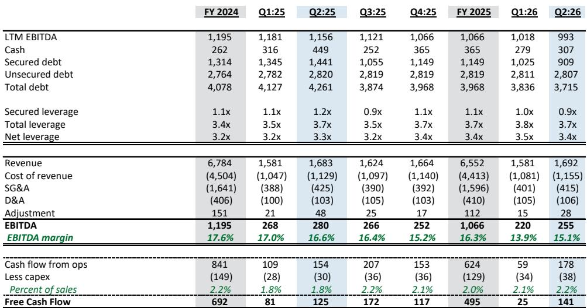
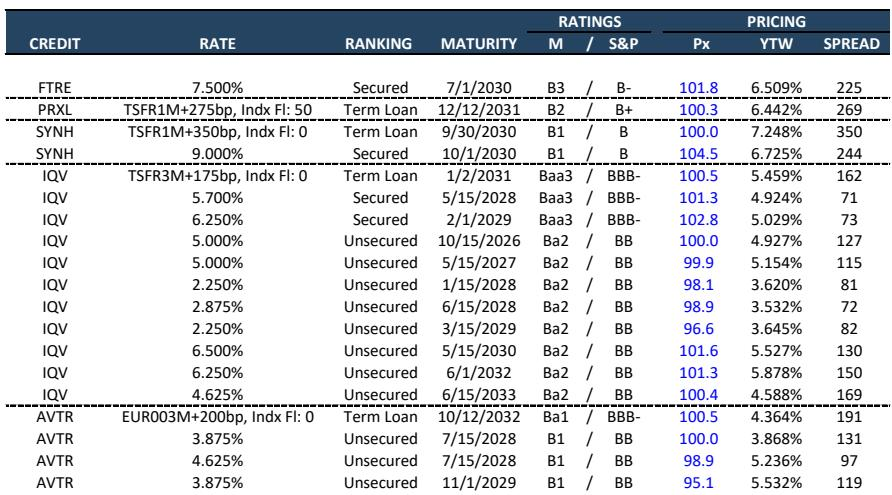
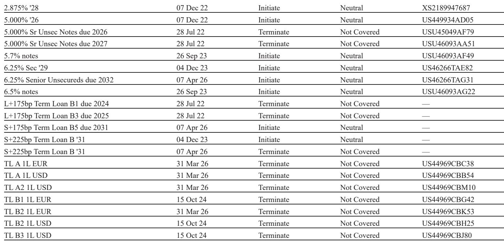

# JPM：CRO与制药服务2Q26业绩观察

本周IQVIA、Fortrea和Avantor先后公布2Q26业绩，三家CRO/制药服务公司不约而同地上调了全年收入指引。JPM在最新研报中梳理了这三家公司的业绩电话会，核心信号是：生物制药融资环境正在改善，新兴生物制药（EBP）客户的研发支出成为需求回暖的主要驱动力，而AI对行业的影响仍处于早期观察阶段。

报告覆盖的三家公司中，IQVIA的指引上调幅度最大，全年收入指引中值从5.8%的增速预期上调至6.5%。Fortrea和Avantor同样上调了收入与EBITDA指引，但两家公司的杠杆水平与业务结构差异明显，信用视角下的判断并不一致。

## 1. 新兴生物制药融资回暖带动临床需求增长

IQVIA在电话会中披露，2Q26新兴生物制药融资规模达到350亿美元，是去年同期的两倍以上。这一数字直接反映在订单流上：临床环境的RFP流量同比增长两位数，决策周期缩短，新兴生物制药资金到位速度加快。

新兴生物制药目前约占IQVIA研发与分析（R&DS）收入的35%，公司在该客户群体的收入占比高于CRO同行。十年前新兴生物制药占全球临床试验启动量的约45%，如今这一比例已升至约70%。IQVIA管理层预计，新兴生物制药的研发支出增速将是大药企研发支出增速的2至3倍。

> **KC评论：** 新兴生物制药的临床试验通常采用全外包模式，而大药企部分试验会选择内部执行。这意味着EBP融资回暖对CRO收入弹性的拉动，可能比表面数字显示的更直接。

## 2. IQVIA上调全年指引，有机增长贡献100个基点

IQVIA 2Q26收入44亿美元，同比增长8.7%，EBITDA利润率同比扩张30个基点至22.8%。全年收入指引上调至172.75亿至174.75亿美元，中值增速6.5%，较此前指引中值5.8%提高70个基点。其中有机收入增长贡献100个基点，并购贡献50个基点，汇率逆风抵消80个基点。

公司季度book-to-bill为1.2倍，新签订单31.5亿美元，同比增长19%，全服务订单表现突出。管理层在电话会中对AI的态度明显积极，认为AI将在2027年及以后扩大市场总规模，理由是AI辅助药物发现将提高分子进入开发阶段的可预测成功率，从而增加CRO需求。

JPM对此保持谨慎，认为AI对CRO行业的具体影响仍难判断，尤其对IQVIA商业解决方案板块中的分析和咨询业务可能形成冲击。该板块目前受益于1H26新药上市数量同比增长约45%的趋势，以及大药企在特定地区将部分疗法商业化全外包的动向。

## 3. Fortrea杠杆仍高，但自由现金流预期转正

Fortrea 2Q26收入6.78亿美元，EBITDA 5800万美元，利润率8.6%，环比改善明显。公司上调全年收入指引至26.2亿至26.9亿美元，EBITDA指引上调至2.05亿至2.2亿美元。管理层预计下半年及全年自由现金流为正。

但JPM对Fortrea的信用判断保持谨慎。公司总杠杆仍达6.7倍，优先担保杠杆7.5倍，管理层未提及任何未来债务赎回计划。报告认为公司具备再融资其TLA、TLB及可能的应收账款融资工具的条件，但整体成本节省空间有限。

> **KC评论：** Fortrea的EBITDA利润率从1Q26的7.3%升至8.6%，但这是否能持续取决于高毛利项目在积压订单中的占比能否继续提升。报告对此保留态度，称其为"show-me story"。

## 4. 中国生物科技合作成为区域性增长线索

Fortrea在电话会中延续了1Q26的表述，强调中国作为创新药中心的地位。管理层指出，来自中国生物科技公司以及与中国生物科技合作将药物带入全球市场的美国公司，正在带来增长。公司认为其在中国保持强大存在，使其成为客户开展全球研究的可选对象。

这一线索与IQVIA电话会中提到的EBP融资回暖形成呼应。中国生物科技公司的全球化合作通常涉及多区域临床试验，对CRO的服务范围要求更高。JPM在报告中未单独展开中国市场的量化数据，但将其列为Fortrea电话会中的积极因素之一。

## 5. 信用定价差异反映市场对三家公司不同预期

报告附带的定价表格显示，三家公司债券在二级市场的定价分化明显。IQVIA的优先无担保债券回报表现在3.5%至5.9%之间，利差从72个基点到169个基点不等；Fortrea的优先担保债券回报表现为6.5%，利差225个基点；Avantor的优先无担保债券利差在97至131个基点之间。

这一利差结构大致对应三家公司不同的杠杆水平和业务确定性。IQVIA总杠杆4.1倍，现金流强劲，流动性充足；Fortrea总杠杆6.7倍，处于去杠杆过程中；Avantor的BMP业务尚未实现年内增长，JPM对其优先无担保债券维持偏谨慎的看法。

三份业绩的共同点是管理层对下半年需求持乐观态度，且都上调了指引。差异在于每家公司所处的杠杆阶段和业务结构不同，信用定价已经反映了这些差异。对于观察CRO行业融资环境的人来说，新兴生物制药融资规模、RFP流量增速和book-to-bill这三个指标，比单季度收入数字更能说明需求趋势的持续性。

For informational purposes only. Portions may be generated,translated,summarized,or edited with AI assistance based on source materials and may contain omissions or errors. Please verify independently. This is not investment,legal,tax,accounting,or other professional advice.

For informational purposes only. Portions may be generated,translated,summarized,or edited with AI assistance based on source materials and may contain omissions or errors. Please verify independently. This is not investment,legal,tax,accounting,or other professional advice.

