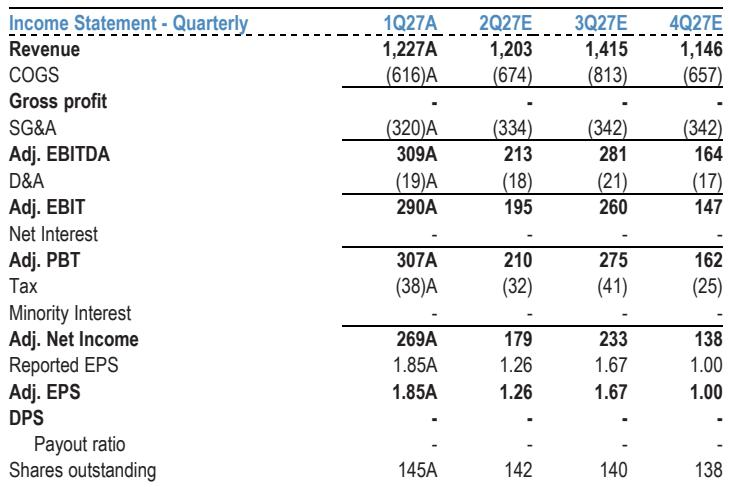
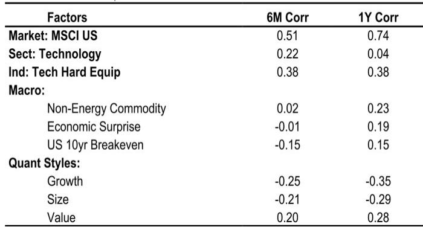

# JPM：罗技国际第一财季业务与近期数据观察

罗技国际在截至6月底的2027财年第一财季交出了一份超出预期的成绩单，营收同比增长7%至12.27亿美元，高于JPM和市场约12亿美元的预期。但这份业绩的成色被一个突发事件打了折扣：6月下旬，罗技一家半导体组件供应商的晶圆厂临时关闭，影响游戏和个人工作空间两大产品线，公司因此下调了接下来两个季度的收入指引。

这份JPM研报的核心判断是，需求端没有问题，问题出在供给端。管理层将供应商事件的影响规模定为第二财季2000万美元、第三财季2亿美元，并预计第四财季基本消化。如果剔除这一扰动，公司收入增速将保持接近第一财季的水平。换句话说，市场需要关注的是供应恢复的时点，而非需求是否走弱。

## 1. 第一财季增长由鼠标、游戏和视频协作拉动

分产品看，指向设备（Pointing Devices）收入同比增长16%，游戏业务增长12%，视频协作增长11%，三者共同构成了第一财季的增长主力。分地区看，美洲增长12%至5.16亿美元，亚太增长9%至3.68亿美元，欧洲、中东和非洲下滑1%至3.44亿美元。

毛利率是本期超预期的主要来源。剔除6100万美元关税退税后，毛利率为44.8%，高于JPM预期的43.5%。欧元走弱贡献了约240至250个基点的顺风，更高的平均售价和产品成本下降各贡献约100个基点，部分被促销投入增加所抵消。经营利润率达到18.7%，同样高于预期的17.0%。

> **KC评论：** 关税退税是一次性项目，但剔除后毛利率仍超预期，说明产品结构和成本控制本身在起作用。欧元贬值对罗技这类以美元计价、成本端有欧元敞口的公司，是一个容易被忽视的利润变量。

## 2. 供应商事件对第二、第三财季收入形成明确影响

管理层给出的第二财季收入指引为11.85亿至12.2亿美元，低于JPM预期的12.5亿美元和市场共识的12.3亿美元，其中包含与供应商事件相关的2000万美元逆风。经营利润指引为1.85亿至2.1亿美元，对应经营利润率约16.4%，低于JPM预期的17.8%。

第三财季的冲击更大，管理层估计为2亿美元，但预计第四财季基本解决。JPM据此将2028财年每股收益预期从6.40美元下调至6.10美元，降幅4.7%，但维持2027财年5.80美元的预期不变。这一调整幅度说明，分析师认为供应中断对当期业绩有影响，但不改变中期盈利轨迹。

## 3. 市场份额增长与北美需求回暖支撑需求侧判断

报告特别指出，罗技在各地区的市场份额均有增长，这强化了“约束在供给而非需求”的判断。游戏业务受益于高端产品的广泛需求，北美市场恢复至中个位数增长；视频协作则延续动能，企业客户持续投入会议室基础设施。

需求侧的另一个观察点是PC趋势。报告提到，企业外设的配套率能否持续，与PC市场的表现存在关联，这是市场对后续增长持续性的主要疑问之一。但就当前数据而言，罗技的终端需求没有出现明显走弱迹象。

> **KC评论：** 市场份额全面增长是一个容易被低估的信号。如果需求真的在出现变化，通常会在某个地区或产品线先出现份额流失，而不是全线扩张。这为“供应问题而非需求问题”的判断提供了支撑。

## 4. 全年经营利润率仍指向15%至18%区间上沿

尽管短期有供应扰动，管理层预计全年经营利润率仍将接近15%至18%长期目标区间的上沿，背后是健康的经营表现加上一次性关税退税的额外贡献，同时公司还在加大研发和销售市场投入。

基于更新后的2028日历年每股收益预期，给予约18倍市盈率，低于当前和历史平均的约19倍。报告认为，这一折价反映了罗技在外设领域的领先地位与宏观环境不确定性之间的平衡。

对于关注外设和游戏硬件产业链的读者，这份报告提供了一个观察框架：当一家公司出现供应中断时，区分需求真实走弱和供给暂时受限，可以看三个指标——市场份额变化、分地区增长结构、以及管理层对恢复时点的具体指引。罗技当前的情况是三者都指向供给端问题，但恢复时点仍需在后续季报中验证。

For informational purposes only. Portions may be generated,translated,summarized,or edited with AI assistance based on source materials and may contain omissions or errors. Please verify independently. This is not investment,legal,tax,accounting,or other professional advice.

