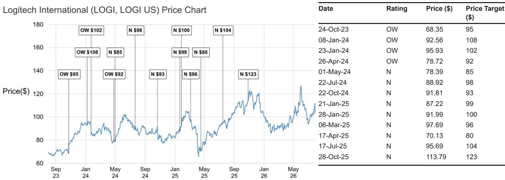

# 罗技的供应冲击揭示真正的考验：需求强劲，但执行风险已从需求端转向供应链

罗技公布了第一财季业绩，表面上看，这份成绩单清晰地印证了其产品组合的实力——营收同比增长7%至12.27亿美元，超出了市场一致预期和内部预估，调整后每股收益1.85美元，比分析师的模型预测高出约40%。业绩增长由指点设备、游戏和视频协作产品的两位数增长推动，美洲地区增速加快至12%。但本季度的真正意义不在于业绩本身，而在于披露了一个事实：一家半导体供应商在6月底的晶圆厂关闭，将在未来两个季度削减约2.2亿美元的营收。市场现在面临的问题，与过去一年主导该公司叙事的需求不确定性讨论有着根本不同：当一家需求动能已被验证的公司无法生产足够的产品来满足需求时，会发生什么？

根据公司的指引和这一中断的结构，答案是：罗技的近期盈利轨迹将由供应约束重塑，而非终端市场需求出现任何恶化。管理层将供应商事件的影响量化为9月季度2000万美元的营收逆风，以及12月季度2亿美元的逆风，并预计该问题在3月季度基本解决。这一时间分布比相对数字更重要。它意味着公司正在吸收的是满足需求能力的暂时冲击，而非市场份额的结构性流失。这一判断的证据在本季度的业绩中清晰可见：各地区的份额增长广泛，而美洲——一个此前表现平淡的市场——恢复了中个位数增长。当一家公司在每个地区都获得份额的同时报告供应中断，约束显然在供应端。

战略层面的含义是，罗技的运营模式正在一个其近期历史未曾让读者准备好的维度上接受考验。过去几年，围绕罗技的讨论集中在需求可持续性上：疫情后外设产品的提前消费是否会造成永久性积压，消费者支出在宏观压力下是否会受到影响，企业视频协作能否维持其动能。公司在6月季度对这些问题给出了肯定的回答。新的风险在于运营层面——公司能否在供应商故障中保持其努力建立的需求动能。未来两个季度将揭示罗技的供应链韧性是否与其产品组合实力相匹配。

## 业绩超预期是真实的，但关税退税影响了盈利惊喜的质量

每股1.85美元对1.33美元一致预期的盈利超预期，受到了一笔6100万美元的一次性关税退税的提振，该退税流经了毛利率。剔除这一收益，基础运营表现依然稳健——剔除退税后营业利润率为18.7%，而一致预期为17.0%——但超预期的幅度不如原始数字所示的那样令人印象深刻。剔除退税后的毛利率表现由三个因素驱动：欧元走弱贡献了约240至250个基点的收益，平均售价提高贡献了约100个基点，产品成本降低贡献了另外100个基点。这些顺风被促销支出增加部分抵消，这提醒我们，即使产品周期有利，罗技仍需要投入资源进行需求培育。

营收超预期比利润率超预期更具实质性。指点设备同比增长16%，游戏增长12%，视频协作增长11%。指点设备的强劲尤为值得注意，因为这是公司最大、最成熟的品类——当核心品类加速至中双位数增长时，这表明存量用户正在升级而非推迟购买。游戏12%的增长表明产品组合的高端部分继续拥有定价能力。视频协作11%的增长，在企业驱动动能持续数个季度后依然保持，表明混合办公的转变在会议室基础设施方面创造了持续的投资周期，而非一次性的更新换代。

地域分布强化了需求端的乐观情绪。亚太地区增长9%至3.68亿美元，美洲增长12%至5.16亿美元，欧洲、中东和非洲地区下降1%至3.44亿美元。欧洲、中东和非洲地区的下降更多是货币换算的结果而非基本面疲软——欧元对美元贬值在机制上降低了该地区的报告营收。美洲的加速是最具战略意义的数据点，因为它逆转了一个此前令人担忧的趋势。当最大的地区恢复两位数增长时，它验证了罗技产品周期具有广泛基础而非依赖单一品类或地区的判断。

## 供应商事件造成2.2亿美元营收缺口，考验公司执行可信度

半导体供应商晶圆厂关闭是本季度最重要的事件，其影响超出了直接的营收冲击。管理层对9月季度11.85亿至12.2亿美元的指引包含了该事件2000万美元的逆风，而12月季度将吸收2亿美元的影响。这一时间分布表明，供应商6月底的晶圆厂关闭将对12月季度产生更严重的影响——12月季度是公司季节性营收最高的季度，因为那是游戏和假日驱动需求的高峰期。时机再糟糕不过了：在12月季度损失2亿美元，意味着在一年中利润率最高的时点损失营收，而此时促销强度通常较低、产品组合更为有利。

9月季度的营业利润率指引也讲述了类似的故事。公司指引营业收入为1.85亿至2.1亿美元，隐含营业利润率约为16.4%，比一致预期低约130个基点。利润率压缩不仅仅是营收损失带来的经营杠杆效应；它还反映了固定成本结构无法在供应冲击下灵活下调。即使公司无法出货以充分利用研发和销售支出，这些支出承诺仍将发生。这就是供应中断的隐性成本：营收损失是可见的，但未吸收固定成本带来的利润率侵蚀对近期盈利能力同样具有破坏性。

管理层对问题将在3月季度基本解决的信心令人鼓舞，但这引入了可信度风险。公司提供了具体的恢复时间表，如果解决进度延迟，市场将不仅因额外的营收损失而惩罚该股，还会因未能执行既定计划而惩罚。公司指引称，排除中断影响，营收动能将在本财年剩余时间内接近第一财季的水平——这是一个有用的框架——它告诉读者，潜在需求趋势完好，营收缺口是供应现象。但这一框架只有在供应商恢复按预期路径推进时才成立。

## 全年利润率目标保持不变，但未来两个季度盈利超预期的质量将下降

全年营业利润率指引接近15%至18%长期目标区间的高端，这体现了韧性，但它掩盖了读者将不得不忍受的季度波动。6月季度18.7%的营业利润率（剔除关税收益）异常强劲。9月季度隐含的16.4%利润率意味着显著的回落，而12月季度鉴于2亿美元的营收逆风可能进一步压缩。全年数字看起来可观，但通往该数字的路径将是波动的。

关税退税使全年图景复杂化。6100万美元的收益流经了6月季度，管理层表示退税的附加收益支撑了全年利润率轨迹。但退税是一次性项目——它不会重复发生，并且抬高了未来季度将被比较的基数。当读者将9月季度利润率与6月季度利润率进行比较时，环比下降看起来会比基础运营趋势更陡峭，因为6月季度包含了一项非经常性收益。公司决定在供应中断和退税非经常性的情况下仍将全年利润率指引在区间高端附近，这表明基础成本纪律仍然完好。但未来两个季度将考验这一纪律能否承受未吸收固定成本和维持促销投入以保护货架空间和消费者心智份额的压力。

盈利预估修正说明了这一点。当前财年调整后每股收益预估从5.78美元微调至5.80美元，反映了近期中断，而2028财年预估被更大幅度下调，从6.40美元降至6.10美元——下降了4.7%。对远期年份更大的下调值得注意，因为它表明供应中断具有超出直接营收损失的二阶效应。公司可能需要在恢复期增加促销支出以重新获取供应受限月份可能失去的份额，或者如果需要加急运输或从替代供应商采购，可能面临更高的组件成本。远期年份预估下调是对供应中断往往会产生持续影响的认可。

## 估值倍数压缩反映市场愿意为质量付费，但不愿为不确定性付费

以2028日历年盈利18倍的倍数交易，这是一个微妙但重要的信号。该倍数低于当前和长期历史平均水平（约19倍），这一下调由宏观背景和供应中断所支撑。市场实际上在说，罗技的质量——其领先的市场地位、一贯的执行力、无债务且拥有大量净现金的强劲资产负债表——值得溢价，但溢价被供应商恢复和更广泛的消费者支出环境的不确定性所限制。

风格暴露数据强化了这一解读。罗技在质量和低波动因子中排名第11百分位，意味着它是其可比公司中质量最高、波动性最低的标的之一。这一质量特征历来享有溢价倍数，当前18倍的倍数仍反映了某种程度的溢价。但动能因子已经减弱——罗技在动能方面排名第49百分位，低于一年前的第16百分位——这表明市场对该股的热情已经消退，即使其基本面质量保持不变。该股的相对表现也说明了类似的故事：罗技年初至今上涨2.8%，但相对其指数下跌14.3%，过去12个月相对其指数下跌19.7%。

从这些数据中浮现的估值框架是：一家高质量公司以合理倍数交易，带有暂时性运营压力。2028日历年盈利18倍的倍数意味着约5.6%的隐含回报。市场正在定价复苏，但并未定价显著的重新评级。倍数从历史平均水平的压缩，是市场对需求复苏持久性和供应正常化时间表表达怀疑的方式。

## 读者的决策框架：区分需求信号与供应信号

罗技的情况为读者在需求环境健康但面临供应中断的公司中导航提供了一个有用的框架。第一步是识别约束在供应端还是需求端。在罗技的案例中，证据明确指向供应：各地区份额增长广泛，美洲恢复两位数增长，核心品类均以两位数速度增长。当一家公司在经历供应中断的同时获得份额时，需求信号完好，投资问题就变成时机问题而非方向问题。

第二步是评估供应影响的规模和持续时间，相对于公司吸收该影响的财务能力。罗技2.2亿美元的营收影响相对于其48亿美元的年营收基础是可控的，公司约17亿美元的净现金头寸提供了充足的流动性来应对这一中断。公司关于问题将在3月季度基本解决的指引是一个具体的、可检验的主张，读者可以跟踪。风险不在于公司耗尽现金或面临偿付能力危机；风险在于中断持续时间超过预期，迫使公司在近期盈利能力和长期市场地位之间做出权衡。

第三步是区分盈利影响中的一次性因素和经常性因素。关税退税是一次性收益，抬高了6月季度的业绩，不会重复。供应中断是暂时性逆风，应随供应商恢复而逆转。基础需求趋势——正如公司评论所称，排除中断影响，营收动能将接近第一财季水平——是应驱动远期年份轨迹的经常性因素。能够分离这三个要素——一次性收益、暂时性逆风和基础趋势——的读者，将对公司的正常化盈利能力有更清晰的认识。

最后一步是在管理层过往记录的背景下评估其可信度。罗技有保守指引和一贯执行的历史，这为恢复时间表增添了可信度。公司决定提供供应商影响的具体指引——9月季度2000万美元和12月季度2亿美元——是透明度的体现，应得到认可。风险在于供应商恢复超出公司的控制范围，即使最可信的管理团队也无法保证第三方晶圆厂恢复的时间表。市场将关注季度披露，以寻找恢复按计划推进的证据。

## 远期轨迹保持不变，但近期路径需要耐心

罗技的研究逻辑建立在一个直接的主张上：公司是外设和设备行业的领导者，具有一贯的执行历史，并将在终端需求恢复时受益。6月季度提供了终端需求确实在恢复的证据——美洲恢复两位数增长，游戏加速，指点设备以中双位数速度增长。供应中断是一个暂时性障碍，不会改变基础需求轨迹，但它将在未来两个季度考验读者的耐心和管理层的可信度。

全年盈利轨迹现在显示当前财年调整后每股收益为5.80美元，与上年基本持平，然后在2028财年恢复至6.10美元，2029财年恢复至6.80美元。当前财年持平的表现是供应中断的直接后果——如果没有中断，公司可能会实现中个位数的盈利增长。2028和2029财年的恢复反映了供应商问题已解决且基础需求动能持续的假设。2029财年预计11.4%的盈利增长，是能够看穿近期中断的读者的回报。

因此，读者的决策框架是耐心和纪律。该股当前财年盈利17.8倍、下一年盈利16.9倍的估值，对于罗技这样质量特征和增长轨迹的公司来说是合理的。近期风险在于供应中断导致进一步预估下调，或宏观环境变化对消费者支出产生额外影响。上行空间在于需求复苏持续，供应商问题按计划解决，公司以市场地位完好和盈利能力恢复的状态走出中断。

未来两个季度将是考验。如果9月季度显示公司在管理供应中断的同时没有失去份额，如果12月季度确认2亿美元的影响确实是暂时性的时间分布问题而非永久性损失，该股应随着市场展望2028和2029财年的复苏而重新评级。如果中断延长至3月季度之后，或者公司在供应受限期间失去份额，研究逻辑将需要重新评估。目前，证据支持这样的观点：罗技的需求动能是真实的，供应中断是暂时的，长期盈利能力完好。市场的耐心将得到回报，但仅限于那些能够区分季度噪音和轨迹信号的读者。

*仅供参考。部分内容可能基于源材料由AI辅助生成、翻译、总结或编辑，可能包含遗漏或错误。请独立核实。本文不构成投资、法律、税务、会计或其他专业建议。*

仅供参考。部分内容可能基于源材料由AI辅助生成、翻译、总结或编辑，可能包含遗漏或错误。请独立核实。本文不构成投资、法律、税务、会计或其他专业建议。

