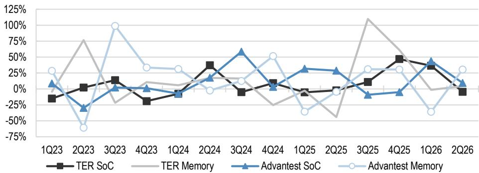

## 半导体/测试设备

## 从泰瑞达最新业绩看：在超大规模客户中推进第二供应商地位

泰瑞达（由Joseph Cardoso负责覆盖）于7月29日05:35（日本时间）公布了4-6月季度业绩，并于21:30举行了说明会。截至说明会结束时（22:45），该公司当日报价上涨11%（同期标普500指数基本持平）。按计划，公司在4-6月季度内向一家GPU客户交付了多系统测试设备，该客户曾在1-3月下达首批订单。此外，正如部分市场参与者所预期，泰瑞达在获得一家大型超大规模客户的第二供应商认证方面似乎取得了进展（我们注意到第一供应商是爱德万）。这将是该公司获得的第二个此类客户。尽管迄今为止SoC测试设备领域以单一供应商采购为主流，但我们开始看到向双供应商采购的逐步转变。不过，我们认为任何市场份额的变化都将是渐进的，且最早可能要到2027年才会显现。在CPU相关设备市场快速扩张的背景下，泰瑞达的优势在于ARM设备，而爱德万（根据其7月29日业绩说明会上管理层的评论）在广泛的客户群和架构（如ARM、x86、无晶圆厂、IDM）方面均表现强劲，因此我们认为目前无需过度担忧。

\- 泰瑞达业绩：公司整体4-6月销售额为13.29亿美元（环比+4%，彭博一致预期为12.17亿美元），其中半导体测试设备销售额为11.22亿美元（环比+1%）。7-9月销售指引为12亿至13亿美元（环比-10%至-2%，彭博一致预期为10.35亿美元）。对于整个2026财年，泰瑞达预计：（1）计算领域上半年占比较高，（2）移动领域相对偏弱，（3）存储及汽车/工业领域下半年占比较高。

\- 市场展望：在公布2025年10-12月业绩后，泰瑞达曾预测2026年ATE市场将同比增长20-40%，其中SoC测试设备增速快于存储测试设备（同比低两位数增长），但在1-3月业绩说明会上未就此进一步置评。管理层确实表示，就存储测试设备而言，受HBM基片测试需求增长的推动，公司认为存在同比40%以上增长的可能。泰瑞达预计ATE在WFE市场中的占比将从2023年的约4%上升至2026年上半年的约8%，最终稳定在7-9%区间。公司还更新了对CPO/SiPh测试设备市场的展望，从此前的2026年约1亿美元、中期3亿至7亿美元，调整为2028年达到3亿至7亿美元。

\- 市场份额：尽管迄今为止SoC测试设备领域以单一供应商采购为主流，但我们开始看到向双供应商采购的逐步转变。获得第二供应商地位通常需要9至12个月，涉及四个步骤：（1）获得竞争机会，（2）开发可行的解决方案，（3）提供经过验证的解决方案，（4）产能爬坡。随后进入"快速跟进"阶段，市场份额逐步上升至约30%，再进入成熟阶段，市场份额处于30-70%区间。在计算领域，泰瑞达目前似乎与一家客户处于成熟阶段，与另一家客户处于扩展阶段，并正在等待第三家客户的认证后方可启动产能爬坡。对于快速增长的CPU测试设备领域，泰瑞达管理层表示，测试强度（GPU对CPU）为4比1是合理的，且其优势在于ARM设备（在同样于7月29日举行的爱德万业绩说明会上，管理层表示该公司的优势覆盖ARM、x86、无晶圆厂和IDM）。对于2026年，泰瑞达预计其在SoC测试设备领域的市场份额将与上年持平或略有上升，在存储测试设备领域则将有所上升（相比之下，爱德万认为其在SoC测试设备领域的市场份额将上升，在存储测试设备领域将下降）。

图1：爱德万与泰瑞达销售额趋势（日历年基准）  
  
来源：公司报告，JPM。  
注：日历年基准；美元兑日元汇率采用相应期间的平均汇率。两家公司的测试设备销售额定义有所不同，但数据均基于已披露信息。

图2：爱德万与泰瑞达环比销售趋势（日历年基准）  
  
来源：公司报告，JPM。  
注：日历年基准。两家公司的测试设备销售额定义有所不同，但数据均基于已披露信息。

本报告讨论的公司（除非另有说明，本报告中所有价格均为2026年7月29日收盘价）爱德万（6857）（6857.T/¥25,200/OW）

分析师认证：本报告封面标注"AC"的研究分析师证明（或者，当多位研究分析师主要负责本报告时，封面或文档内标注"AC"的研究分析师分别就其在本研究中覆盖的每一证券或发行人证明）：（1）本报告中表达的所有观点准确反映了研究分析师对任何及所有标的证券或发行人的个人观点；（2）研究分析师的任何部分薪酬过去、现在或将来均不会直接或间接与本报告中研究分析师表达的具体建议或观点相关。对于封面列出的所有韩国研究分析师（如适用），其还根据KOFIA要求证明，研究分析师的分析是本着诚信原则进行的，所表达观点反映的是研究分析师自身的判断，未受到不当影响或干预。

除非另有说明，本报告中列出的所有作者均为编制独立研究的研究分析师。在欧洲，行业专家（销售与交易）可能作为联系人出现在本报告中，但并非报告作者，也不属于研究部门。

## 重要披露

\- 做市商/流动性提供者：JPM是爱德万（6857）或相关实体金融工具的交易商和/或流动性提供者。

\- 客户：JPM目前拥有，或在过去12个月内拥有以下实体作为客户：爱德万（6857）或相关实体。

\- 客户/非投资银行、证券相关：JPM目前拥有，或在过去12个月内拥有以下实体作为客户，所提供的服务为非投资银行、证券相关服务：爱德万（6857）或相关实体。

\- 客户/非证券相关：JPM目前拥有，或在过去12个月内拥有以下实体作为客户，所提供的服务为非证券相关服务：爱德万（6857）或相关实体。

\- 潜在投资银行报酬：JPM预计在未来三个月内从爱德万（6857）或相关实体获得或寻求投资银行服务报酬。

\- 已收非投资银行报酬：JPM在过去12个月内因投资银行以外的产品或服务从爱德万（6857）或相关实体获得了报酬。

\- 债务头寸：JPM可能持有爱德万（6857）或相关实体的债务证券头寸（如有）。

公司特定披露：JPM目前并寻求与其研究报告所覆盖的公司开展业务。因此，读者应注意，该公司可能存在影响本报告客观性的利益冲突。读者应将本报告视为作出投资决策的单一因素。重要披露（包括适用时的价格图表和信用意见历史表）可在https://www.jpmm.com/research/disclosures查阅，或致电1-800-477-0406，或发送邮件至research.disclosure.inquiries@JPM.com索取，适用于汇编报告及所有JPM覆盖的公司和某些未覆盖的公司。

爱德万（6857）（6857.T, 6857 JP）价格图表  

<table><tr><td>日期</td><td>评级</td><td>价格（日元）</td><td>目标价（日元）</td></tr><tr><td>2023年9月27日</td><td>N</td><td>4032</td><td>4,375</td></tr><tr><td>2024年2月9日</td><td>OW</td><td>6577</td><td>7,400</td></tr><tr><td>2024年7月9日</td><td>OW</td><td>6625</td><td>7,700</td></tr><tr><td>2024年10月18日</td><td>OW</td><td>8002</td><td>9,200</td></tr><tr><td>2024年12月11日</td><td>OW</td><td>8478</td><td>10,500</td></tr><tr><td>2025年6月13日</td><td>OW</td><td>8303</td><td>11,000</td></tr><tr><td>2025年9月12日</td><td>OW</td><td>13700</td><td>16,000</td></tr><tr><td>2026年1月21日</td><td>OW</td><td>21485</td><td>26,000</td></tr><tr><td>2026年3月17日</td><td>OW</td><td>24140</td><td>31,000</td></tr><tr><td>2026年6月16日</td><td>OW</td><td>29420</td><td>41,000</td></tr></table>

来源：Bloomberg Finance L.P. 和 JPM；价格数据已根据股票分割和股息进行调整。  
2001年4月26日开始覆盖。所有股价均为前一交易日收盘价。  
图表显示JPM对该股票的持续覆盖；现任分析师可能并非在整个期间内覆盖该股票。

JPM评级或标识：OW = 增持，N = 中性，UW = 减持，NR = 未评级

## 股票研究评级、标识和分析师覆盖范围说明：

JPM采用以下评级体系：增持（在本报告所示目标价的持续期内，我们预计该股票的表现将优于研究分析师或其团队覆盖范围内股票的平均总回报）；中性（在本报告所示目标价的持续期内，我们预计该股票的表现将与研究分析师或其团队覆盖范围内股票的平均总回报一致）；减持（在本报告所示目标价的持续期内，我们预计该股票的表现将逊于研究分析师或其团队覆盖范围内股票的平均总回报）。NR为未评级。在此情况下，JPM已因缺乏充分的基本面依据或出于法律、监管或政策原因移除了该股票的评级及（如适用）目标价。此前的评级及（如适用）目标价不再具有参考意义。NR标识不构成建议或评级。部分被覆盖股票有评级但无目标价；在此情况下，我们预计该股票在相关区域的相关持续期内将优于/与/逊于研究分析师或其团队覆盖范围内股票的平均总回报。在我们亚洲（除澳大利亚和印度）和英国中小市值股票研究中，每只股票的预期总回报是与基准国家市场指数的预期总回报进行比较，而非与研究分析师的覆盖范围进行比较。如果本报告的重要披露部分未显示，认证研究分析师的覆盖范围可在JPM研究网站https://www.JPMmarkets.com上查阅。

覆盖范围：Shikanai, Mio：AGC（5201）（5201.T）、爱德万（6857）（6857.T）、Disco（6146）（6146.T）、HOYA（7741）（7741.T）、JX Advanced Metals（5016）（5016.T）、KIOXIA Holdings（285A）（285A.T）、Kaneka（4118）（4118.T）、Lasertec（6920）（6920.T）、Nikon（7731）（7731.T）、日本电气硝子（5214）（5214.T）、日本板硝子（5202）（5202.T）、Nittobo（3110）（3110.T）、Rigaku Holdings（268A）（268A.T）、SCREEN Holdings（7735）（7735.T）、住友大阪水泥（5232）（5232.T）、太平洋水泥（5233）（5233.T）、东京电子（8035）（8035.T）、ULVAC（6728）（6728.T）

JPM股票研究评级分布，截至2026年7月4日

<table><tr><td></td><td>增持（买入）</td><td>中性（持有）</td><td>减持（卖出）</td></tr><tr><td>JPM全球股票研究覆盖*</td><td>53%</td><td>36%</td><td>12%</td></tr><tr><td>投行客户**</td><td>83%</td><td>80%</td><td>73%</td></tr><tr><td>JPMS股票研究覆盖*</td><td>51%</td><td>37%</td><td>12%</td></tr><tr><td>投行客户**</td><td>95%</td><td>92%</td><td>87%</td></tr></table>

\*请注意，由于四舍五入，百分比可能无法加总至100%。

\*\*在"买入"、"持有"和"卖出"各类别中，JPM在过去12个月内提供过投资银行服务的标的公司百分比。

就FINRA评级分布规则而言，我们的增持评级属于报告评级类别；中性评级属于持有评级类别；减持评级属于报告评级类别。请注意，标有NR的股票未包含在上表中。该信息截至最近一个日历季度末。

股票估值与风险：有关被覆盖公司或目标价的估值方法和风险，请参阅http://www.JPMmarkets.com上最新的公司特定研究报告，联系首席分析师或您的JPM代表，或发送邮件至research.disclosure.inquiries@JPM.com。有关专有模型的实质性信息，请参阅公司特定研究报告中的财务摘要和公司一览表，可在我们的客户网站http://www.JPMmarkets.com的公司页面下载。本报告还列出了所使用的重大基础假设。

## 研究交流历史：

JPM在过去12个月内发布的研究交流历史可在http://www.JPMmarkets.com的研究与评论页面查阅，您也可以按分析师姓名、行业或金融工具进行搜索。

分析师薪酬：负责编制本报告的研究分析师的薪酬基于多种因素，包括研究的质量和准确性、客户反馈、竞争因素以及公司整体收入。

非美国分析师注册：除非另有说明，本报告封面列出的非美国分析师是非美国关联公司的员工，可能未在FINRA规则下注册为研究分析师，可能不是JPM Securities LLC的关联人员，且可能不受FINRA规则2241或2242关于与所覆盖公司沟通、公开露面以及交易研究分析师账户持有证券的限制。

## 其他披露

## JPM是JPM Chase & Co.及其全球子公司和关联公司投资银行业务的营销名称。

英国MIFID FICC研究解除捆绑豁免：英国客户应参阅英国MIFID研究解除捆绑豁免，了解JPM实施FICC研究豁免的详情以及相关FICC研究分类的指引。

除非相关法律特别允许，所有向客户提供的研究材料均同时在我们的客户网站JPM Markets上提供。并非所有研究内容都会被重新分发、通过电子邮件发送或提供给第三方聚合平台。如需获取特定股票的所有研究材料，请联系您的销售代表。

本研究材料中对中国的任何长格式称谓为：中国大陆；中国香港特别行政区；中国台湾；中国澳门特别行政区。

JPM可能不时撰写关于受美国、欧盟、英国或其他相关司法管辖区政府当局实施或管理的经济或金融制裁所针对的发行人或证券（"受制裁证券"）的内容。本报告中的任何内容均无意被解读为鼓励、促进、推动或以其他方式批准对受制裁证券的投资或交易。客户在作出投资决策时应了解自身的法律和合规义务。

本研究报告中讨论的任何数字或加密资产均受快速变化的监管环境影响。有关加密资产（包括比特币和以太坊）的相关监管提示，请访问https://www.JPM.com/disclosures/cryptoasset-disclosure。

本研究报告的作者可能未获许可在您的司法管辖区开展受监管活动，如未获许可，则不会声称有能力开展此类活动。

交易所交易基金（ETF）：JPM Securities LLC（"JPMS"）作为几乎所有美国上市ETF的授权参与者。如果本报告中提及任何ETF，JPMS可能因分销这些ETF份额而赚取佣金和基于交易的报酬，并可能因提供其他交易相关服务（如向ETF份额的卖空者出借证券）而赚取费用。JPMS还可能为ETF本身提供服务，包括担任ETF的经纪商或交易商。此外，JPMS的关联公司可能为ETF提供服务，包括信托、托管、管理、借贷、指数计算和/或维护及其他服务。

期权和期货相关研究：如果本材料包含期权或期货相关研究，该信息仅提供给已收到适当期权或期货风险披露文件的人士。请联系您的JPM代表或访问https://www.theocc.com/components/docs/riskstoc.pdf获取期权清算公司的《标准化期权的特征和风险》，或访问https://www.finra.org/sites/default/files/2020-08/Security\_Futures\_Risk\_Disclosure\_Statement\_2020.pdf获取《证券期货风险披露声明》。

银行间报价利率（IBOR）和其他基准利率的变更：某些利率基准正在或可能在未来受到持续的国际、国家和其他监管指导、改革和改革提案的影响。欲了解更多信息，请访问：https://www.JPM.com/global/disclosures/interbank\_offered\_rates

信用评级通知：如果本材料包含信用评级，则日本信用评级机构有限公司（JCR）和评级与投资信息公司（R&I）提供的信用评级是根据日本《金融工具与交易法》（FIEL）注册的信用评级机构（注册信用评级机构）提供的信用评级。对于由JCR和R&I以外的信用评级机构提供且未注明由注册信用评级机构提供的信用评级，这意味着此类信用评级为非注册评级（由未在FIEL下注册的信用评级机构提供的信用评级）。在非注册评级中，对于标普全球评级（S&P）、穆迪读者服务（Moody's）或惠誉评级（Fitch）提供的信用评级，在基于此类非注册评级作出投资决策之前，请仔细阅读我们已单独发送或将要发送的相应信用评级机构的《非注册评级说明函》。

私人银行客户：如果您作为JPM Chase & Co.及其子公司（"JPM私人银行"）提供的私人银行业务的客户接收研究，则研究由JPM私人银行提供，而非JPM的任何其他部门，包括但不限于JPM企业与投资银行及其全球研究部门。

负责编制和分发研究的法律实体：本材料封面Reg AC研究分析师姓名下方标识的法律实体是负责编制本研究的法律实体。如果多位Reg AC研究分析师编写了本材料且其姓名下方标识了不同的法律实体，则这些法律实体共同负责编制本研究。如果分析师姓名下方列出的法律实体不止一个，则除非另有说明，第一个法律实体负责编制。来自各JPM关联公司的研究分析师可能为本材料的编制做出了贡献，但可能未获许可在您的司法管辖区开展受监管活动（且不会声称有能力开展此类活动）。除非下文法律实体披露中另有说明，本材料已由负责编制的法律实体分发，或者如果分析师姓名下方列出的法律实体不止一个，则由第一个法律实体负责分发。如有任何疑问，请联系您所在司法管辖区的相关研究分析师或分发本研究材料的实体。

## 法律实体披露及国家/地区特定披露：

阿根廷：JPM Chase Bank, N.A.布宜诺斯艾利斯分行受阿根廷共和国中央银行（BCRA）和国家证券委员会（CNV - ALYC y AN Integral N°51）监管。

澳大利亚：JPM Securities Australia Limited（"JPMSAL"）（ABN 61 003 245 234/AFS牌照号：238066）受澳大利亚证券和投资委员会监管，是ASX Limited的市场参与者、ASX Clear Pty Limited的清算和结算参与者以及ASX Clear（期货）Pty Limited的清算参与者。本材料由JPMSAL在澳大利亚或代表JPMSAL仅向"批发客户"（定义见《2001年公司法》第761G条）发行和分发。所有被覆盖金融产品的列表可在https://www.jpmm.com/research/disclosures查阅。JPM力求覆盖与国内外读者相关的所有全球行业分类标准（GICS）行业以及不同市值规模的公司。如适用，在对标的公司进行公开尽职调查的过程中，研究分析师团队可能不时通过公司拜访、与公司代表讨论、管理层演示等公司互动方式开展此类尽职调查。JPMSAL发布的研究是根据JPM澳大利亚研究独立性政策编制的，该政策可在以下链接查阅：JPM Australia - Research Independence Policy。

巴西：Banco JPM S.A.受证券委员会（CVM）和巴西中央银行监管。JPM监察员：0800-7700847 / 0800-7700810（听障专线）/ ouvidoria.jp.morgan@jpmchase.com。

加拿大：JPM Securities Canada Inc.是一家注册投资交易商，受加拿大投资监管组织和安大略省证券委员会监管，是加拿大交易所的参与会员。本材料由JPM Securities Canada Inc.在加拿大分发。

智利：Inversiones JPM Limitada是一家在智利注册的未受监管实体。

中国：JPM证券（中国）有限公司已获中国证监会批准开展证券投资咨询业务。

哥伦比亚：Banco JPM Colombia S.A.受哥伦比亚金融监管局（SFC）监管。本材料中对哥伦比亚境外实体提供的产品或服务的任何引用仅供描述之用。此类引用不构成、也不应被解释为在哥伦比亚领土内的促销活动或金融产品或服务的提供，如适用的哥伦比亚法规所定义。

迪拜国际金融中心（DIFC）：JPM Chase Bank, N.A.迪拜分行受迪拜金融服务管理局（DFSA）监管，注册地址为Dubai International Financial Centre - The Gate, West Wing, Level 3 and 9 PO Box 506551, Dubai, UAE。本材料已由JPM Chase Bank, N.A.迪拜分行分发给根据DFSA规则被视为专业客户或市场对手方的人士。

欧洲经济区（EEA）：除非另有说明，研究在EEA由JPM SE（"JPM SE"）分发，JPM SE是经联邦金融监管局（BaFin）授权的信贷机构，受BaFin、德国中央银行（德意志联邦银行）和欧洲中央银行（ECB）共同监管。JPM SE总部位于法兰克福，注册地址为TaunusTurm, Taunustor 1, Frankfurt am Main, 60310, Germany。本材料已在EEA分发给根据MiFID II第4条第1款第10项及附件II及其在各自母国的实施被视为专业读者（或同等资格）的人士（"EEA专业读者"）。非EEA专业读者不得依据或依赖本材料。本材料涉及的任何投资或投资活动仅面向EEA相关人士，且仅与EEA相关人士进行。

中国香港：JPM Securities (Asia Pacific) Limited（CE编号AAJ321）受中国香港金融管理局和证券及期货事务监察委员会监管，JPM Broking (Hong Kong) Limited（CE编号AAB027）受证券及期货事务监察委员会监管。JPM Chase Bank, N.A.中国香港分行（CE编号AAL996）受中国香港金融管理局和证券及期货事务监察委员会监管，是根据美国法律组织的有限责任实体。如果本材料的分发在中国香港属于受监管活动，则本材料由中国香港的JPM Securities (Asia Pacific) Limited和/或JPM Broking (Hong Kong) Limited分发。

印度：JPM India Private Limited（公司识别号 - U67120MH1992FTC068724），注册办公地址为JPM Tower, Off. C.S.T. Road, Kalina, Santacruz - East, Mumbai – 400098，已在印度证券交易委员会（SEBI）注册为"研究分析师"，注册号INH000001873。JPM India Private Limited还已在SEBI注册为印度国家证券交易所和孟买证券交易所会员（SEBI注册号 – INZ000239730）以及商人银行家（SEBI注册号 - MB/INM000002970）。电话：91-22-6157 3000，传真：91-22-6157 3990，网站：http://www.jpmipl.com。JPM Chase Bank, N.A.孟买分行已获得印度储备银行（RBI）许可（许可证号53/许可证号BY.4/94；SEBI - IN/CUS/014/ CDSL：IN-DP-CDSL-444-2008/ IN-DP-NSDL-285-2008/ INBI00000984/ INE231311239），是印度的表列商业银行，该许可是其在印度开展银行业务及印度银行分行允许开展的其他活动的主要许可证。对于非本地研究材料，本材料不由JPM India Private Limited在印度分发。合规官：Ashutosh Sharma；ashutosh.j.sharma@jpmchase.com；+912261575002。投诉官：Ramprasadh K，jpmipl.research.feedback@JPM.com；+912261573000。SEBI的注册和NISM的认证不以任何方式保证中介机构的业绩或向读者提供回报保证。请访问条款和条件及最重要条款和条件（MITC）。年度合规审计报告可在http://www.jpmipl.com/#research查阅。

印度尼西亚：PT JPM Sekuritas Indonesia是印度尼西亚证券交易所的会员，并在金融服务管理局（OJK）注册和监管。

韩国：JPM Securities (Far East) Limited首尔分行是韩国交易所（KRX）的会员。JPM Chase Bank, N.A.首尔分行是外国银行（JPM Chase Bank, N.A.）在韩国的分行。两个实体均受金融服务委员会（FSC）和金融监督院（FSS）监管。对于非宏观研究材料，本材料由JPM Securities (Far East) Limited首尔分行在韩国分发。

日本：JPM Securities Japan Co., Ltd.和JPM Chase Bank, N.A.东京分行受日本金融服务厅监管。

马来西亚：本材料由JPM Securities (Malaysia) Sdn Bhd（18146-X）在马来西亚发行和分发，该公司是马来西亚证券交易所的参与组织，持有马来西亚证券委员会颁发的资本市场服务牌照。

墨西哥：JPM Casa de Bolsa, S.A. de C.V., JPM Grupo Financiero是墨西哥证券交易所（Bolsa Mexicana de Valores）和机构证券交易所（Bolsa Institucional de Valores）的会员，并获国家银行和证券委员会（Comisión Nacional Bancaria y de Valores）授权作为经纪交易商运营。

新西兰：本材料由JPMSAL在新西兰仅向"批发客户"（定义见《2013年金融市场行为法》）发行和分发。JPMSAL已根据《2008年金融服务提供商（注册和争议解决）法》注册为金融服务提供商。

菲律宾：JPM Securities Philippines Inc.是菲律宾证券交易所的交易参与者，也是菲律宾证券清算公司和证券读者保护基金的会员。它受证券交易委员会监管。

新加坡：本材料由JPM Securities Singapore Private Limited（JPMSS）[MDDI (P) 057/08/2025，公司注册号：199405335R]和/或JPM Chase Bank, N.A.新加坡分行（JPMCB Singapore）在新加坡发行和分发，两者均受新加坡金融管理局监管，JPMSS是新加坡交易所证券交易有限公司的会员。本材料仅向《证券与期货法》第289章第4A条定义的认可读者、专家读者和机构读者在新加坡发行和分发。本材料无意向零售读者或不属于《证券与期货法》第4A条定义的"认可读者"、"专家读者"或"机构读者"类别的任何其他读者发行或分发。新加坡的收件人如对本材料有任何疑问，请联系JPMSS或JPMCB Singapore。

南非：JPM Equities South Africa Proprietary Limited和JPM Chase Bank, N.A.约翰内斯堡分行是约翰内斯堡证券交易所的会员，受金融服务行为监管局（FSCA）监管。

中国台湾：JPM Securities (Taiwan) Limited是中国台湾证券交易所的参与者（公司型），受中国台湾证券期货局监管。与股票证券相关的材料由中国台湾的JPM Securities (Taiwan) Limited发行和分发，受中国台湾适用法律法规的许可范围和约束。如果JPM Securities (Taiwan) Limited编制了关于未在中国台湾证券交易所或台北交易所上市的证券（"非中国台湾上市证券"）的研究材料，则该等材料不构成适用的中国台湾法规下的证券建议，且为免生疑问，JPM Securities (Taiwan) Limited不担任非中国台湾上市证券的经纪商。根据《证券商推介客户买卖有价证券管理办法》第7条之1第2项（经修订或补充）和/或其他适用法律法规，请注意，除非本材料"重要披露"部分另有披露，本材料的接收者不得从事与本材料相关的可能产生利益冲突的任何活动。

泰国：本材料由JPM Securities (Thailand) Ltd.在泰国发行和分发，该公司是泰国证券交易所的会员，受财政部和证券交易委员会监管。注册地址为548 One City Center Building, 50th Floor, Ploenchit Road, Lymphini, Pathum Wan, Bangkok 10330。

英国：研究在英国由JPM Securities plc（"JPMS plc"）编制，该公司是伦敦证券交易所的会员，获审慎监管局授权并受金融行为监管局和审慎监管局监管；或由JPM Markets Limited（"JPMML Ltd"）编制，该公司获金融行为监管局授权并受其监管。除非另有说明，本材料在英国由JPMS plc分发，且在英国仅面向：（a）具有《2000年金融服务与市场法（金融促销）2005年命令》（"FPO"）第19(5)条所述投资相关事项专业经验的人士；（b）FPO第49条所述人士（高净值公司、非法人协会或合伙企业、高价值信托的受托人等）；或（c）本通信可以合法发送给的任何其他人士；所有此类人士统称为"英国相关人士"。非英国相关人士不得依据或依赖本材料。本材料涉及的任何投资或投资活动仅面向英国相关人士，且仅与英国相关人士进行。JPM EMEA关于编制研究的利益冲突预防和避免政策的说明可在以下链接查阅：JPM EMEA - Research Independence Policy。

美国：JPM Securities LLC（"JPMS"）是NYSE、FINRA、SIPC和NFA的会员。JPM Chase Bank, N.A.是FDIC的会员。非美国关联公司发布的材料由JPMS在美国分发，JPMS对其内容负责。

一般信息：可根据要求提供额外信息。本材料中的信息来自被认为可靠的来源。尽管已采取一切合理谨慎措施确风险自担材料中陈述的事实准确且其中包含的预测、意见和预期公平合理，但JPM Chase & Co.或其关联公司和/或子公司（统称"JPM"）不对所提供材料的完整性或准确性作出任何陈述或保证，除非涉及JPM和研究分析师与作为材料主题的发行人的相关披露。因此，不应依赖本材料所含信息的准确性、公平性或完整性。由于计算、调整、翻译成不同语言和/或适用的当地监管限制，本材料中可能存在某些数据差异和/或内容限制（如适用）。这些差异不应影响对材料中可能讨论的标的公司的整体投资分析、观点和/或建议。人工智能工具可能已用于本材料的编制，包括协助数据分析、模式识别和研究材料的内容起草。JPM对因使用本材料或其内容而产生的任何损失不承担任何责任，JPM及其各自的董事、高级管理人员或员工不对本材料的内容承担任何责任，除非相关司法管辖区的监管机构或该监管制度对其施加了责任和义务。本材料中包含的意见、预测或预测性陈述仅代表JPM截至材料日期当前的意见或判断，因此如有变更，恕不另行通知。可能会根据公司特定发展或公告、市场状况或任何其他公开可用信息对公司和/或行业进行定期更新。无法保证未来的结果或事件将与任何此类意见、预测或预测性陈述一致，这些陈述仅代表一种可能的结果。此外，此类意见、预测或预测性陈述受某些未经验证的风险、不确定性和假设的影响，未来的实际结果或事件可能存在重大差异。本材料中提及的任何投资的价值或收入可能会波动和/或受汇率变动的影响。除非另有说明，所有定价均为所讨论证券的市场收盘价。过往表现不代表未来结果。因此，读者可能收回的资金少于原始投资。本材料不构成对任何金融工具的购买或出售的要约或招揽。本材料中的意见和建议未考虑个别客户的情况、目标或需求，不构成对特定客户推荐的特定证券、金融工具或策略。本材料可能包含对结构性证券、期权、期货和其他衍生品的观点。这些是复杂的工具，可能涉及高度风险，可能仅适合能够理解和承担相关风险的成熟读者。本材料的接收者必须就本材料中提及的任何证券或金融工具自行作出独立决策，并应就其认为必要的任何事项寻求独立的财务、法律、税务或其他顾问的建议。JPM可能基于研究分析师的看法和研究进行自营交易，也可能以与其自营账户或客户账户不一致的方式进行交易，且JPM没有义务确保此类其他沟通被提请本材料任何接收者注意。JPM内部的其他人士，包括策略师、销售人员和其他研究分析师，可能持有与本材料中观点不一致的看法。未参与本材料编制的JPM员工可能持有本材料中提及的证券（或此类证券的衍生品）的投资，并可能以与本材料中讨论的方式不同的方式进行交易。本材料不构成对任何发行人在任何司法管辖区的广告或营销。

保密与安全通知：本传输可能包含根据适用法律享有特权、保密、法律特权和/或免于披露的信息。如果您不是预期接收者，特此通知您，对本材料所含信息的任何披露、复制、分发或使用（包括任何依赖）均被严格禁止。尽管本传输及其任何附件被认为不含任何可能影响接收和打开它的任何计算机系统的病毒或其他缺陷，但接收者有责任确保其无病毒，JPM Chase & Co.及其子公司和关联公司（如适用）对因使用它而以任何方式产生的任何损失或损害不承担任何责任。如果您错误地收到此传输，请立即联系发件人并彻底销毁该材料，无论是电子版还是纸质版。此消息受电子监控约束：https://www.JPM.com/disclosures/email

MSCI：本材料中的某些信息（"信息"）经MSCI Inc.、其关联公司和信息提供商（"MSCI"）许可复制，©2026。未经适当许可，不得复制或传播信息。MSCI对信息不作任何明示或暗示的保证（包括适销性或适用性），并在法律允许的范围内免除所有责任。任何信息均不构成研究交流，除非是MSCI ESG Research的任何适用信息。另请参阅msci.com/disclaimer

Sustainalytics：本材料中包含的某些信息、数据、分析和意见经Sustainalytics许可复制，并且：（1）包含Sustainalytics的专有信息；（2）除非特别授权，不得复制或再分发；（3）不构成研究交流，也不构成对任何产品或项目的认可；（4）仅供参考；（5）不保证完整、准确或及时。Sustainalytics不对任何交易决策、损害或其他与其或其使用相关的损失负责。数据的使用受https://www.sustainalytics.com/legal-disclaimers提供的条件约束。©2026 Sustainalytics。保留所有权利。

"其他披露"最后修订于2026年7月4日。

版权所有2026 JPM Chase & Co.保留所有权利。未经JPM书面同意，不得重印、出售或再分发本材料或其任何部分。未经JPM事先书面同意，严禁在任何第三方人工智能（AI）系统或模型中使用或共享从JPM或授权第三方（"JPM数据"）收到的任何研究材料，当此类JPM数据可被第三方访问时。
