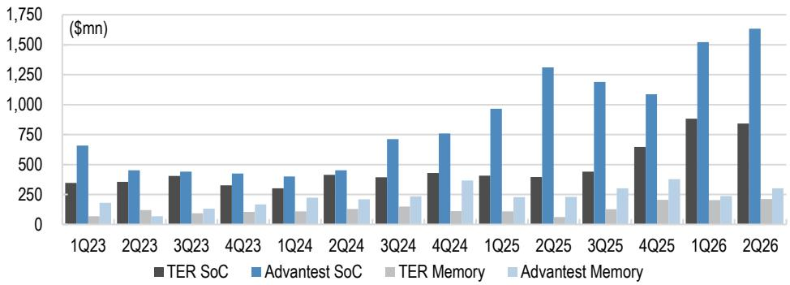
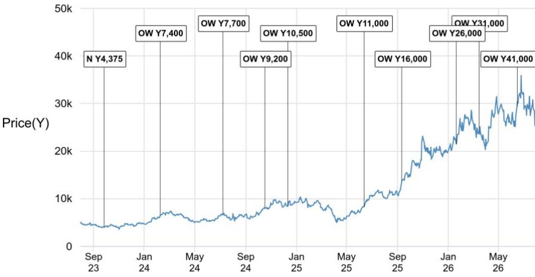

# JPM：Teradyne在超大规模客户二供认证上取得进展

7月29日盘后，Teradyne公布4-6月季度业绩并召开说明会。截至说明会结束时，公司报价当日上涨11%，同期标普500基本持平。这份由JPM日本半导体团队发布的研究报告，核心判断并不在当季营收本身，而在于一个更长期的信号：Teradyne正在从一家GPU客户和一家超大规模云厂商那里获得第二供应商认证的进展。在SoC测试机领域长期以单一供应商采购为主的格局下，这可能是行业采购模式开始松动的早期迹象。

报告同时给出了明确的时间预期：任何市场份额的迁移都将是渐进的，最早也要到2027年才会看到实质性变化。换句话说，市场现在看到的报价反应，定价的是两年后的格局，而不是本季度的订单。

## 1. 4-6月营收超预期，7-9月指引区间高于市场一致预期

Teradyne全公司4-6月销售额为13.29亿美元，环比增长4%，Bloomberg一致预期为12.17亿美元。其中半导体测试机销售额11.22亿美元，环比增长1%。7-9月销售指引为12亿至13亿美元，环比下降2%至10%，但Bloomberg一致预期仅为10.35亿美元，指引区间整体高于市场预期。

报告还提到，公司在4-6月按计划向一家GPU客户交付了多系统测试机，该客户在1-3月下达了首批订单。这个交付节点本身没有意外，但它为后续的二供认证进展提供了上下文：Teradyne与头部算力客户的工程合作已经进入实际量产交付阶段。

> **KC评论：** 指引高于一致预期这件事，市场通常只看数字本身。但这份报告提醒了一个更值得注意的细节：Teradyne对2026年全年ATE市场的判断是同比增长20-40%，其中SoC测试机增速高于存储器测试机。指引区间高于预期，部分原因可能是公司对算力相关测试需求的能见度在提升。

## 2. 二供认证周期为9-12个月，份额爬坡分两个阶段

报告详细拆解了成为第二供应商的完整流程：获得竞争机会、开发可用方案、提供关联方案、量产爬坡，整个周期需要9-12个月。之后进入"快速跟随者"阶段，市场份额逐步上升至约30%；再进入成熟阶段，份额落在30-70%区间。

在Compute领域，Teradyne目前的状态是：与一家客户处于成熟阶段，与另一家客户处于扩张阶段，还有一家客户正在等待认证后量产。这个分布本身说明，二供身份的获取不是一次性事件，而是一个多客户、多阶段的渐进过程。

报告同时指出，SoC测试机领域此前一直以单一供应商采购为主，但正在出现向双供应商采购的缓慢转变。需要留意的是，报告认为任何市场份额变化都只会渐进发生，最早2027年才会看到实质影响。

> **KC评论：** 9-12个月的认证周期意味着，现在看到的进展，对应的是2027年之后的份额变化。市场如果现在就给Teradyne定价二供份额，实际上是在为一个两年后才兑现的格局付钱。这个时间差值得留意。

## 3. CPU测试强度为GPU的四分之一，两家厂商的架构覆盖各有侧重

在快速增长的CPU测试机领域，Teradyne管理层给出了一个关键参数：GPU对CPU的测试强度比为4比1。也就是说，同样数量的芯片，GPU需要的测试时间是CPU的四倍。这个比例直接影响了CPU市场扩张对测试机需求的拉动幅度。

架构覆盖上，两家主要厂商的侧重不同。Teradyne的优势集中在ARM架构设备，而Advantest在7月29日的说明会上表示，其优势覆盖ARM、x86、fabless和IDM等多种客户与架构。报告认为，在CPU相关设备市场快速扩张的背景下，这种差异目前不构成对Advantest的重大担忧。

## 4. ATE占WFE比重升至7-9%，CPO/SiPh测试机市场预期上调

报告更新了两个市场层面的判断。其一，Teradyne预计ATE占WFE（晶圆厂设备）市场的比重将从2023年的约4%升至2026年上半年的约8%，最终稳定在7-9%区间。这个比重的上升，反映的是先进封装和HBM相关测试需求对ATE市场的结构性拉动。

其二，CPO/SiPh测试机市场的预期从2026年约1亿美元、中期3-7亿美元，更新为2028年达到3-7亿美元。时间点推后了，但规模区间没有缩水。报告还提到，Teradyne管理层认为存储器测试机2026年有40%以上的同比增长潜力，驱动力来自HBM base die测试需求的增长。

对于2026年的市场份额，Teradyne预计自己在SoC测试机领域同比持平或小幅上升，在存储器测试机领域上升。Advantest的预期则相反：SoC测试机份额上升，存储器测试机份额下降。两家公司对同一市场的份额预期出现方向性分歧，这个差异本身值得持续跟踪。

For informational purposes only. Portions may be generated,translated,summarized,or edited with AI assistance based on source materials and may contain omissions or errors. Please verify independently. This is not investment,legal,tax,accounting,or other professional advice.

For informational purposes only. Portions may be generated,translated,summarized,or edited with AI assistance based on source materials and may contain omissions or errors. Please verify independently. This is not investment,legal,tax,accounting,or other professional advice.

