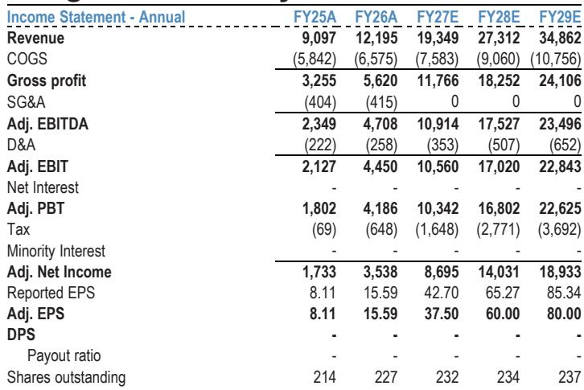
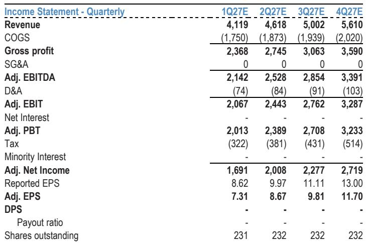
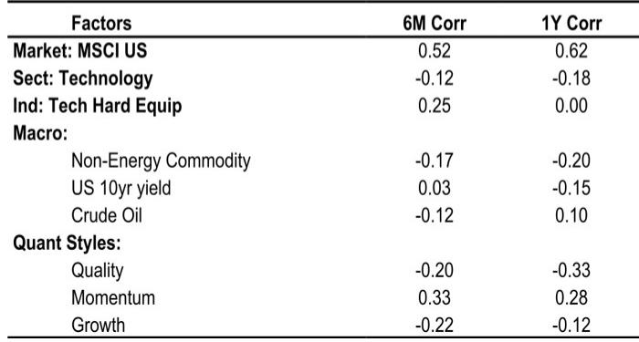

# JPM：希捷F4Q26财报点评-供需持续博弈

硬盘驱动器行业的供需缺口正在从“预期”变成“可核对的数字”。JPM在希捷科技F4Q26（截至6月）财报点评中给出了一组值得注意的数据：每EB定价同比增长11%，较上季度的4%明显提速，且公司指引下季度定价增速至少达到20%。这不是一次普通的beat-and-raise，而是连续第二个季度呈现同一模式——需求侧由云厂商资本开支和AI数据增量支撑，供给侧则因长期协议锁定而保持克制。

报告将FY27和FY28的每股盈利预测分别上调30.7%和32.1%，理由是定价假设需要与最新趋势对齐。对于关注存储产业链的读者，这份报告的价值不在于单季超预期本身，而在于它揭示了定价弹性如何沿着供需缺口传导，以及这种传导能持续多久。

## 1. 数据中心收入增长57%且定价增速逐季抬升

F4Q26数据中心收入达到29.33亿美元，同比增长57%，是整体营收超预期的主要来源。更关键的是定价节奏：每EB定价同比增长11%，而公司指引F1Q27至少达到20%。JPM原本预期下季度定价增速为12%，实际指引明显高于这一水平。

报告认为，定价上行来自两个独立来源：数据中心需求缺口扩大带来的议价能力，以及Edge IoT业务在竞争对手NAND存储产品大幅涨价的背景下获得的机遇性定价。后者说明，HDD的定价弹性部分来自替代品价格变化的外溢效应，而非纯粹的供需紧张。

> **KC评论：** 定价增速从11%跳升至20%指引，意味着增量毛利率会继续抬升。F4Q26增量毛利率为83%以上，下季度指引隐含88%以上——这个数字比营收增速更能说明供需缺口的实际深度。

## 2. 近线产能已分配至CY28且客户规划延伸至CY29

供给端的约束比需求端更值得关注。报告指出，绝大多数近线（Nearline）EB产能已通过长期协议分配至CY28，客户正在将规划周期延伸至CY29及以后。这意味着即使需求增速节奏变化，短期内新增供给也难以大规模进入市场。

管理层将需求描述为“结构性增强”，依据是云厂商持续建设、AI驱动的增量数据创建与保留，以及视频等既有高数据密集型工作负载。客户规划周期延伸至多年，支撑了FY27营收加速增长的指引。供给纪律与需求可见度的组合，构成了定价持续上行的基础。

## 3. Mozaic 4+正在两大CSP客户量产爬坡

技术平台的进展为供给约束提供了另一层解释。Mozaic 3+已在所有主要云客户完成认证并进入量产，Mozaic 4+正在两家最大的云服务商处爬坡，并扩展至更多认证。HAMR技术的领先是希捷在供需格局中占据有利位置的原因之一。

，基于2028E每股盈利60美元按约18倍市盈率估值。报告认为这一倍数高于历史水平，但相对于其他AI相关硬件供应商仍属保守，反映了对定价行动力度较为克制的假设。

## 4. 观察框架：区分定价弹性来源与持续性

对于需要跟踪存储行业的读者，这份报告提供了一个可复用的分析框架：将定价弹性拆解为需求缺口驱动和替代品价格外溢驱动，分别评估其持续性。前者取决于云厂商资本开支节奏，后者取决于NAND与HDD的成本差距变化。

报告在不确定性部分提到，若云厂商AI基础设施支出节奏变化，或闪存迁移速度快于预期、NAND密度进展超预期，都可能对当前预期构成不确定性。这些不确定性并非假设性——它们界定了当前定价环境的边界条件。在产能已锁定至CY28的背景下，需求侧的变化将是影响后续定价走势的主要变量。

For informational purposes only. Portions may be generated,translated,summarized,or edited with AI assistance based on source materials and may contain omissions or errors. Please verify independently. This is not investment,legal,tax,accounting,or other professional advice.

For informational purposes only. Portions may be generated,translated,summarized,or edited with AI assistance based on source materials and may contain omissions or errors. Please verify independently. This is not investment,legal,tax,accounting,or other professional advice.

