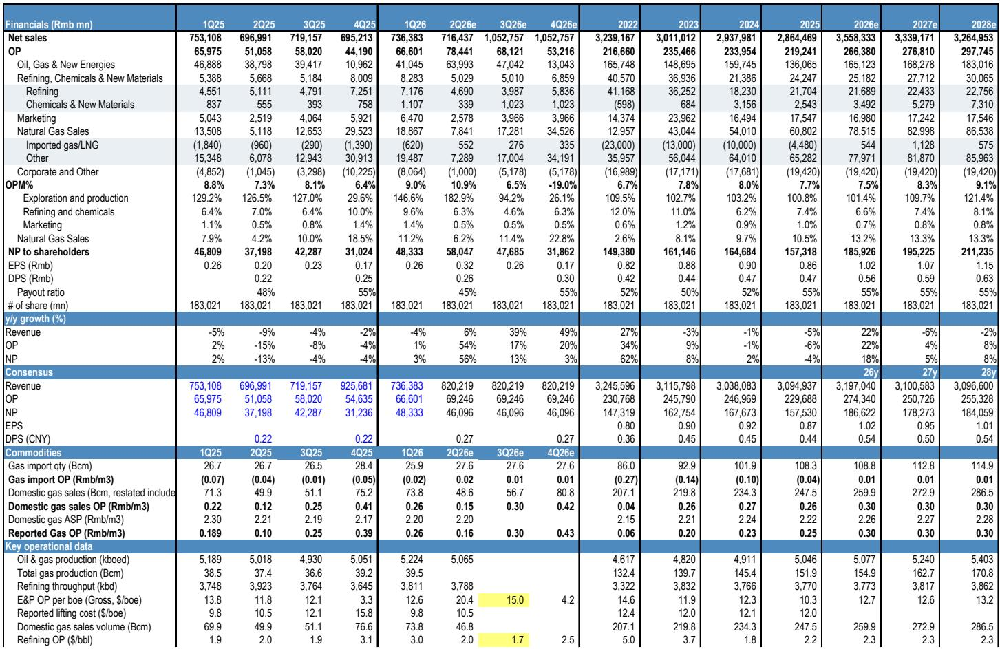
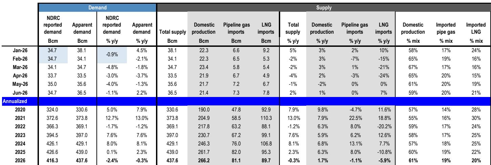
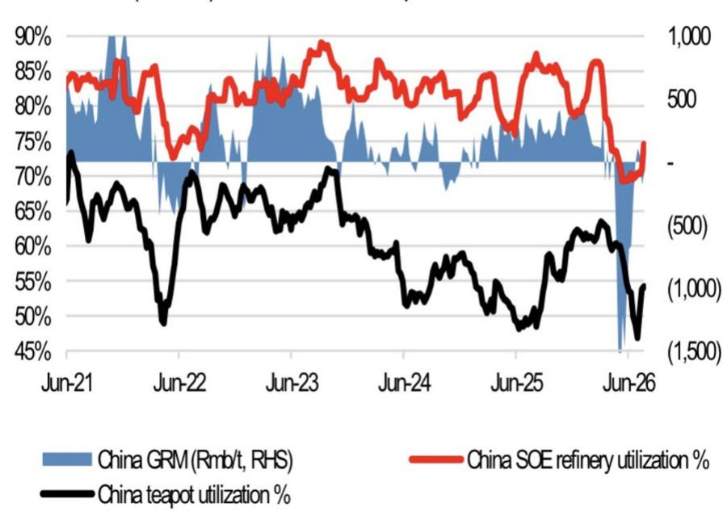

# LNG Canada部分权益调整：资本纪律的体现，而非被动退出

中国石油据报正考虑出售其在LNG Canada项目中15%权益的一部分，以帮助筹措该项目二期扩建所需资金。市场对此的初步反应——股价相对同业略有落后——可能忽略了这一决策背后的战略逻辑。消息公布后，公司股价相对其他石油巨头表现温和，H股仅上涨1%，而恒生指数及中国同业整体上涨2%。读者似乎担忧可能出现资产减值，但更合理的解读是：中国石油正寻求在行业周期高位将这一战略性LNG资产部分变现，实现资本循环，并降低自身在数十亿美元级二期建设支出中的敞口。这并非实力减弱的信号，而是纪律性的体现。

时机的选择并非偶然。当前全球LNG市场供需关系偏紧，有利于卖方。据媒体报道，马来西亚国家石油公司（Petronas）在2025年四季度以略高于30亿美元的价格，向MidOcean Energy出售了LNG Canada 5%的权益及其加拿大上游资产20%的权益。这一交易为评估中国石油所持权益的潜在价值提供了现实参照。中国石油董事会于2018年批准了对LNG Canada 15%权益总计34.6亿美元的投资，其中FID前投入3.35亿美元，FID后投入31.25亿美元。若能以接近Petronas交易倍数的价格完成部分出售，这一交易更可能实现价值兑现，而非确认损失。

据报的这一权益调整，需要放在LNG Canada所有者群体的更广阔背景中理解。壳牌和三菱商事据报也在考虑出售各自的部分权益，其中壳牌可能寻求出售其40%权益中的至多30%。壳牌在5月财报电话会议上澄清，考虑出售的权益涉及中游资产，公司希望在保持全产业链敞口的同时，将资本重新配置到其他领域。当多家成熟的所有者同时考虑部分退出时，这更多反映的是集体判断——该资产的价值正接近阶段性高点，而非项目本身遇到困难。LNG Canada的战略优势——贴近亚洲市场、以AECO为基准且较Henry Hub存在折价的原料气定价、以及在地缘不确定性背景下实现供应多元化——并未改变。所有者们只是认识到，这些优势在当前价格中已得到充分体现。

## 市场对减值的担忧或被高估：账面价值才是锚点，而非原始投资额

读者对减值的担忧可以理解，但从分析角度看并不精确。中国石油是否确认损失，取决于出售价格与资产当前账面价值的关系，而非2018年的原始投资额。34.6亿美元代表的是累计历史投入，但账面价值在权益法核算、减值评估和汇率变动等因素作用下，可能已随时间发生变化。若部分出售价格高于账面价值，将产生收益而非损失。Petronas的交易表明，在当前LNG市场偏紧和项目战略定位的背景下，LNG Canada权益的估值水平可能高于中国石油的账面价值。

报告自身的模型提供了一个有用的参考。对2026财年的预测已保守地计入了150亿元人民币的减值，这与历史趋势一致。这意味着分析层面已经纳入了一个可能不会发生的下行情景。如果实际交易以高于账面价值的估值完成，结果将好于已属保守的预期。市场即时的反应——相对同业1%的落后——似乎反映了一种条件反射式的假设，即任何资产出售都意味着困境。更具纪律性的解读是：中国石油在LNG价格处于高位、供需关系偏紧时进行资产变现，而这正是资产出售能够获得最优定价的时机。

减值问题还忽略了一个更重要的战略要点：此次权益调整的目的在于为二期提供资金，而非退出项目。LNG Canada二期扩建计划新增产能1400万吨/年，壳牌预计将在2026年底前做出最终投资决定。Wood Mackenzie估计二期资本开支为182亿加元，约合136.5亿美元。中国石油按15%权益比例对应的建设支出约为20亿美元。在当前有利的估值条件下出售部分权益，是为该义务预先筹措资金的合理方式，既不会给资产负债表带来压力，也不会挤占分红和其他优先事项的现金流。这一交易将降低中国石油未来的资本开支负担，同时保留剩余权益带来的可观上行空间。

## Petronas交易显示LNG Canada权益正按偏紧市场定价，卖方窗口已经打开

Petronas交易是LNG Canada所有权当前被溢价评估的最清晰证据。该交易于2025年四季度完成，将LNG Canada 5%的权益加上约10.6万亿立方英尺储量和或有资源的上游资产20%权益，以略高于30亿美元的价格估值。上游部分规模可观，但仅LNG Canada权益本身——即使按保守分配——也意味着该项目获得了显著估值。中国石油也持有与LNG Canada相关的上游资产权益，尽管储量规模小于Petronas。这一比较表明，中国石油15%的权益加上其上游头寸，可能获得超过原始34.6亿美元投资的价格。

更广泛的并购背景也支持这一判断。近期LNG交易表明，买家愿意为液化能力和相关基础设施支付溢价。Woodside将其路易斯安那LNG基础设施40%的权益出售给Stonepeak，价格为该项目2025-26年资本开支的75%，合计57亿美元；另将控股公司10%的权益及管道80%的权益出售给Williams，作价2.5亿美元。这些交易以反映当前LNG市场偏紧和供应多元化战略溢价的估值完成。LNG Canada的优势——到亚洲的航运时间约10天，不到墨西哥湾运输时间的一半，以及以AECO为基准且较Henry Hub存在折价的原料气定价——使其在当前买家寻求在地缘不确定性中实现供应多元化的市场中，成为一项具有吸引力的资产。

卖方窗口当前是敞开的，因为市场偏紧。LNG Canada一期产能1400万吨/年，于2025年二季度开始调试，预计2026年下半年实现两条生产线满负荷运行。二期若在2026年下半年做出最终投资决定，可能在2030年代初投产。该项目获得了显著的政府支持以加速推进，这降低了政策风险，但并未消除建设风险。一期于2018年做出最终投资决定，原计划2024年投产，但据Wood Mackenzie数据，延期和成本超支使资本开支增加了30%，达到260亿加元。这段历史对二期而言是一个警示，也解释了为何所有者可能更倾向于引入资本合作伙伴，而非独自承担全部建设风险。

## 中国石油核心盈利动能强劲，足以吸收权益调整而不伤及战略

权益调整的叙事不应掩盖背后的盈利图景——这一图景稳健且持续改善。中国石油预计将公布强劲的二季度净利润580亿元人民币，环比增长20%，同比增长56%，上半年净利润1060亿元人民币，创历史新高。盈利动能由多个未反映在LNG Canada头条中的因素驱动。中国石油原油自给率约60-70%，另有约20%通过管道从俄罗斯进口，这为其炼化板块提供了同业不具备的成本优势。报告预计中国石油二季度炼化经营利润保持正值，而中石化预计出现亏损，凸显了原油自给的结构性优势。

天然气板块也在迎来拐点。中国石油的LNG进口预计在二季度扭亏为盈，驱动因素包括国内市场份额提升、行业领先的天然气成本管理，以及5月以来中国天然气需求的恢复。报告预计上半年天然气销量同比增长1%，而中国天然气需求同比下降2.4%，表明中国石油在偏弱的市场中正在获得份额。天然气进口经营利润预计在二季度转正至每立方米0.02元，而一季度为每立方米亏损0.02元，这是近年来进口板块首次实现盈利。这是结构性改善，而非周期性波动，它强化了中国石油有能力在不影响增长轨迹的前提下实现战略资产变现的判断。

盈利质量对权益调整的讨论很重要，因为它改变了叙事框架。一家拥有创纪录盈利和持续改善的板块盈利能力的公司，并非因为需要现金而出售资产。它出售资产是因为看到了在有利价格下实现价值并以更高效率重新配置资本的机会。这一区别对估值至关重要。将权益调整解读为困境的读者会低估公司价值；将其解读为资本纪律的读者会认识到，中国石油正以与全球同业相同的严谨度管理其资产组合。

## 评估LNG部分权益出售的决策框架：价格、目的与交易后定位

对于评估中国石油据报的权益调整——或任何类似的LNG部分资产出售——读者应围绕三个问题展开分析。第一，价格相对于账面价值和可比交易如何？Petronas交易提供了参照点，但具体条款至关重要。高于账面价值的出售具有增值效应；低于账面价值的出售则触发减值。市场的初步反应表明读者在假设后者，但偏紧的LNG市场和Petronas先例更支持前者。Woodside在路易斯安那的交易以及Browse气田出售给Woodside的交易，为当前环境下LNG资产估值提供了额外数据点。

第二，出售的目的是什么？如果所得资金专门用于二期建设，该交易将降低未来资本开支风险并改善资产负债表灵活性。如果所得资金用于分红或股份回购，该交易则传递了对基础盈利能力的信心。如果所得资金用于偿还债务，该交易则表明更为保守的资本配置姿态。据报的理由——为二期提供资金——是最具建设性的解读，因为它意味着中国石油在主动管理其增长管道，而非被动应对。另一种解读——中国石油在降低对成本风险上升项目的敞口——不太有利，但考虑到项目的战略优势，也未必是负面信号。

第三，交易后的定位如何？保留可观权益的部分出售，在降低资本承诺的同时保留了上行敞口。壳牌的做法——出售中游资产同时保持全产业链敞口——提供了一个模板。中国石油可以类似地出售LNG Canada权益的一部分，同时保留足够权益以受益于项目的长期现金流。关键指标是保留的经济利益，而非头条中的出售百分比。从15%降至10%与完全退出有本质区别，市场应对两者区别对待。

这一决策框架同样适用于更广泛的LNG行业。近期一波部分权益出售——Petronas、Woodside、壳牌、三菱商事，以及现在可能加入的中国石油——表明行业在经历一段积极投资期后，正进入资本纪律阶段。偏紧的LNG市场为所有者创造了以有利估值变现资产的机会，理性的回应是利用这一窗口优化资产组合构成。这不是行业疲弱的信号，而是行业成熟的标志。2010年代末做出最终投资决定的项目正在陆续投产，其所有者正在认识到，价值创造阶段已从建设转向运营。

## 权益调整反映LNG行业向资本纪律的广泛转变：变现取代建设成为价值驱动因素

LNG行业正处于一个拐点，中国石油据报的权益调整是更广泛战略转变的表征。第一波LNG投资的特点是大型建设项目、长周期和显著的成本超支。LNG Canada一期就是一个典型案例：2018年做出最终投资决定，原计划2024年投产，经历延期后调试推迟至2025年二季度，成本超支使资本开支增加30%至260亿加元。正在浮现的第二波则表现为资本纪律、资产组合优化，以及专注于变现现有资产而非建设新资产。

这一模式在整个行业清晰可见。Petronas出售了其LNG Canada权益及相关上游资产。Woodside出售了路易斯安那LNG的基础设施权益。壳牌和三菱商事据报正在考虑部分退出LNG Canada。现在中国石油据报也在考虑部分出售其15%的权益。共同的主线是，成熟的所有者正在认识到LNG资产的价值当前处于高位——受供需关系偏紧、地缘风险溢价和供应多元化战略重要性驱动——并选择实现这一价值，而非无限期持有。

这一转变对读者如何评估LNG相关公司具有启示意义。传统估值框架聚焦于储量、产量和项目管道。新兴框架还必须纳入组合管理能力、资本配置纪律以及资产出售时机的把握。中国石油据报的权益调整，如果以有利价格完成，将证明公司具备这些能力。市场最初的怀疑——反映在股价的轻微落后——为能够区分困境退出与纪律性变现的读者创造了机会。证据指向后者。

第二层含义是，LNG Canada二期可能以与一期不同的所有权结构推进。如果中国石油、壳牌和三菱商事都减少各自权益，项目可能吸引寻求加拿大LNG敞口的新读者。政府对加速推进项目的支持表明政策资本已投入其成功，这可能促进新资本合作伙伴的进入。结果可能是更多元化的所有权基础，降低集中风险并可能改善项目治理。对中国石油而言，在二期持有较低权益意味着未来资本开支要求降低，建设风险敞口减少，同时保留LNG Canada区位和原料气优势带来的战略收益。

这一交易还凸显了为LNG Canada供气的上游资产的重要性。Petronas与MidOcean Energy的交易包括约10.6万亿立方英尺储量和或有资源的加拿大上游资产20%权益。中国石油持有类似的上游头寸，尽管储量规模较小。这些上游资产的价值与LNG Canada的成功密切相关，将上游和液化权益捆绑出售可能比分开出售获得更高价格。Petronas先例表明，买家愿意为同时锁定天然气供应和液化能力的综合方案支付溢价。

## 中国石油创纪录盈利为LNG资产变现提供支撑，不构成疲弱信号

据报的权益调整在时机上具有战略优势，因为它恰逢公司创纪录盈利期。中国石油上半年1060亿元人民币的净利润预计将创历史新高，二季度580亿元的预测意味着同比增长56%。这一盈利强度为交易提供了支撑：它表明公司是从强势地位而非必要性出发进行出售。与中石化的对比——后者预计二季度炼化板块亏损，而中国石油保持盈利——凸显了中国石油的盈利质量及其在具有挑战性的炼化环境中保持盈利的能力。

盈利动能由可能持续的结构性因素驱动。中国石油的原油自给率——约60-70%来自国内生产，约20%来自俄罗斯管道——使其炼化板块免受全球原油价格波动的影响，而这一波动正在损害一体化程度较低的同业。天然气板块受益于市场份额提升、成本管理和需求恢复。天然气进口板块近期首次实现盈利，反映了中国石油获取低成本天然气供应和优化进口组合的长期战略的成功。这些因素表明，创纪录盈利并非一次性事件，而是业务结构性改善的反映。

创纪录盈利与有利LNG市场的结合，为资产变现创造了一个难得的窗口。中国石油可以按反映当前偏紧市场的价格出售LNG Canada的部分权益，将所得资金用于二期或其他优先事项，同时仍报告强劲的盈利增长。只要出售价格高于账面价值，该交易就具有增值效应，并将降低未来资本开支要求。市场最初的轻微落后反应，随着读者消化战略逻辑和有利的交易条款，可能会得到修正。

对读者而言，更广泛的启示是，LNG行业的资产出售应基于具体条款进行评估，而非基于对困境的条件反射式假设。近期一波部分权益出售——Petronas、Woodside、壳牌、三菱商事，以及现在可能加入的中国石油——反映了对有利定价环境的理性回应。执行好这些交易的公司将提高资本效率并为股东创造价值。在整个周期中持有资产不放的公司可能错失窗口。中国石油据报的权益调整，如果以与Petronas交易一致的价格完成，将使公司跻身前一类。

*仅供参考。部分内容可能基于原始材料由AI辅助生成、翻译、摘要或编辑，可能存在遗漏或错误。请独立核实。本文不构成投资、法律、税务、会计或其他专业建议。*
