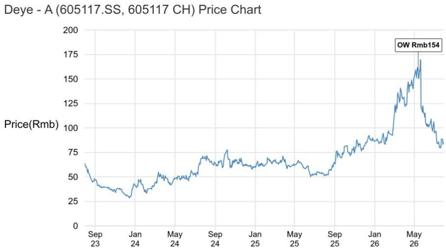

本材料不面向中国大陆读者分发，亦不构成在中国大陆境内提供证券投资咨询服务。本材料及其任何部分，未经JPM书面同意，不得转载、出售或再分发。

## 阳光电源 - A

## 美国FCC针对新型中国逆变器进口表态；维持增持评级，相关影响已部分反映

7月28日，美国联邦通信委员会（FCC）表示将阻止进口新型中国仿人/四足机器人和并网功率逆变器。虽然这一消息并非全新，但其范围（同时涵盖逆变器和储能PCS产品，以及公用事业规模和离网应用）倾向于偏谨慎的一面。与市场预期一致，该禁令将影响新型号，而此前已获FCC批准的型号仍可向美国销售。我们认为对盈利的影响更多体现在中期。另一个关键进展将是对“远程连接”的法律解释。据阳光电源称，其产品不具备无线通信功能，并通过物理线缆连接到客户的控制单元。我们认为，阳光电源有可能通过个性化风险评估（经由DoW/DHS）申请“有条件批准”以获取新机型的FCC授权，但门槛可能较高。

我们估算美国市场约占阳光电源2025年毛利润的20-25%；若完全退出美国市场，可能意味着约20-25%的盈利下行空间（假设阳光电源将合理化其运营）。自6月30日以来，该股相对上证综指跑输约25%后，目前交易于约12倍FY27E市盈率（或剔除美国业务敞口后约15倍），且其26/27年除美国外储能装机复合年增长率约为40%，我们认为当前估值已对风险有所补偿，维持增持评级。话虽如此，这一进展也限制了阳光电源从AIDC储能主题中获得的估值重估空间。在中国储能集成商中，我们也指出德业股份是更纯粹的新兴市场分布式发电储能增长标的。

\- 事件摘要：7月28日，美国联邦通信委员会（FCC）发布消息称，将阻止进口新型中国仿人机器人和四足机器人，以及并网功率逆变器——这类设备可使可再生能源和电池接入电网及数据中心设备（链接）。

\- 我们的分析与结论：这对市场而言并非全新消息，因为6月30日已有新闻报道暗示FCC可能正在考虑一项规则，以限制新型外国逆变器进口至美国（链接至我们的报告）。话虽如此，其范围（同时涵盖逆变器和储能PCS，以及电网规模和表后应用）正趋向于更为严格的一面，我们将其视为负面因素（尽管并非完全出乎意料的结果）。尽管如此，仍有一些要素有待进一步的法律解释，我们在下表中进行了总结。一个重要的要素是“远程连接”的定义是否足够宽泛，以涵盖其新型逆变器型号；如果是，这些型号可能不再在美国销售。我们认为，现有的、已获授权的型号目前可能不受影响，这将把任何盈利影响推迟几年。

## 增持

300274.SZ, 300274 CH
价格（26年7月28日）：人民币112.08元

目标价（26年12月）：人民币212.00元

亚太公用事业与可再生能源 | 可持续投资

Alan Hon AC

(852) 2800-8573

alan.hon@JPM.com

Daqi Jiao

(852) 2800-8595

daqi.jiao@JPM.com

JPM Securities (Asia Pacific) Limited/ JPM Broking (Hong Kong) Limited

参见第4页的分析师认证和重要披露，包括非美国分析师披露。

表1：该裁决的关键方面、JPM评论及对阳光电源盈利的影响

<table><tr><td>该裁决的关键方面</td><td>可能性/JPM评论</td><td>对盈利影响的时间</td></tr><tr><td>功率逆变器的远程连接</td><td>JPM观点：根据FCC的定义，该限制适用于具有远程连接功能的功率逆变器，而阳光电源辩称其产品不具备此类功能（即WiFi和蓝牙）。我们注意到阳光电源正在与美国律师讨论此问题，这可能取决于FCC的最终解释。</td><td>如果FCC认定阳光电源的产品属于此类别，其新型逆变器型号可能无法再在美国销售。否则，阳光电源可以继续销售其产品，这是最好的情况。</td></tr><tr><td>FCC对现有产品的授权</td><td>JPM观点：根据FCC的说法，该裁决不应禁止任何现有型号的进口、销售或使用。我们认为阳光电源仍有可能在几年内销售其旧型号，这种可能性很高。</td><td>实际的盈利影响可能在几年后显现。</td></tr><tr><td>产品类型：该裁决是否适用于PCS/储能逆变器？</td><td>JPM观点：根据FCC的定义，我们认为PCS/储能逆变器有很大可能被列入清单（受FCC裁决影响）。这偏向市场讨论中较为谨慎的一面。</td><td></td></tr><tr><td>应用：该裁决是否适用于表后/电网规模逆变器？</td><td>JPM观点：根据FCC的定义，我们认为表后/电网规模逆变器有很大可能被列入清单（受FCC裁决影响）。这比一些读者所希望的要稍差一些。</td><td></td></tr></table>

来源：FCC，JPM估计。

\- 如何申请豁免：根据FCC的规定，战争部（DoW）或国土安全部（DHS）有可能授予“有条件批准”。逆变器制造商可通过个性化风险评估寻求有条件批准，而DoW/DHS可能会要求提供更多信息。请注意，申请必须在2028年1月1日前提交，所需信息包括：（1）公司结构，即法定名称、注册司法管辖区、所有权结构、董事会成员和高管领导层等；（2）制造和供应链披露，即物料清单、每个组件的原产国等；（3）美国制造和回流计划，即建立美国制造以使设备有资格获得FCC授权的详细且有时限的计划等。

\- 股票观点及我们的建议：我们认为美国市场应占阳光电源2025年毛利润的20-25%。如果我们假设阳光电源完全退出美国市场，我们预计盈利可能削减约20%至25%（假设阳光电源合理化其成本基础），但与此相对的是其储能业务2026-27年（除美国外）40%的复合年增长率TAM增长。目前，阳光电源的交易价格为12倍FY27E市盈率，或剔除美国业务敞口后为15倍FY27E市盈率。我们认为当前估值足以证明风险合理，并维持增持评级。话虽如此，AIDC储能主题的估值重估空间现在相当有限。另外，在中国储能集成商中，我们认为德业股份（605117 CH，增持）在新兴市场分布式发电储能增长方面是一个更纯粹的故事。

# 投资论点、估值与风险

阳光电源 - A（增持；目标价：人民币212.00元）

## 投资论点

阳光电源是全球最大的光伏逆变器生产商（按产量计），截至FY24市场份额约为30%。近年来，阳光电源凭借成本优势获得了市场份额。我们认为，与其他国内生产商相比，阳光电源拥有更优越的产品质量和更成熟的品牌认知度。我们给予阳光电源增持评级，因为我们预计其将受益于强劲的储能需求，这得益于公用事业和数据中心订单潜力的增加。

## 估值

我们12月26日的目标价人民币212元相当于12个月远期目标市盈率23.0倍。我们对其不同业务板块采用分部估值法（SOTP）。我们的目标倍数为历史平均值的-0.1个标准差。

<table><tr><td>SOTP估值</td><td>方法</td><td>远期1年倍数</td><td>FY26E目标价（人民币）</td></tr><tr><td>EPC</td><td>市盈率</td><td>23.0倍</td><td>13.4</td></tr><tr><td>逆变器</td><td>市盈率</td><td>23.0倍</td><td>60.6</td></tr><tr><td>储能</td><td>市盈率</td><td>23.0倍</td><td>115.0</td></tr><tr><td>其他</td><td>市盈率</td><td>23.0倍</td><td>22.6</td></tr><tr><td>总计（取整）</td><td></td><td></td><td>212.0</td></tr></table>

来源：JPM估计。

## 评级与目标价风险

我们评级和目标价的下行风险包括：光伏/储能装机增长低于预期；定价和毛利率表现差于预期；以及国内竞争对手的竞争加剧。

上行风险包括：光伏/储能装机增长高于预期；定价和毛利率表现好于预期；以及国内竞争对手的竞争好于预期。

本报告中讨论的公司（除非另有说明，本报告中所有价格均为2026年7月29日收盘价）德业股份 - A（605117.SS/人民币85.13元/增持）

分析师认证：本报告封面标注“AC”的研究分析师证明（或，在多位研究分析师主要负责本报告的情况下，封面或文档中标有“AC”的研究分析师分别证明，对于该研究分析师在本研究中涵盖的每只证券或发行人）：（1）本报告中表达的所有观点准确反映了研究分析师对任何及所有标的证券或发行人的个人观点；（2）研究分析师的薪酬中没有任何部分直接或间接与本研究报告中表达的具体建议或观点相关。对于封面列出的所有韩国研究分析师（如适用），他们亦根据KOFIA要求证明，其分析是本着诚信原则进行的，观点反映了研究分析师的自身意见，未受到不当影响或干预。

除非另有说明，本报告中提到的所有作者均为独立开展研究的研究分析师。在欧洲，行业专家（销售和交易）可能作为联系人出现在本报告中，但并非报告作者或研究部门成员。

## 重要披露

\- 做市商/流动性提供者：JPM是阳光电源 - A、德业股份 - A或相关实体的金融工具的做市商和/或流动性提供者。

\- 客户：JPM目前拥有，或在过去12个月内拥有以下实体作为客户：阳光电源 - A、德业股份 - A或相关实体。

\- 客户/非投资银行、证券相关：JPM目前拥有，或在过去12个月内拥有以下实体作为客户，且提供的服务为非投资银行、证券相关：德业股份 - A或相关实体。

\- 客户/非证券相关：JPM目前拥有，或在过去12个月内拥有以下实体作为客户，且提供的服务为非证券相关：德业股份 - A或相关实体。

\- 潜在投资银行报酬：JPM预计在未来三个月内将从阳光电源 - A、德业股份 - A或相关实体获得或寻求投资银行服务报酬。

• 非投资银行报酬：JPM在过去12个月内因投资银行以外的产品或服务从德业股份 - A或相关实体获得了报酬。

\- 债务头寸：JPM可能持有阳光电源 - A、德业股份 - A或相关实体的债务证券头寸（如有）。

公司特定披露：JPM现在并寻求与其研究报告所覆盖的公司开展业务。因此，读者应知悉，该公司可能存在利益冲突，可能影响本报告的客观性。读者应将本报告仅视为做出投资决策的单一因素。重要披露，包括价格图表和信用意见历史表（如适用），可在https://www.jpmm.com/research/disclosures 获取，或致电1-800-477-0406，或发送邮件至research.disclosure.inquiries@JPM.com 索取。

阳光电源 - A（300274.SZ, 300274 CH）价格图表  
  
来源：Bloomberg Finance L.P. 和 JPM；价格数据已根据股票拆分和股息进行调整。2021年6月7日开始覆盖。所有股价均为前一交易日收盘价。

<table><tr><td>日期</td><td>评级</td><td>价格（人民币）</td><td>目标价（人民币）</td></tr><tr><td>23年9月6日</td><td>增持</td><td>70.93</td><td>96</td></tr><tr><td>23年11月3日</td><td>增持</td><td>57.36</td><td>93</td></tr><tr><td>23年12月8日</td><td>中性</td><td>56.79</td><td>61</td></tr><tr><td>24年3月10日</td><td>增持</td><td>71.00</td><td>83</td></tr><tr><td>24年3月21日</td><td>增持</td><td>74.98</td><td>84.5</td></tr><tr><td>24年5月3日</td><td>增持</td><td>73.82</td><td>85</td></tr><tr><td>24年9月3日</td><td>增持</td><td>75.98</td><td>93</td></tr><tr><td>24年10月15日</td><td>增持</td><td>96.75</td><td>123</td></tr><tr><td>24年11月7日</td><td>增持</td><td>94.12</td><td>114</td></tr><tr><td>25年4月9日</td><td>中性</td><td>55.71</td><td>60</td></tr><tr><td>25年4月27日</td><td>中性</td><td>58.82</td><td>63</td></tr><tr><td>25年8月26日</td><td>中性</td><td>102.60</td><td>84</td></tr><tr><td>25年11月5日</td><td>增持</td><td>187.19</td><td>240</td></tr><tr><td>25年11月30日</td><td>增持</td><td>182.90</td><td>250</td></tr><tr><td>26年4月1日</td><td>增持</td><td>150.76</td><td>212</td></tr></table>

<table><tr><td>日期</td><td>评级</td><td>价格（人民币）</td><td>目标价（人民币）</td></tr><tr><td>26年5月14日</td><td>增持</td><td>158.87</td><td>154</td></tr></table>

来源：Bloomberg Finance L.P. 和 JPM；价格数据已根据股票拆分和股息进行调整。2026年5月14日开始覆盖。所有股价均为前一交易日收盘价。  
图表显示JPM对这些股票的持续覆盖；现任分析师可能并未在整个期间内覆盖这些股票。JPM评级或名称：OW = 增持，N = 中性，UW = 减持，NR = 未评级

## 股票研究评级、名称和分析师覆盖范围说明：

JPM采用以下评级体系：增持（在本报告所示目标价期间内，我们预计该股票的表现将优于研究分析师或研究分析师团队的覆盖范围内股票的平均总回报）；中性（在本报告所示目标价期间内，我们预计该股票的表现将与研究分析师或研究分析师团队的覆盖范围内股票的平均总回报一致）；减持（在本报告所示目标价期间内，我们预计该股票的表现将逊于研究分析师或研究分析师团队的覆盖范围内股票的平均总回报。NR为未评级。在这种情况下，JPM已因缺乏足够的基本面基础或法律、监管或政策原因而移除了该股票的评级以及（如适用）目标价。先前的评级和（如适用）目标价不应再被依赖。NR名称并非建议或评级。一些被覆盖的股票有评级但没有目标价；在这种情况下，我们预计该股票的表现将优于/一致/逊于研究分析师或研究分析师团队的覆盖范围内股票在相关区域内的平均总回报。在我们亚洲（除澳大利亚和印度外）和英国中小市值股票研究中，每只股票的预期总回报与基准国家市场指数的预期总回报进行比较，而非与研究分析师的覆盖范围进行比较。如果本报告的重要披露部分未出现，认证研究分析师的覆盖范围可在JPM研究网站https://www.JPMmarkets.com 上找到。

覆盖范围：Hon, Alan：Arctech - A (688408.SS), CGN Power (1816) (1816.HK), Daqo (DQ), Datang Renewable (1798) (1798.HK), Deye - A (605117.SS), Envicool - A (002837.SZ), Flat Glass (6865.HK), GCL Tech (3800.HK), Goldwind - A (002202.SZ), Goldwind - H (2208.HK), Hangzhou First - A (603806.SS), Huaneng Hydropower - A (600025.SS), LONGi Green - A (601012.SS), Longyuan (0916) (0916.HK), Maxwell - A (300751.SZ), Mingyang - A (601615.SS), Orient Cables - A (603606.SS), SDIC Power - A (600886.SS), Shenzhen SC - A (300724.SZ), Sichuan Chuantou - A (600674.SS), Sungrow - A (300274.SZ), Tongwei - A (600438.SS), Xinyi Solar (0968) (0968.HK), Yangtze Power - A (600900.SS)

JPM股票研究评级分布，截至2026年7月4日

<table><tr><td></td><td>增持（买入）</td><td>中性（持有）</td><td>减持（卖出）</td></tr><tr><td>JPM全球股票研究覆盖*</td><td>53%</td><td>36%</td><td>12%</td></tr><tr><td>投行客户**</td><td>83%</td><td>80%</td><td>73%</td></tr><tr><td>JPMS股票研究覆盖*</td><td>51%</td><td>37%</td><td>12%</td></tr><tr><td>投行客户**</td><td>95%</td><td>92%</td><td>87%</td></tr></table>

\*请注意，由于四舍五入，百分比可能无法合计为100%。
\*\*在“买入”、“持有”和“卖出”类别中，JPM在过去12个月内提供过投资银行服务的标的公司百分比。

仅就FINRA评级分布规则而言，我们的增持评级属于报告评级类别；中性评级属于持有评级类别；减持评级属于报告评级类别。请注意，标有NR的股票未包含在上表中。此信息截至最近一个日历季度末。

股票估值与风险：有关被覆盖公司或目标价的估值方法和风险，请参阅http://www.JPMmarkets.com 上最新的公司特定研究报告，联系首席分析师或您的JPM代表，或发送邮件至research.disclosure.inquiries@JPM.com。有关专有模型的实质性信息，请参阅公司特定研究报告中的财务摘要和公司Tearsheets，可在我们的客户网站http://www.JPMmarkets.com 的公司页面下载。本报告亦阐述了其使用的重要基础假设。

## 研究交流历史：

过去12个月内JPM研究交流的历史记录可在http://www.JPMmarkets.com 的研究与评论页面访问，您也可以按分析师姓名、行业或金融工具进行搜索。

分析师薪酬：负责编写本报告的研究分析师的薪酬基于多种因素，包括研究的质量和准确性、客户反馈、竞争因素以及公司整体收入。

非美国分析师注册：除非另有说明，本报告封面上列出的非美国分析师是JPM Securities LLC非美国关联公司的员工，可能未根据FINRA规则注册为研究分析师，可能不是JPM Securities LLC的关联人员，并且可能不受FINRA规则2241或2242关于与所覆盖公司沟通、公开露面以及交易研究分析师账户持有证券的限制。

## 其他披露

JPM是JPM Chase & Co.及其全球子公司和关联公司的投资银行业务的营销名称。

英国MIFID FICC研究解绑豁免：英国客户应参阅英国MIFID研究解绑豁免，了解JPM实施FICC研究豁免的详情以及相关FICC研究分类的指引。

所有向客户提供的研究材料均同时在我们的客户网站JPM Markets上提供，除非相关法律特别允许。并非所有研究内容都会重新分发、通过电子邮件发送或提供给第三方聚合商。如需特定股票的所有研究材料，请联系您的销售代表。

本研究材料中对中国的任何长格式名称指代；香港；台湾；澳门分别为中国大陆；香港特别行政区（中国）；台湾（中国）；澳门特别行政区（中国）。

JPM可能不时撰写有关受美国、欧盟、英国或其他相关司法管辖区政府当局实施或管理的经济或金融制裁所针对的发行人或证券（受制裁证券）的文章。本报告中的任何内容均无意被解读为鼓励、促进、推动或以其他方式批准对受制裁证券的投资或交易。客户在做出投资决策时应了解自己的法律和合规义务。

本研究报告中讨论的任何数字或加密资产均受快速变化的监管环境影响。有关加密资产（包括比特币和以太坊）的相关监管建议，请参阅https://www.JPM.com/disclosures/cryptoasset-disclosure。

本研究报告的作者可能未获许可在您的司法管辖区开展受监管活动，如果未获许可，则不会声称能够这样做。

交易所交易基金（ETF）：JPM Securities LLC（“JPMS”）几乎在所有美国上市ETF中担任授权参与者。如果本报告中提及任何ETF，JPMS可能因分发这些ETF份额而赚取佣金和基于交易的报酬，并可能因执行其他交易相关服务（例如向ETF份额卖空者出借证券）而赚取费用。JPMS也可能为ETF本身提供服务，包括担任ETF的经纪商或交易商。此外，JPMS的关联公司可能为ETF提供服务，包括信托、托管、管理、借贷、指数计算和/或维护及其他服务。

期权和期货相关研究：如果此处包含的信息涉及期权或期货相关研究，则此类信息仅提供给已收到适当期权或期货风险披露文件的人士。请联系您的JPM代表或访问https://www.theocc.com/components/docs/riskstoc.pdf 获取期权清算公司的标准化期权的特征和风险副本，或访问https://www.finra.org/sites/default/files/2020-08/Security\_Futures\_Risk\_Disclosure\_Statement\_2020.pdf 获取证券期货风险披露声明副本。

银行间同业拆借利率（IBOR）和其他基准利率的变更：某些利率基准正在或可能在未来受到持续的国际、国内和其他监管指导、改革和改革提案的影响。欲了解更多信息，请参阅：https://www.JPM.com/global/disclosures/interbank\_offered\_rates

私人银行客户：如果您作为JPM Chase & Co.及其子公司（“JPM私人银行”）私人银行业务的客户接收研究，则研究由JPM私人银行提供，而非JPM的任何其他部门，包括但不限于JPM企业与投资银行及其全球研究部门。

负责制作和分发研究的法律实体：在编写本材料的Reg AC研究分析师姓名下方标识的法律实体是负责制作本研究的法律实体。如果多位Reg AC研究分析师编写了本材料，且其姓名下方标识了不同的法律实体，则这些法律实体共同负责制作本研究。如果分析师姓名下列出多个法律实体，则除非另有说明，第一个法律实体负责制作。来自各JPM关联公司的研究分析师可能为本材料的制作做出了贡献，但可能未获许可在您的司法管辖区开展受监管活动（并且不声称能够这样做）。除非下文法律实体披露中另有说明，本材料已由负责制作的法律实体分发，或者如果分析师姓名下列出多个法律实体，则第一个法律实体负责分发。如有任何疑问，请联系您所在司法管辖区的相关研究分析师或分发本研究材料的实体。

## 法律实体披露及国家/地区特定披露：

阿根廷：JPM Chase Bank N.A Sucursal Buenos Aires受阿根廷共和国中央银行（“BCRA”）和国家证券委员会（“CNV”- 阿根廷证券委员会 - ALYC y AN Integral N°51）监管。

澳大利亚：JPM Securities Australia Limited（“JPMSAL”）（ABN 61 003 245 234/AFS牌照号：238066）受澳大利亚证券和投资委员会监管，是ASX Limited的市场参与者、ASX Clear Pty Limited的清算和结算参与者以及ASX Clear（Futures）Pty Limited的清算参与者。本材料由JPMSAL或代表其在澳大利亚仅向“批发客户”（定义见《2001年公司法》第761G条）发行和分发。所覆盖的所有金融产品列表可在https://www.jpmm.com/research/disclosures 查看。JPM寻求覆盖与国内外读者相关的所有全球行业分类标准（GICS）行业以及各种市值规模的公司。如适用，在对标的公司进行公开尽职调查过程中，研究分析师团队可能不时通过公司参与（如实地考察、与公司代表讨论、管理层演示等）进行此类尽职调查。JPMSAL发布的研究已根据JPM澳大利亚研究独立性政策编写，该政策可在以下链接找到：JPM澳大利亚 - 研究独立性政策。

巴西：Banco JPM S.A.受证券委员会（CVM）和巴西中央银行监管。JPM监察员：0800-7700847 / 0800-7700810（听力障碍人士）/ ouvidoria.jp.morgan@jpmchase.com。

加拿大：JPM Securities Canada Inc.是一家注册投资交易商，受加拿大投资监管组织和安大略省证券委员会监管，是加拿大交易所的参与成员。本材料由JPM Securities Canada Inc.或代表其在加拿大分发。

智利：Inversiones JPM Limitada是一家在智利注册的未受监管实体。

中国：JPM Securities (China) Company Limited已获中国证监会批准从事证券投资咨询业务。

哥伦比亚：Banco JPM Colombia S.A.受哥伦比亚金融监管局（SFC）监管。本材料中对哥伦比亚境外实体提供的产品或服务的任何引用仅用于描述目的。此类引用不构成也不应被解释为在哥伦比亚领土内的促销活动或提供金融产品或服务，如适用的哥伦比亚法规所定义。

迪拜国际金融中心（DIFC）：JPM Chase Bank, N.A., Dubai Branch受迪拜金融服务管理局（DFSA）监管，其注册地址为Dubai International Financial Centre - The Gate, West Wing, Level 3 and 9 PO Box 506551, Dubai, UAE。本材料已由JPM Chase Bank, N.A., Dubai Branch分发给根据DFSA规则被视为专业客户或市场对手方的人士。

欧洲经济区（EEA）：除非另有说明，研究在EEA由JPM SE（“JPM SE”）分发，JPM SE是一家由联邦金融监管局（Bundesanstalt für Finanzdienstleistungsaufsicht, BaFin）授权作为信贷机构的公司，并由BaFin、德国中央银行（Deutsche Bundesbank）和欧洲中央银行（ECB）共同监管。JPM SE总部位于法兰克福，注册地址为TaunusTurm, Taunustor 1, Frankfurt am Main, 60310, Germany。本材料已在EEA分发给根据MiFID II第4条第1款第10项及附件II及其各自在所在司法管辖区的实施被视为专业读者（或同等）的人士（“EEA专业读者”）。非EEA专业读者不得依据本材料行事或依赖本材料。本材料所涉及的任何投资或投资活动仅适用于EEA相关人士，并将仅与EEA相关人士进行。

香港：JPM Securities (Asia Pacific) Limited（CE编号AAJ321）受香港金融管理局和香港证券及期货事务监察委员会监管，JPM Broking (Hong Kong) Limited（CE编号AAB027）受香港证券及期货事务监察委员会监管。JPM Chase Bank, N.A., Hong Kong Branch（CE编号AAL996）受香港金融管理局和证券及期货事务监察委员会监管，根据美国法律组建，承担有限责任。如果本材料的分发在香港属于受监管活动，则本材料在香港由或通过JPM Securities (Asia Pacific) Limited和/或JPM Broking (Hong Kong) Limited分发。

印度：JPM India Private Limited（公司识别号 - U67120MH1992FTC068724），注册地址为JPM Tower, Off. C.S.T. Road, Kalina, Santacruz - East, Mumbai – 400098，已在印度证券交易委员会（SEBI）注册为“研究分析师”，注册号为INH000001873。JPM India Private Limited亦在SEBI注册为印度国家证券交易所和孟买证券交易所的成员（SEBI注册号 – INZ000239730）以及商人银行家（SEBI注册号 - MB/INM000002970）。电话：91-22-6157 3000，传真：91-22-6157 3990，网站：http://www.jpmipl.com。JPM Chase Bank, N.A. - Mumbai Branch已获得印度储备银行（RBI）许可（许可证号 53/许可证号 BY.4/94；SEBI - IN/CUS/014/ CDSL : IN-DP-CDSL-444-2008/ IN-DP-NSDL-285-2008/ INBI00000984/ INE231311239）作为印度的表列商业银行，这是其允许在印度开展银行业务以及印度银行分支机构获准开展的其他活动的主要许可证。对于非本地研究材料，本材料不由JPM India Private Limited在印度分发。合规官：Ashutosh Sharma；ashutosh.j.sharma@jpmchase.com；+912261575002。投诉官：Ramprasadh K，jpmipl.research.feedback@JPM.com；+912261573000。SEBI授予的注册和NISM的认证不以任何方式保证中介机构的业绩或向读者提供任何回报保证。请访问条款和条件以及最重要条款和条件（MITC）。年度合规审计报告可在http://www.jpmipl.com/#research 获取。

印度尼西亚：PT JPM Sekuritas Indonesia是印度尼西亚证券交易所的成员，并在Otoritas Jasa Keuangan（OJK）注册和监管。

韩国：JPM Securities (Far East) Limited, Seoul Branch是韩国交易所（KRX）的成员。JPM Chase Bank, N.A., Seoul Branch注册为外国银行（JPM Chase Bank, N.A.）的分行。两家实体均受金融服务委员会（FSC）和金融监督院（FSS）监管。对于非宏观研究材料，该材料在韩国由或通过JPM Securities (Far East) Limited, Seoul Branch分发。

日本：JPM Securities Japan Co., Ltd.和JPM Chase Bank, N.A., Tokyo Branch受日本金融厅监管。

马来西亚：本材料由JPM Securities (Malaysia) Sdn Bhd（18146-X）在马来西亚发行和分发，该公司是Bursa Malaysia Berhad的参与组织，并持有马来西亚证券委员会颁发的资本市场服务牌照。

墨西哥：JPM Casa de Bolsa, S.A. de C.V., JPM Grupo Financiero是墨西哥证券交易所（“Bolsa Mexicana de Valores”）和机构证券交易所（“Bolsa Institucional de Valores”）的成员，并获授权由国家银行和证券委员会（“Comisión Nacional Bancaria y de Valores”）作为经纪交易商运营。

新西兰：本材料由JPMSAL仅向新西兰的“批发客户”（定义见《2013年金融市场行为法》）发行和分发。JPMSAL根据《2008年金融服务提供商（注册和争议解决）法》注册为金融服务提供商。

菲律宾：JPM Securities Philippines Inc.是菲律宾证券交易所的交易参与者，也是菲律宾证券清算公司和证券读者保护基金的成员。它受证券交易委员会监管。

新加坡：本材料由或通过JPM Securities Singapore Private Limited（JPMSS）[MDDI (P) 057/08/2025 和公司注册号：199405335R]在新加坡发行和分发，该公司是新加坡交易所证券交易有限公司的成员，和/或JPM Chase Bank, N.A., Singapore branch（JPMCB Singapore），两者均受新加坡金融管理局监管。本材料仅向《证券与期货法》（第289章）（SFA）第4A条定义的认可读者、专家读者和机构读者在新加坡发行和分发。本材料不旨在向任何零售读者或不符合SFA第4A条定义的“认可读者”、“专家读者”或“机构读者”类别的任何其他读者发行或分发。新加坡的接收者如对本材料产生或与本材料相关的任何事宜，请联系JPMSS或JPMCB Singapore。

南非：JPM Equities South Africa Proprietary Limited和JPM Chase Bank, N.A., Johannesburg Branch是约翰内斯堡证券交易所的成员，受金融服务行为监管局（FSCA）监管。

台湾：JPM Securities (Taiwan) Limited是台湾证券交易所（公司型）的参与者，受台湾证券期货局监管。与股票证券相关的材料由JPM Securities (Taiwan) Limited在台湾发行和分发，受台湾许可证范围及适用法律和法规的约束。如果JPM Securities (Taiwan) Limited就未在台湾证券交易所或台北交易所上市的证券（“非台湾上市证券”）制作研究材料，则这些材料不构成台湾适用法规下的证券建议，并且为免生疑问，JPM Securities (Taiwan) Limited不担任非台湾上市证券的经纪商。根据《证券商推介客户买卖有价证券管理办法》（经修订或补充）第7条之1第2项和/或其他适用法律或法规，请注意，本材料的接收者不得从事与本材料相关的可能产生利益冲突的任何活动，除非本材料中的“重要披露”另有披露。

泰国：本材料由JPM Securities (Thailand) Ltd.在泰国发行和分发，该公司是泰国证券交易所的成员，受财政部和证券交易委员会监管。注册地址为548 One City Center Building, 50th Floor, Ploenchit Road, Lymphini, Pathum Wan, Bangkok 10330。

英国：研究由JPM Securities plc（“JPMS plc”）在英国制作，该公司是伦敦证券交易所的成员，获审慎监管局授权并受金融行为监管局和审慎监管局监管，或由JPM Markets Limited（“JPMML Ltd”）制作，该公司获金融行为监管局授权并受其监管。除非另有说明，本材料在英国由JPMS plc分发，且仅面向英国的：(a) 具有投资相关事务专业经验的人士，符合《2000年金融服务与市场法（金融促销）令2005》（“FPO”）第19(5)条；(b) FPO第49条所述人士（高净值公司、非法人协会或合伙企业、高价值信托的受托人等）；或 (c) 本通信可以合法传达给任何其他人士；所有此类人士均称为“英国相关人士”。非英国相关人士不得依据本材料行事或依赖本材料。本材料所涉及的任何投资或投资活动仅适用于英国相关人士，并将仅与英国相关人士进行。JPM EMEA关于预防和避免与研究制作相关的利益冲突的政策说明可在以下链接找到：JPM EMEA - 研究独立性政策。

美国：JPM Securities LLC（“JPMS”）是NYSE、FINRA、SIPC和NFA的成员。JPM Chase Bank, N.A.是FDIC的成员。非美国关联公司发布的材料在美国由JPMS分发，JPMS对其内容承担责任。

一般信息：可根据要求提供更多信息。本材料中的信息来自据信可靠的来源。虽然已采取一切合理谨慎措施确风险自担材料中陈述的事实准确，且其中包含的预测、意见和预期公平合理，但JPM Chase & Co.或其关联公司和/或子公司（合称JPM）对本材料的完整性或准确性不作任何陈述或保证，但有关JPM和研究分析师参与本材料主题发行人的披露除外。因此，不应依赖本材料所含信息的准确性、公平性或完整性。由于计算、调整、翻译成不同语言和/或适用的当地监管限制，本材料中可能存在某些数据差异和/或内容有限。这些差异不应影响对本材料中可能讨论的标的公司的整体投资分析、观点和/或建议。人工智能工具可能已用于本材料的准备，包括协助数据分析、模式识别和研究材料的内容起草。JPM对因使用本材料或其内容而产生的任何损失不承担任何责任，JPM及其各自的董事、高级职员或员工均不对本材料的内容负责，但相关司法管辖区的监管机构或其监管制度可能施加的责任和义务除外。本材料中包含的意见、预测或预测仅代表JPM截至本材料日期的当前意见或判断，因此如有变更，恕不另行通知。可能会根据公司特定发展或公告、市场状况或任何其他公开可用信息定期提供公司/行业的更新。无法保证未来的结果或事件将与任何此类意见、预测或预测一致，这些意见、预测或预测仅代表一种可能的结果。此外，此类意见、预测或预测受某些未经证实的风险、不确定性和假设的影响，未来的实际结果或事件可能存在重大差异。本材料中提及的任何投资的价值或收入可能会波动和/或受到汇率变化的影响。除非另有说明，所有定价均为所讨论证券的市场收盘价指示性价格。过往表现并非未来结果的指示。因此，读者可能收回的资金少于原始投资。本材料不构成购买或出售任何金融工具的要约或招
