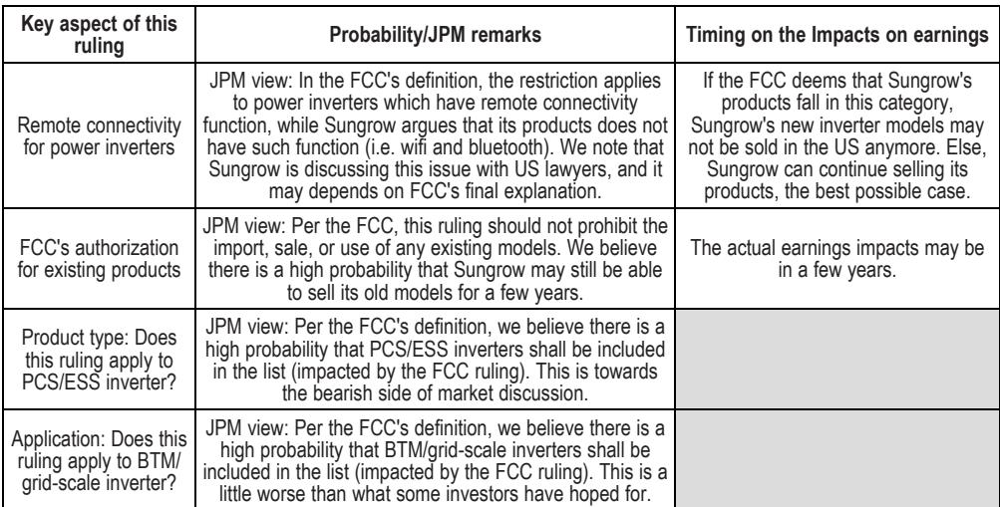
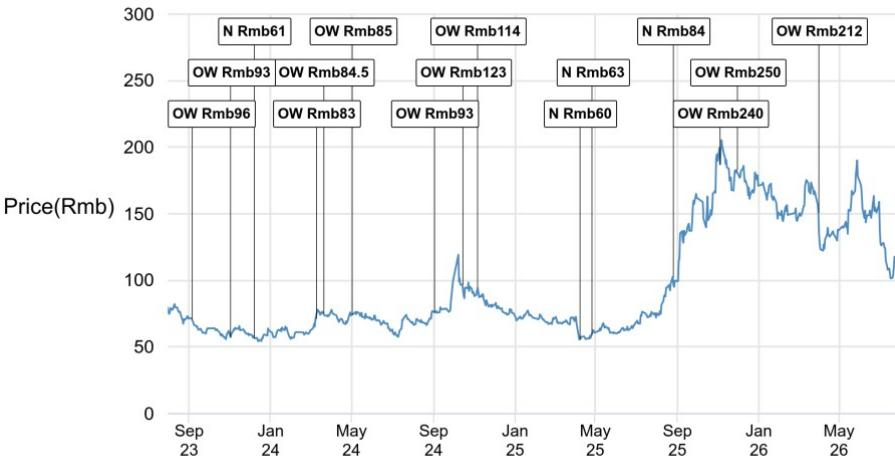

# 美国FCC限制中国逆变器进口：阳光电源估值承压，但市场已计入大部分风险

7月28日，美国联邦通信委员会（FCC）宣布将限制进口具有远程连接功能的新型中国机器人和并网电力逆变器——这类设备用于将可再生能源、电池和数据中心设备接入电网。对于全球出货量最大的光伏逆变器制造商阳光电源（2024财年市场份额约30%）而言，该规则的覆盖范围超出了市场预期。限制涵盖逆变器和储能系统（ESS）的功率转换系统（PCS）产品，并同时适用于公用事业规模和表后应用场景。自6月底以来，市场一直在为FCC可能出台的限制措施做准备，但最终规则的广度收窄了读者曾希望保留该公司增长最快业务板块的解读空间。

然而，直接的盈利影响并非核心问题。已获得FCC授权的现有型号仍可在美国市场销售，这将任何实质性盈利影响推迟了数年。更关键的是该裁决对阳光电源估值结构性上限的信号意义。自6月30日以来，阳光电源相对上证综指落后约25%，目前交易价格约为2027财年预期市盈率的12倍，剔除美国业务敞口后约为15倍。这一估值倍数已包含了显著的地缘政治风险折价。读者面临的问题不再是美国市场是否会消失——而是市场是否正确定价了消失的速度、概率以及其他地区的增长对冲。

总体而言，答案是肯定的。假设公司合理调整运营以匹配缩减的市场版图，完全退出美国市场将意味着阳光电源盈利下降20-25%。但这一风险需要与2026年至2027年除美国外储能系统安装量约40%的复合年增长率进行权衡。当前估值已对风险做出补偿，这也是某全球投资银行研究报告在负面消息背景下仍维持报告观点的原因。然而，同样的分析揭示了一个关键的二阶影响：FCC的裁决不仅威胁盈利——它还限制了AIDC（人工智能数据中心）储能主题带来的估值重估空间，而这一主题一直是读者对该行业热情的重要驱动力。市场不能再将阳光电源定价为美国数据中心建设的纯粹受益者。

# 裁决范围广泛，但法律关键点尚未明确——不确定性才是真正的风险

FCC的限制并非对中国逆变器的一刀切禁令。它针对的是具有远程连接功能的"并网电力逆变器"。这正是法律解读成为关键的地方。阳光电源坚称其产品不具备无线通信能力——没有WiFi、没有蓝牙——其逆变器通过物理线缆连接到客户控制单元。如果FCC对"远程连接"的最终解读与阳光电源的技术描述一致，该公司的新型号可能继续在美国销售。如果定义更宽泛，涵盖任何形式的远程管理或数据传输，阳光电源的新产品将被有效禁止进入美国市场。

报告指出，阳光电源正在与美国律师积极讨论这一问题，这凸显了真实存在的模糊性。这不是公司牵强附会的情况；无线与有线连接之间的技术区别是真实存在的，FCC的措辞可能并非针对逆变器特定架构而制定。但研究方面的概率评估偏于谨慎。根据目前的理解，FCC的定义可能同时涵盖PCS/ESS逆变器以及电网规模和表后应用——这处于读者所希望范围的更严格一端。

任何盈利影响的时间取决于"祖父条款"规定。根据FCC的规定，该裁决不应禁止已获得授权的现有型号的进口、销售或使用。这是监管过渡的标准特征，但在逆变器行业的产品周期动态背景下具有特殊重要性。逆变器型号的商业寿命相对较长，尤其是在认证和客户资质审核流程广泛的公用事业规模应用中。如果阳光电源能在未来几年继续销售其当前已授权型号，盈利影响将被推迟而非消除。公司需要为新型号争取有条件批准，或寻找调整产品设计以适应监管框架的方法。

有条件批准路径增加了另一层复杂性。FCC表示，国防部或国土安全部可通过个案风险评估授予有条件批准。申请必须在2028年1月1日前提交，所需披露内容广泛：公司结构，包括法定名称、注册司法管辖区、股权结构、董事会成员和高管团队；制造和供应链披露，包括物料清单和每个零部件的原产国；以及详细的、有时限的美国制造和本土化计划。门槛很高，相对于产品开发周期而言时间紧迫。即使阳光电源成功完成这一流程，结果也可能是美国业务版图的缩减，而非恢复原状。

# 20-25%的盈利下行风险真实存在，但市场已开始消化

研究报告估计美国市场占阳光电源2025年毛利润的20-25%，这为了解风险提供了量化锚点。完全退出美国市场，加上相关的成本合理化调整，将转化为约20-25%的盈利削减。这不是微不足道的影响，但也不至于危及生存。公司的美国以外增长引擎——2026年至2027年储能系统安装量约40%的复合年增长率——部分抵消了美国市场的损失。计算很简单：美国市场对毛利润的贡献显著但非主导，美国以外地区的增长轨迹足以在多年时间范围内吸收这一冲击。

然而，市场的反应比基本面分析所暗示的更为严厉。自6月30日以来，阳光电源相对上证综指约25%的落后表现，反映的不仅是盈利风险，还有被美国监管机构明确针对的声誉和战略影响。该股目前交易价格约为2027财年预期市盈率的12倍，相对其历史平均水平和增长概况有大幅折价。即使调整美国业务敞口后，估值倍数约为15倍——仍低于公司美国以外增长轨迹通常对应的水平。

这就是估值论点变得有说服力的地方。市场已经计入了显著的全额退出美国市场的概率，尽管实际盈利影响可能被推迟，并可能通过有条件批准或产品调整得到缓解。不对称性有利于能够承受头条风险的读者。研究报告维持报告观点的决定正是基于这种不对称性：下行风险已大部分定价，而美国以外增长和潜在监管明确性带来的上行空间尚未定价。

但读者不应忽视一个关键警告。FCC的裁决限制了阳光电源从AIDC储能主题中获得估值重估的潜力。数据中心对储能的需求一直是该行业估值扩张的主要驱动力，而美国是全球最大的数据中心市场。如果阳光电源无法参与美国数据中心储能部署，其增长叙事将从全球领导者捕捉AI基础设施建设的浪潮，转变为专注于非美国市场的区域性参与者。这仍然是一个有吸引力的故事——美国以外储能市场正在快速增长，阳光电源的成本优势和品牌认知度赋予其竞争优势——但这是一个不同的故事，有着不同的估值上限。

# 有条件批准流程创造新的竞争动态，有利于具备美国制造能力的现有企业

FCC的有条件批准路径，虽然技术上对任何制造商开放，但为已经拥有或能够快速建立美国制造业务的公司创造了事实上的竞争优势。申请要求——详细的公司结构披露、供应链透明度和有时限的本土化计划——并非易事。对于像阳光电源这样以中国成本效率和规模建立竞争优势的公司来说，美国制造的经济性具有挑战性。劳动力成本、监管合规和供应链物流都不利于支撑阳光电源在全球获得市场份额的成本结构。

这种动态对逆变器行业的竞争格局具有更广泛的影响。FCC的裁决实际上提高了进入美国市场的门槛，不仅针对中国制造商，也针对任何无法展示可信美国制造计划的公司。这可能有利于拥有现有美国业务的成熟企业，以及一直在成本上难以与中国竞争对手匹敌的美国本土制造商。该裁决可能加速储能和逆变器行业区域化制造的趋势，这将对全球供应链和定价动态产生影响。

对阳光电源而言，有条件批准流程提出了一个战略困境。寻求有条件批准需要在美国制造方面进行大量投资，这可能会稀释公司的成本优势并压缩利润率。披露要求也引发了对知识产权和竞争情报的担忧。一家中国公司向美国监管机构披露其物料清单、零部件采购和制造流程，所承担的战略风险超出了直接的监管结果。报告关于"门槛可能很高"的评估显得审慎，甚至可能有所保留。

2028年1月1日的申请截止日期增加了另一层战略复杂性。这一时间线创造了一个窗口期，阳光电源可以在评估选项的同时继续销售现有型号。但这也意味着公司不能无限期推迟决策。如果阳光电源选择不寻求有条件批准，就必须接受新产品的美国市场最终流失。如果寻求批准，则承诺进行具有不确定结果的重大战略转型。两条路径都有成本，这一决定将塑造公司未来多年的竞争地位。

# 读者的决策框架：权衡美国退出概率与美国以外增长轨迹

对于应对这一不确定性的读者，分析框架应聚焦三个变量：完全退出美国市场的概率、任何盈利影响的时间，以及美国以外市场的对冲增长。研究报告为这一分析提供了关键输入。完全退出美国市场的概率并非100%——远程连接的解读和有条件批准路径都为继续参与美国市场提供了潜在途径。但概率也并非可以忽略不计，市场的定价表明读者正在赋予负面结果相当大的权重。

时间变量更为有利。现有型号的祖父条款将任何盈利影响推迟了数年，这给了阳光电源时间来调整产品策略并可能获得有条件批准。2028年的申请截止日期为决策创造了清晰的时间线，但也意味着市场将在较长时间内面临不确定性。这种不确定性可能会限制该股的估值倍数，无论最终结果如何。

对冲增长变量是看涨论点中最有说服力的部分。美国以外储能市场在2026年至2027年以约40%的复合年增长率增长，阳光电源凭借其成本优势和品牌认知度完全有能力捕捉这一增长。公司近年来的市场份额增长源于其以有竞争力的价格提供优质产品的能力，这一能力不会因FCC的裁决而减弱。美国是一个市场，虽然是一个重要的市场，但全球能源转型正在多个地区创造机遇。

因此，决策框架不是预测FCC的最终解读或有条件批准申请的结果。而是评估当前估值是否充分补偿了可能结果的范围。在约12倍2027财年预期市盈率，或剔除美国业务敞口后15倍的情况下，市场正在定价相当大比例的负面结果概率。研究报告的结论——估值证明了风险的合理性——正是基于这种不对称性。下行风险已大部分定价，而美国以外增长和潜在监管明确性带来的上行空间尚未定价。

在更广泛的中国储能系统集成商领域中，报告指出一个更清晰的选择，供寻求该行业增长敞口而不受美国监管压力的读者参考。德业股份，评级为报告观点，被定位为新兴市场分布式储能增长的更纯粹标的。这一区别很重要，因为它凸显了行业内的分化：美国业务敞口较大的公司面临估值监管上限，而专注于新兴市场的公司可能不会。FCC的裁决不仅影响阳光电源——它重塑了整个中国逆变器和储能行业的竞争与投资格局。

对读者的战略启示是根据地理敞口和应对监管风险的能力对公司进行区分。美国市场对中国逆变器制造商的可及性正在降低，无论当前裁决的具体结果如何，这一趋势可能持续。能够转向其他增长市场或已拥有多元化地理足迹的公司，更有能力应对监管风暴。严重依赖美国市场的公司则面临更具挑战性的道路。

# FCC裁决重塑投资考量：阳光电源估值可辩护，但增长叙事已改变

FCC限制中国新型逆变器进口的决定是一个重要发展，其影响超出了直接的盈利影响。它标志着美国市场对中国制造商可及性的结构性转变，并限制了那些被定价为美国数据中心建设受益者的公司的估值潜力。对阳光电源而言，该裁决并未改变业务的基本质量——公司仍然是全球最大的逆变器制造商，具有成本优势和强大品牌。但它确实改变了增长叙事和估值上限。

研究报告维持报告观点的决定基于当前估值是合理的。在约12倍2027财年预期市盈率下，该股正在定价相当大比例的完全退出美国市场概率，而美国以外增长轨迹提供了部分对冲。不对称性有利于能够承受头条风险和长期监管不确定性的读者。但报告也承认，AIDC储能主题的估值重估潜力现已受限。市场不能再将阳光电源定价为AI基础设施建设的纯粹受益者，这限制了估值倍数，无论公司运营表现如何。

对该行业更广泛的影响是，监管风险已成为投资格局的永久特征。FCC的裁决并非孤立事件，而是中美科技脱钩加剧模式的一部分。美国业务敞口较大的公司面临结构性折价，而专注于其他市场的公司可能不会。这种分化将在未来数年塑造整个行业的投资决策。

对阳光电源而言，前进的道路涉及在复杂的监管环境中导航，同时继续执行其美国以外增长战略。有条件批准流程为继续参与美国市场提供了潜在途径，但门槛很高，时间紧迫。公司关于其产品不具备远程连接功能的技术论点可能具有说服力，但结果不确定。最可能的情况是未来几年美国市场份额逐步减少，盈利影响被推迟但未被消除。

投资决策最终归结为当前估值是否充分补偿了这一风险。在12倍2027财年预期市盈率下，加上40%的美国以外储能增长轨迹，市场为相信公司能够在应对监管环境的同时在其他地区捕捉增长的投资提供了合理的入场点。风险在于监管环境比当前预期的更为严格，或者美国以外增长未能按预期速度实现。但当前估值提供了在股票以更高倍数交易时不可获得的安全边际。

FCC的裁决提醒我们，地缘政治风险现已成为能源技术投资中的首要考量因素。纯粹基于运营优势为中国逆变器制造商定价的时代已经结束。读者现在必须将监管不确定性、供应链多元化和进一步限制的可能性纳入考量。这增加了投资过程的复杂性，但也为能够识别善于应对新格局的公司的读者创造了机会。

*仅供参考。部分内容可能基于源材料由AI辅助生成、翻译、摘要或编辑，可能包含遗漏或错误。请独立核实。本文不构成投资、法律、税务、会计或其他专业建议。*

仅供参考。部分内容可能基于源材料由AI辅助生成、翻译、摘要或编辑，可能包含遗漏或错误。请独立核实。本文不构成投资、法律、税务、会计或其他专业建议。

