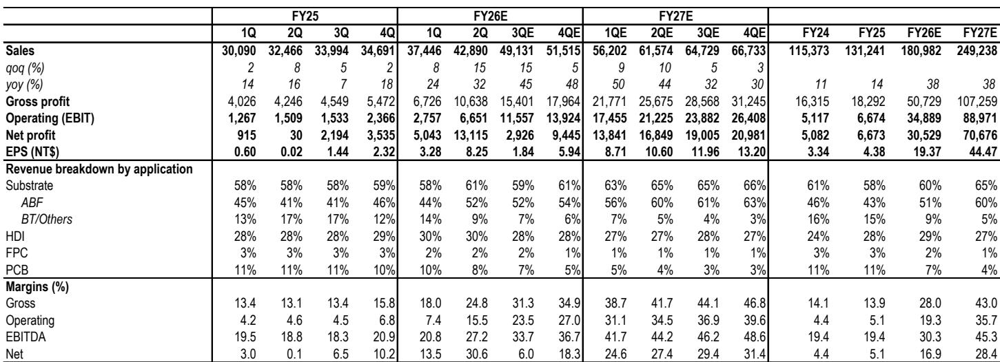
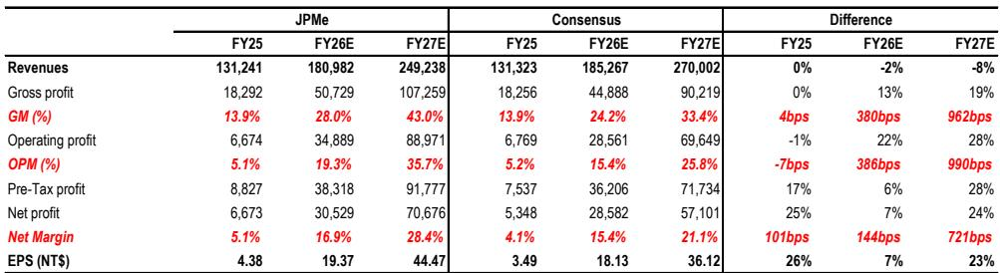
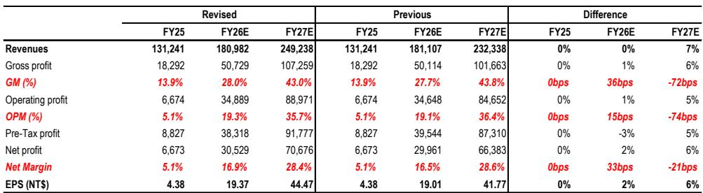

# ABF基板利润率不再具有周期性：某全球投资银行报告指出，某公司60%毛利率目标标志着先进封装经济性的结构性转变

某公司第二季度业绩中包含了一个比盈利本身更重要的数字：管理层表示，据某全球投资银行报告认为，这是首次，ABF基板毛利率最终可能达到60%的经常性水平。这不是渐进式改善，而是对基板业务价值的重新定义。多年来，市场将ABF基板视为周期性硬件组件，利润率可观但有上限。60%的经常性毛利率目标，可在2027年下半年实现，使该业务与领先半导体制造和先进封装处于同一盈利水平，而非印刷电路板组装。

时机并非偶然。该公司ABF中AI相关产品占比从上半年的60%升至下半年的70%以上，这得益于新型AI加速器产品的推出。这些产品的平均售价至少是消费级基板的两到三倍，即使在同类产品成功提价之后也是如此。随着基板进入壁垒的提高，这一差距可能会扩大。当供应商指出即使良率损失也能由客户承担时，商业关系已从交易型转向战略型。定价权不是周期性的，而是结构性的。

本报告探讨为何60%的毛利率目标可信、对竞争格局意味着什么，以及读者应如何重新定位对ABF基板作为资产类别的思考。证据表明，市场仍基于盈利轨迹对该公司进行估值，而该轨迹低估了利润率扩张的速度和持续性。

## 60%的ABF毛利率目标是一个改变研究框架的门槛，而不仅仅是预测调整

第二季度毛利率为24.8%，环比上升684个基点，同比上升1,173个基点。仅此一项就已超出预期。但更具意义的信号是趋势。该全球投资银行报告预计第三季度收入环比增长15%，毛利率再扩大六至七个百分点，这将使公司在9月季度接近31%。从那时起，到2027年达到43%的毛利率，最终ABF达到60%的路径虽然不是一条直线，但方向是明确的。

60%目标可信的原因在于利润率改善的构成。报告强调，未来产品结构改善将超过同类产品提价的影响。这是一个关键区别。提价是有限的，且会吸引竞争。而由AI加速器更复杂、层数更高的基板出货驱动的结构改善，是技术能力和客户认证的函数。它会随着时间推移而复利增长，因为每一代新产品都提高了进入门槛。

公司关于即使良率损失也能由客户承担的表述，是稀缺供应能力现状的有力指标。在正常制造业务中，良率损失是制造商的问题。在供应受限的战略组件市场中，它们成为认证成本。这种风险分配的逆转是基板业务已跨越结构性门槛的最有力证据。客户购买的不是组件，而是无法快速复制的产能和能力。

对观察者而言，这意味着当前的估值框架——由于历史周期性仍对基板制造商施加折价——其溢价水平较2018年以来平均倍数高出约0.5个标准差。这一溢价并非由短期动能支撑，而是由现在可见的利润率结构的持续性所支撑。

## AI基板含量正在重新定义价值链，平均售价高出两到三倍，进入壁垒比产能增长更快

收入结构说明了问题。基板收入占总收入的比例将从2025财年的58%升至2027财年的65%，其中ABF从占总收入的43%增长至60%。这不是多元化，而是向最高价值细分领域的集中。ABF中AI相关产品占比已在上半年达到60%，下半年将超过70%，这意味着该公司越来越专注于AI加速器封装领域。

平均售价差异是机制所在。新型AI加速器产品的单位平均售价至少是消费级基板的两到三倍，随着基板层数增加和线宽缩小，这一差距将进一步扩大。报告指出，由于层数和面积的增加，HPC、AI和5G芯片的基板含量大约增长50%至100%。每一代AI加速器都需要更大的基板面积、更多的层数和更严格的公差。这不是一次性的跃升，而是一个复合增长的需求。

进入壁垒的论点同样重要。报告强调，基板进入壁垒正在迅速提高，高能力的供应商应因其努力而获得充分回报。这不仅仅是资本支出的问题，还涉及工艺知识、良率学习曲线以及跨越多个产品世代的客户认证周期。新进入者无法快速进入这一业务，即使是没有正确客户关系的现有参与者也会发现自己在最高价值细分领域被排除在外。

市场尚未完全定价这一点。2027财年的一致收入预估为2,700亿新台币，比该投资银行2,490亿新台币的预估高出8%，但一致毛利率预估比该银行的预测低19%。市场预测的收入更高，但系统性地低估了利润率。这一分歧表明，卖方仍在将基板业务建模为组件制造商，而非战略技术合作伙伴。

## EMIB-T是下一个封装竞争领域，基板供应商持有的筹码比市场预期的更强

先进封装格局由CoWoS主导，但EMIB-T正成为可信的替代方案。报告指出，EMIB-T在显著提升基板内容价值的同时，提供了非常有吸引力的整体封装成本降低，基板平均售价估计约为CoWoS的两倍。成本约束不在于基板本身，而在于OSAT产能和关键设备（特别是贴片机）的可用性。

某公司在EMIB-T中的定位意义重大。管理层认为，公司是全球三大基板技术开发合作伙伴之一，客户已为关键设备采购制定了完善的方案。报告表明，该公司有望获得可用工具的三分之一。这不是推测，而是客户对稀缺产能的计划性分配，标志着长期承诺。

一些观察者可能担心EMIB-T的采用会稀释该公司在ASIC基板中现有的高份额。报告直接回应了这一点，对公司的执行能力和满足良率检查点的能力表示信心。V9项目按计划推进。这一担忧可以理解，但放错了重点。EMIB-T中的基板内容价值高于CoWoS，因此即使该公司在特定客户封装组合中的份额发生变化，每个设备的美元含量也会增加。该公司不是在防守份额，而是在扩大其出货的价值。

OSAT产能约束是近期瓶颈，但也是一条护城河。报告承认成本和产能约束仍然存在，但方向是明确的。随着EMIB-T成为主流选择，拥有合格技术和 secured 设备分配的基板供应商将获得不成比例的价值。设备采购方案中该公司获得可用工具的三分之一，这是竞争对手难以复制的战略资产。

## 盈利轨迹支撑估值倍数，2026财年每股收益增长342%，2027财年增长130%

财务预测令人瞩目。调整后每股收益预计从2025财年的4.38新台币增长至2026财年的19.37新台币（增长342%），然后在2027财年达到44.47新台币（再增长130%）。营业利润率同期从5.1%扩大至19.3%再至35.7%。2026财年和2027财年收入均增长38%表现强劲，但利润率扩张才是真正的核心。

季度进展显示拐点就在当下。2026财年第二季度调整后每股收益为8.25新台币，是第一季度3.28新台币的两倍多。第三季度预计为1.84新台币，看似回落，但这反映了一次性项目。潜在的经营轨迹——第三季度毛利率再扩大六到七个百分点——才是关键。第四季度恢复攀升至5.94新台币，2027财年在此基础上加速。

该投资银行的预估与一致预期之间的比较具有启发性。2027财年，该银行的毛利率预测为43.0%，而一致预期为33.4%，差距为962个基点。营业利润率为35.7%对25.8%，差距为990个基点。该银行不仅在收入上更乐观，在业务的利润率结构上也从根本上更乐观。鉴于该银行近期与管理层有过沟通，而一致预期尚未完全更新至60%的ABF毛利率指引，这一差距可能会朝该银行的方向收敛。

自由现金流在2027财年转正，达到728亿新台币，此前因资本支出周期在2025财年和2026财年为负。这是回报阶段。公司现在正大力投资以确保AI基板浪潮的产能，2027财年的现金流拐点证明了当前溢价的合理性——该溢价相对于股票历史均值较高，但考虑到现在可见的增长和利润率持续性，是适当的。

## 一个决策框架：基板业务不再是周期性交易，而是结构性增长复合体

评估该公司以及ABF基板体系的框架，需要从周期性供需平衡转向结构性价值捕获。有四个关键变量，每个都支持结构性论点。

第一，ABF中的AI相关产品占比是主要的利润率驱动因素。在70%且持续上升的情况下，公司已过了消费级周期性可能拖累业绩的临界点。AI基板中的定价权——平均售价是消费级产品的两到三倍——不是暂时的短缺溢价。它反映了制造的技术难度和合格供应商的稀缺性。观察者应关注AI相关产品占比作为利润率轨迹的领先指标。

第二，客户关系结构已经改变。当客户为良率损失买单并按计划分配稀缺设备时，供应商实际上是战略合作伙伴，而非供应商。这降低了盈利波动性，并支持更高的估值倍数。EMIB-T的设备分配——可用工具的三分之一流向该公司——是这种伙伴关系结构的具体例证。

第三，进入壁垒比产能增长更快。报告指出基板壁垒正在迅速提高，这体现在即使在成功提价后AI与消费级产品之间的平均售价差距仍在扩大。新进入者面临的不仅是资本成本，还有工艺知识要求和跨越多个产品世代的认证周期。拥有合格技术和客户关系的现有参与者将捕获价值。

第四，利润率轨迹偏向后端。2026财年是转型之年，营业利润率从5.1%增长两倍多至19.3%。2027财年是回报之年，营业利润率达35.7%，自由现金流强劲转正。市场仍在对此轨迹打折，这从该银行预估与一致预期之间的差距可见一斑。风险不在于公司未能执行，而在于市场需要太长时间来重新定价。

值得关注的一个风险是EMIB-T的采用速度以及相关的OSAT产能约束。报告承认这些约束仍然存在。如果EMIB-T的采用慢于预期，该特定技术带来的基板含量提升将被推迟。然而，这一风险被以下事实所缓解：核心ABF中AI相关产品占比已经在推动利润率扩张，独立于EMIB-T。EMIB-T的机会是增量上行空间，而非基准情形。

该股票已经经历了显著的重新定价，年初至今上涨212.7%，过去十二个月上涨391.4%。最近一个月回调29.5%，而更广泛市场相对下跌18.5%，表明在强劲上涨后出现了一些获利了结。估值方面，2027财年预期盈利的27.5倍，而当年盈利增长130%，并不算高。仅约3.6%的盈利回报表现就低估了增长调整后的吸引力。

基板业务已经跨越了一个门槛。60%的毛利率目标不是希望，而是一个由客户承诺、设备分配和日益以AI为主导的产品结构支撑的计划。市场最终会认识到这一点。问题在于，观察者是为这一认识做好了准备，还是等待确认——而确认到来时，可能已经反映在报价中了。

*仅供参考。部分内容可能基于源材料由AI辅助生成、翻译、总结或编辑，可能包含遗漏或错误。请独立核实。本文不构成投资、法律、税务、会计或其他专业建议。*

仅供参考。部分内容可能基于源材料由AI辅助生成、翻译、总结或编辑，可能包含遗漏或错误。请独立核实。本文不构成投资、法律、税务、会计或其他专业建议。

