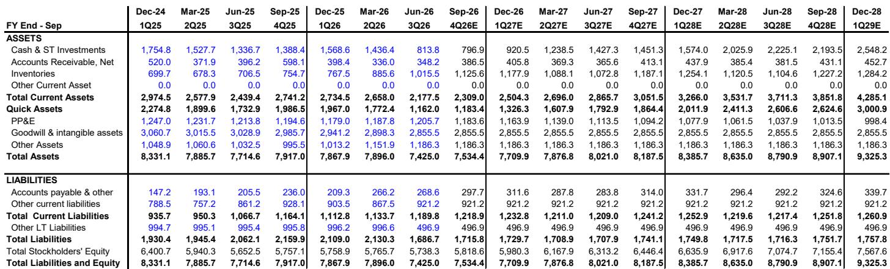
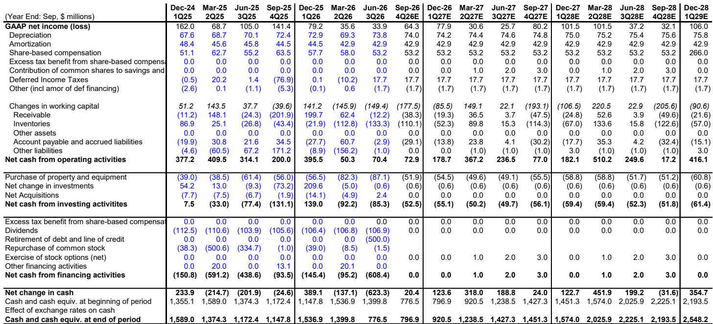
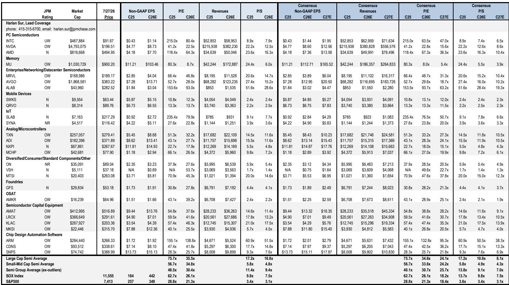

# JPM：Skyworks六月季度业务与季度数据观察

Skyworks Solutions 最新一季财报呈现一个少见组合：业绩超出市场预期，同时公司主动调整了资本回报框架。JPM在 7 月 29 日发布的报告中指出，六月季度收入 9.35 亿美元，高于市场预期的约 9.25 亿美元，每股收益 1.08 美元也超过共识的 1.03 美元。但真正值得关注的不是这组数字本身，而是公司同时宣布的两项决定：将 QRVO 合并交易时间提前至最早本财年末，以及取消约 4.3 亿美元的季度股息，转而推出 20 亿美元回购授权。

这两项动作放在一起，指向一个清晰的资金使用顺序：先回购，再去杠杆，最后才是增值性并购。报告认为，这一安排与公司此前向读者传达的回报框架一致，但股息取消本身仍是一个需要消化的变化，尤其是对持有约 5% 股息率的股东结构而言。

## 1. 苹果业务内容下滑幅度收窄至低两位数

报告中最值得注意的修正来自苹果业务的内容价值。JPM此前在 2025 年 2 月给出的框架是内容下滑 20-25%，而最新跟踪显示实际下滑已收窄至低两位数。驱动因素并非 socket 重新夺回，而是客户出货量同比增长 20-22% 以及更有利的机型组合。苹果仍占 Skyworks 总收入的约 57%，这一比例本身没有变化，但内容下滑的斜率已经明显节奏变化。

报告同时提到，射频复杂度“多年来首次”上升。这句话值得细读：它意味着单机射频价值量可能进入一个重新定价的周期，但JPM明确表示，在下一次选型周期出现证据之前，不会将内容拐点视为可持续趋势。

> **KC评论：** 内容下滑收窄和射频复杂度上升是两回事。前者是既有客户出货量带来的数学修正，后者才是真正的产品周期信号。读者在跟踪后续季度时，应区分这两条线索，而不是把出货量增长直接等同于内容价值回升。

## 2. 九月季度指引略低于季节性，苹果增长仍高于移动业务均值

九月季度收入指引中值 10.35 亿美元，环比增长约 11%，略低于典型的低双位数季节性。移动业务预计环比增长高双位数，其中苹果增速将明显高于移动业务整体增速，安卓部分则形成影响。值得留意的是，公司管理层将最大安卓客户在六月季度的强劲表现定性为发布时点造成的异常，不会在九月季度重复。

JPM对十二月季度的判断相对明确：秋季备货周期完整，十二月季度大部分订单已经锁定，订单出货比大于 1，渠道库存处于低位。报告认为，如果苹果需求出现真正的调整，更可能以一季度混合调整的形式出现，而非十二月季度的直接冲击。因此，三月季度才是检验记忆体相关需求变化的时点。

## 3. 毛利率受投入成本与年度定价重置双重约束

六月季度毛利率 44.9%，同比下降 220 个基点，基本符合市场预期。九月季度指引毛利率 44.5%，环比再降约 40 个基点，主要受季节性移动业务组合变化和持续的投入成本通胀影响。JPM的观点是，在年度定价重置之前，毛利率可能面临阶段性上限。

移动业务的价格回收将进入 2027 财年谈判，而 Broad Markets 的定价行动（高于公司整体毛利率水平）将在过渡期内逐步计入组合。这意味着毛利率的修复节奏不由单一因素决定，而是取决于移动定价谈判结果与 Broad Markets 组合改善速度的赛跑。

## 4. 自由现金流为负，债务融资与回购并行

六月季度自由现金流为 -1700 万美元，经营现金流 7000 万美元，资本开支 8700 万美元。库存从上一季度的 8.9 亿美元上升至 10.2 亿美元。公司账上现金 8.14 亿美元，但考虑到 20 亿美元回购授权和约 20 亿美元债务融资计划，现金储备并不宽裕。

，对应 2028 日历年每股收益 5.08 美元的约 12-13 倍估值，与纯无线半导体同行一致。报告对 QRVO 收购本身持正面看法，认为规模效应和多元化收益明确，但当前阶段的不确定性回报评估偏平衡。

> **KC评论：** 自由现金流为负与 20 亿美元回购并行，这个组合在半导体行业并不常见。回购的时点和节奏将直接影响每股收益的摊薄路径，而债务融资成本则取决于利率环境。这两个变量的交互，比单看季度业绩更能解释估值区间的移动。

Broad Markets 的光学业务增速从三月季度的 30% 降至六月季度的 15%，九月季度指引进一步节奏变化至约 5%。报告将这一减速归因于基数效应和消费物联网正在吸收 AI 数据中心供应紧张的影响。这一板块的增长质量仍受供给约束，而非需求不足。

整体来看，这份报告的核心信息是：业绩超预期与资本回报调整同时发生，苹果内容下滑斜率改善与毛利率上限并存，回购启动与自由现金流为负并行。这些组合指向一个正在重新定位的公司，而非简单的季度波动。

For informational purposes only. Portions may be generated,translated,summarized,or edited with AI assistance based on source materials and may contain omissions or errors. Please verify independently. This is not investment,legal,tax,accounting,or other professional advice.

For informational purposes only. Portions may be generated,translated,summarized,or edited with AI assistance based on source materials and may contain omissions or errors. Please verify independently. This is not investment,legal,tax,accounting,or other professional advice.

