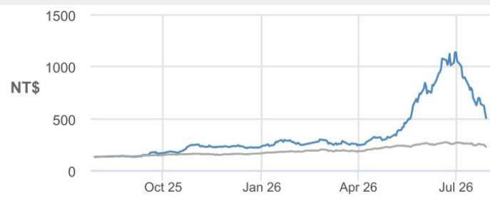
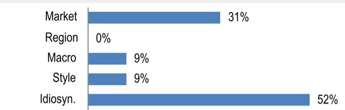

## YAGEO

**正面展望未改变**

**关于第三季度指引的看法**：YAGEO第二季度营收增长强劲，利润率表现良好（详见下文），但第三季度营收指引为“温和增长”（我们理解约为环比增长5%），明显低于市场预期的环比增长11-12%。值得注意的是，YAGEO表示第三季度产能利用率将提升至90-95%的水平（大宗品和高端品均如此），高于第二季度的80-85%。部分产出可能用于库存回补（第二季度库存周转天数从通常的约120天降至约110天）。我们基本维持原第三季度营收预测（约新台币460亿元，隐含环比增长5%），但认为指引和我们的预测存在一定的上行空间。我们仍认为第三季度许多客户和产品类别存在价格调整的可能性。同时，我们也不排除YAGEO正在关注特定渠道的出货情况。近几个月来，该公司在大中华区通用IT市场中的地位快速提升（因北亚同行正将重心转向AI领域），这应有助于供需平衡格局的延续。

**小幅上调目标价至新台币1,030元；正面展望未改变**。自6月高点以来，亚洲多家被动元件公司的报价出现了约50%的回调。部分参与者从极度乐观的定价预期中调整回来是主要原因之一，大中华区的一些负面定价数据点也影响了报价表现（但需注意，这主要涉及二级/转售市场，与YAGEO及其他被动元件制造商并无直接关联）。我们相信当前对2026年5-10%和2027年10-20%的价格调整假设（6月时许多参与者认为该假设偏保守）仍然成立，因为我们相信AI为被动元件行业带来长期供给紧平衡的核心逻辑依然稳固。我们预计未来几周行业中将有更多关于价格调整的消息。在我们看来，溢出订单和供应链转移将在可预见的未来为YAGEO的定价提供支撑。因此，在业绩公布后可能出现的波动中，读者可关注YAGEO的布局机会，目前其估值对应2027年预期每股收益约16倍。

## 表1：YAGEO 2Q26业绩摘要（新台币百万元）

<table><tr><td></td><td colspan="3">2Q26</td><td colspan="2">差异</td><td colspan="2">增长</td></tr><tr><td>新台币百万元</td><td>实际</td><td>本行预测</td><td>市场一致预期</td><td>vs. 本行</td><td>vs. 市场</td><td>环比</td><td>同比</td></tr><tr><td>营收</td><td>44,456</td><td>40,809</td><td>42,712</td><td>9%</td><td>4%</td><td>16%</td><td>36%</td></tr><tr><td>毛利</td><td>17,116</td><td>15,141</td><td>16,620</td><td>13%</td><td>3%</td><td>18%</td><td>47%</td></tr><tr><td>营业利润</td><td>11,749</td><td>9,698</td><td>11,413</td><td>21%</td><td>3%</td><td>22%</td><td>67%</td></tr><tr><td>净利润</td><td>9,418</td><td>8,073</td><td>9,156</td><td>17%</td><td>3%</td><td>18%</td><td>88%</td></tr><tr><td>调整后每股收益（新台币）</td><td>4.54</td><td>3.89</td><td>4.45</td><td>17%</td><td>2%</td><td>17%</td><td>-53%</td></tr><tr><td>毛利率</td><td>38.5%</td><td>37.1%</td><td>38.9%</td><td>140bps</td><td>-41bps</td><td>40bps</td><td>294bps</td></tr><tr><td>营业利润率</td><td>26.4%</td><td>23.8%</td><td>26.7%</td><td>266bps</td><td>-29bps</td><td>124bps</td><td>494bps</td></tr><tr><td>净利润率</td><td>21.2%</td><td>19.8%</td><td>21.4%</td><td>140bps</td><td>-25bps</td><td>22bps</td><td>594bps</td></tr></table>

资料来源：本行预测、公司数据、彭博金融资讯

## 增持

2327.TW, 2327 TT
价格（2026年7月29日）：新台币507.00元

▲ 目标价（2026年12月）：新台币1,030.00元
此前（2026年12月）：新台币1,000.00元

## 科技行业

Jerry Tsai AC
(886-2) 2725-9867
jerry.tsai@JPM.com
JPM证券（台湾）有限公司

Josie Yu
(886-2) 2725-9877
josie.yu@JPM.com
JPM证券（台湾）有限公司

Gokul Hariharan
(852) 2800-8564
gokul.hariharan@JPM.com
JPM证券（亚太）有限公司/JPM经纪（香港）有限公司

<table><tr><td colspan="4">主要变动（12月财年）</td></tr><tr><td></td><td>此前</td><td>当前</td><td>变动</td></tr><tr><td>调整后每股收益 - 26E（新台币）</td><td>16.98</td><td>18.22</td><td>7.3%</td></tr><tr><td>调整后每股收益 - 27E（新台币）</td><td>30.22</td><td>31.80</td><td>5.2%</td></tr></table>

## 季度预测（12月财年）

<table><tr><td colspan="4">调整后每股收益（新台币）</td></tr><tr><td></td><td>2025A</td><td>2026E</td><td>2027E</td></tr><tr><td>第一季度</td><td>10.77</td><td>3.90A</td><td>6.96</td></tr><tr><td>第二季度</td><td>9.74</td><td>4.54A</td><td>7.85</td></tr><tr><td>第三季度</td><td>3.10</td><td>4.51</td><td>8.41</td></tr><tr><td>第四季度</td><td>3.29</td><td>5.27</td><td>8.58</td></tr><tr><td>全年</td><td>11.40</td><td>18.22</td><td>31.80</td></tr></table>

## 风格暴露

<table><tr><td rowspan="2">量化因子</td><td rowspan="2">当前%排名</td><td colspan="4">历史%排名（1=最高）</td></tr><tr><td>6个月</td><td>1年</td><td>3年</td><td>5年</td></tr><tr><td>价值</td><td>72</td><td>53</td><td>20</td><td>11</td><td>54</td></tr><tr><td>成长</td><td>45</td><td>40</td><td>45</td><td>33</td><td>15</td></tr><tr><td>动量</td><td>6</td><td>16</td><td>53</td><td>58</td><td>54</td></tr><tr><td>质量</td><td>54</td><td>42</td><td>26</td><td>35</td><td>29</td></tr><tr><td>低波动</td><td>74</td><td>59</td><td>41</td><td>57</td><td>73</td></tr><tr><td>ESGQ</td><td>100</td><td>100</td><td>100</td><td>96</td><td>12</td></tr></table>

价格表现  

— 2327.TW 价格（新台币） — TSE（重新基准）

<table><tr><td></td><td>年初至今</td><td>1个月</td><td>3个月</td><td>12个月</td></tr><tr><td>相对</td><td>119.5%</td><td>-51.2%</td><td>57.4%</td><td>279.1%</td></tr><tr><td>相对</td><td>81.3%</td><td>-40.2%</td><td>55.6%</td><td>206.5%</td></tr></table>

公司数据

<table><tr><td>流通股数（百万股）</td><td>2,054</td></tr><tr><td>52周区间（新台币）</td><td>1,220.00-129.50</td></tr><tr><td>市值（百万美元）</td><td>32,134</td></tr><tr><td>汇率</td><td>32.40</td></tr><tr><td>自由流通比例（%）</td><td>82.7%</td></tr><tr><td>3个月日均成交量（百万股）</td><td>55.66</td></tr><tr><td>3个月日均成交额（百万美元）</td><td>1,264.3</td></tr><tr><td>波动率（90日）</td><td>91</td></tr><tr><td>指数</td><td>TAIEX</td></tr><tr><td>彭博分析师评级（买入|持有|卖出）</td><td>17|0|0</td></tr></table>

关键指标（12月财年）

<table><tr><td>新台币百万元</td><td>FY25A</td><td>FY26E</td><td>FY27E</td><td>FY28E</td></tr><tr><td colspan="5">财务预测</td></tr><tr><td>营收</td><td>132,930</td><td>179,792</td><td>248,899</td><td>316,299</td></tr><tr><td>调整后营业利润</td><td>29,801</td><td>47,009</td><td>83,409</td><td>124,938</td></tr><tr><td>调整后税息折旧及摊销前利润</td><td>39,635</td><td>62,925</td><td>107,728</td><td>156,261</td></tr><tr><td>调整后净利润</td><td>23,634</td><td>37,684</td><td>65,925</td><td>99,631</td></tr><tr><td>调整后每股收益</td><td>11.40</td><td>18.22</td><td>31.80</td><td>48.06</td></tr><tr><td>彭博每股收益</td><td>11.32</td><td>19.08</td><td>30.16</td><td>45.33</td></tr><tr><td>经营活动现金流</td><td>49,937</td><td>(8,954)</td><td>49,806</td><td>81,680</td></tr><tr><td>无杠杆自由现金流</td><td>43,881</td><td>(17,680)</td><td>39,806</td><td>71,680</td></tr><tr><td colspan="5">利润率与增长</td></tr><tr><td>营收同比增长（%）</td><td>9.3%</td><td>35.3%</td><td>38.4%</td><td>27.1%</td></tr><tr><td>营业利润率</td><td>22.4%</td><td>26.1%</td><td>33.5%</td><td>39.5%</td></tr><tr><td>营业利润同比增长（%）</td><td>27.4%</td><td>57.7%</td><td>77.4%</td><td>49.8%</td></tr><tr><td>税息折旧及摊销前利润率</td><td>29.8%</td><td>35.0%</td><td>43.3%</td><td>49.4%</td></tr><tr><td>税息折旧及摊销前利润同比增长（%）</td><td>20.1%</td><td>58.8%</td><td>71.2%</td><td>45.1%</td></tr><tr><td>净利润率</td><td>17.8%</td><td>21.0%</td><td>26.5%</td><td>31.5%</td></tr><tr><td>调整后每股收益增长</td><td>(72.6%)</td><td>59.8%</td><td>74.5%</td><td>51.1%</td></tr><tr><td colspan="5">比率</td></tr><tr><td>调整后税率</td><td>23.6%</td><td>22.7%</td><td>23.0%</td><td>23.0%</td></tr><tr><td>利息保障倍数</td><td>NM</td><td>NM</td><td>NM</td><td>NM</td></tr><tr><td>净债务/权益</td><td>0.4</td><td>0.5</td><td>0.3</td><td>0.1</td></tr><tr><td>净债务/税息折旧及摊销前利润</td><td>1.7</td><td>1.5</td><td>0.6</td><td>0.1</td></tr><tr><td>净资产回报表现</td><td>14.3%</td><td>21.3%</td><td>31.7%</td><td>37.0%</td></tr><tr><td colspan="5">估值</td></tr><tr><td>无杠杆自由现金流回报表现</td><td>4.2%</td><td>(1.7%)</td><td>3.8%</td><td>6.8%</td></tr><tr><td>股息回报表现</td><td>1.0%</td><td>1.2%</td><td>1.1%</td><td>1.9%</td></tr><tr><td>企业价值/营收</td><td>2.0</td><td>1.6</td><td>1.1</td><td>0.7</td></tr><tr><td>企业价值/税息折旧及摊销前利润</td><td>6.7</td><td>4.7</td><td>2.5</td><td>1.5</td></tr><tr><td>调整后市盈率</td><td>44.5</td><td>27.8</td><td>15.9</td><td>10.5</td></tr></table>

## 投资论点与估值摘要

## 投资论点

我们给予YAGEO增持评级，基于其在收购Kemet后于钽电容领域的领先地位，以及在MLCC和芯片电阻市场的强大布局——该市场经过整合后供给扩张较为有序。我们认为，对大宗商品类产品的较低敞口有助于平滑营收波动，而钽电容需求的持续增长可支撑YAGEO未来的营收和利润增长。

## 估值

我们的2026年12月目标价新台币1,030元基于2027/28年预期每股收益的26倍。26倍高于公司自2021年以来交易的前瞻市盈率均值加1.5个标准差。我们认为该倍数合理，因为被动元件正进入需求驱动的上行周期，相较于2018-19年的周期更具结构性和健康性。我们认为YAGEO是本轮周期的主要受益者之一，原因在于：1）高端被动元件领域的领先地位（全球钽电容龙头）；2）MLCC价格调整从低端产品开始。

表现驱动因素  

<table><tr><td>因素</td><td>6个月相关性</td><td>1年相关性</td></tr><tr><td>市场：MSCI亚太（除日本）</td><td>0.57</td><td>0.56</td></tr><tr><td>地区：台湾</td><td>-0.07</td><td>-0.05</td></tr><tr><td>宏观：</td><td></td><td></td></tr><tr><td>恒生波动率指数</td><td>-0.19</td><td>-0.22</td></tr><tr><td>JPM中国A股情绪指数</td><td>-0.05</td><td>-0.16</td></tr><tr><td>JPM全球股票情绪指数</td><td>-0.27</td><td>-0.16</td></tr><tr><td>量化风格：</td><td></td><td></td></tr><tr><td>成长</td><td>0.41</td><td>0.30</td></tr><tr><td>价值</td><td>-0.33</td><td>-0.30</td></tr><tr><td>股息率</td><td>-0.37</td><td>-0.29</td></tr></table>

新台币百万元，12月财年  
表2：YAGEO定价 - 情景分析

<table><tr><td></td><td>2026e</td><td>2027e</td><td>2028e</td><td>2027e营业利润 vs 基准情景</td><td>2028e营业利润 vs 基准情景</td></tr><tr><td>情景1</td><td>MLCC无价格调整；65-70%电阻器价格上调10%；35-40%电感器价格上调10%；85%以上钽电容价格上调10%</td><td>MLCC无价格调整；65-70%电阻器价格上调20%；45-50%电感器价格上调20%；85%以上钽电容价格上调20%</td><td>25-30% MLCC价格上调10%；85%以上电阻器价格上调10%；55-60%电感器价格上调10%；85%以上钽电容价格上调20%</td><td>-11%</td><td>-15%</td></tr><tr><td>情景2（基准）</td><td>35-40% MLCC价格上调10%；85%以上电阻器价格上调10%；45-50%电感器价格上调10%；85%以上钽电容价格上调10%</td><td>35-40% MLCC价格上调20%；85%以上电阻器价格上调20%；45-50%电感器价格上调20%；85%以上钽电容价格上调20%</td><td>85%以上MLCC价格上调15%；85%以上电阻器价格上调15%；55-60%电感器价格上调15%；85%以上钽电容价格上调25%</td><td>0%</td><td>0%</td></tr><tr><td>情景3</td><td>85%以上MLCC价格上调10%；85%以上电阻器价格上调10%；45-50%电感器价格上调10%；85%以上钽电容价格上调10%</td><td>85%以上MLCC价格上调25%；85%以上电阻器价格上调25%；45-50%电感器价格上调25%；85%以上钽电容价格上调25%</td><td>85%以上MLCC价格上调15%；85%以上电阻器价格上调20%；55-60%电感器价格上调20%；85%以上钽电容价格上调30%</td><td>+15%</td><td>+20%</td></tr></table>

资料来源：本行预测。

表3：损益表要点：年度本行预测 vs 市场一致预期（新台币百万元，每股收益除外）

<table><tr><td rowspan="2"></td><td colspan="3">本行预测</td><td colspan="3">市场一致预期</td><td colspan="3">差异</td></tr><tr><td>FY26E</td><td>FY27E</td><td>FY28E</td><td>FY26E</td><td>FY27E</td><td>FY28E</td><td>FY26E</td><td>FY27E</td><td>FY28E</td></tr><tr><td>营收</td><td>179,792</td><td>248,899</td><td>316,299</td><td>177,508</td><td>238,111</td><td>307,384</td><td>1%</td><td>5%</td><td>3%</td></tr><tr><td>毛利</td><td>70,230</td><td>115,531</td><td>164,375</td><td>70,144</td><td>104,690</td><td>150,560</td><td>0%</td><td>10%</td><td>9%</td></tr><tr><td>毛利率（%）</td><td>39.1%</td><td>46.4%</td><td>52.0%</td><td>39.5%</td><td>44.0%</td><td>49.0%</td><td>-45bps</td><td>245bps</td><td>299bps</td></tr><tr><td>营业利润</td><td>47,009</td><td>83,409</td><td>124,938</td><td>48,220</td><td>77,979</td><td>111,414</td><td>-3%</td><td>7%</td><td>12%</td></tr><tr><td>营业利润率（%）</td><td>26.1%</td><td>33.5%</td><td>39.5%</td><td>27.2%</td><td>32.7%</td><td>36.2%</td><td>-102bps</td><td>76bps</td><td>325bps</td></tr><tr><td>税前利润</td><td>48,964</td><td>85,815</td><td>129,589</td><td>50,660</td><td>80,536</td><td>119,862</td><td>-3%</td><td>7%</td><td>8%</td></tr><tr><td>净利润</td><td>37,684</td><td>65,925</td><td>99,631</td><td>39,245</td><td>62,648</td><td>93,294</td><td>-4%</td><td>5%</td><td>7%</td></tr><tr><td>净利润率</td><td>21.0%</td><td>26.5%</td><td>31.5%</td><td>22.1%</td><td>26.3%</td><td>30.4%</td><td>-115bps</td><td>18bps</td><td>115bps</td></tr><tr><td>每股收益（新台币）</td><td>18.22</td><td>31.80</td><td>48.06</td><td>19.08</td><td>30.16</td><td>45.33</td><td>-4%</td><td>5%</td><td>6%</td></tr></table>

资料来源：本行预测、彭博金融资讯

表4：损益表要点：年度修正后 vs 此前（新台币百万元，每股收益除外）

<table><tr><td rowspan="2"></td><td colspan="3">修正后</td><td colspan="3">此前</td><td colspan="3">差异</td></tr><tr><td>FY26E</td><td>FY27E</td><td>FY28E</td><td>FY26E</td><td>FY27E</td><td>FY28E</td><td>FY26E</td><td>FY27E</td><td>FY28E</td></tr><tr><td>营收</td><td>179,792</td><td>248,899</td><td>316,299</td><td>171,165</td><td>240,511</td><td>312,892</td><td>5%</td><td>3%</td><td>1%</td></tr><tr><td>毛利</td><td>70,230</td><td>115,531</td><td>164,375</td><td>65,630</td><td>110,009</td><td>160,650</td><td>7%</td><td>5%</td><td>2%</td></tr><tr><td>毛利率（%）</td><td>39.1%</td><td>46.4%</td><td>52.0%</td><td>38.3%</td><td>45.7%</td><td>51.3%</td><td>72bps</td><td>68bps</td><td>62bps</td></tr><tr><td>营业利润</td><td>47,009</td><td>83,409</td><td>124,938</td><td>43,217</td><td>78,860</td><td>121,616</td><td>9%</td><td>6%</td><td>3%</td></tr><tr><td>营业利润率（%）</td><td>26.1%</td><td>33.5%</td><td>39.5%</td><td>25.2%</td><td>32.8%</td><td>38.9%</td><td>90bps</td><td>72bps</td><td>63bps</td></tr><tr><td>税前利润</td><td>48,964</td><td>85,815</td><td>129,589</td><td>45,670</td><td>81,549</td><td>126,309</td><td>7%</td><td>5%</td><td>3%</td></tr><tr><td>净利润</td><td>37,684</td><td>65,925</td><td>99,631</td><td>35,106</td><td>62,646</td><td>97,111</td><td>7%</td><td>5%</td><td>3%</td></tr><tr><td>净利润率</td><td>21.0%</td><td>26.5%</td><td>31.5%</td><td>20.5%</td><td>26.0%</td><td>31.0%</td><td>45bps</td><td>44bps</td><td>46bps</td></tr><tr><td>每股收益（新台币）</td><td>18.22</td><td>31.80</td><td>48.06</td><td>16.98</td><td>30.22</td><td>46.85</td><td>7%</td><td>5%</td><td>3%</td></tr></table>

资料来源：本行预测。

表5：本行季度和年度预测

<table><tr><td rowspan="2"></td><td colspan="4">FY25</td><td colspan="4">FY26E</td><td colspan="4">FY27E</td><td colspan="4">FY28E</td><td colspan="6"></td></tr><tr><td>1Q</td><td>2Q</td><td>3Q</td><td>4Q</td><td>1Q</td><td>2Q</td><td>3QE</td><td>4QE</td><td>1QE</td><td>2QE</td><td>3QE</td><td>4QE</td><td>1QE</td><td>2QE</td><td>3QE</td><td>4QE</td><td>FY23</td><td>FY24</td><td>FY25</td><td>FY26E</td><td>FY27E</td><td>FY28E</td></tr><tr><td>销售额</td><td>31,104</td><td>32,771</td><td>33,087</td><td>35,968</td><td>38,166</td><td>44,456</td><td>46,477</td><td>50,694</td><td>57,901</td><td>62,022</td><td>64,330</td><td>64,646</td><td>75,068</td><td>78,587</td><td>80,641</td><td>82,002</td><td>107,609</td><td>121,667</td><td>132,930</td><td>179,792</td><td>248,899</td><td>316,299</td></tr><tr><td>环比（%）</td><td>4%</td><td>5%</td><td>1%</td><td>9%</td><td>6%</td><td>16%</td><td>5%</td><td>9%</td><td>14%</td><td>7%</td><td>4%</td><td>0%</td><td>16%</td><td>5%</td><td>3%</td><td>2%</td><td>0%</td><td>0%</td><td>0%</td><td>0%</td><td>0%</td><td>0%</td></tr><tr><td>同比（%）</td><td>9%</td><td>4%</td><td>4%</td><td>20%</td><td>23%</td><td>36%</td><td>40%</td><td>41%</td><td>52%</td><td>40%</td><td>38%</td><td>28%</td><td>30%</td><td>27%</td><td>25%</td><td>27%</td><td>-11%</td><td>13%</td><td>9%</td><td>35%</td><td>38%</td><td>27%</td></tr><tr><td>毛利</td><td>11,086</td><td>11,652</td><td>11,974</td><td>13,417</td><td>14,542</td><td>17,116</td><td>17,948</td><td>20,625</td><td>25,999</td><td>28,581</td><td>30,220</td><td>30,731</td><td>38,879</td><td>40,675</td><td>41,825</td><td>42,995</td><td>36,026</td><td>41,803</td><td>48,130</td><td>70,230</td><td>115,531</td><td>164,375</td></tr><tr><td>营业利润</td><td>6,463</td><td>7,044</td><td>7,562</td><td>8,732</td><td>9,613</td><td>11,749</td><td>11,756</td><td>13,891</td><td>18,357</td><td>20,623</td><td>21,979</td><td>22,450</td><td>29,313</td><td>30,949</td><td>31,847</td><td>32,829</td><td>20,430</td><td>23,386</td><td>29,801</td><td>47,009</td><td>83,409</td><td>124,938</td></tr><tr><td>净利润</td><td>5,530</td><td>4,998</td><td>6,356</td><td>6,751</td><td>8,001</td><td>9,418</td><td>9,342</td><td>10,923</td><td>14,434</td><td>16,270</td><td>17,426</td><td>17,795</td><td>23,232</td><td>24,635</td><td>25,523</td><td>26,241</td><td>17,427</td><td>19,356</td><td>23,634</td><td>37,684</td><td>65,925</td><td>99,631</td></tr><tr><td>按应用划分的营收结构</td><td></td><td></td><td></td><td></td><td></td><td></td><td></td><td></td><td></td><td></td><td></td><td></td><td></td><td></td><td></td><td></td><td></td><td></td><td></td><td></td><td></td><td></td></tr><tr><td>YAGEO原有业务</td><td>33%</td><td>33%</td><td>34%</td><td>32%</td><td>31%</td><td>31%</td><td>29%</td><td>30%</td><td>30%</td><td>30%</td><td>30%</td><td>30%</td><td>29%</td><td>28%</td><td>28%</td><td>28%</td><
