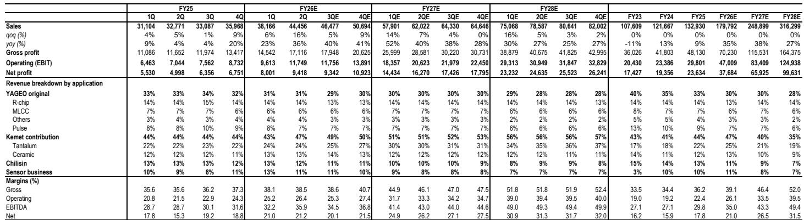
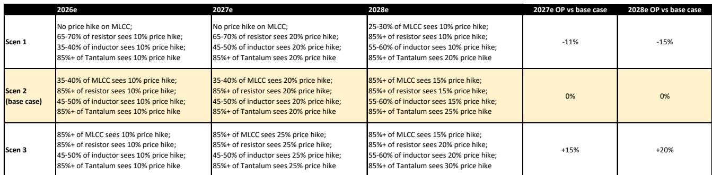
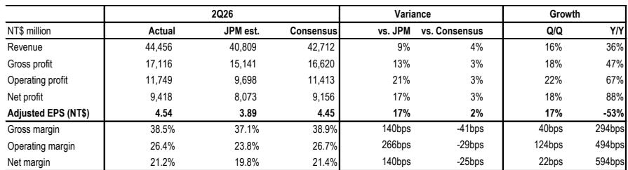

# 被动元件周期并未终结——而是正在向国巨转动

国巨公布的第二季度业绩大幅超出内部预测和市场一致预期：营收达445亿新台币，环比增长16%，同比增长36%；营业利润117亿新台币，环比增长22%；毛利率38.5%。然而，公司股价自6月高点以来已回落约50%，且第三季度指引为“温和增长”——市场解读为环比营收增长约5%——远低于市场预期的11%至12%。实际业绩与指引轨迹之间的落差，是读者需要厘清的核心矛盾。

市场将保守指引解读为定价超级周期正在消退的信号。更准确的解读是，国巨正在推进一个有意识的过渡：产能利用率在通用和高端两大板块均提升至90%至95%，库存天数从通常的120天降至约110天，公司正在为预计于第三季度在众多客户和产品中落实的涨价提前建立缓冲库存。积极前景并未破裂，只是形态发生了变化。

股价回调更多由仓位调整驱动，而非基本面变化。许多亚洲被动元件公司在6月高点后均出现约50%的回调，部分原因是读者从极度乐观的定价预期中重置，部分原因是中国大陆及周边二级和转售市场出现负面定价数据——这些渠道并不直接反映国巨的合约定价。目前股价约为2027年预期盈利的16倍，这一估值已包含对周期持续性的相当大怀疑。而这种怀疑恰恰创造了机会。

长期逻辑依然完整：人工智能正在被动元件行业制造结构性供应紧张，国巨凭借其在钽电容领域的全球领先地位、强大的MLCC和电阻业务，以及在北亚同行转向AI应用之际于中国大陆及周边通用IT市场新增强化的角色，成为主要受益者。周期并未结束，而是在向掌控高端产能和多元化终端市场敞口的公司转动。

## 第三季度指引看似保守，是因为国巨在主动提前布局定价周期，而非宣告其终结

财报中最关键的细节不是营收超预期，而是产能利用率轨迹。国巨指引第三季度通用和高端板块产能利用率均达90%至95%，高于第二季度的80%至85%。当一家制造商在仅指引5%环比营收增长的同时提高产能利用率，可能发生两种情况：要么公司在预期需求之前建立库存，要么在为不会立即体现在单位销量中的涨价做准备。

库存数据支持第一种解读，定价前景支持第二种。库存天数从通常的120天降至约110天，意味着国巨一直在消耗库存而非积累库存。第三季度利用率上升的指引，加上第二季度末库存天数下降，表明管理层正准备在预期涨价之前重建库存缓冲。公司并未排除对某些渠道的出货进行监控，这符合一个在供应趋紧市场中管理分配而非面临需求萎缩的供应商的行为。

市场对5%环比增长指引的失望，反映了一种预期——公司应当立即更多地捕捉上行周期。但销量增长与价格获取之间的区别至关重要。一个在定价上行周期中提高利用率并重建库存的供应商，其定位是在涨价生效时最大化单位收入，而非在当前价格下最大化单位销量。这是供应趋紧市场中理性参与者的行为，而非周期终结的公司。

## 定价情景分析显示，基准情形已包含可观的涨价幅度，风险偏向上行

研究框架为2026至2028年设定了三种定价情景。基准情形假设2026年35%至40%的MLCC涨价10%，2027年相同比例涨价20%，2028年超过85%的MLCC涨价15%。电阻、电感和钽电容遵循类似轨迹，其中钽电容定价最为激进：2026年超过85%的产品线涨价10%，2027年涨价20%，2028年涨价25%。

保守情景假设2026年和2027年MLCC不涨价，仅2028年25%至30%的MLCC涨价10%。激进情景假设2026年超过85%的MLCC涨价10%，2027年涨价25%。2027年营业利润在保守与激进情景之间的差异为26个百分点——从较基准情形低11%到高15%。这是一个较大的离散区间，也解释了为何股价相对历史估值存在显著折价。

对读者而言重要的是，基准情形并不激进。它假设的MLCC涨价幅度低于市场6月时的定价预期——当时许多读者认为基准情形偏保守。股价已回调约50%而基准情形假设未变，意味着市场现在定价的已接近保守情景。不对称性有利：下行情形已基本反映在股价中，而上行情形仅需公司执行两个月前仍被视为保守的定价假设即可实现。

报告的情景分析还揭示了一个重要的结构性观点：即使在保守情景下，营业利润到2028年仍有可观增长。情景之间的差异是上行周期的幅度，而非其存在性。这就是周期性峰值与结构性重估之间的区别。市场将当前状况视为前者，而证据越来越支持后者。

## 国巨的利润率扩张由产品组合和定价能力驱动，而非仅靠销量增长，这改变了盈利轨迹的质量

第二季度业绩表明，利润率扩张速度快于营收增长。毛利率环比扩大40个基点，同比扩大294个基点至38.5%。营业利润率环比扩大124个基点，同比扩大494个基点至26.4%。净利率环比扩大22个基点，同比扩大594个基点至21.2%。同比数据引人注目：营收增长36%，但营业利润增长67%，净利润增长88%。

这种经营杠杆并非单季现象。全年预估显示毛利率从2026年的39.1%扩大至2027年的46.4%和2028年的52.0%。营业利润率遵循类似轨迹：2026年26.1%，2027年33.5%，2028年39.5%。这些并非会回落的周期性峰值利润率。它们反映了高端被动元件定价能力的结构性转变，由AI对钽电容的需求以及过去十年MLCC和电阻市场的整合所驱动。

关键洞察在于，国巨的利润率扩张来自定价和产品组合，而非仅靠产能利用率。公司通过收购Kemet获得的钽电容市场主导地位，使其在一个AI服务器需要高可靠性且不易替代元件的市场中拥有定价能力。MLCC市场已整合为少数参与者，供应扩张纪律严明，这意味着涨价能够维持而非因竞争性供应响应而侵蚀。

盈利修正轨迹强化了这一观点。报告将2026年调整后每股盈利预估上调7.3%，从16.98新台币至18.22新台币；2027年预估上调5.2%，从30.22新台币至31.80新台币。2026年营收预估上调5%，2027年上调3%。盈利修正快于营收修正，证实利润率故事是研究逻辑的核心驱动力。

## 中国大陆及周边通用IT市场是被忽视的增长引擎，延长了周期的持续性

报告指出了一个未获足够关注的发展：随着北亚同行将重心转向AI应用，国巨在中国大陆及周边通用IT市场迅速获得了更突出的角色。这是AI建设带来的二阶效应，为国巨业务创造了自我强化的动力。

随着日本和韩国主要被动元件制造商将产能转向AI服务器和高端应用，他们实际上正在将通用IT市场——笔记本电脑、台式机、消费电子和主流服务器——让给国巨等能够填补空白的公司。这不是暂时性替代。它代表了竞争格局的永久性转变，因为北亚同行即使AI需求放缓也不太可能回归通用IT。聚焦AI的战略决策是一个多年期承诺，需要产能分配、工程资源和客户关系，这些都无法快速逆转。

对国巨而言，这创造了双引擎：通过钽电容和高端MLCC参与AI驱动的优质板块，同时在竞争对手退出之际获得通用IT板块的份额增长。通用IT市场提供销量稳定性和利用率支撑，而优质板块提供定价能力和利润率扩张。两者的结合平滑了营收波动，并将上行周期的持续时间延长至纯AI驱动周期所能支撑的范围之外。

因此，被动元件行业的供需平衡比市场认知的更为持久。AI建设正在高端吸收产能，而竞争对手退出通用IT正在主流层面收紧供应。这两个动态都有利于国巨，且两者都是结构性的而非周期性的。

## 读者的决策框架：区分二级市场的价格发现与价格破坏

6月后亚洲被动元件股的急剧回调，造成了关于定价信号实际含义的困惑。来自中国大陆及周边地区的一些负面定价数据点——尤其是二级和转售市场——被解读为定价周期见顶的证据。这种解读混淆了两个不同的市场：交易商买卖元件的现货市场，以及国巨等主要制造商与直接客户设定价格的合约市场。

二级市场是过剩库存被吸收、投机头寸被平仓的地方。当AI相关需求在2025年末和2026年初激增时，被动元件二级市场价格因交易商预期短缺而飙升。这些价格的回落反映了投机头寸的解除，而非制造商与客户之间合约价格的变化。报告明确指出，这些二级市场数据点与国巨及其他被动元件制造商并无直接关联。

因此，读者的决策框架应聚焦三个问题。第一，合约价格是否持稳或上升？证据显示如此，报告预计未来数周行业将出现新一轮涨价动态。第二，利用率在上升还是下降？国巨第三季度90%至95%的利用率指引表明利用率在上升。第三，库存是在重建还是清算？库存降至110天，加上利用率指引上升，表明公司正准备在涨价前重建库存。

当这三个信号均为正面时，二级市场价格的回落是干扰而非信号。股价回落至2027年预期盈利的16倍，是积累一家在通用IT领域获得份额、在高端板块维持定价能力并以上升利用率运营的公司的机会。市场正在定价保守情景，而证据越来越支持基准情形，且基准情形本身已包含可观的盈利增长。

最后的考虑是估值纪律。以2027年预期盈利的16倍计算，股价已定价了当前轨迹并不支持的显著盈利增长减速。盈利预估显示调整后每股盈利从2026年的18.22新台币增长至2027年的31.80新台币和2028年的48.06新台币——增长率分别为75%和51%。即使保守定价情景也不会消除这一增长；它只是降低了增长幅度。已定价的下行风险与可实现的上行空间之间的不对称性，正是当前水平对十二个月或更长持有期的读者具有吸引力的原因。

*仅供参考。部分内容可能基于原始材料由AI辅助生成、翻译、总结或编辑，可能包含遗漏或错误。请独立核实。本文不构成投资、法律、税务、会计或其他专业建议。*

仅供参考。部分内容可能基于原始材料由AI辅助生成、翻译、总结或编辑，可能包含遗漏或错误。请独立核实。本文不构成投资、法律、税务、会计或其他专业建议。

