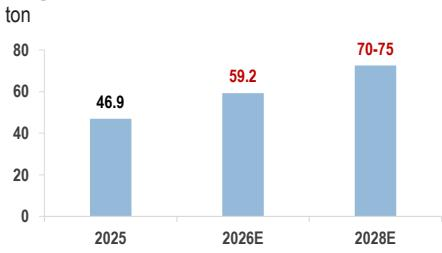
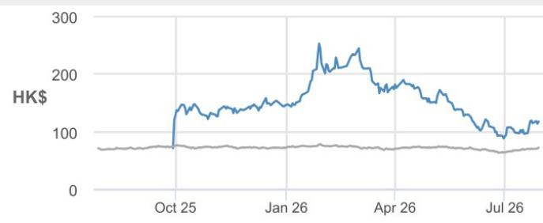
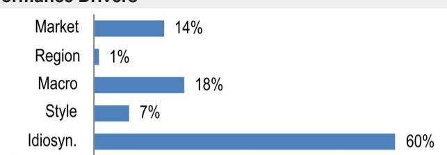

## 紫金黄金国际 - H

## Allied Gold事项落定；在进一步并购之前，内生爬产将支撑增长

Allied Gold与紫金黄金于7月29日宣布终止紫金黄金对Allied Gold的收购（链接），同时紫金黄金同意认购约2.95亿美元的Allied股份，预计完成后持股约9.2%。我们认为，交易无法完成的风险已在前期报价中有所反映（自5月以来相对同业表现落后约20%）。即便剔除Allied Gold的贡献并按当前金价重估，紫金黄金的估值仍具吸引力，对应FY27E市盈率约13倍。因此，我们认为交易终止可视为压制因素的解除。剔除Allied后，我们仍预计紫金黄金的内生矿山增长将支撑产量从2026年的59.2吨（含Porgera）提升至2028年的70-75吨。随着金价回调，我们预计进一步并购的可能性在增加，紫金黄金仍有望实现2030年100吨的长期产量目标。维持增持评级。

- 收购终止。紫金黄金与Allied Gold宣布终止紫金黄金对Allied Gold的收购协议，双方认为在2026年7月29日的外部截止日期或此后合理时间内，交割条件无法满足的可能性较大。两家公司提及适用于此类规模跨境交易的更广泛外部因素。与此同时，紫金黄金同意以每股C$32.55认购约1,280万股Allied股份，总对价约2.95亿美元（约C$4.17亿），完成后持股约9.2%。该战略投资预计于2026年8月10日前后完成交割，尚需TSX和NYSE批准，并附有惯例参与权和增购权。

- 内生爬产支撑2028年目标。将Allied Gold的四个矿山从预测中剔除后，我们预计紫金黄金2026-28年黄金产量分别为59吨、64吨和73吨。因此，我们下调FY26-28年盈利预测12-32%，并将Dec-27目标价下调至HK$146，对应FY27E市盈率16.5倍。尽管剔除Allied贡献后我们下调了盈利预测，但我们维持增持评级，并对紫金黄金的长期增长前景保持建设性看法。我们认为，内生爬产仍在正轨，估值仍不贵。在后续并购公告之前，加息预期和金价是更强的报价驱动因素，公司正朝着长期产量目标推进。

## 增持

2259.HK，2259 HK
报价（2026年7月29日）：HK$117.70

▼目标价（2027年12月）：HK$146.00
此前（2027年12月）：HK$170.00

## 亚洲基础材料

Avery Chan AC
(852) 2800-8659
avery.chan@JPM.com

Sabrina Liu
(852) 2800-8535
sabrina.liu@JPM.com

Frankie Fong
(852) 2800-8574
frankie.fong@JPM.com
JPM Securities (Asia Pacific) Limited / JPM Broking (Hong Kong) Limited

<table><tr><td colspan="4">主要变动（FYE Dec）</td></tr><tr><td></td><td>此前</td><td>当前</td><td>Δ</td></tr><tr><td>调整后每股收益 - 26E（$）</td><td>1.25</td><td>1.10</td><td>-11.6%</td></tr><tr><td>调整后每股收益 - 27E（$）</td><td>1.67</td><td>1.14</td><td>-31.9%</td></tr></table>

## 风格暴露

<table><tr><td rowspan="2">量化因子</td><td rowspan="2">当前%排名</td><td colspan="4">历史%排名（1=最高）</td></tr><tr><td>6个月</td><td>1年</td><td>3年</td><td>5年</td></tr><tr><td>价值</td><td>78</td><td>90</td><td>85</td><td>84</td><td></td></tr><tr><td>成长</td><td>20</td><td>9</td><td>8</td><td></td><td></td></tr><tr><td>动量</td><td>82</td><td></td><td></td><td></td><td></td></tr><tr><td>质量</td><td>34</td><td>58</td><td>11</td><td></td><td></td></tr><tr><td>低波动</td><td>92</td><td>82</td><td></td><td></td><td></td></tr></table>

图1：紫金黄金：黄金产量目标

  
来源：公司数据，JPM预测。

报价表现  

— 2259.HK报价（HK$） — 恒生指数（重置）

<table><tr><td></td><td>年初至今</td><td>1个月</td><td>3个月</td><td>12个月</td></tr><tr><td>相对</td><td>-19.4%</td><td>26.6%</td><td>-25.4%</td><td>-</td></tr><tr><td>相对</td><td>-20.1%</td><td>14.5%</td><td>-24.2%</td><td>-</td></tr></table>

公司数据

<table><tr><td>流通股数（百万）</td><td>2,676</td></tr><tr><td>52周区间（HK$）</td><td>268.00-84.20</td></tr><tr><td>市值（百万美元）</td><td>40,175</td></tr><tr><td>汇率</td><td>7.84</td></tr><tr><td>自由流通比例（%）</td><td>13.9%</td></tr><tr><td>3个月日均成交量（百万股）</td><td>8.46</td></tr><tr><td>3个月日均成交额（百万美元）</td><td>128.9</td></tr><tr><td>波动率（90日）</td><td>73</td></tr><tr><td>指数</td><td>恒生指数</td></tr><tr><td>彭博分析师评级（买入|持有|卖出）</td><td>15|1|0</td></tr></table>

关键指标（FYE Dec）

<table><tr><td>百万美元</td><td>FY25A</td><td>FY26E</td><td>FY27E</td><td>FY28E</td></tr><tr><td colspan="5">财务预测</td></tr><tr><td>营业收入</td><td>5,383</td><td>7,996</td><td>8,286</td><td>10,018</td></tr><tr><td>EBITDA</td><td>3,200</td><td>5,296</td><td>5,434</td><td>6,659</td></tr><tr><td>调整后EBITDA</td><td>3,200</td><td>5,296</td><td>5,434</td><td>6,659</td></tr><tr><td>调整后EBIT</td><td>2,791</td><td>4,795</td><td>4,890</td><td>6,020</td></tr><tr><td>调整后净利润</td><td>1,532</td><td>2,955</td><td>3,047</td><td>3,798</td></tr><tr><td>净利润</td><td>1,602</td><td>2,912</td><td>3,003</td><td>3,754</td></tr><tr><td>调整后每股收益</td><td>0.57</td><td>1.10</td><td>1.14</td><td>1.42</td></tr><tr><td>彭博每股收益</td><td>0.63</td><td>1.33</td><td>1.51</td><td>1.58</td></tr><tr><td>净债务</td><td>(2,963)</td><td>(858)</td><td>(2,850)</td><td>(5,401)</td></tr><tr><td>经营活动现金流</td><td>2,400</td><td>3,446</td><td>3,964</td><td>4,553</td></tr><tr><td>投资活动现金流</td><td>(4,840)</td><td>(5,000)</td><td>(1,000)</td><td>(1,000)</td></tr><tr><td>FCFF</td><td>1,780</td><td>2,446</td><td>2,964</td><td>3,553</td></tr><tr><td colspan="5">利润率与增长</td></tr><tr><td>收入同比增长（%）</td><td>80.1%</td><td>48.5%</td><td>3.6%</td><td>20.9%</td></tr><tr><td>EBITDA同比增长（%）</td><td>131.4%</td><td>65.5%</td><td>2.6%</td><td>22.5%</td></tr><tr><td>调整后每股收益增长</td><td>(37.0%)</td><td>92.9%</td><td>3.1%</td><td>24.6%</td></tr><tr><td colspan="5">比率</td></tr><tr><td>调整后税率</td><td>32.0%</td><td>29.2%</td><td>28.7%</td><td>29.5%</td></tr><tr><td>净债务/EBITDA</td><td>NM</td><td>NM</td><td>NM</td><td>NM</td></tr><tr><td>ROCE</td><td>31.4%</td><td>33.2%</td><td>28.0%</td><td>28.5%</td></tr><tr><td>ROE</td><td>28.6%</td><td>30.9%</td><td>25.8%</td><td>26.7%</td></tr><tr><td colspan="5">估值</td></tr><tr><td>FCFF回报表现</td><td>4.4%</td><td>6.1%</td><td>7.4%</td><td>8.8%</td></tr><tr><td>股息率</td><td>1.3%</td><td>2.3%</td><td>2.4%</td><td>3.0%</td></tr><tr><td>EV/收入</td><td>7.0</td><td>4.5</td><td>4.2</td><td>3.3</td></tr><tr><td>EV/EBITDA</td><td>11.8</td><td>6.9</td><td>6.4</td><td>4.9</td></tr><tr><td>调整后市盈率</td><td>26.2</td><td>13.6</td><td>13.2</td><td>10.6</td></tr><tr><td>市净率</td><td>4.8</td><td>3.7</td><td>3.1</td><td>2.6</td></tr></table>

## 投资论点与估值摘要

## 投资论点

紫金黄金作为紫金矿业的子公司，通过并购和资源扩张建立了强劲的增长平台，2023年至2025年黄金产量复合年增长率达15%。公司在四大洲运营九座矿山，正在关键矿区扩建产能，2028年黄金产量目标为70-75吨。紫金黄金审慎的并购策略推动资本效率持续提升，ROLTA从2024年的12%升至2025年的29%。在金价前景有利和增长管道强劲的背景下，我们预测2025年至2028年盈利复合年增长率为33%。我们给予增持评级，2027年12月目标价为HK$146。

## 估值

我们2027年12月的目标价HK$146基于DCF估值，WACC为8.5%，永续增长率为2.5%。目标价对应FY27E市盈率16.5倍，FY27E EV/EBITDA 9倍。

表现驱动因素  

<table><tr><td>因子</td><td>6个月相关性</td><td>1年相关性</td></tr><tr><td>市场：MSCI亚太（除日本）</td><td>0.53</td><td>0.36</td></tr><tr><td>地区：香港</td><td>0.34</td><td>0.11</td></tr><tr><td colspan="3">宏观：</td></tr><tr><td>JPM GBI-EM全球股息</td><td>0.43</td><td>0.31</td></tr><tr><td>JPM新兴市场货币（EMCI）定盘</td><td>0.39</td><td>0.23</td></tr><tr><td>恒生波动率指数</td><td>-0.06</td><td>0.18</td></tr><tr><td colspan="3">量化风格：</td></tr><tr><td>规模</td><td>-0.38</td><td>-0.34</td></tr><tr><td>成长</td><td>-0.29</td><td>-0.30</td></tr><tr><td>价值</td><td>0.20</td><td>0.24</td></tr></table>

# 投资论点、估值与风险

紫金黄金国际 - H（增持；目标价：HK$146.00）

## 投资论点

紫金黄金作为紫金矿业的子公司，通过并购和资源扩张建立了强劲的增长平台，2023年至2025年黄金产量复合年增长率达15%。公司在四大洲运营九座矿山，正在关键矿区扩建产能，2028年黄金产量目标为70-75吨。紫金黄金审慎的并购策略推动资本效率持续提升，ROLTA从2024年的12%升至2025年的29%。在金价前景有利和增长管道强劲的背景下，我们预测2025年至2028年盈利复合年增长率为33%。我们给予增持评级，2027年12月目标价为HK$146。

## 估值

我们2027年12月的目标价HK$146基于DCF估值，WACC为8.5%，永续增长率为2.5%。目标价对应FY27E市盈率16.5倍，FY27E EV/EBITDA 9倍。

## 评级与目标价的风险

我们评级和目标价的主要下行风险包括：1）金价波动；2）因涉及多个境外司法管辖区而产生的运营风险、项目施工延期以及哥伦比亚Buriticá金矿的非法采矿活动；3）矿产品实际实现价格低于预期。

紫金黄金国际 - H：财务摘要

<table><tr><td>利润表</td><td>FY24A</td><td>FY25A</td><td>FY26E</td><td>FY27E</td><td>FY28E</td></tr><tr><td>营业收入</td><td>2,990</td><td>5,383</td><td>7,996</td><td>8,286</td><td>10,018</td></tr><tr><td>营业成本</td><td>(1,856)</td><td>(2,547)</td><td>(3,045)</td><td>(3,301)</td><td>(3,873)</td></tr><tr><td>毛利润</td><td>1,134</td><td>2,837</td><td>4,952</td><td>4,985</td><td>6,146</td></tr><tr><td>销售及管理费用</td><td>(141)</td><td>(214)</td><td>(318)</td><td>(322)</td><td>(379)</td></tr><tr><td>调整后EBITDA</td><td>1,383</td><td>3,200</td><td>5,296</td><td>5,434</td><td>6,659</td></tr><tr><td>折旧与摊销</td><td>(412)</td><td>(409)</td><td>(501)</td><td>(544)</td><td>(638)</td></tr><tr><td>调整后EBIT</td><td>971</td><td>2,791</td><td>4,795</td><td>4,890</td><td>6,020</td></tr><tr><td>净利息</td><td>(34)</td><td>(37)</td><td>(35)</td><td>(35)</td><td>(35)</td></tr><tr><td>调整后税前利润</td><td>937</td><td>2,754</td><td>4,760</td><td>4,855</td><td>5,986</td></tr><tr><td>税项</td><td>(316)</td><td>(882)</td><td>(1,388)</td><td>(1,392)</td><td>(1,768)</td></tr><tr><td>少数股东权益</td><td>(139)</td><td>(271)</td><td>(460)</td><td>(461)</td><td>(463)</td></tr><tr><td>调整后净利润</td><td>496</td><td>1,532</td><td>2,955</td><td>3,047</td><td>3,798</td></tr><tr><td>报告每股收益</td><td>0.88</td><td>0.60</td><td>1.09</td><td>1.12</td><td>1.40</td></tr><tr><td>调整后每股收益</td><td>0.91</td><td>0.57</td><td>1.10</td><td>1.14</td><td>1.42</td></tr><tr><td>每股股息</td><td>0.00</td><td>0.19</td><td>0.35</td><td>0.36</td><td>0.45</td></tr><tr><td>派息率</td><td>0.0%</td><td>32.2%</td><td>32.2%</td><td>32.2%</td><td>32.2%</td></tr><tr><td>流通股数</td><td>546</td><td>2,676</td><td>2,676</td><td>2,676</td><td>2,676</td></tr><tr><td>资产负债表</td><td>FY24A</td><td>FY25A</td><td>FY26E</td><td>FY27E</td><td>FY28E</td></tr><tr><td>现金及现金等价物</td><td>241</td><td>3,617</td><td>1,512</td><td>3,504</td><td>6,054</td></tr><tr><td>应收账款</td><td>118</td><td>217</td><td>322</td><td>333</td><td>403</td></tr><tr><td>存货</td><td>437</td><td>682</td><td>816</td><td>885</td><td>1,038</td></tr><tr><td>其他流动资产</td><td>958</td><td>1,497</td><td>2,026</td><td>2,138</td><td>2,553</td></tr><tr><td>流动资产合计</td><td>1,201</td><td>5,116</td><td>3,540</td><td>5,645</td><td>8,610</td></tr><tr><td>固定资产</td><td>2,534</td><td>3,737</td><td>4,236</td><td>4,692</td><td>5,054</td></tr><tr><td>长期投资</td><td>-</td><td>-</td><td>-</td><td>-</td><td>-</td></tr><tr><td>其他非流动资产</td><td>173</td><td>604</td><td>4,604</td><td>4,604</td><td>4,604</td></tr><tr><td>总资产</td><td>5,403</td><td>12,567</td><td>15,490</td><td>18,051</td><td>21,379</td></tr><tr><td>短期借款</td><td>131</td><td>180</td><td>180</td><td>180</td><td>180</td></tr><tr><td>应付款项</td><td>245</td><td>345</td><td>413</td><td>447</td><td>525</td></tr><tr><td>其他短期负债</td><td>579</td><td>727</td><td>727</td><td>727</td><td>727</td></tr><tr><td>流动负债合计</td><td>955</td><td>1,251</td><td>1,319</td><td>1,354</td><td>1,431</td></tr><tr><td>长期债务</td><td>601</td><td>474</td><td>474</td><td>474</td><td>474</td></tr><tr><td>其他长期负债</td><td>1,546</td><td>2,421</td><td>2,421</td><td>2,421</td><td>2,421</td></tr><tr><td>总负债</td><td>2,501</td><td>3,672</td><td>3,740</td><td>3,775</td><td>3,852</td></tr><tr><td>股东权益</td><td>2,325</td><td>8,374</td><td>10,770</td><td>12,835</td><td>15,622</td></tr><tr><td>少数股东权益</td><td>577</td><td>521</td><td>980</td><td>1,441</td><td>1,904</td></tr><tr><td>总负债及权益</td><td>5,403</td><td>12,567</td><td>15,490</td><td>18,051</td><td>21,379</td></tr><tr><td>每股净资产</td><td>4.26</td><td>3.13</td><td>4.02</td><td>4.80</td><td>5.84</td></tr><tr><td>同比增长</td><td>15.5%</td><td>(26.5%)</td><td>28.6%</td><td>19.2%</td><td>21.7%</td></tr><tr><td>净债务/（现金）</td><td>492</td><td>(2,963)</td><td>(858)</td><td>(2,850)</td><td>(5,401)</td></tr></table>

来源：公司报告和JPM预测。

<table><tr><td>现金流量表</td><td>FY24A</td><td>FY25A</td><td>FY26E</td><td>FY27E</td><td>FY28E</td></tr><tr><td>经营活动现金流</td><td>876</td><td>2,400</td><td>3,446</td><td>3,964</td><td>4,553</td></tr><tr><td>其中：折旧与摊销</td><td>412</td><td>409</td><td>501</td><td>544</td><td>638</td></tr><tr><td>其中：营运资金变动</td><td>(117)</td><td>(438)</td><td>(461)</td><td>(78)</td><td>(338)</td></tr><tr><td>投资活动现金流</td><td>(400)</td><td>(4,840)</td><td>(5,000)</td><td>(1,000)</td><td>(1,000)</td></tr><tr><td>其中：资本开支</td><td>(487)</td><td>(620)</td><td>(1,000)</td><td>(1,000)</td><td>(1,000)</td></tr><tr><td>占收入比例</td><td>16.3%</td><td>11.5%</td><td>12.5%</td><td>12.1%</td><td>10.0%</td></tr><tr><td>融资活动现金流</td><td>(397)</td><td>5,816</td><td>(551)</td><td>(973)</td><td>(1,002)</td></tr><tr><td>其中：已付股息</td><td>(127)</td><td>(37)</td><td>(551)</td><td>(973)</td><td>(1,002)</td></tr><tr><td>其中：发行/（回购）股份</td><td>0</td><td>6,651</td><td>0</td><td>0</td><td>0</td></tr><tr><td>其中：净债务发行/（偿还）</td><td>(60)</td><td>0</td><td>0</td><td>0</td><td>0</td></tr><tr><td>现金净变动</td><td>80</td><td>3,376</td><td>(2,105)</td><td>1,992</td><td>2,551</td></tr><tr><td>调整后自由现金流（公司）</td><td>389</td><td>1,780</td><td>2,446</td><td>2,964</td><td>3,553</td></tr><tr><td>同比增长</td><td>(20.2%)</td><td>357.1%</td><td>37.4%</td><td>21.2%</td><td>19.9%</td></tr><tr><td>比率分析</td><td>FY24A</td><td>FY25A</td><td>FY26E</td><td>FY27E</td><td>FY28E</td></tr><tr><td>毛利率</td><td>37.9%</td><td>52.7%</td><td>61.9%</td><td>60.2%</td><td>61.3%</td></tr><tr><td>EBITDA利润率</td><td>46.3%</td><td>59.4%</td><td>66.2%</td><td>65.6%</td><td>66.5%</td></tr><tr><td>EBIT利润率</td><td>32.5%</td><td>51.8%</td><td>60.0%</td><td>59.0%</td><td>60.1%</td></tr><tr><td>净利润率</td><td>16.6%</td><td>28.5%</td><td>37.0%</td><td>36.8%</td><td>37.9%</td></tr><tr><td>ROE</td><td>22.9%</td><td>28.6%</td><td>30.9%</td><td>25.8%</td><td>26.7%</td></tr><tr><td>ROA</td><td>9.4%</td><td>17.1%</td><td>21.1%</td><td>18.2%</td><td>19.3%</td></tr><tr><td>ROCE</td><td>22.2%</td><td>31.4%</td><td>33.2%</td><td>28.0%</td><td>28.5%</td></tr><tr><td>销售及管理费用/收入</td><td>4.7%</td><td>4.0%</td><td>4.0%</td><td>3.9%</td><td>3.8%</td></tr><tr><td>净债务/权益</td><td>0.2</td><td>NM</td><td>NM</td><td>NM</td><td>NM</td></tr><tr><td>净债务/EBITDA</td><td>0.4</td><td>NM</td><td>NM</td><td>NM</td><td>NM</td></tr><tr><td>收入/总资产（倍）</td><td>0.6</td><td>0.6</td><td>0.6</td><td>0.5</td><td>0.5</td></tr><tr><td>总资产/权益（倍）</td><td>2.4</td><td>1.7</td><td>1.5</td><td>1.4</td><td>1.4</td></tr><tr><td>利息保障倍数（倍）</td><td>40.6</td><td>86.4</td><td>151.7</td><td>155.6</td><td>190.7</td></tr><tr><td>经营杠杆</td><td>349.2%</td><td>234.2%</td><td>147.9%</td><td>55.2%</td><td>110.5%</td></tr><tr><td>税率</td><td>33.8%</td><td>32.0%</td><td>29.2%</td><td>28.7%</td><td>29.5%</td></tr><tr><td>收入同比增长</td><td>32.2%</td><td>80.1%</td><td>48.5%</td><td>3.6%</td><td>20.9%</td></tr><tr><td>EBITDA同比增长</td><td>60.9%</td><td>131.4%</td><td>65.5%</td><td>2.6%</td><td>22.5%</td></tr><tr><td>每股收益同比增长</td><td>105.9%</td><td>(37.0%)</td><td>92.9%</td><td>3.1%</td><td>24.6%</td></tr><tr><td>估值</td><td>FY24A</td><td>FY25A</td><td>FY26E</td><td>FY27E</td><td>FY28E</td></tr><tr><td>市盈率（倍）</td><td>16.5</td><td>26.2</td><td>13.6</td><td>13.2</td><td>10.6</td></tr><tr><td>市净率（倍）</td><td>3.5</td><td>4.8</td><td>3.7</td><td>3.1</td><td>2.6</td></tr><tr><td>EV/EBITDA（倍）</td><td>29.8</td><td>11.8</td><td>6.9</td><td>6.4</td><td>4.9</td></tr><tr><td>股息率</td><td>0.0%</td><td>1.3%</td><td>2.3%</td><td>2.4%</td><td>3.0%</td></tr></table>

分析师认证：本报告封面标注“AC”的研究分析师证明（或，若多位研究分析师主要负责本报告，则封面或文内标注“AC”的研究分析师分别就其在本研究中覆盖的每只证券或发行人证明）：(1) 本报告中表达的所有观点准确反映了研究分析师对任何及所有标的证券或发行人的个人观点；(2) 研究分析师的任何部分薪酬过去、现在或将来均不会直接或间接与本报告中研究分析师表达的具体建议或观点相关。对于封面列出的所有韩国研究分析师（如适用），其亦根据KOFIA要求证明，研究分析师的分析系基于善意作出，观点反映研究分析师自身意见，未受不当影响或干预。

本报告所列所有作者均为独立开展研究的研究分析师，除非另有说明。在欧洲，行业专家（销售与交易）可能作为联系人出现在本报告中，但并非报告作者或研究部门成员。

## 重要披露

- 做市商/流动性提供者：JPM是紫金黄金国际 - H或相关实体金融工具的做市商和/或流动性提供者。

- 做市商/流动性提供者（香港）：JPM Securities (Asia Pacific) Limited及/或JPM Broking (Hong Kong) Limited及/或关联公司是紫金黄金国际 - H或相关实体及/或其权证或期权的做市商和/或流动性提供者，该等证券在香港联合交易所有限公司上市或交易。

- 客户：JPM目前拥有，或在过去12个月内拥有以下实体作为客户：紫金黄金国际 - H或相关实体。

- 客户/非投资银行、证券相关：JPM目前拥有，或在过去12个月内拥有以下实体作为客户，且所提供的服务为非投资银行、证券相关服务：紫金黄金国际 - H或相关实体。

- 非投资银行报酬：JPM在过去12个月内因紫金黄金国际 - H或相关实体的产品或服务（投资银行服务除外）收取了报酬。

- 债务头寸：JPM可能持有紫金黄金国际 - H或相关实体的债务证券头寸（如有）。

公司特定披露：JPM目前并寻求与其研究报告所覆盖的公司开展业务。因此，读者应注意，本公司可能存在利益冲突，可能影响本报告的客观性。读者应仅将本报告视为其决策的单一因素。重要披露（包括价格图表和信用意见历史表（如适用））可在https://www.jpmm.com/research/disclosures查阅，或致电1-800-477-0406，或发送邮件至research.disclosure.inquiries@J
