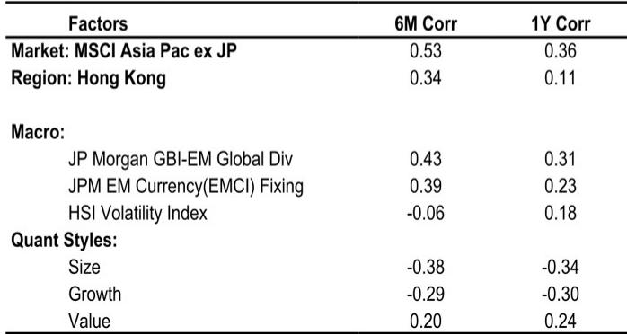
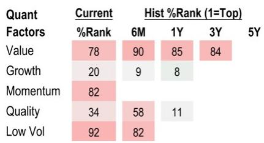

# 不确定性消退，增长逻辑未变：紫金黄金终止收购后，百吨目标的路径依然清晰

紫金黄金国际于7月29日决定放弃对Allied Gold的收购计划，转而以2.95亿美元战略认购其约9.2%的股份。这一决定消除了压制公司报价的最大不确定性，但并未动摇其增长逻辑。市场此前已对交易可能失败有所预期，自5月以来公司报价跑输同业黄金公司约20%。因此，终止交易与其说是负面意外，不如说是重新定价的契机：即便剔除Allied的贡献并按当前金价重新评估，公司报价仍对应FY27E约13倍的水平。对于一家有望在2030年实现年产黄金100吨的公司而言，这一估值并不算高。

研究逻辑已从依赖交易驱动增长转向依靠运营兑现。剔除Allied的四座矿山后，紫金黄金的内生爬产预计将使产量从2026年的59.2吨提升至2028年的70-75吨。这并非收购失败后的安慰奖，而是公司价值主张的核心引擎。事实上，交易失败反而强化了审慎资本配置的说服力。与其为一项面临难以逾越交割条件的跨境收购支付过高溢价，紫金黄金以少数股权方式在Allied获得战略立足点，既保留了灵活性，又规避了黄金行业并购中常见的整合风险。

当前的关键在于，市场是会以更高倍数回报运营执行力，还是会继续折价，直到下一次并购公告出现。从公司财务轨迹来看——收入从FY24的29.9亿美元增长至FY26预计的79.96亿美元，净利率从16.6%扩大至预计的37.0%——答案更可能是前者。市场对公司报价年初至今19.4%的回调所体现的观望情绪，在金价保持支撑的背景下，或许正在为长期机构参与者提供一个值得关注的窗口期。

## 失败已被定价，终止成为积极催化而非负面意外

市场对交易告吹的反应说明了问题。自5月以来，紫金黄金报价跑输黄金同业约20%，这一折价反映了市场对交易无法完成的概率上升的预期。到7月29日终止公告发布时，交易失败的风险已大部分反映在报价中。随后宣布的2.95亿美元战略投资Allied Gold——以每股C$32.55认购约1280万股——提供了建设性的解决方案，而非简单切割。

这一安排之所以重要，有两方面原因。第一，它保留了与Allied资产的关联，同时无需承担完全所有权的运营和监管负担。第二，它表明紫金黄金管理层仍致力于通过外部机会实现增长，但前提是条款具有战略合理性。认购协议包含惯例的参与权和增持权，为紫金黄金在情况允许时提供了增持的机制。这是审慎资本配置者的行为，而非急于求成的买家。

公司报价一个月内26.6%的反弹表明市场正开始认识到这一区别。然而，报价三个月内仍下跌25.4%，年初至今下跌19.4%，说明重新定价尚未完成。当前估值与内在增长潜力之间的差距——2025至2028年预计盈利复合增长率33%——正是值得关注的窗口。交易终止消除了此前压制估值的二元风险；剩下的只是每家成长型矿企都面临的执行风险，这是一个更可控的问题。

## 内生产量增长而非并购，将驱动2028年70-75吨目标

剥离并购叙事，底层运营故事依然扎实。剔除Allied的四座矿山，紫金黄金产量预计将从2026年的59.2吨增长至2027年的64吨和2028年的73吨。这一内生爬产依托于公司横跨四大洲的九座矿山现有组合，关键矿区的产能扩建正在进行中。2028年70-75吨的目标不依赖进一步交易；它是对现有项目实现满产的函数。

财务预测支持这一运营视角。收入预计从FY25的53.83亿美元增长至FY27的82.86亿美元和FY28的100.18亿美元。更值得注意的是，EBITDA利润率预计同期从59.4%扩大至66.5%，反映出固定成本摊薄带来的运营杠杆效应。公司资本回报率从FY24的22.2%提升至FY25的31.4%，表明增长是在资本效率改善而非回报递减的情况下实现的。

市场对Allied交易失败的关注掩盖了这一运营动能。但数据是明确的：紫金黄金的内生增长引擎完好无损，修订后的盈利预测——剔除Allied贡献后FY26-28下调12-32%——仍意味着公司对应FY26E约13.6倍、FY28E约10.6倍。对于一家2023至2025年产量复合增长率15%、且2030年百吨路径清晰的公司而言，这一估值并不算高；甚至可以认为偏低了。

## 资产负债表为未来并购提供弹药，但仅在条款有利时出手

Allied交易失败的一个被低估的后果是紫金黄金资产负债表的实力。公司FY25期末净现金为29.63亿美元，对于一家持续收购资产的黄金矿企而言，这是相当突出的位置。即便计入对Allied的2.95亿美元战略投资和FY26预计50亿美元的投资性现金流，公司预计到2026年底仍将维持8.58亿美元的净现金头寸，到FY28年将增至54.01亿美元。

在黄金资产价格随金价从近期高位回落而可能变得更具吸引力的背景下，这种财务灵活性是一项战略资产。报告明确指出，随着金价回调，进一步并购的可能性在增加，而紫金黄金的资产负债表使其能够在机会出现时果断行动。公司过往记录——2023至2025年通过并购和储量扩张实现黄金产量15%的复合增长率——表明管理层懂得如何有效配置资本。

关键洞察在于：紫金黄金不需要通过并购来增长，但可以通过并购来加速。到2028年实现70-75吨的内生路径已经确定。任何额外的并购都将是增量而非必需。这是整合者的最优位置：有能力保持选择性，对不达标交易说“不”，并等待反映价值而非急迫的价格。从这个角度看，Allied收购失败不是挫折，而是纪律的体现。

## 读者决策框架：在紫金黄金修订后的展望中区分信号与噪音

对于在Allied终止后评估紫金黄金的读者而言，分析挑战在于区分失败交易的噪音与底层业务的信号。一个结构化的框架可以提供帮助。第一个考量是估值：对应FY27E约13.2倍和EV/EBITDA约6.4倍，公司报价定价的是温和增长，而非其预计将实现的33%盈利复合增长率。第二个是增长引擎的质量：内生产量爬产、利润率改善和资本回报率提升都指向一个效率不断提升而非下降的业务。

第三个考量是资产负债表。FY25期末净现金29.63亿美元，预计到FY28年增至54.01亿美元，提供了很少有黄金矿企能匹敌的安全边际。这不是一家需要通过增发或高成本债务来为增长融资的公司；它能够自筹资本开支——FY28年前每年10亿美元——并持续积累现金。股息率预计从FY25的1.3%升至FY28的3.0%，这是当前估值尚未充分反映的额外股东回报来源。

最后一个考量是风险。报告指出金价波动、多个海外司法辖区的运营风险以及项目建设延期是主要下行风险。哥伦比亚的Buriticá金矿因非法采矿活动历史而成为需要关注的特定运营问题。但这些风险并非新问题，且已大部分反映在公司报价相对同业的折价中。对读者而言，问题在于当前估值下的风险调整后回报，相对于黄金板块和更广泛市场的替代选择是否具有吸引力。现有证据表明答案是肯定的。

## 2030年百吨路径依然完整，失败交易反而强化了兑现能力

紫金黄金的长期逻辑建立在2030年百吨产量目标之上。这一目标——大致相当于当前产量的两倍——需要内生增长和战略并购共同推动。Allied交易的失败不会偏离这一轨迹；它只是推迟了该特定资产组合的贡献。公司现有组合——横跨四大洲的九座矿山及关键矿区产能扩建——为2028年达到70-75吨提供了基础。到百吨的剩余缺口需要通过进一步并购来填补，而公司的资产负债表在合适机会出现时具备充分执行能力。

市场对Allied终止的反应——先跌后一个月内反弹26.6%——表明读者正开始理解这一动态。即便在反弹之后，公司报价的估值仍不显高。关键变量在于管理层能否执行内生增长计划，并保持迄今为止其资本配置所体现的纪律性。

Allied收购的失败，悖论性地，可能成为紫金黄金报价所能发生的最好的事情。它消除了压制估值的确定性风险，展示了管理层对不达标交易说“不”的意愿，并保留了资产负债表以捕捉更具吸引力的机会。从这一事件中走出来的公司更精干、更专注，也更有能力兑现其长期产量目标。对于能够穿透失败交易噪音的读者而言，信号是清晰的：紫金黄金是一家以合理估值交易、拥有可信增长路径的优质黄金矿企。

*仅供参考。部分内容可能基于原始材料经AI辅助生成、翻译、摘要或编辑，可能存在遗漏或错误。请独立核实。本文不构成投资、法律、税务、会计或其他专业建议。*

仅供参考。部分内容可能基于原始材料经AI辅助生成、翻译、摘要或编辑，可能存在遗漏或错误。请独立核实。本文不构成投资、法律、税务、会计或其他专业建议。

