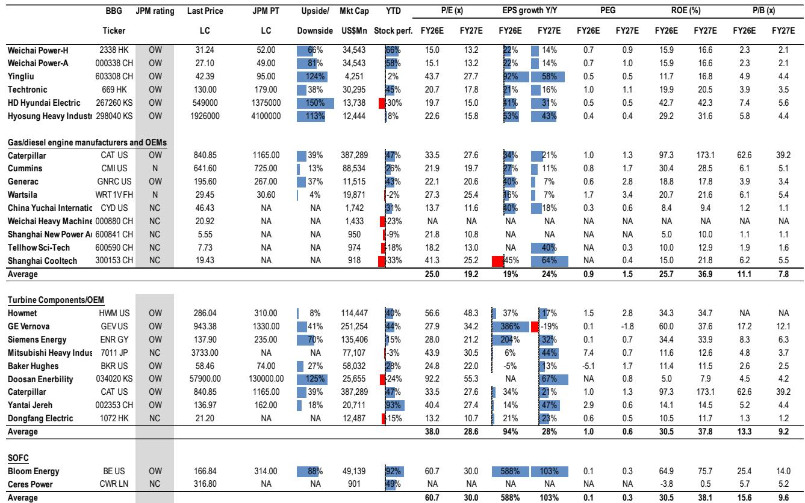
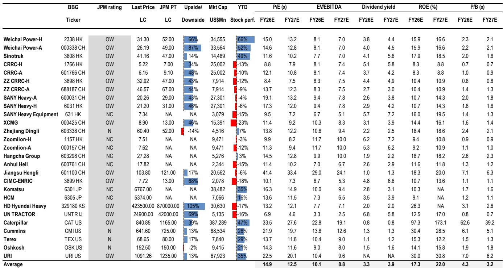
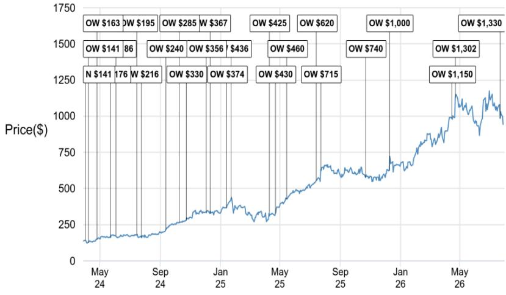

# JPM：潍柴动力，三家电力设备公司订单排至2030年代

全球AI数据中心对电力的需求，正在把燃气轮机、气体发动机和固体氧化物燃料电池（SOFC）三类设备的订单周期拉长到过去十年少见的长度。JPM在7月28日发布的潍柴动力研究报告中，交叉比对了Bloom Energy、Innio和GE Vernova三家公司的二季度业绩与指引，得出的判断是：分布式发电（BTM）和AI数据中心供电的订单簿仍然饱满，产能排期已延伸至2030年代，尚未看到需求断崖或供给过剩的证据。

这份报告的独特之处在于，它用三家不同技术路线的公司交叉验证同一个结论。Bloom Energy代表SOFC路线，Innio代表气体发动机，GE Vernova代表大型燃气轮机。三家公司二季度订单均超出预期，且都上调了产能或交付指引。管理层在交流会上反复提及的词汇高度一致：BTM需求强劲、供给持续紧张、订单可见度以年为单位。

> **KC评论：** 三家技术路线不同的公司同时出现“订单排到2030年代”的表述，比单一公司指引更有说服力。这基本排除了个别公司的订单波动，指向的是整个分布式发电赛道正在经历一轮结构性扩张。

## 1. Bloom Energy的SOFC订单显示数据中心需求超过全年订单两倍

Bloom Energy在二季度业绩中披露，数据中心订单已超过FY25全年订单总量的两倍。管理层表示客户能见度已延伸至2030年，订单簿扩张速度超出产能建设节奏。公司正在同时瞄准公用事业和增量机械扩张两个方向，SOFC被定位为多年度增长周期的早期阶段。

对潍柴而言，这一信号直接关系到其SOFC业务的时间表。JPM在报告中给出潍柴SOFC的爬坡路径：2026年30MW，2027年200MW。Bloom Energy的订单数据意味着全球SOFC市场仍处于供不应求阶段，后来者进入窗口尚未关闭。

## 2. Innio的数据中心订单簿比达6.3倍，产能扩张至10GW

Innio二季度订单创下纪录，数据中心板块book-to-bill达到6.3倍，公用事业解决方案为2.0倍。公司计划在2026年底将产能提升至5GW，2030年达到10GW。管理层明确表示，气体发动机需求将持续处于供给约束状态，这支撑了高资质供应商的定价权和利润率。

这一数据对潍柴的AIDC（AI数据中心）发动机业务构成直接利好。JPM报告显示，潍柴AIDC发动机出货指引为2026年3,500-4,000台，目前进度符合预期，订单管道强劲，交付节奏集中在下半年。产能扩张按计划推进，AIDC相关发动机产能将在2027年底达到8,000-10,000台。

## 3. GE Vernova上调自由现金流指引，燃气轮机产能目标30GW

GE Vernova二季度订单达到242亿美元，显著超出预期。公司宣布20GW燃气轮机产能扩建已完成，目标在FY28达到24GW、2030年达到30GW。数据中心订单处于纪录水平。更值得关注的是利润率信号：FY26自由现金流指引从65-75亿美元上调至115-125亿美元，上调幅度接近一倍。

JPM认为，GE Vernova的现金流指引上调说明电力设备行业的定价权正在转化为实际利润，而非仅仅是订单层面的繁荣。这对整个电力设备板块的盈利预期都有参考意义。

## 4. 潍柴估值回落至工业周期股水平，控股股东宣布增持

报告特别提到一个时间节点：7月21日，潍柴控股股东宣布观点偏积极相关市场计划，金额最高达4亿元人民币。JPM将其解读为控股股东对公司成长前景和内在价值的信心信号。

自5月以来，潍柴H股和相关市场分别下跌约19%和13%，同期MSCI中国指数下跌5%。经过这轮回调，潍柴的估值重新回到工业周期股的水平，股息率约4%。JPM在报告中更新公司观点，认为当前的估值重置提供了入场窗口，支撑因素包括交付韧性、利润率纪律和多年度增长跑道。

> **KC评论：** 控股股东在报价回调后宣布观点偏积极，通常比卖方评级更值得关注。4亿元的观点偏积极规模不算大，但信号意义在于：最了解公司的人愿意在这个价位用真金白银表态。

## 5. 电力设备板块估值对比：SOFC溢价最高，潍柴处于低位

报告附带的对比表格显示，在JPM覆盖的电力设备公司中，Bloom Energy的FY26E市盈率为60.7倍，GE Vernova为27.9倍，而潍柴相关市场和H股分别为14.6倍和15.0倍。即便考虑业务结构差异，这一估值差距也反映了市场对纯电力设备标的和综合工业集团的不同定价逻辑。

一个值得注意的细节是，潍柴的PEG指标（FY26E）为0.7，低于表格中多数电力设备公司。这意味着市场对其盈利增速的定价可能偏保守，尤其是在AIDC发动机出货量按计划爬坡的前提下。

这份报告的观察框架可以简化为三条线索：一是跟踪三家全球电力设备龙头的季度订单和产能指引，作为行业景气度的先行指标；二是关注潍柴AIDC发动机的季度出货量是否匹配3,500-4,000台的年度指引节奏；三是留意SOFC从30MW到200MW的爬坡进度，这决定了潍柴在下一代分布式发电技术中的卡位。

For informational purposes only. Portions may be generated,translated,summarized,or edited with AI assistance based on source materials and may contain omissions or errors. Please verify independently. This is not investment,legal,tax,accounting,or other professional advice.

For informational purposes only. Portions may be generated,translated,summarized,or edited with AI assistance based on source materials and may contain omissions or errors. Please verify independently. This is not investment,legal,tax,accounting,or other professional advice.

