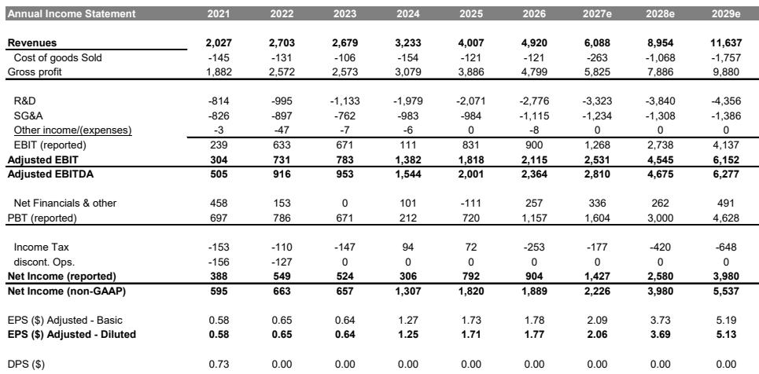
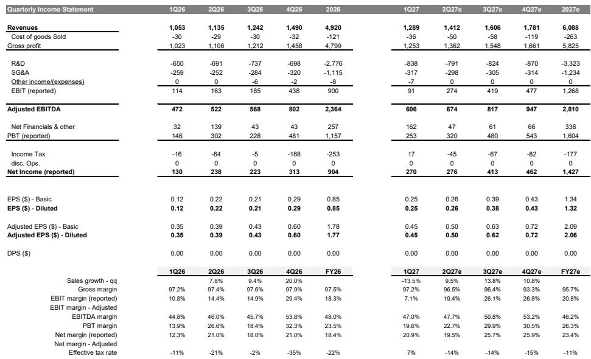
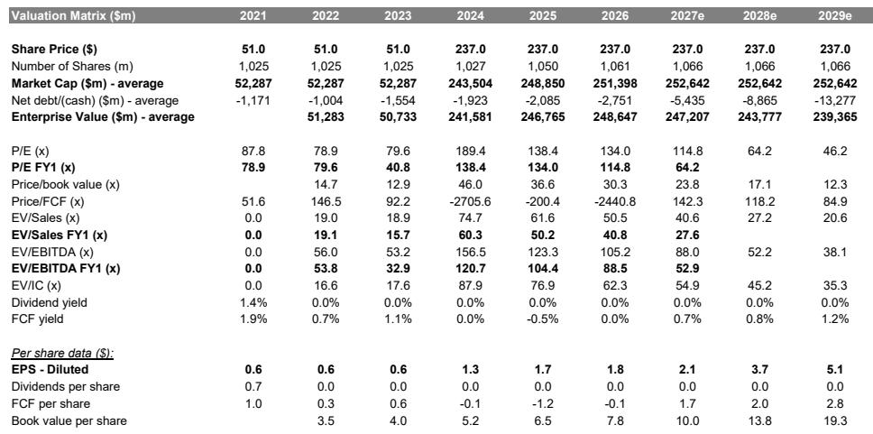

# MS：Arm版税增速节奏变化，CPU供应覆盖待确认

Arm Holdings 在 2027 财年第一季度的业绩超出市场预期，但这份报告的真正信号藏在数字背后：版税收入增速正在节奏变化，而市场寄予厚望的 AGI CPU 业务，虽然需求管道超过 20 亿美元，供应端却仍未完全落实。MS在最新研报中更新了公司观点评级，同时明确指出，经过 3 月 Arm Everywhere 活动以来的重新定价，当前报价已经较大程度反映了新 CPU 业务的机会。

这份报告的价值不在于确认 Arm 的 AI 故事，而在于把故事拆开，让读者看清哪些部分已经兑现、哪些部分仍停留在指引层面。

## 1. AGI CPU 销售预期上调，供应覆盖成为关键约束

管理层现在预计 AGI CPU 在 2027-2028 财年的销售额将超过 10 亿美元，高于此前约 10 亿美元的预期，同时重申需求管道超过 20 亿美元。客户广度正在提升，美国和中国的客户都在补充现有合作。使用场景也在拓宽：管理层将 AGI 定位为不仅面向 agentic 应用负载，还延伸到 head-node 系统 CPU 和传统服务器。

近期的约束不在需求，而在供应。晶圆、内存、基板、测试等环节都在推进，但管理层可能要到第三季度财报才能确认 20 亿美元以上管道的完整覆盖。Arm 还计划将更高的投入成本转嫁给客户，客户接受程度是一个执行变量。

> **KC评论：** 10 亿美元销售预期与 20 亿美元需求管道之间的差额，就是供应不确定性的量化表达。读者在跟踪后续季报时，应重点关注管理层是否给出供应覆盖的具体时间表，而非重复需求端的故事。

## 2. 手机混合结构影响版税增长，数据中心版税成为结构性对冲

管理层指引第二季度版税增长约 13% 同比，低于此前预期，原因是手机混合结构向中端 Android 设备倾斜，而 Armv8 合作伙伴和 iOS 在高端智能手机中份额提升。授权业务预计增长约 30% 同比，可以部分抵消不确定性，但版税增速节奏变化可能让那些期待智能手机更快复苏的读者失望。

Armv9 和 CSS 渗透率仍应支撑手机版税同比增长，但混合结构效应弱于预期。相比之下，数据中心版税保持强劲：第一季度收入同比增长超过一倍，管理层预计未来两到三年每年至少增长 100%，支撑因素包括超大规模云厂商 CPU、NVIDIA 的 Grace 和 Vera 爬坡，以及更广泛的 DPU/SmartNIC 采用。Arm 现在指引 2027 财年版税增长为高 teens 同比。

数据中心版税是更干净的结构性驱动，但规模尚不足以完全抵消智能手机的短期波动。这份报告隐含的判断是：Arm 的增长叙事正在从手机转向数据中心，但转换尚未完成。

## 3. 运营费用持续攀升，硅片能力建设推高投入强度

第一季度非 GAAP 运营费用为 7.33 亿美元，同比增长 18%，比指引低约 2700 万美元，属于时间性差异。第二季度运营费用指引约 7.8 亿美元，与市场预期基本一致，确认了研发投入的持续加码。报告预计 2027 财年剩余时间运营费用将逐季增长，用于支持 AGI CPU 执行和相邻硅片机会。

这在战略上与机会规模一致，但限制了近期运营杠杆，并提高了收入转化的门槛。Arm 预计在硅片收入达到集团收入至少 10% 时单独披露，时间点预计在 2028 财年。对于观察者而言，关键标记是：有供应支撑的 AGI 订单、投入成本上升时的定价能力证据，以及从高研发投入到可持续硅片毛利的清晰路径。

## 4. 估值框架：IP 业务与芯片业务分开定价

MS继续以 SOTP 方式对 Arm 估值，以反映 IP 和芯片业务的不同特征。IP 业务采用 50 倍 EV/EBIT，处于 Arm 历史区间上端，反映云 AI 作为日益重要的增长驱动；芯片业务采用 20 倍，仍低于全球芯片制造商（低毛利同行），但更好地反映了 Arm 的长期增长潜力。

报告将 2027 财年 EPS 预期从 1.93 美元上调至 2.06 美元，2028 财年从 3.51 美元上调至 3.69 美元。公司观点更新的核心逻辑是：虽然看好 CPU 故事，但报价已经反映了 2030 年机会的很大一部分。报告保留约 1250 亿美元的 2030 年 CPU TAM 估计，隐含的 Arm 收入预期保持不变。

> **KC评论：** SOTP 估值框架值得注意：IP 业务给到 50 倍 EV/EBIT，芯片业务只给 20 倍。这个差距本身就是判断——市场愿意为 Arm 的 IP 授权模式支付溢价，但对芯片业务仍按低毛利硬件逻辑定价。如果后续季度硅片毛利数据好于预期，这个折价可能成为重新评估的起点。

回到开头的问题：这份报告最值得看的判断是什么？不是 Arm 的 AI CPU 故事本身，而是这个故事当前所处的位置——需求端已经讲清楚，供应端还在确认中，版税增长正在经历手机混合结构的短期扰动，而数据中心版税虽然强劲但规模尚小。MS的结论是，报价已经反映了大部分 2030 年机会，接下来的关键变量是供应、执行和差异化，而非叙事本身。

For informational purposes only. Portions may be generated,translated,summarized,or edited with AI assistance based on source materials and may contain omissions or errors. Please verify independently. This is not investment,legal,tax,accounting,or other professional advice.

For informational purposes only. Portions may be generated,translated,summarized,or edited with AI assistance based on source materials and may contain omissions or errors. Please verify independently. This is not investment,legal,tax,accounting,or other professional advice.

