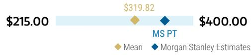
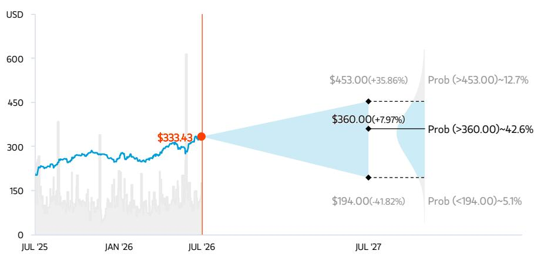
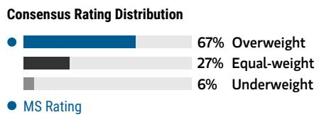
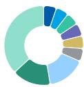

July 31, 2026 03:43 AM GMT

Apple, Inc. | North America

# F3Q26业绩观察：利润率与服务业务出现新变化

## 本期要点

IT硬件 | 美国

<table><tr><td>苹果公司 (AAPL.O)</td><td>调整前</td><td>调整后</td></tr><tr><td>目标报价</td><td>$364.00</td><td>$360.00</td></tr></table>

## AlphaSignals 业绩反应

对研究框架的影响：中性偏谨慎

对研究框架的影响

— 符合预期

财务结果与市场一致预期对比 ↓ 小幅下调
未来12个月一致预期盈利方向

资料来源：公司数据、MS

产品需求依然稳健，但供应限制对下一季度增长形成制约，存储成本上升在调价前对利润率带来更明显影响，服务业务增速有所放缓。在报价接近历史高位的情况下，预计在新催化剂临近前，市场表现可能相对平淡。

## 主要观察

六月季度业绩整体平稳，主要例外是服务业务低于预期，受汇率和移动游戏市场影响。

\- 下一季度指引因供应限制在收入端偏保守，但产品潜在需求依然稳健，即便经历部分调价。

剔除关税返还后的毛利率显示下一季度面临比模型预期更大的成本压力，但预计九月末的iPhone调价将带来一定缓解。

在我们看来，最值得关注的变化是服务业务的实际表现与指引均低于预期，这使得未来的调价空间和Siri AI的推出变得更加关键。

■ 后续催化剂：iPhone发布活动（九月初）、Siri AI上线（秋季）、苹果Intel相关事项在欧盟及中国市场的审批进展（待定）。

苹果故事的两个关键支柱正面临短期挑战。历史经验显示，当iPhone、服务业务和毛利率这三个核心要素同步向好时，苹果往往能获得较强的盈利上修、估值扩张和市场表现。本次九月季度指引显示其中两个因素面临的挑战大于预期——（1）服务业务增速自2023年六月季度以来首次降至同比10%以下，低于我们原本就低于市场一致预期的判断，主要受汇率逆风和移动游戏市场变化影响；（2）剔除关税返还后的毛利率指引中值为46.5%（较市场预期低1个百分点，较我们的预期低30个基点），存储成本贡献了毛利率环比压缩的绝大部分。iPhone在九月季度也面临零部件供应约束，但预计仍可实现同比中双位数增长，因此我们认为iPhone的表现仍是这个故事中相对稳健的部分。

<table><tr><td colspan="2">MS & CO. LLC</td></tr><tr><td colspan="2">Erik W Woodring</td></tr><tr><td colspan="2">股票研究分析师</td></tr><tr><td>Erik.Woodring@morganstanley.com</td><td>+1 212 296-8083</td></tr><tr><td colspan="2">Dylan Liu</td></tr><tr><td colspan="2">研究助理</td></tr><tr><td>Dylan.Liu@morganstanley.com</td><td>+1 212 761-4519</td></tr><tr><td colspan="2">Maya C Neuman</td></tr><tr><td colspan="2">研究助理</td></tr><tr><td>Maya.Neuman@morganstanley.com</td><td>+1 212 761-1946</td></tr><tr><td colspan="2">Rauf Ural</td></tr><tr><td colspan="2">研究助理</td></tr><tr><td>Rauf.Ural@morganstanley.com</td><td>+1 212 761-5958</td></tr></table>

## 苹果公司 (AAPL.O, AAPL US)

<table><tr><td>股票评级</td><td>增持</td></tr><tr><td>行业观点</td><td>谨慎</td></tr><tr><td>目标报价</td><td>$360.00</td></tr><tr><td>最新收盘价 (2026年7月30日)</td><td>$333.43</td></tr><tr><td>当前市值 (百万)</td><td>$4,896,209</td></tr><tr><td>52周区间</td><td>$344.57-201.50</td></tr></table>

<table><tr><td>财年截止</td><td>09/25</td><td>09/26e</td><td>09/27e</td><td>09/28e</td></tr><tr><td>每股盈利 ($)**</td><td>7.46</td><td>8.84</td><td>10.00</td><td>10.83</td></tr><tr><td>此前每股盈利 ($)**</td><td>-</td><td>8.86</td><td>10.39</td><td>11.29</td></tr><tr><td>市盈率</td><td>34.1</td><td>37.7</td><td>33.3</td><td>30.8</td></tr><tr><td>每股盈利 ($)§</td><td>-</td><td>8.77</td><td>9.75</td><td>10.93</td></tr><tr><td>股息率 (%)</td><td>0.4</td><td>0.3</td><td>0.3</td><td>0.4</td></tr></table>

除非另有说明，所有指标均基于MS ModelWare框架

\*\* = 基于一致预期方法
§ = 一致预期数据由Refinitiv Estimates提供
e = MS预测值

## 季度每股盈利 ($)

<table><tr><td>季度</td><td>2025</td><td>2026e 此前</td><td>2026e 当前</td><td>2027e 此前</td><td>2027e 当前</td></tr><tr><td>Q1</td><td>2.40</td><td>-</td><td>2.84a</td><td>2.92</td><td>2.82</td></tr><tr><td>Q2</td><td>1.65</td><td>-</td><td>2.01a</td><td>2.50</td><td>2.42</td></tr><tr><td>Q3</td><td>1.57</td><td>-</td><td>2.02a</td><td>2.44</td><td>2.35</td></tr><tr><td>Q4</td><td>1.85</td><td>2.12</td><td>1.96</td><td>2.54</td><td>2.41</td></tr></table>

e = MS预测值，a = 公司实际报告数据

MS与报告覆盖的公司存在业务往来。因此，读者应知悉公司可能存在影响研究客观性的利益冲突。读者应将MS的研究视为决策的单一因素之一。

有关分析师认证及其他重要披露，请参阅本报告末尾的披露部分。

## 整体来看，苹果的故事仍有许多值得关注的积极因素——用户基数持续创历史新高，自由现金流年初至今同比增长52%，产品发布节奏加快，新形态产品在途，Siri AI即将在未来几个月上线，新CEO也已就位。但与此同时，苹果对供应链的掌控力似乎受到一定质疑，AI是否已为产品或服务业务带来可量化的推动尚不明确，其未来的商业化影响仍存在不确定性。事实上，App Store的增长变化或许也与AI重新分配用户时间有关。综合来看，我们认为在苹果迎来下一个重要催化剂——iPhone 18/折叠屏发布（含定价信息）、Siri AI上线、或任何国际监管审批——或供需关系出现明显变化之前，市场表现可能维持相对平淡，市场需要时间重新建立对盈利上行的信心。业绩发布后，我们将FY27每股盈利预测从$10.39下调至$10.00，同时将估值基准滚动至CY27每股盈利$10.30，在维持35倍市盈率不变的情况下，目标报价下调至$360。

## 从苹果F3Q26（六月季度）业绩中我们了解到：

(-) 需求保持稳健，但供应链挑战持续存在。虽然苹果的九月季度展望引入了新的不确定性因素，但我们认为需求仍是这个故事中争议较小的部分。六月季度业绩表现强劲，iPhone收入同比增长22%至创纪录的$543亿，Mac收入在供应受限下同比增长29%，管理层强调所有地理分区均创下六月季度纪录。重要的是，苹果的活跃用户基数和升级用户数均创下新高，表明在多年延长换机周期后，换机周期开始收缩。然而，挑战正日益从需求端转向供应端。管理层确认先进制程（即3nm）供应约束将影响九月季度的iPhone、Mac和iPad。值得注意的是，苹果将此描述为更多是需求超出预期的结果，而非供应商执行问题，并反复强调供应链"灵活性"低于正常水平。管理层指出六月季度末渠道库存已处于较低水平，九月末可能继续保持低位。因此，尽管苹果指引九月iPhone同比增长中双位数，管理层暗示若无供应限制，增长本可更强。读者关注的核心问题转向：这种需求能否持续到十二月及以后，还是更高价格会产生需求弹性效应。我们最新的渠道调查显示C2H26 iPhone生产计划未变，这意味着苹果认为消费者在iPhone 18 Pro/Pro Max/折叠屏发布后仍会升级。

(-) 毛利率面临更明显的存储成本压力——后续走向如何？如果说供应约束限制了收入上行空间，存储成本上升则日益影响盈利能力。在九月季度毛利率指引47-48%的表象之下，约1个百分点来自关税返还，意味着剔除该因素后的中值毛利率约为46.5%，环比收缩150个基点，而历史季节性通常为持平至上升50个基点。更重要的是，管理层指出存储成本将贡献九月季度毛利率压缩的绝大部分——尽管产品组合和非存储零部件成本下降带来一定抵消——存储成本仍在继续上升。接下来的问题是——毛利率后续走向如何，因为存储成本短期内难以缓解？苹果在十二月季度仍有两个可用的工具——iPhone调价和折叠屏iPhone出货——因此我们认为苹果有望在十二月季度实现产品毛利率环比改善。然而，更广泛的问题依然存在——存储成本上升是否会推迟更持续的利润率复苏至FY27更晚时期？

(-) 对App Store挑战的确认使服务业务调价/Siri AI上线成为焦点。六月季度服务业务收入同比增长12%，低于市场预期的+14.6%同比增长，九月季度指引也显示在计入额外2.5个百分点的汇率同比逆风后，增速将放缓至约9.5%同比增长。汇率仍是增速变化的最大驱动因素，但让我们注意的是苹果对App Store增长变化的异常直接确认——管理层指出了移动游戏市场的挑战、游戏发布时间的波动、部分国家App Store商业模式的变化、持续的诉讼相关影响，以及更广泛的用户参与模式变化。虽然苹果未将增长变化归因于任何单一因素，但相关表述印证了App Store已不再是服务业务中的增长亮点（服务业务毛利率环比收缩也印证了这一点），与我们通过Sensor Tower数据观察到的趋势一致。尽管如此，管理层对Siri AI表示乐观，称内部和开发者反馈非常积极，同时暗示使用量增加可能为更高档位的iCloud+订阅创造机会。不过，公司也承认在计算成本影响和收入机会方面仍处于早期阶段。虽然管理层对服务业务长期增长持建设性态度，但我们预计汇率对比和App Store增速变化仍将是苹果服务业务面临的主要挑战。

<table><tr><td colspan="2">风险回报主题</td></tr><tr><td>颠覆性创新：</td><td>正面</td></tr><tr><td>新数据时代：</td><td>正面</td></tr><tr><td>定价能力：</td><td>正面</td></tr><tr><td colspan="2">查看风险回报主题说明</td></tr></table>

## 风险回报 – 苹果公司 (AAPL.O)

更高定价、更强盈利能力和催化剂密集的下半年

## 目标报价 $360.00

我们的$360目标报价基于CY27 EV/Sales 9.4倍，该倍数通过对科技和消费平台同行的回归分析得出。目标报价隐含约35倍市盈率，基于CY27每股盈利$10.30。

一致预期目标报价分布

资料来源：Refinitiv、MS

## 风险回报图与期权隐含概率（12个月）

关键：— 历史市场表现 ● 当前报价 ◆ 目标报价
资料来源：Refinitiv、MS、MS机构股票部门。牛市、基准和熊市情景的概率基于截至2026年7月30日期权市场的隐含波动率数据估算。所有数字均为报价在三个月或一年内达到情景价格以上的近似风险中性概率。查看期权概率方法说明

## 增持逻辑

随着iPhone换机周期达到历史最长、新AI功能在全球陆续推出、以及公司重新聚焦设备形态创新，我们认为苹果有望从CY26开始加速iPhone增长，换机周期在存量用户基数开始升级时达到峰值。结合持续的双位数服务业务增长和适度的经营杠杆，我们预计苹果FY27每股盈利可达$10.00，FY28可达$10.83。存储成本动态可能在短期内带来不确定性。长期来看，在AI、支付、云、健康和家居领域的投入，以及每位用户日消费$1的长期增长空间，是支撑持续长期增长和价值创造的关键论据。

资料来源：Refinitiv、MS

## 牛市情景

$453.00

## 11x EV/Sales FY27；约41倍FY27牛市市盈率，基于$11.02

iPhone换机周期在FY26/FY27加速，机器人业务提供长期上行空间。消费需求回暖，iPhone 17升级意愿强于预期，叠加向高端机型的产品组合转移，推动iPhone收入同比中双位数增长，同时零部件成本上升因苹果对消费者和供应链的议价能力而得到缓解。我们的牛市估值隐含FY27牛市每股盈利的4.1倍市盈率，其中包含机器人业务每股$22的上行空间。

## 基准情景

$360.00

9.4x EV/Sales CY27 或约35倍CY27每股盈利$10.30

服务业务和利润率保持韧性，读者开始预期更强的iPhone周期。FY27收入同比增长中双位数，由10%以上的服务业务增长和中双位数的产品增长驱动。毛利率可能在FY27同比收缩，受产品收入占比提升和存储成本影响，而苹果通过供应链管理和重新定价来缓解成本影响。由于存储成本导致的定价上升带来需求弹性，iPhone换机周期在FY27再次延长。

## 熊市情景

$194.00

6.3x EV/Sales FY27；24.6倍FY27熊市每股盈利$7.89

iPhone 17周期表现不及预期，消费支出在价格上涨背景下弱于预期。组合中各项业务增长进一步放缓，可支配收入承压，导致FY26产品收入仅低个位数增长、服务业务增速放缓。在收入微增但利润率收缩的情况下，FY26每股盈利仅中个位数增长至约$7.36。我们的熊市估值隐含24.6倍FY27市盈率，低于五年平均26.0倍，反映服务业务利润占比趋于平稳。

## 风险回报 – 苹果公司 (AAPL.O)

## 关键盈利输入

<table><tr><td>驱动因素</td><td>2025年9月</td><td>2026年9月e</td><td>2027年9月e</td><td>2028年9月e</td></tr><tr><td>总收入增长（同比）(%)</td><td>6.4</td><td>14.6</td><td>13.9</td><td>5.5</td></tr><tr><td>iPhone收入增长（同比）(%)</td><td>4.2</td><td>20.7</td><td>18.9</td><td>4.0</td></tr><tr><td>服务业务收入增长（同比）(%)</td><td>13.5</td><td>12.9</td><td>10.6</td><td>11.6</td></tr><tr><td>毛利率 (%)</td><td>46.9</td><td>48.7</td><td>47.1</td><td>48.1</td></tr><tr><td>每股盈利增长（同比）(%)</td><td>10.6</td><td>18.4</td><td>13.1</td><td>8.3</td></tr></table>

## 投资驱动因素

\- iPhone生产计划上修 / 换机周期加速的明确信号

• 服务业务收入增长重新加速

\- Apple Intelligence功能与分发扩展

\- 家居、健康和AI领域的新产品发布

## 全球收入分布

<table><tr><td rowspan="9"></td><td>0-10%</td><td>亚太（除日本、中国大陆和印度）</td></tr><tr><td>0-10%</td><td>印度</td></tr><tr><td>0-10%</td><td>日本</td></tr><tr><td>0-10%</td><td>拉丁美洲</td></tr><tr><td>0-10%</td><td>中东和非洲</td></tr><tr><td>0-10%</td><td>英国</td></tr><tr><td>10-20%</td><td>欧洲（除英国）</td></tr><tr><td>10-20%</td><td>中国大陆</td></tr><tr><td>30-40%</td><td>北美</td></tr></table>

资料来源：MS预测 查看区域层级说明

## MS ALPHA模型

<table><tr><td>3/5最佳</td><td>24个月周期</td><td>1/5最优</td><td>3个月周期</td></tr></table>

资料来源：Refinitiv、FactSet、MS；1为最高偏好五分位，5为最低偏好五分位

## 目标报价/评级风险

## 上行风险

\- iPhone 18表现超预期

\- Apple Intelligence采用率超预期

• 苹果推出新产品线

• 服务业务在更高对比基数下重新加速

• 毛利率超预期

## 下行风险

\- 消费支出变化限制iPhone升级率

• 存储成本上升

\- AI功能进展有限

\- 地缘政治因素

\- 监管加强，尤其是App Store相关

## 持仓情况

<table><tr><td>机构读者主动持仓比例</td><td>47.5%</td></tr><tr><td>对冲基金行业多空比</td><td>2.1x</td></tr><tr><td>对冲基金行业净敞口</td><td>29.5%</td></tr></table>

Refinitiv；MSPB内容。包含通过MSPB持有的部分对冲基金敞口。信息可能与更广泛的市场趋势不一致或无法反映。多空比 = 多头敞口 / 空头敞口。行业净敞口占比 = (特定行业：多头敞口 - 空头敞口) / (所有行业：多头敞口 - 空头敞口)。

MS预测 vs. 一致预期
FY 2027年9月e

<table><tr><td rowspan="2">销售额/收入 ($, 百万)</td><td>487,423</td><td>543,285</td><td>584,689</td></tr><tr><td></td><td>523,697</td><td></td></tr><tr><td rowspan="2">EBITDA ($, 百万)</td><td>159,913</td><td>187,562</td><td>208,000</td></tr><tr><td></td><td>184,508</td><td></td></tr><tr><td rowspan="2">净利润 ($, 百万)</td><td>126,959</td><td>145,610</td><td>161,457</td></tr><tr><td></td><td>140,172</td><td></td></tr><tr><td rowspan="2">每股盈利 ($)</td><td>8.79</td><td>10.00</td><td>10.96</td></tr><tr><td></td><td>9.75</td><td></td></tr></table>

资料来源：Refinitiv、MS

# 业绩差异分析

图表1：苹果F3Q26业绩差异

苹果业绩分析

代码：AAPL

行业观点：谨慎

Erik Woodring

(212) 296-8083

评级：增持

erik.woodring@morganstanley.com

F4Q26预期

一致预期（业绩前）：F4Q26收入$1,149亿，毛利率47.4%，运营支出$193亿，税率17.0%，每股盈利$2.01

MS预测（业绩前）：F4Q26收入$1,213亿，毛利率46.8%，运营支出$196亿，OI&E $1.55亿，税率17.0%，每股盈利$2.12

<table><tr><td>($ 百万)</td><td>F4Q24A</td><td>F1Q25A</td><td>F2Q25A</td><td>F3Q25A</td><td>F4Q25A</td><td>F1Q26A</td><td>F2Q26A</td><td>F3Q26A</td><td>F3Q26E</td><td>% 差异</td><td>每股影响</td><td>一致预期</td></tr><tr><td>总收入</td><td>94,930</td><td>124,300</td><td>95,359</td><td>94,036</td><td>102,466</td><td>143,756</td><td>111,184</td><td>109,417</td><td>108,468</td><td>1%</td><td>$0.03</td><td>109,039</td></tr><tr><td>同比增长</td><td>6%</td><td>4%</td><td>5%</td><td>10%</td><td>8%</td><td>16%</td><td>17%</td><td>16%</td><td>15%</td><td></td><td></td><td></td></tr><tr><td>环比增长</td><td>11%</td><td>31%</td><td>-23%</td><td>-1%</td><td>9%</td><td>40%</td><td>-23%</td><td>-2%</td><td>-2%</td><td></td><td></td><td></td></tr><tr><td>毛利润</td><td>43,879</td><td>58,275</td><td>44,867</td><td>43,718</td><td>48,341</td><td>69,231</td><td>54,781</td><td>54,770</td><td>52,239</td><td>5%</td><td>$0.14</td><td>52,432</td></tr><tr><td>毛利率</td><td>46.2%</td><td>46.9%</td><td>47.1%</td><td>46.5%</td><td>47.2%</td><td>48.2%</td><td>49.3%</td><td>50.1%</td><td>48.2%</td><td>190 bps</td><td></td><td>48.1%</td></tr><tr><td>SG&A</td><td>6,523</td><td>7,175</td><td>6,728</td><td>6,650</td><td>7,048</td><td>7,492</td><td>7,477</td><td>7,346</td><td>7,267</td><td>1%</td><td>($0.00)</td><td></td></tr><tr><td>SG&A占销售比</td><td>6.9%</td><td>5.8%</td><td>7.1%</td><td>7.1%</td><td>6.9%</td><td>5.2%</td><td>6.7%</td><td>6.7%</td><td>6.7%</td><td></td><td></td><td></td></tr><tr><td>研发</td><td>7,765</td><td>8,268</td><td>8,550</td><td>8,866</td><td>8,866</td><td>10,887</td><td>11,419</td><td>11,729</td><td>11,823</td><td>-1%</td><td>$0.01</td><td></td></tr><tr><td>研发占销售比</td><td>8.2%</td><td>6.7%</td><td>9.0%</td><td>9.4%</td><td>8.7%</td><td>7.6%</td><td>10.3%</td><td>10.7%</td><td>10.9%</td><td></td><td></td><td></td></tr><tr><td>总运营支出</td><td>14,288</td><td>15,443</td><td>15,278</td><td>15,516</td><td>15,914</td><td>18,379</td><td>18,896</td><td>19,075</td><td>19,090</td><td>0%</td><td></td><td>18,942</td></tr><tr><td>运营利润</td><td>29,591</td><td>42,832</td><td>29,589</td><td>28,202</td><td>32,427</td><td>50,852</td><td>35,885</td><td>35,695</td><td>33,149</td><td>8%</td><td>$0.12</td><td>33,491</td></tr><tr><td>运营利润率</td><td>31.2%</td><td>34.5%</td><td>31.0%</td><td>30.0%</td><td>31.6%</td><td>35.4%</td><td>32.3%</td><td>32.6%</td><td>30.6%</td><td>206 bps</td><td></td><td>30.7%</td></tr><tr><td>其他收入与支出</td><td>19</td><td>(248)</td><td>(279)</td><td>(171)</td><td>377</td><td>150</td><td>(52)</td><td>572</td><td>251</td><td>128%</td><td>0.0</td><td></td></tr><tr><td>税率</td><td>15.6%</td><td>14.7%</td><td>15.5%</td><td>16.4%</td><td>16.3%</td><td>17.5%</td><td>17.5%</td><td>17.9%</td><td>17.0%</td><td></td><td></td><td></td></tr><tr><td>运营每股盈利</td><td>$1.64</td><td>$2.40</td><td>$1.65</td><td>$1.57</td><td>$1.85</td><td>$2.84</td><td>$2.01</td><td>$2.02</td><td>$1.89</td><td>7%</td><td>$0.14</td><td>$1.89</td></tr><tr><td>股本数</td><td>15,243</td><td>15,151</td><td>15,056</td><td>14,948</td><td>14,864</td><td>14,810</td><td>14,726</td><td>14,715</td><td>14,693</td><td>0%</td><td></td><td></td></tr><tr><td>分部收入 ($M)</td><td>F4Q24A</td><td>F1Q25A</td><td>F2Q25A</td><td>F3Q25A</td><td>F4Q25A</td><td>F1Q26A</td><td>F2Q26A</td><td>F3Q26A</td><td>F3Q26E</td><td></td><td></td><td></td></tr><tr><td>iPhone</td><td>46,222</td><td>69,138</td><td>46,841</td><td>44,582</td><td>49,025</td><td>85,269</td><td>56,994</td><td>54,252</td><td>54,473</td><td>0%</td><td></td><td>53,742</td></tr><tr><td>同比增长</td><td>6%</td><td>-1%</td><td>2%</td><td>13%</td><td>6%</td><td>23%</td><td>22%</td><td>22%</td><td>22%</td><td></td><td></td><td></td></tr><tr><td>iPad</td><td>6,950</td><td>8,088</td><td>6,402</td><td>6,581</td><td>6,952</td><td>8,595</td><td>6,914</td><td>6,191</td><td>6,649</td><td>-7%</td><td></td><td>7,098</td></tr><tr><td>同比增长</td><td>8%</td><td>15%</td><td>15%</td><td>-8%</td><td>0%</td><td>6%</td><td>8%</td><td>-6%</td><td>1%</td><td></td><td></td><td></td></tr><tr><td>Mac</td><td>7,744</td><td>8,987</td><td>7,949</td><td>8,046</td><td>8,726</td><td>8,386</td><td>8,399</td><td>10,352</td><td>8,092</td><td>28%</td><td></td><td>8,680</td></tr><tr><td>同比增长</td><td>2%</td><td>16%</td><td>7%</td><td>15%</td><td>13%</td><td>-7%</td><td>6%</td><td>29%</td><td>1%</td><td></td><td></td><td></td></tr><tr><td>可穿戴、家居及配件</td><td>9,042</td><td>11,747</td><td>7,522</td><td>7,404</td><td>9,013</td><td>11,493</td><td>7,901</td><td>7,883</td><td>8,175</td><td>-4%</td><td></td><td>7,904</td></tr><tr><td>同比增长</td><td>-3%</td><td>-2%</td><td>-5%</td><td>-9%</td><td>0%</td><td>-2%</td><td>5%</td><td>6%</td><td>10%</td><td></td><td></td><td></td></tr><tr><td>服务</td><td>24,972</td><td>26,340</td><td>26,645</td><td>27,423</td><td>28,750</td><td>30,013</td><td>30,976</td><td>30,739</td><td>31,080</td><td>-1%</td><td></td><td>31,414</td></tr><tr><td>同比增长</td><td>12%</td><td>14%</td><td>12%</td><td>13%</td><td>15%</td><td>14%</td><td>16%</td><td>12%</td><td>13%</td><td></td><td></td><td></td></tr><tr><td>分部毛利率 ($M)</td><td>F4Q24A</td><td>F1Q25A</td><td>F2Q25A</td><td>F3Q25A</td><td>F4Q25A</td><td>F1Q26A</td><td>F2Q26A</td><td>F3Q26A</td><td>F3Q26E</td><td></td><td></td><td></td></tr><tr><td>产品毛利润</td><td>25,392</td><td>38,513</td><td>24,684</td><td>22,993</td><td>26,697</td><td>46,265</td><td>31,029</td><td>31,525</td><td>28,463</td><td>11%</td><td></td><td></td></tr><tr><td>产品毛利率</td><td>36.3%</td><td>39.3%</td><td>35.9%</td><td>34.5%</td><td>36.2%</td><td>40.7%</td><td>38.7%</td><td>40.1%</td><td>36.8%</td><td>329 bps</td><td></td><td></td></tr><tr><td>服务毛利润</td><td>18,487</td><td>19,762</td><td>20,183</td><td>20,725</td><td>21,644</td><td>22,966</td><td>23,752</td><td>23,245</td><td>23,776</td><td>-2%</td><td></td><td></td></tr><tr><td>服务毛利率</td><td>74.0%</td><td>75.0%</td><td>75.7%</td><td>75.6%</td><td>75.3%</td><td>76.5%</td><td>76.7%</td><td>75.6%</td><td>76.5%</td><td>-88 bps</td><td></td><td></td></tr
