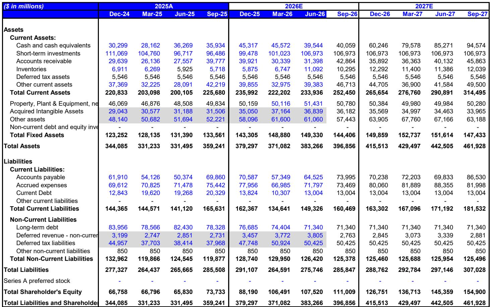

# MS：苹果北美F3Q26财报，毛利率与服务增速现变化

苹果六月季度财报整体干净，但真正值得注意的信号藏在九月季度的指引里。目标报价从364美元调整至360美元，同时将FY27每股收益预期从10.39美元降至10.00美元。调整幅度不大，但方向性判断清晰：支撑苹果故事的三根支柱——iPhone、服务、毛利率——在接下来的季度里有两根同时承压。

这份报告的判断核心不是iPhone需求出了问题。恰恰相反，六月季度iPhone收入同比增长22%至543亿美元，创下历史纪录，Mac收入增长29%，每个地理区域都刷新了六月季度纪录。需求端仍然强劲，问题出在供给和成本结构。

## 1. 九月季度供给约束限制收入上限，但需求韧性仍在

管理层在沟通会上明确表示，先进节点（3nm）的供给约束将影响iPhone、Mac和iPad在九月季度的出货。值得注意的是，苹果将这一约束定性为需求跑赢预测的结果，而非供应商执行问题，同时反复强调供应链“灵活性低于正常水平”。

渠道库存以极低水平走出六月季度，九月季度结束时大概率仍然偏低。苹果给出的九月季度iPhone收入指引为同比中双位数增长，但管理层暗示如果没有供给限制，增长本可以更高。MS的渠道核查显示，C2H26的iPhone生产计划没有变化，这意味着苹果相信消费者在iPhone 18 Pro/Pro Max/Foldable发布后仍会升级。

> **KC评论：** 供给约束和需求节奏变化在报表上都会表现为收入增长节奏变化，但两者的后续含义完全不同。这份报告的关键区分在于：苹果把九月季度的收入上限归因于供给，而非消费者意愿。观察后续月份的生产计划是否上调，比盯着单季收入数字更有信息量。

## 2. 内存成本上升对毛利率的挤压超过预期

九月季度毛利率指引为47-48%，但其中约1个百分点来自关税退还，剔除后隐含的底层毛利率约为46.5%，环比调整150个基点，而历史季节性通常为持平至上升50个基点。管理层明确表示，内存成本将贡献超过100%的毛利率环比压缩——即便有产品组合和非内存组件成本节省的正面因素。

内存价格短期内看不到缓解迹象。苹果在十二月季度仍有两张牌可打：iPhone涨价和折叠屏iPhone出货。MS认为这两项措施应能推动十二月季度产品毛利率环比改善，但更长期的问题是内存通胀是否会推迟FY27更持久的毛利率复苏。

## 3. 服务业务增速首次降至10%以下，App Store软肋被直接承认

六月季度服务收入同比增长12%，低于市场预期的14.6%。九月季度指引隐含增速进一步节奏变化至约9.5%，其中包含2.5个百分点的汇率逆风。这将是自2023年6月季度以来服务业务首次出现低于10%的同比增速。

报告中最引人注目的部分是苹果对App Store变化的罕见直接承认。管理层提到了移动游戏增长节奏变化、游戏发布排期波动、部分国家App Store商业模式调整、持续诉讼影响，以及消费者使用习惯的广泛变化。虽然苹果没有将变化归因于单一因素，但这一表态确认了App Store已不再是服务业务中的增长引擎——Sensor Tower的数据也支持这一判断。

管理层对Siri AI的态度仍然积极，称内部和开发者反馈“压倒性正面”，并暗示使用量增加可能推动更高档位的iCloud+订阅。但公司也承认，在计算成本影响和收入机会方面仍处于早期阶段。

## 4. 观察框架：三支柱同步运转才是苹果故事最顺的阶段

MS在报告中提供了一个简洁的观察框架：历史数据显示，苹果较强劲的盈利上修、估值扩张和市场表现，出现在iPhone、服务和毛利率三部分同步运转时。当前九月季度指引意味着三支柱中有两个面临超出预期的逆风。

iPhone仍是故事中较强的部分，但服务增速下台阶和毛利率承压同时出现，使得市场需要等待新的催化剂来重新确认盈利预期能否继续上移。报告列出的后续观察节点包括：九月初的iPhone发布活动、秋季的Siri AI上线，以及Apple Intel在欧盟和中国的监管审批进展。

整体来看，这份报告没有给出简单的方向性结论，而是把“三支柱同步”作为评估框架。当服务和毛利率同时出现减速信号时，即使iPhone表现强劲，整体故事也需要重新定价。后续重点观察内存价格走势和九月iPhone发布时的定价策略，这两项将决定十二月季度毛利率能否如报告预期那样环比回升。

苹果的安装基数仍在创新高，年初至今自由现金流同比增长52%，产品发布节奏在加快，新形态产品在路上，Siri AI即将上线，新CEO即将接任。长期叙事没有改变，但短期内的成本结构和增速变化，确实让市场需要更多时间消化。

For informational purposes only. Portions may be generated,translated,summarized,or edited with AI assistance based on source materials and may contain omissions or errors. Please verify independently. This is not investment,legal,tax,accounting,or other professional advice.

