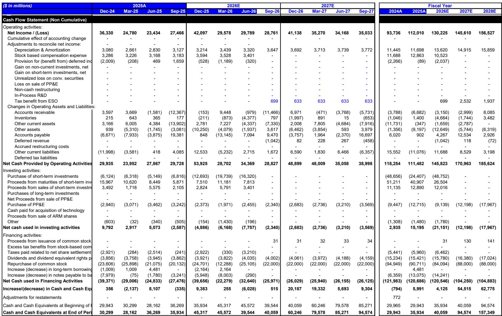
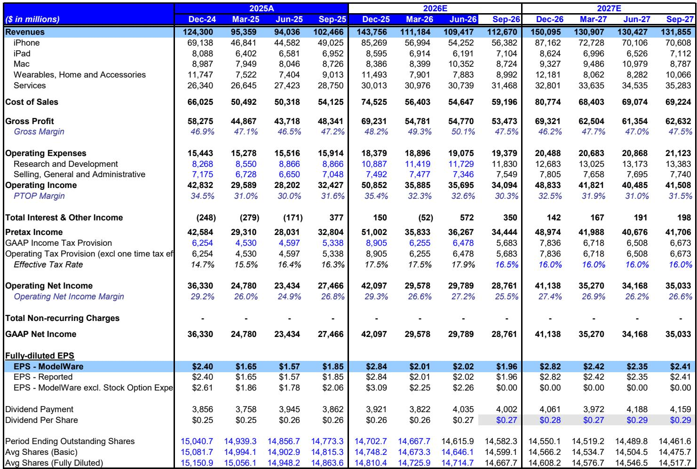

# 苹果的增长引擎正在失去同步：服务增速放缓与存储成本上升考验估值逻辑

苹果六月季度交出了创纪录的营收、创纪录的活跃设备基数增长，以及iPhone销售额同比增长22%至543亿美元的成绩单。然而，市场对九月指引的反应揭示了真实的结构性摩擦——这才是读者需要面对的核心问题。这家两年来被市场重新定价为高韧性、高毛利服务型平台公司的企业，刚刚释放信号表明其三大增长支柱中有两项正面临足以改变盈利轨迹的逆风。

九月季度指引中包含服务业务增速自2023年6月以来首次降至同比10%以下，以及剔除关税返还后的毛利率较市场预期低约100个基点。存储成本上升一项就贡献了超过100%的环比毛利率压缩。这不是一个普通的季度噪音；这是一个市场必须重新评估的时刻——苹果历史上那种iPhone、服务、毛利率三大支柱协同驱动盈利预测上修和估值扩张的模式，能否在未来两个季度内恢复。

时机至关重要。苹果正接近一个密集的催化剂窗口：九月初的iPhone 18发布活动、秋季的Siri AI上线，以及潜在的海外监管审批。每一项都可能重塑市场叙事。但财报本身表明，公司进入这一窗口时，毛利率弹性更小、服务业务轨迹更温和、供应约束限制了营收增长——即便需求超出预期。读者的问题不在于苹果是否出了问题——它没有——而在于未来两个季度能否在市场的耐心耗尽之前重新对齐三大支柱。

## 需求侧仍是较强支柱，但供应约束正成为增长的硬性瓶颈

六月季度从几乎所有需求指标来看都是一场胜利。iPhone营收同比增长22%至创纪录的543亿美元。Mac营收在供应受限的情况下仍增长29%。管理层强调所有地理区域均创下六月季度纪录。活跃设备基数和升级用户数量均创下新高，表明持续多年的换机周期拉长趋势终于开始逆转。这是看多逻辑的基础证据：消费者正在回归升级周期，而且力度强劲。

然而九月指引讲述了一个更复杂的故事。苹果指引iPhone同比增长为十几个百分点，但管理层明确表示，若没有供应限制，增长本可以更强。瓶颈在于先进制程3nm半导体供应，影响范围覆盖iPhone、Mac和iPad。管理层谨慎地将此定性为需求预测问题而非供应商执行失误，但实际效果是一样的：苹果无法生产足够的设备来满足需求，渠道库存以六月季度的低位水平结束，并可能在九月季度保持低位。

战略含义微妙但重要。过去几年，围绕苹果的争论集中在需求弹性上——消费者是否会在更高价位升级、换机周期是否会压缩、AI功能是否会带来超级周期。本季度颠覆了这一争论。需求不再是问题；供应才是。而供应约束虽然限制了近期营收，但本身并非负面因素。它表明定价权存在、渠道库存保持健康，并为十二月季度在供应正常化情况下的追赶性增长奠定基础。风险在于约束持续到十二月，这将把一个季度的问题变成多季度的增长天花板。

更令人担忧的数据点是供应约束对毛利率结构的影响。当苹果无法生产足够的设备时，就无法积极地向高端配置倾斜。无法利用规模优势谈判更优的零部件价格。也无法高效地分摊固定成本。供应约束是一个具有毛利率后果的营收问题，这种关联是理解九月指引为何显得疲弱的核心。

## 存储成本上升并非暂时性成本问题；它是对苹果定价权与毛利率架构的结构性考验

九月季度毛利率指引为47-48%，但该数字包含约一个百分点的关税返还。剔除这些返还后，隐含中值约为46.5%，环比收缩150个基点，而历史季节性为持平至上升50个基点。驱动因素明确无误：存储成本将贡献超过100%的环比压缩，这意味着即使有产品组合和非存储零部件成本节约的顺风，存储成本上升仍压倒了苹果可用的每一个其他毛利率杠杆。

这不是一个新问题。随着AI驱动的HBM和服务器DRAM需求挤占了消费设备的供应，存储价格已连续多个季度上涨。但这是影响最为显著的一个季度，也是管理层首次如此明确地披露影响幅度。读者现在必须问的是，这是一个单季度现象，还是持续毛利率压缩周期的开始。

苹果有两个应对工具。第一个是iPhone涨价，预计将在九月发布活动上宣布并于十二月季度生效。第二个是可折叠iPhone，其平均售价更高、毛利率特性更好。这两者都应使苹果在十二月季度实现产品毛利率的环比扩张。但更广泛的问题——存储成本上升是否会延迟更持久的毛利率复苏至2027财年——仍然悬而未决。如果存储成本维持高位，苹果将面临一个任何产品组合调整都无法完全抵消的结构性毛利率天花板。

更深层的战略问题是这对苹果毛利率架构的影响。多年来，研究逻辑建立在这样一个假设上：随着服务业务在营收中占比提升以及苹果对硬件定价权的增强，其毛利率将稳步上行。存储成本上升打破了这一假设。它引入了一个苹果无法控制、无法对冲、也无法实时完全转嫁的成本输入。九月涨价会有帮助，但也会在供应约束已经限制销量的时刻考验需求弹性。这是一个微妙的平衡，毛利率指引表明苹果对自己能否在无痛的情况下完成这一平衡并非完全自信。

## 服务增速放缓是最显著的瑕疵，因为它打破了估值重塑的叙事

六月季度服务营收同比增长12%，低于市场预期的14.6%。九月指引暗示进一步放缓至约9.5%的同比增速，其中已计入额外2.5个百分点的汇率逆风。这是自2023年6月以来服务增速首次跌破10%，对苹果已成功转型为高毛利、经常性收入平台公司的叙事构成了直接挑战。

管理层对App Store的评论异常直接。他们提到了移动游戏领域的逆风、游戏发布排期的不确定性、部分国家App Store商业模式的变化、持续的诉讼相关影响，以及消费者参与模式的更广泛转变。最后一点值得深入思考。如果消费者因为AI重新分配了注意力而在移动游戏上花费更少时间，那么App Store的疲软就不是周期性波动；而是一个苹果需要用新的服务品类来应对的长期转变，而不仅仅是对现有品类的更好变现。

服务毛利率也出现环比收缩，确认了App Store已不再是曾经的优等生。这一点很重要，因为服务毛利率大约是硬件毛利率的两倍，市场愿意给予苹果溢价估值的部分原因正是向服务业务的组合转变。如果服务增速放缓至高个位数，而硬件毛利率又受到存储成本压缩，公司的盈利能力将发生显著变化。

抵消因素是Siri AI。管理层将内部和开发者反馈描述为压倒性的积极，并暗示使用量的增加可能推动更高层级iCloud+订阅的机会。但公司也承认，在确定计算成本影响和收入机会方面都还处于早期阶段。这是诚实的，但并不令人安心。AI变现的故事仍然是一个承诺，而非证明。在苹果能够证明AI功能推动可衡量的服务营收加速之前，核心服务业务的放缓将继续对估值构成压力。

## 历史规律清晰：只有当iPhone、服务与毛利率同步向好时，苹果股价才表现优异

本报告最重要的分析框架是观察到：苹果较强劲的盈利预测上修、估值扩张和股价优异表现，都发生在三大支柱——iPhone、服务和毛利率——协同发力之时。这不是一个无关紧要的相关性；它反映了业务的底层经济逻辑。iPhone驱动活跃设备基数，服务将其变现，毛利率决定有多少变现流入利润表。当任何一根支柱走弱时，其他支柱无法完全弥补。

九月指引意味着三大支柱中有两项正面临严峻逆风。服务增速放缓至10%以下，剔除关税返还后的毛利率指引低于市场和内部预测。iPhone是例外，在供应约束下仍实现十几百分点的增长。但仅靠iPhone无法支撑整个故事。市场已将苹果重新定价为服务和毛利率的故事，而非硬件周期的故事。一个硬件强劲但服务和毛利率令人失望的季度，恰恰是估值最容易承压的季度。

这就是为什么未来两个季度如此关键。iPhone 18发布、可折叠iPhone和Siri AI上线都计划在未来90天内落地。每一个都有重塑叙事的潜力。但它们也带有执行风险。如果iPhone涨价引发需求弹性担忧，如果可折叠发布受供应约束，或者Siri AI未能产生可衡量的服务营收，那么市场将得出结论：三大支柱的同步尚未恢复。结果将是持续的估值压缩和股价疲软，即便基本面业务仍然健康。

看多观点认为iPhone周期将更强劲。看空观点假设iPhone需求令人失望、存储成本持续压制毛利率、服务增速继续放缓。当前指引在三大支柱中的两项上更接近看空情形，这就是为什么股价可能保持区间震荡，直到市场看到重新加速的证据。

## 未来两个季度的定位决策框架

对于读者而言，实际问题是如何在九月至十二月这个催化剂密集的窗口期进行定位。报告建议围绕三个顺序检查点构建框架。第一，关注iPhone 18发布活动的定价披露。涨价幅度将告诉你苹果打算将多少存储成本上升转嫁给消费者，而需求反应将告诉你消费者是否愿意接受。第二，关注Siri AI上线是否有服务变现的证据。管理层一直持建设性态度，但证明将在于AI功能是否推动iCloud+订阅或其他服务项目的可衡量增长。第三，关注供应链正常化的迹象。如果先进制程供应约束持续到十二月，营收天花板将保持，毛利率复苏将无论涨价与否都被推迟。

决策框架不是关于预测任何单一数据点；而是关于监测三大支柱的同步性。如果iPhone增长保持强劲、服务重新加速至10%以上、毛利率在十二月实现环比扩张，那么看多逻辑完好，股价应重新估值。如果这三个条件中有任意两个未能满足，市场可能会继续对故事打折。当前报告倾向于谨慎，但催化剂日历足够密集，任何一个领域的积极意外都可能迅速转变叙事。

更深层的战略启示是，苹果的毛利率和服务挑战并非独立事件；它们是一家正在经历转型期公司的症状。AI时代需要大规模计算投入，存储成本因此上升，App Store商业模式正被消费者参与模式转变和监管压力所颠覆。苹果正在以涨价、新形态和AI驱动服务来应对。但转型并非一帆风顺，未来两个季度将决定市场是奖励公司成功驾驭转型，还是惩罚其过渡期成本。

*仅供参考。部分内容可能基于原始材料由AI辅助生成、翻译、总结或编辑，可能存在遗漏或错误。请独立核实。本文不构成投资、法律、税务、会计或其他专业建议。*

仅供参考。部分内容可能基于原始材料由AI辅助生成、翻译、总结或编辑，可能存在遗漏或错误。请独立核实。本文不构成投资、法律、税务、会计或其他专业建议。

